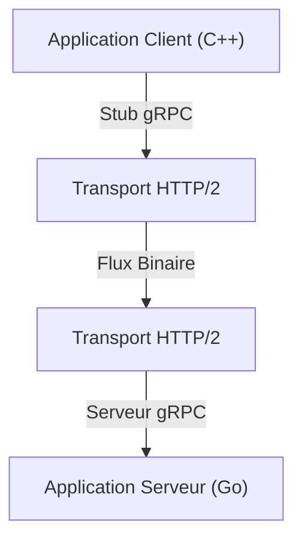

Dans le développement de systèmes modernes, l'adoption de l'architecture des microservices est devenue un choix standard. Bien qu'il y ait de grands avantages à ce que chaque service puisse évoluer indépendamment et être développé avec différents langages ou piles technologiques, l'impact de la communication entre les services (communication inter-processus) sur les performances et la fiabilité du système n'a jamais été aussi important.

Dans la communication traditionnelle des microservices, la combinaison des API REST sur HTTP/1.1 et des données JSON a été largement utilisée. Cependant, à mesure que le trafic augmente et que les exigences en temps réel s'intensifient, les limites de cette approche deviennent évidentes. C'est pourquoi la combinaison de **gRPC** et des **Protocol Buffers (Protobuf)** attire l'attention et est désormais devenue la norme de facto dans de nombreux systèmes à grande échelle.

Dans cet article, nous expliquerons en détail pourquoi gRPC et Protocol Buffers sont si puissants, leurs mécanismes et avantages, une comparaison avec JSON/REST, et les défis de leur adoption réelle.

## 1. Les limites de REST et JSON

Pour comprendre la supériorité de gRPC, il est d'abord nécessaire d'identifier les problèmes de l'approche traditionnelle REST + JSON.

### Coût d'analyse et taille des données de JSON
JSON (JavaScript Object Notation) est un format textuel qui présente le grand avantage d'être lisible par les humains. Cependant, il n'est pas nécessairement efficace pour les ordinateurs.

1. **Taille des données sujette à gonfler** : JSON envoie les noms de champs sous forme de chaînes de caractères à chaque fois. Par exemple, dans des données comme `{"user_id": 12345, "status": "active"}`, il arrive fréquemment que les métadonnées telles que les noms de clés et les accolades occupent plus d'octets que la charge utile réelle (12345, active).
2. **Surcharge de sérialisation et de désérialisation** : Le processus de conversion de chaînes en nombres ou en objets (processus d'analyse) consomme des ressources CPU de manière significative. Surtout dans un environnement où un grand nombre de messages s'échangent entre les microservices, ces coûts d'analyse s'accumulent pour entraîner une latence énorme et une augmentation de l'utilisation du CPU.

### Les goulots d'étranglement de HTTP/1.1
Les API REST traditionnelles fonctionnent principalement sur HTTP/1.1. HTTP/1.1 présente les limites structurelles suivantes :

- **Blocage en tête de ligne (Head-of-Line / HoL)** : Il est difficile de traiter plusieurs requêtes en parallèle sur une seule connexion TCP, et si le traitement d'une requête précédente est retardé, les requêtes suivantes sont également bloquées.
- **En-têtes textuels** : Les informations d'en-tête sont envoyées en texte brut à chaque fois sans être compressées, ce qui consomme inutilement de la bande passante.
- **Communication unidirectionnelle** : Fondamentalement, il s'agit d'un modèle où le serveur renvoie une réponse à une requête du client. Pour réaliser un push du serveur ou un streaming bidirectionnel, il fallait combiner d'autres technologies comme WebSockets.

## 2. Que sont les Protocol Buffers (Protobuf) ?

Développés par Google, les **Protocol Buffers** (abrégés en Protobuf) sont un mécanisme extensible, indépendant du langage et de la plateforme, pour sérialiser des données structurées. Semblable à XML ou JSON, mais plus petit, plus rapide et plus simple.

### La puissance de la sérialisation binaire
Protobuf encode les données au format binaire. Au lieu d'envoyer les noms de champs sous forme de chaînes de caractères comme dans JSON, il utilise des entiers prédéfinis appelés « balises (numéros de champ) » pour identifier les données.

```protobuf
// user.proto
syntax = "proto3";

package user;

message UserRequest {
  int32 user_id = 1;
  string include_details = 2;
}

message UserResponse {
  int32 user_id = 1;
  string name = 2;
  bool is_active = 3;
}
```

Sur la base du schéma défini dans le fichier `.proto` ci-dessus, les données sont converties en une séquence binaire très compacte. Le CPU n'a pas besoin d'analyser des chaînes et peut mapper directement les données binaires sur des structures en mémoire, ce qui rend la vitesse de sérialisation et de désérialisation de quelques fois à plusieurs dizaines de fois plus rapide par rapport à JSON.

### Développement piloté par les schémas
En utilisant Protobuf, les spécifications de l'API (schémas) sont clairement définies sous la forme de fichiers `.proto`. Cela sert non seulement de documentation, mais aussi de contrat exécutable.
À partir de ce fichier `.proto`, à l'aide du compilateur `protoc`, vous pouvez générer automatiquement des classes d'accès aux données pour différents langages tels que C++, Java, Python, Go, Ruby, C#, etc. Cela résout le problème éternel du développement d'API, à savoir la « divergence entre la documentation et l'implémentation ».

## 3. L'architecture de gRPC et HTTP/2

**gRPC** est un framework RPC (Remote Procedure Call) open source haute performance qui utilise Protocol Buffers comme langage de définition d'interface (IDL) et format d'échange de messages sous-jacent.



La plus grande caractéristique de gRPC est son adoption complète de **HTTP/2** comme protocole de communication.

### La révolution de la communication grâce à HTTP/2
HTTP/2 a été conçu pour résoudre bon nombre des problèmes rencontrés avec HTTP/1.1.

1. **Multiplexage** : Sur une seule connexion TCP, plusieurs flux de requêtes et de réponses peuvent être envoyés et reçus simultanément et dans n'importe quel ordre. Cela élimine le blocage en tête de ligne (HoL) et réduit considérablement la surcharge liée à l'établissement de la connexion.
2. **Cadrage binaire (Binary Framing)** : Contrairement au protocole textuel de HTTP/1.1, HTTP/2 divise et envoie toutes les données sous forme de trames binaires. Cela se marie très bien avec les données binaires de Protobuf.
3. **Compression des en-têtes (HPACK)** : Compresse efficacement les en-têtes HTTP redondants et économise la bande passante du réseau.

### Quatre modèles de communication
En tirant parti des capacités de streaming de HTTP/2, gRPC fournit quatre modèles de communication qui vont au-delà de la simple requête-réponse.

1. **RPC Unaire** : Le client envoie une seule requête et le serveur renvoie une seule réponse. C'est la forme la plus proche de l'API REST courante.
2. **RPC de Streaming Serveur** : Le client envoie une seule requête et le serveur renvoie un flux de données (plusieurs réponses). Utile pour renvoyer progressivement de grandes quantités de données.
3. **RPC de Streaming Client** : Le client envoie un flux de données et le serveur renvoie une seule réponse. Idéal pour les téléchargements de fichiers volumineux.
4. **RPC de Streaming Bidirectionnel** : Le client et le serveur utilisent tous deux des flux indépendants pour envoyer et recevoir des données. Idéal pour les communications en temps réel complexes et bidirectionnelles, comme les applications de chat ou les jeux en ligne en temps réel.

## 4. Les avantages de gRPC dans un environnement de microservices

Les avantages spécifiques obtenus en adoptant gRPC dans une architecture de microservices sont les suivants :

### Des performances exceptionnelles
Grâce à la sérialisation binaire et au multiplexage HTTP/2, la latence de communication est considérablement réduite. En particulier, dans un environnement où des dizaines de microservices communiquent en chaîne en interne pour traiter une seule requête utilisateur (graphe d'appel profond), cet effet de réduction de latence contribue directement à l'amélioration du temps de réponse de l'ensemble du système.

### Collaboration au-delà des barrières linguistiques
Dans les systèmes modernes, il n'est pas rare de trouver un environnement « polyglotte » (multilingue) où les composants de machine learning sont écrits en Python, la passerelle d'API à fort trafic en Go, et le backend existant en Java.
En utilisant gRPC et Protobuf, en partageant simplement les fichiers `.proto`, le code de communication optimisé pour chaque langage peut être généré automatiquement. Les développeurs n'ont plus besoin d'écrire des traitements réseau de bas niveau ou des traitements d'analyse JSON, et peuvent se concentrer sur l'implémentation de la logique métier.

### Sécurité de typage robuste et compatibilité ascendante
Dans les API JSON, les erreurs d'exécution dues à des fautes de frappe dans les noms de champs ou à des incohérences de types de données (comme la réception d'une chaîne lorsqu'un nombre est attendu) se produisent souvent. Protobuf offre un typage statique fort, permettant de détecter ces erreurs au moment de la compilation.
De plus, comme Protobuf utilise des numéros de champ, il est facile de maintenir une compatibilité ascendante et descendante dans la communication entre d'anciens clients et de nouveaux serveurs. Même si des champs devenus inutiles sont supprimés (plus précisément obsolètes avec leur numéro réservé) ou que de nouveaux champs sont ajoutés, la communication ne sera pas interrompue.

## 5. Défis et contre-mesures lors de l'adoption de gRPC

Bien que gRPC soit puissant, il existe certains obstacles à son adoption.

### Compatibilité avec les navigateurs
Parce que gRPC s'appuie sur des fonctionnalités avancées de HTTP/2 (en particulier les en-têtes Trailer), il est actuellement difficile d'appeler directement des API gRPC depuis les navigateurs Web.
Les deux solutions générales à ce problème sont :
- **gRPC-Web** : Une technologie qui transforme légèrement le protocole afin qu'il puisse être utilisé à partir du navigateur. Il communique avec le serveur gRPC via un proxy comme Envoy.
- **Passerelle gRPC (gRPC Gateway)** : En ajoutant des annotations au fichier `.proto`, un proxy inverse est automatiquement généré en même temps que le serveur gRPC, permettant également d'y accéder en tant qu'API RESTful JSON.

### Lisibilité pour les humains
Alors que le contenu JSON peut être facilement examiné avec une simple commande `curl`, Protobuf, étant binaire, ne peut pas être lu tel quel.
Pour le débogage pendant le développement, il est nécessaire d'utiliser des outils CLI dédiés comme `grpcurl` ou des clients d'API prenant en charge gRPC comme Postman. De plus, lors de la capture de paquets, il faut configurer Wireshark pour lire les fichiers `.proto` afin de les analyser.

## Conclusion

La combinaison de gRPC et des Protocol Buffers améliore considérablement les performances, la sécurité du typage et la productivité du développement dans la communication entre microservices.
Cela ne signifie pas que JSON et REST deviennent obsolètes. Dans de nombreux cas, REST/JSON reste adapté aux API publiques orientées vers l'extérieur et à la communication avec les front-ends. Cependant, pour la communication inter-services au sein du backend, gRPC est déjà en train de passer d'une « option à considérer » à une « option par défaut ».

Si vous souffrez d'une surcharge de communication ou si vous êtes sur le point de créer un microservice à grande échelle, l'adoption de gRPC apportera une évolution spectaculaire à votre système.
