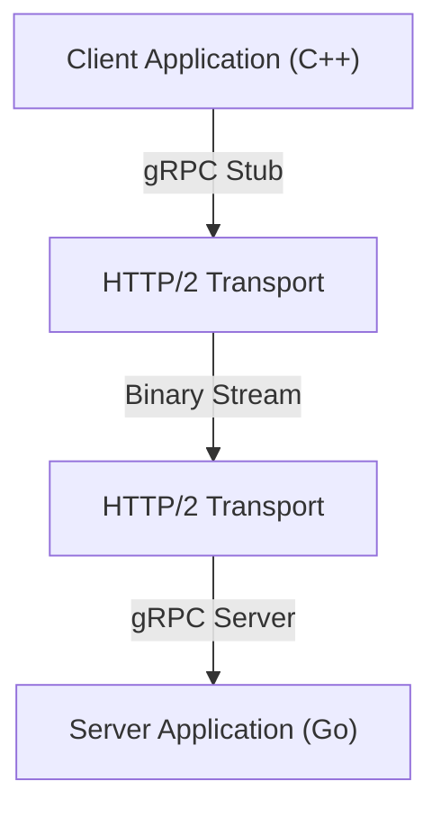

आधुनिक सिस्टम विकास में, माइक्रोसर्विस आर्किटेक्चर को अपनाना एक मानक विकल्प बन गया है। जबकि प्रत्येक सेवा को स्वतंत्र रूप से स्केल करने और विभिन्न भाषाओं और प्रौद्योगिकी स्टैक में विकसित करने में सक्षम होने का बड़ा फायदा है, सिस्टम के प्रदर्शन और विश्वसनीयता पर सेवाओं (इंटर-प्रोसेस संचार) के बीच संचार का प्रभाव पहले से कहीं अधिक है।

पारंपरिक माइक्रोसर्विस संचार में, HTTP/1.1 पर REST API और JSON डेटा के संयोजन का व्यापक रूप से उपयोग किया गया है। हालांकि, जैसे-जैसे ट्रैफ़िक बढ़ता है और वास्तविक समय के प्रदर्शन की आवश्यकताएं बढ़ती हैं, इस दृष्टिकोण की सीमाएं स्पष्ट हो जाती हैं। इसलिए, जिसने ध्यान आकर्षित किया है और अब कई बड़े पैमाने के सिस्टम में वास्तविक मानक बन गया है, वह **gRPC** और **Protocol Buffers (Protobuf)** का संयोजन है।

इस लेख में, हम विस्तार से बताएंगे कि gRPC और Protocol Buffers इतने शक्तिशाली क्यों हैं, उनके तंत्र और लाभ, JSON/REST के साथ तुलना, और वास्तविक कार्यान्वयन में चुनौतियां क्या हैं।

## 1. REST और JSON की सीमाएँ

gRPC की श्रेष्ठता को समझने के लिए, पहले पारंपरिक REST + JSON दृष्टिकोण के सामने आने वाली चुनौतियों को समझना आवश्यक है।

### JSON की पार्सिंग लागत और डेटा का आकार
JSON (JavaScript Object Notation) एक टेक्स्ट-आधारित प्रारूप है, जिसका बड़ा फायदा यह है कि इसे इंसानों के लिए पढ़ना आसान है। हालाँकि, यह कंप्यूटर के लिए हमेशा कुशल नहीं होता है।

1. **डेटा का आकार बढ़ने की संभावना**: JSON हर बार फ़ील्ड के नाम को स्ट्रिंग के रूप में भेजता है। उदाहरण के लिए, `{"user_id": 12345, "status": "active"}` जैसे डेटा में, की (key) के नाम और ब्रैकेट जैसे मेटाडेटा अक्सर वास्तविक पेलोड (12345, active) की तुलना में अधिक बाइट्स लेते हैं।
2. **सीरियलाइज़ेशन और डीसीरियलाइज़ेशन का भार**: स्ट्रिंग्स को संख्याओं और ऑब्जेक्ट्स में बदलने की प्रक्रिया (पार्सिंग) सीपीयू संसाधनों की काफी खपत करती है। विशेष रूप से ऐसे वातावरण में जहां माइक्रोसर्विसेज के बीच बड़ी संख्या में संदेश आते-जाते हैं, यह पार्सिंग लागत जमा हो सकती है, जिससे विशाल विलंबता (latency) और उच्च सीपीयू उपयोग हो सकता है।

### HTTP/1.1 की बाधा (Bottleneck)
पारंपरिक REST API मुख्य रूप से HTTP/1.1 पर चलते हैं। HTTP/1.1 की निम्नलिखित संरचनात्मक सीमाएँ हैं:

- **Head-of-Line (HoL) ब्लॉकिंग**: एक ही TCP कनेक्शन पर एक साथ कई अनुरोधों को संसाधित करना मुश्किल है, और यदि किसी पूर्ववर्ती अनुरोध के प्रसंस्करण में देरी होती है, तो बाद के अनुरोध भी ब्लॉक हो जाते हैं।
- **टेक्स्ट-आधारित हेडर**: चूंकि हेडर की जानकारी बिना कंप्रेस किए हर बार प्लेन टेक्स्ट के रूप में भेजी जाती है, इसलिए यह बैंडविड्थ बर्बाद करता है।
- **एकतरफा संचार**: मूल रूप से, यह एक मॉडल है जिसमें सर्वर क्लाइंट के अनुरोध का जवाब देता है। सर्वर से पुश और द्विदिशी (bidirectional) स्ट्रीमिंग प्राप्त करने के लिए, WebSocket जैसी अन्य तकनीकों को संयोजित करना आवश्यक था।

## 2. Protocol Buffers (Protobuf) क्या है?

Google द्वारा विकसित **Protocol Buffers** (संक्षेप में Protobuf), संरचित डेटा को सीरियलाइज़ करने के लिए एक भाषा-स्वतंत्र और प्लेटफ़ॉर्म-स्वतंत्र एक्स्टेंसिबल तंत्र है। यह XML या JSON के समान है, लेकिन छोटा, तेज़ और सरल है।

### बाइनरी सीरियलाइज़ेशन की शक्ति
Protobuf डेटा को बाइनरी प्रारूप में एन्कोड करता है। फ़ील्ड नामों को JSON की तरह स्ट्रिंग के रूप में भेजने के बजाय, यह डेटा को पहचानने के लिए पूर्व-परिभाषित पूर्णांक "टैग (फ़ील्ड नंबर)" का उपयोग करता है।

```protobuf
// user.proto
syntax = "proto3";

package user;

message UserRequest {
  int32 user_id = 1;
  string include_details = 2;
}

message UserResponse {
  int32 user_id = 1;
  string name = 2;
  bool is_active = 3;
}
```

उपरोक्त `.proto` फ़ाइल में परिभाषित स्कीमा के आधार पर, डेटा को एक बहुत ही कॉम्पैक्ट बाइनरी अनुक्रम में बदल दिया जाता है। चूंकि सीपीयू को स्ट्रिंग्स को पार्स करने की आवश्यकता नहीं होती है और बाइनरी डेटा को सीधे मेमोरी में संरचनाओं (structures) में मैप किया जा सकता है, इसलिए JSON की तुलना में सीरियलाइज़ेशन और डीसीरियलाइज़ेशन की गति कई गुना से लेकर दर्जनों गुना तेज़ होती है।

### स्कीमा-संचालित विकास
Protobuf का उपयोग करके, API विनिर्देश (स्कीमा) स्पष्ट रूप से `.proto` फ़ाइल के रूप में परिभाषित किया जाता है। यह केवल एक दस्तावेज़ नहीं है, बल्कि एक निष्पादन योग्य अनुबंध (contract) के रूप में कार्य करता है।
इस `.proto` फ़ाइल से, आप protoc कंपाइलर का उपयोग करके C++, Java, Python, Go, Ruby, C# जैसी विभिन्न भाषाओं के लिए डेटा एक्सेस क्लासेस स्वचालित रूप से उत्पन्न कर सकते हैं। यह API विकास में "दस्तावेज़ीकरण और कार्यान्वयन के बीच विसंगति" की शाश्वत समस्या को हल करता है।

## 3. gRPC का आर्किटेक्चर और HTTP/2

**gRPC** एक उच्च-प्रदर्शन, ओपन-सोर्स RPC (Remote Procedure Call) फ्रेमवर्क है जो इस Protocol Buffers का उपयोग अपने इंटरफ़ेस परिभाषा भाषा (IDL) और अंतर्निहित संदेश विनिमय प्रारूप के रूप में करता है।



gRPC की सबसे बड़ी विशेषता यह है कि यह पूरी तरह से संचार प्रोटोकॉल के रूप में **HTTP/2** को अपनाता है।

### HTTP/2 द्वारा संचार क्रांति
HTTP/2 को HTTP/1.1 द्वारा सामना की जाने वाली कई समस्याओं को हल करने के लिए डिज़ाइन किया गया था।

1. **मल्टीप्लेक्सिंग (Multiplexing)**: एक ही TCP कनेक्शन पर, कई अनुरोध और प्रतिक्रिया स्ट्रीम एक साथ भेजे और प्राप्त किए जा सकते हैं, चाहे उनका क्रम कुछ भी हो। यह Head-of-Line ब्लॉकिंग को समाप्त करता है और कनेक्शन स्थापित करने के ओवरहेड को नाटकीय रूप से कम करता है।
2. **बाइनरी फ्रेमिंग**: HTTP/1.1 के टेक्स्ट-आधारित प्रोटोकॉल के विपरीत, HTTP/2 सभी डेटा को बाइनरी फ्रेम में विभाजित करता है और उन्हें भेजता है। यह Protobuf के बाइनरी डेटा के साथ बहुत अच्छी तरह से काम करता है।
3. **हेडर कम्प्रेशन (HPACK)**: यह अनावश्यक HTTP हेडर को प्रभावी ढंग से कंप्रेस करता है और नेटवर्क बैंडविड्थ को बचाता है।

### 4 संचार मॉडल
gRPC HTTP/2 की स्ट्रीमिंग क्षमताओं का लाभ उठाते हुए चार संचार मॉडल प्रदान करता है जो साधारण अनुरोध-प्रतिक्रिया (request-response) से परे हैं।

1. **Unary RPC**: क्लाइंट एक अनुरोध भेजता है, और सर्वर एक प्रतिक्रिया देता है। यह सबसे आम REST API के सबसे करीब है।
2. **Server Streaming RPC**: क्लाइंट एक अनुरोध भेजता है, और सर्वर डेटा की एक स्ट्रीम (कई प्रतिक्रियाएं) लौटाता है। यह तब उपयोगी होता है जब बड़ी मात्रा में डेटा को थोड़ा-थोड़ा करके लौटाना हो।
3. **Client Streaming RPC**: क्लाइंट डेटा की एक स्ट्रीम भेजता है, और सर्वर एक प्रतिक्रिया देता है। यह बड़ी फ़ाइलों को अपलोड करने आदि के लिए उपयुक्त है।
4. **Bidirectional Streaming RPC**: क्लाइंट और सर्वर दोनों डेटा भेजने और प्राप्त करने के लिए स्वतंत्र स्ट्रीम का उपयोग करते हैं। यह जटिल दो-तरफ़ा वास्तविक समय संचार, जैसे चैट ऐप या रीयल-टाइम ऑनलाइन गेम के लिए आदर्श है।

## 4. माइक्रोसर्विसेज वातावरण में gRPC के लाभ

माइक्रोसर्विस आर्किटेक्चर में gRPC को अपनाने के विशिष्ट लाभ निम्नलिखित हैं।

### अभूतपूर्व प्रदर्शन
बाइनरी सीरियलाइज़ेशन और HTTP/2 मल्टीप्लेक्सिंग के कारण संचार विलंबता (latency) में काफी कमी आती है। विशेष रूप से ऐसे वातावरण में जहां दर्जनों माइक्रोसर्विसेज एक उपयोगकर्ता के अनुरोध (गहरे कॉल ग्राफ़) को संसाधित करने के लिए आंतरिक रूप से एक श्रृंखला में संवाद करते हैं, यह विलंबता में कमी सीधे समग्र सिस्टम के प्रतिक्रिया समय में सुधार की ओर ले जाती है।

### भाषा की बाधाओं को पार करते हुए सहयोग
आधुनिक प्रणालियों में, एक "पॉलीग्लॉट (बहुभाषी)" वातावरण होना असामान्य नहीं है जहाँ मशीन लर्निंग घटकों को Python में लिखा जाता है, उच्च-ट्रैफ़िक API गेटवे Go में होते हैं, और लीगेसी बैकएंड Java में लिखे जाते हैं।
gRPC और Protobuf के साथ, आप केवल `.proto` फ़ाइल साझा करके प्रत्येक भाषा के लिए अनुकूलित संचार कोड स्वचालित रूप से उत्पन्न कर सकते हैं। डेवलपर्स को अब निम्न-स्तरीय नेटवर्क प्रोसेसिंग या JSON पार्सिंग लिखने की आवश्यकता नहीं है, और वे व्यावसायिक तर्क (business logic) को लागू करने पर ध्यान केंद्रित कर सकते हैं।

### मजबूत टाइप सेफ्टी और बैकवर्ड कम्पैटिबिलिटी
JSON API में, फ़ील्ड नामों में टाइपिंग की गलतियों या डेटा प्रकार के बेमेल होने (जैसे जहाँ संख्या अपेक्षित हो वहाँ स्ट्रिंग आना) के कारण रनटाइम त्रुटियाँ बार-बार होती हैं। चूंकि Protobuf मजबूत स्टेटिक टाइपिंग प्रदान करता है, इसलिए इन त्रुटियों को कंपाइल-टाइम पर पकड़ा जा सकता है।
इसके अलावा, क्योंकि Protobuf फ़ील्ड नंबरों का उपयोग करता है, इसलिए पुराने क्लाइंट्स और नए सर्वरों के बीच संचार में भी बैकवर्ड और फॉरवर्ड कम्पैटिबिलिटी को बनाए रखना आसान है। यहां तक कि अगर आप उन फ़ील्ड्स को हटा देते हैं जिनकी अब आवश्यकता नहीं है (सख्ती से बोलते हुए, उन्हें अप्रचलित कर दें और नंबर आरक्षित करें) या नए फ़ील्ड जोड़ें, संचार नहीं टूटेगा।

## 5. gRPC को लागू करने में चुनौतियां और उपाय

हालांकि gRPC शक्तिशाली है, लेकिन इसके कार्यान्वयन में कुछ बाधाएं भी हैं।

### ब्राउज़र के साथ संगतता
चूंकि gRPC HTTP/2 की उन्नत सुविधाओं (विशेष रूप से Trailer हेडर आदि) पर निर्भर करता है, इसलिए वर्तमान वेब ब्राउज़रों से सीधे gRPC API को कॉल करना मुश्किल है।
इस समस्या के दो सामान्य समाधान हैं:
- **gRPC-Web**: एक तकनीक जो प्रोटोकॉल को थोड़ा बदल देती है ताकि इसे ब्राउज़र से इस्तेमाल किया जा सके। यह Envoy जैसे प्रॉक्सी के माध्यम से gRPC सर्वर के साथ संचार करता है।
- **gRPC Gateway**: `.proto` फ़ाइल में एनोटेशन जोड़कर gRPC सर्वर के साथ-साथ एक रिवर्स प्रॉक्सी को स्वचालित रूप से उत्पन्न करने की एक विधि, जिससे इसे RESTful JSON API के रूप में भी एक्सेस किया जा सके।

### इंसानों के लिए पठनीयता (Readability)
JSON को `curl` कमांड का उपयोग करके आसानी से जांचा और पढ़ा जा सकता है, लेकिन बाइनरी Protobuf को वैसे ही नहीं पढ़ा जा सकता है।
विकास के दौरान डिबगिंग के लिए, आपको `grpcurl` जैसे समर्पित CLI टूल या Postman जैसे gRPC-संगत API क्लाइंट का उपयोग करना होगा। इसके अलावा, पैकेट कैप्चर करते समय, आपको इसे पार्स करने के लिए Wireshark में `.proto` फ़ाइल लोड करने जैसी तरकीबों का उपयोग करने की आवश्यकता होती है।

## निष्कर्ष

gRPC और Protocol Buffers का संयोजन माइक्रोसर्विसेज के बीच संचार में प्रदर्शन, टाइप सेफ्टी और विकास उत्पादकता में नाटकीय रूप से सुधार करता है।
इसका मतलब यह नहीं है कि JSON और REST अब आवश्यक नहीं हैं। सार्वजनिक-सामना करने वाले API और फ्रंट-एंड संचार के लिए अभी भी REST/JSON अक्सर बेहतर अनुकूल होते हैं। हालाँकि, बैकएंड के भीतर सेवाओं के बीच संचार के लिए, gRPC पहले से ही "विचार करने के विकल्प" से "डिफ़ॉल्ट विकल्प" में बदल रहा है।

यदि आप संचार ओवरहेड से जूझ रहे हैं, या यदि आप बड़े पैमाने पर माइक्रोसर्विसेज बनाने वाले हैं, तो gRPC को अपनाने से आपके सिस्टम में एक नाटकीय विकास होना चाहिए।
