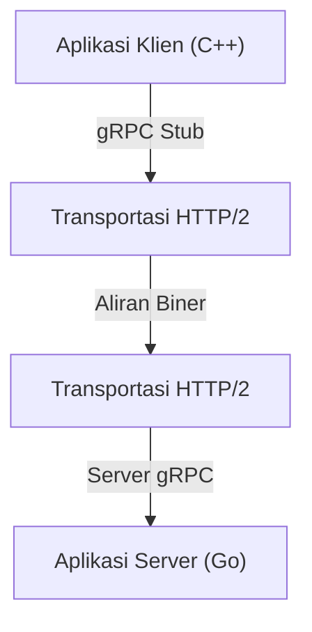

Dalam pengembangan sistem modern, adopsi arsitektur layanan mikro telah menjadi pilihan standar. Meskipun terdapat keuntungan besar di mana setiap layanan dapat diskalakan secara independen dan dikembangkan dengan bahasa atau tumpukan teknologi yang berbeda, dampak komunikasi antar layanan (komunikasi antar proses) terhadap kinerja dan keandalan sistem menjadi lebih besar dari sebelumnya.

Dalam komunikasi layanan mikro tradisional, kombinasi REST API di atas HTTP/1.1 dan data JSON telah banyak digunakan. Namun, seiring dengan meningkatnya lalu lintas data dan tuntutan untuk waktu nyata (real-time), keterbatasan pendekatan ini menjadi semakin jelas. Oleh karena itu, kombinasi **gRPC** dan **Protocol Buffers (Protobuf)** mendapat banyak perhatian dan kini telah menjadi standar de facto di banyak sistem skala besar.

Dalam artikel ini, kami akan menjelaskan secara detail mengapa gRPC dan Protocol Buffers begitu kuat, bagaimana cara kerja dan keuntungannya, perbandingannya dengan JSON/REST, serta tantangan dalam implementasi aktualnya.

## 1. Keterbatasan REST dan JSON

Untuk memahami keunggulan gRPC, pertama-tama kita perlu meninjau kembali tantangan yang dihadapi oleh pendekatan REST + JSON tradisional.

### Biaya Parsing JSON dan Ukuran Data
JSON (JavaScript Object Notation) adalah format berbasis teks yang memiliki keuntungan besar karena mudah dibaca oleh manusia. Namun, format ini tidak selalu efisien bagi komputer.

1. **Ukuran Data Cenderung Membengkak**: JSON mengirimkan nama bidang (field) sebagai string setiap saat. Misalnya, dalam data seperti `{"user_id": 12345, "status": "active"}`, metadata seperti nama kunci (key) dan tanda kurung sering kali memakan lebih banyak byte daripada payload aktual (12345, active).
2. **Beban Serialisasi dan Deserialisasi**: Proses mengubah string menjadi angka atau objek (proses parsing) mengkonsumsi sumber daya CPU secara signifikan. Terutama di lingkungan di mana sejumlah besar pesan beterbangan antar layanan mikro, biaya parsing ini menumpuk dan menyebabkan latensi yang besar serta peningkatan penggunaan CPU.

### Kemacetan HTTP/1.1
REST API tradisional sebagian besar beroperasi di atas HTTP/1.1. HTTP/1.1 memiliki batasan struktural berikut:

- **Pemblokiran Head-of-Line (HoL)**: Sulit untuk memproses beberapa permintaan secara paralel pada satu koneksi TCP. Jika pemrosesan permintaan sebelumnya tertunda, permintaan berikutnya juga akan terblokir.
- **Header Berbasis Teks**: Informasi header dikirim dalam teks biasa tanpa kompresi setiap saat, sehingga membuang-buang bandwidth.
- **Komunikasi Searah**: Pada dasarnya ini adalah model di mana server mengembalikan respons terhadap permintaan dari klien. Untuk mengimplementasikan dorongan (push) dari server atau streaming dua arah, perlu digabungkan dengan teknologi lain seperti WebSocket.

## 2. Apa itu Protocol Buffers (Protobuf)?

**Protocol Buffers** (disingkat Protobuf), yang dikembangkan oleh Google, adalah mekanisme yang dapat diperluas, tidak bergantung pada bahasa, dan tidak bergantung pada platform untuk menserialisasikan data terstruktur. Mirip dengan XML atau JSON, tetapi lebih kecil, lebih cepat, dan lebih sederhana.

### Kekuatan Serialisasi Biner
Protobuf mengkodekan data dalam format biner. Alih-alih mengirimkan nama bidang sebagai string seperti JSON, Protobuf menggunakan "tag" (nomor bidang) berupa bilangan bulat yang telah ditentukan sebelumnya untuk mengidentifikasi data.

```protobuf
// user.proto
syntax = "proto3";

package user;

message UserRequest {
  int32 user_id = 1;
  string include_details = 2;
}

message UserResponse {
  int32 user_id = 1;
  string name = 2;
  bool is_active = 3;
}
```

Berdasarkan skema yang didefinisikan dalam file `.proto` di atas, data diubah menjadi urutan biner yang sangat ringkas. Karena CPU tidak perlu mengurai string dan dapat memetakan data biner langsung ke struktur dalam memori, kecepatan serialisasi dan deserialisasi menjadi beberapa kali hingga puluhan kali lebih cepat dibandingkan JSON.

### Pengembangan Berbasis Skema
Dengan menggunakan Protobuf, spesifikasi API (skema) didefinisikan dengan jelas sebagai file `.proto`. Ini bukan sekadar dokumen, melainkan berfungsi sebagai kontrak yang dapat dieksekusi.
Dari file `.proto` ini, menggunakan kompiler `protoc`, kelas akses data untuk berbagai bahasa seperti C++, Java, Python, Go, Ruby, C#, dll., dapat dihasilkan secara otomatis. Hal ini memecahkan masalah abadi dalam pengembangan API, yaitu "kesenjangan antara dokumen dan implementasi".

## 3. Arsitektur gRPC dan HTTP/2

**gRPC** adalah kerangka kerja RPC (Remote Procedure Call) sumber terbuka berkinerja tinggi yang menggunakan Protocol Buffers sebagai Bahasa Definisi Antarmuka (IDL) dan format pertukaran pesan yang mendasarinya.



Fitur terbesar dari gRPC adalah adopsi penuh **HTTP/2** sebagai protokol komunikasinya.

### Revolusi Komunikasi dengan HTTP/2
HTTP/2 dirancang untuk memecahkan banyak masalah yang dihadapi oleh HTTP/1.1.

1. **Multiplexing**: Aliran dari beberapa permintaan dan respons dapat dikirim dan diterima secara bersamaan dan dalam urutan apa pun pada satu koneksi TCP tunggal. Hal ini menghilangkan pemblokiran Head-of-Line dan secara dramatis mengurangi overhead pembuatan koneksi.
2. **Pembingkaian Biner (Binary Framing)**: Tidak seperti protokol berbasis teks dari HTTP/1.1, HTTP/2 membagi semua data menjadi bingkai biner untuk transmisi. Hal ini sangat cocok dengan data biner Protobuf.
3. **Kompresi Header (HPACK)**: Mengompresi header HTTP yang berlebihan secara efisien untuk menghemat bandwidth jaringan.

### 4 Model Komunikasi
Dengan memanfaatkan fitur streaming dari HTTP/2, gRPC menyediakan empat model komunikasi yang melampaui sekadar permintaan dan respons sederhana.

1. **Unary RPC**: Klien mengirimkan satu permintaan dan server mengembalikan satu respons. Bentuk yang paling umum dan mirip dengan REST API.
2. **Server Streaming RPC**: Klien mengirimkan satu permintaan dan server mengembalikan aliran data (beberapa respons). Berguna ketika mengembalikan sejumlah besar data sedikit demi sedikit.
3. **Client Streaming RPC**: Klien mengirimkan aliran data dan server mengembalikan satu respons. Cocok untuk mengunggah file berukuran besar.
4. **Bidirectional Streaming RPC**: Baik klien maupun server menggunakan aliran independen untuk mengirim dan menerima data. Ideal untuk komunikasi waktu nyata dua arah yang kompleks seperti aplikasi obrolan atau game online.

## 4. Keuntungan gRPC dalam Lingkungan Layanan Mikro

Dalam arsitektur layanan mikro, manfaat khusus dari adopsi gRPC adalah sebagai berikut:

### Kinerja yang Luar Biasa
Dengan serialisasi biner dan multiplexing HTTP/2, latensi komunikasi berkurang secara signifikan. Terutama di lingkungan di mana puluhan layanan mikro berkomunikasi secara berantai (grafik panggilan yang dalam) untuk memproses satu permintaan pengguna, efek pengurangan latensi ini secara langsung mengarah pada peningkatan waktu respons sistem secara keseluruhan.

### Kolaborasi Lintas Batas Bahasa
Dalam sistem modern, lingkungan "polyglot" (multi-bahasa) bukan hal yang tidak biasa, di mana komponen pembelajaran mesin ditulis dengan Python, API Gateway dengan lalu lintas tinggi dengan Go, dan backend sistem lama dengan Java.
Dengan menggunakan gRPC dan Protobuf, hanya dengan berbagi file `.proto`, Anda dapat secara otomatis menghasilkan kode komunikasi yang dioptimalkan untuk setiap bahasa. Pengembang tidak perlu lagi menulis logika pemrosesan jaringan tingkat rendah atau parsing JSON, sehingga dapat fokus pada implementasi logika bisnis.

### Keamanan Tipe yang Kuat dan Kompatibilitas Mundur
Dalam JSON API, kesalahan waktu proses sering terjadi akibat salah ketik pada nama bidang atau ketidakcocokan tipe data (misalnya string diterima saat angka diharapkan). Protobuf menyediakan pengetikan statis yang kuat, sehingga kesalahan ini dapat dideteksi pada waktu kompilasi.
Selain itu, karena Protobuf menggunakan nomor bidang, kompatibilitas mundur dan kompatibilitas maju dapat dengan mudah dipertahankan dalam komunikasi antara klien lama dan server baru. Bahkan jika Anda menghapus bidang yang tidak lagi diperlukan (secara teknis, membuatnya usang dan memesan nomornya) atau menambahkan bidang baru, komunikasi tidak akan rusak.

## 5. Tantangan dalam Adopsi gRPC dan Solusinya

Meskipun gRPC sangat kuat, terdapat juga beberapa rintangan dalam penerapannya.

### Kompatibilitas dengan Browser
Karena gRPC bergantung pada fitur-fitur lanjutan dari HTTP/2 (terutama header Trailer, dll.), sulit untuk memanggil gRPC API secara langsung dari browser web saat ini.
Dua solusi umum untuk masalah ini adalah sebagai berikut:
- **gRPC-Web**: Teknologi yang sedikit mengubah protokol agar dapat digunakan dari browser. Ia berkomunikasi dengan server gRPC melalui proksi seperti Envoy.
- **gRPC Gateway**: Teknik menambahkan anotasi ke file `.proto` untuk secara otomatis menghasilkan proksi terbalik bersama dengan server gRPC, memungkinkannya diakses juga sebagai RESTful JSON API.

### Keterbacaan bagi Manusia
Meskipun JSON dapat dengan mudah diperiksa isinya menggunakan perintah `curl`, Protobuf yang merupakan format biner tidak dapat dibaca begitu saja.
Untuk debugging selama pengembangan, perlu menggunakan alat CLI khusus seperti `grpcurl` atau klien API yang mendukung gRPC seperti Postman. Selain itu, saat melakukan penangkapan paket, diperlukan upaya lebih seperti memuat file `.proto` ke Wireshark untuk melakukan analisis.

## Kesimpulan

Kombinasi gRPC dan Protocol Buffers secara dramatis meningkatkan kinerja, keamanan tipe, dan produktivitas pengembangan dalam komunikasi antar layanan mikro.
Bukan berarti JSON dan REST menjadi tidak diperlukan. REST/JSON mungkin masih lebih cocok untuk API publik dan komunikasi dengan frontend. Namun, untuk komunikasi antar layanan internal di backend, gRPC telah beralih dari "pilihan untuk dipertimbangkan" menjadi "pilihan bawaan (default)".

Jika Anda berjuang dengan overhead komunikasi, atau berencana untuk membangun layanan mikro skala besar mulai sekarang, adopsi gRPC harusnya akan membawa evolusi dramatis pada sistem Anda.
