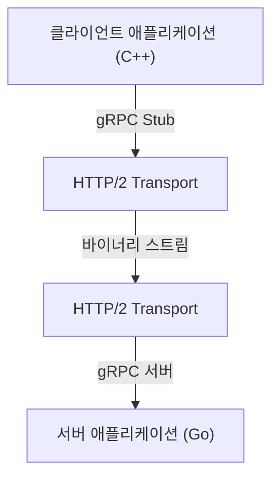

현대의 시스템 개발에서 마이크로서비스 아키텍처의 채택은 표준적인 선택이 되었습니다. 각 서비스가 독립적으로 확장하고 다른 언어나 기술 스택으로 개발할 수 있다는 큰 장점이 있는 반면, 서비스 간 통신(프로세스 간 통신)이 시스템의 성능이나 신뢰성에 미치는 영향은 그 어느 때보다 커졌습니다.

기존의 마이크로서비스 통신에서는 HTTP/1.1 상의 REST API와 JSON 데이터의 조합이 널리 사용되어 왔습니다. 하지만 트래픽의 증가와 실시간성에 대한 요구가 높아짐에 따라 이 접근 방식의 한계가 뚜렷해지고 있습니다. 그래서 주목을 받아 현재 많은 대규모 시스템에서 사실상 표준이 된 것이 바로 **gRPC**와 **Protocol Buffers (Protobuf)**의 조합입니다.

본 기사에서는 gRPC와 Protocol Buffers가 왜 이토록 강력한지, 그 원리와 장점, JSON/REST와의 비교, 그리고 실제 도입 시의 과제에 대해 자세히 설명합니다.

## 1. REST와 JSON의 한계

gRPC의 우수성을 이해하기 위해서는 먼저 기존의 REST + JSON 접근 방식이 가진 과제를 정리할 필요가 있습니다.

### JSON의 파싱 비용과 데이터 크기
JSON(JavaScript Object Notation)은 텍스트 기반 포맷으로, 사람이 읽기 쉽다는 큰 장점이 있습니다. 하지만 컴퓨터에게는 반드시 효율적이지는 않습니다.

1. **데이터 크기가 비대해지기 쉽다**: JSON은 필드명을 매번 문자열로 전송합니다. 예를 들어 `{"user_id": 12345, "status": "active"}`와 같은 데이터에서 실제 페이로드(12345, active)보다 키 이름이나 괄호 등의 메타데이터가 더 많은 바이트 수를 차지하는 경우가 빈번합니다.
2. **직렬화 및 역직렬화의 부하**: 문자열을 숫자나 객체로 변환하는 처리(파싱 처리)는 CPU 리소스를 상당히 소비합니다. 특히 마이크로서비스 간에 대량의 메시지가 오가는 환경에서는 이러한 파싱 비용이 쌓여 엄청난 지연 시간과 CPU 사용률의 증가를 초래합니다.

### HTTP/1.1의 병목 현상
기존의 REST API는 주로 HTTP/1.1 위에서 동작합니다. HTTP/1.1에는 다음과 같은 구조적 한계가 있습니다.

- **Head-of-Line (HoL) 블로킹**: 하나의 TCP 연결에서 여러 요청을 병렬로 처리하기 어려우며, 앞선 요청의 처리가 지연되면 뒤따르는 요청도 차단되어 버립니다.
- **텍스트 기반 헤더**: 헤더 정보가 압축되지 않고 매번 일반 텍스트로 전송되기 때문에 대역폭을 낭비합니다.
- **단방향 통신**: 기본적으로 클라이언트의 요청에 대해 서버가 응답을 반환하는 모델이므로, 서버의 푸시나 양방향 스트리밍을 구현하려면 WebSocket과 같은 다른 기술을 결합해야 했습니다.

## 2. Protocol Buffers(Protobuf)란 무엇인가?

Google에서 개발한 **Protocol Buffers**(프로토콜 버퍼, 줄여서 Protobuf)는 구조화된 데이터를 직렬화하기 위한 언어 및 플랫폼 독립적이고 확장 가능한 메커니즘입니다. XML이나 JSON과 유사하지만 더 작고, 빠르고, 단순합니다.

### 바이너리 직렬화의 힘
Protobuf는 데이터를 바이너리 형식으로 인코딩합니다. JSON처럼 필드명을 문자열로 전송하는 것이 아니라, 사전에 정의된 정수인 '태그(필드 번호)'를 사용하여 데이터를 식별합니다.

```protobuf
// user.proto
syntax = "proto3";

package user;

message UserRequest {
  int32 user_id = 1;
  string include_details = 2;
}

message UserResponse {
  int32 user_id = 1;
  string name = 2;
  bool is_active = 3;
}
```

위의 `.proto` 파일에 정의된 스키마를 기반으로, 데이터는 매우 압축된 바이너리 시퀀스로 변환됩니다. CPU는 문자열 파싱을 수행할 필요가 없고 바이너리 데이터를 직접 메모리 상의 구조체에 매핑할 수 있기 때문에, 직렬화 및 역직렬화 속도는 JSON에 비해 수배에서 수십 배 빠릅니다.

### 스키마 주도 개발
Protobuf를 사용하면 API 사양(스키마)이 `.proto` 파일로 명확하게 정의됩니다. 이는 단순한 문서가 아니라 실행 가능한 계약(Contract)으로 작동합니다.
이 `.proto` 파일에서 protoc 컴파일러를 사용하여 C++, Java, Python, Go, Ruby, C# 등 다양한 언어의 데이터 액세스 클래스를 자동 생성할 수 있습니다. 이를 통해 API 개발에 있어 영원한 숙제인 '문서와 구현의 괴리'를 해결합니다.

## 3. gRPC의 아키텍처와 HTTP/2

**gRPC**는 이 Protocol Buffers를 인터페이스 정의 언어(IDL) 및 기본 메시지 교환 포맷으로 사용하는 고성능 오픈 소스 RPC(Remote Procedure Call) 프레임워크입니다.



gRPC의 가장 큰 특징은 통신 프로토콜로 **HTTP/2**를 전면적으로 채택하고 있다는 점입니다.

### HTTP/2를 통한 통신 혁명
HTTP/2는 HTTP/1.1이 안고 있던 여러 가지 과제를 해결하기 위해 설계되었습니다.

1. **멀티플렉싱(다중화)**: 단일 TCP 연결에서 여러 요청과 응답 스트림을 동시에, 순서에 상관없이 송수신할 수 있습니다. 이로 인해 Head-of-Line 블로킹이 해소되고, 연결 설정의 오버헤드가 극적으로 감소합니다.
2. **바이너리 프레이밍**: HTTP/1.1의 텍스트 기반 프로토콜과 달리, HTTP/2는 모든 데이터를 바이너리 프레임으로 분할하여 전송합니다. 이는 Protobuf의 바이너리 데이터와 매우 잘 맞습니다.
3. **헤더 압축(HPACK)**: 중복되는 HTTP 헤더를 효율적으로 압축하여 네트워크 대역폭을 절약합니다.

### 4가지 통신 모델
gRPC는 HTTP/2의 스트리밍 기능을 활용하여 단순한 요청 및 응답에 머무르지 않는 4가지 통신 모델을 제공합니다.

1. **Unary RPC**: 클라이언트가 하나의 요청을 보내고 서버가 하나의 응답을 반환합니다. 가장 일반적인 REST API에 가까운 형태입니다.
2. **Server Streaming RPC**: 클라이언트가 하나의 요청을 보내고 서버가 데이터 스트림(여러 응답)을 반환합니다. 대량의 데이터를 조금씩 반환할 때 유용합니다.
3. **Client Streaming RPC**: 클라이언트가 데이터 스트림을 보내고 서버가 하나의 응답을 반환합니다. 대용량 파일 업로드 등에 적합합니다.
4. **Bidirectional Streaming RPC**: 클라이언트와 서버 양측이 독립적인 스트림을 사용하여 데이터를 송수신합니다. 채팅 앱이나 실시간 온라인 게임 등 복잡한 양방향 실시간 통신에 최적입니다.

## 4. 마이크로서비스 환경에서 gRPC의 장점

마이크로서비스 아키텍처에서 gRPC를 도입함으로써 얻을 수 있는 구체적인 이점은 다음과 같습니다.

### 압도적인 성능
바이너리 직렬화와 HTTP/2의 다중화를 통해 통신 지연 시간이 대폭 감소합니다. 특히, 하나의 사용자 요청을 처리하기 위해 내부적으로 수십 개의 마이크로서비스가 연쇄적으로 통신하는 환경(깊은 호출 그래프)에서는 이러한 지연 시간 감소 효과가 시스템 전체의 응답 시간 향상으로 직결됩니다.

### 언어의 장벽을 뛰어넘는 연동
최신 시스템에서는 머신 러닝 컴포넌트는 Python으로, 트래픽이 많은 API 게이트웨이는 Go로, 레거시 백엔드는 Java로 작성되어 있는 식의 '폴리글랏(다국어)' 환경이 드물지 않습니다.
gRPC와 Protobuf를 사용하면 `.proto` 파일만 공유함으로써 각 언어에 최적화된 통신 코드를 자동 생성할 수 있습니다. 개발자는 저수준의 네트워크 처리나 JSON 파싱 처리를 작성할 필요가 없어져 비즈니스 로직 구현에 집중할 수 있습니다.

### 견고한 타입 안정성과 하위 호환성
JSON API에서는 필드명의 오타나 데이터 타입 불일치(숫자를 기대하는 곳에 문자열이 오는 등)로 인한 런타임 에러가 자주 발생합니다. Protobuf는 강력한 정적 타이핑을 제공하므로 컴파일 시에 이러한 에러를 감지할 수 있습니다.
또한, Protobuf는 필드 번호를 이용하기 때문에 오래된 클라이언트와 새로운 서버 간의 통신에서도 상위 호환성(Forward Compatibility) 및 하위 호환성(Backward Compatibility)을 쉽게 유지할 수 있습니다. 불필요해진 필드를 삭제(엄밀히 말해 비권장화하고 번호를 예약)하거나 새로운 필드를 추가하더라도 통신이 깨지지 않습니다.

## 5. gRPC 도입 시의 과제와 대책

강력한 gRPC이지만 도입에는 몇 가지 장애물도 존재합니다.

### 브라우저와의 호환성
gRPC는 HTTP/2의 고급 기능(특히 Trailer 헤더 등)에 의존하고 있기 때문에, 현재의 웹 브라우저에서 gRPC API를 직접 호출하는 것은 어렵습니다.
이 문제에 대한 일반적인 해결책은 다음 두 가지입니다.
- **gRPC-Web**: 브라우저에서 이용할 수 있도록 프로토콜을 약간 변환하는 기술입니다. Envoy 등의 프록시를 거쳐 gRPC 서버와 통신합니다.
- **gRPC Gateway**: `.proto` 파일에 어노테이션을 추가하여 gRPC 서버와 동시에 리버스 프록시를 자동 생성하고, RESTful JSON API로도 접근할 수 있도록 하는 방식입니다.

### 사람에 대한 가독성
JSON은 `curl` 명령어로 쉽게 호출하여 내용을 볼 수 있지만, 바이너리인 Protobuf는 그대로는 읽을 수 없습니다.
개발 시 디버깅을 위해서는 `grpcurl`과 같은 전용 CLI 도구를 사용하거나 Postman 등의 gRPC 지원 API 클라이언트를 사용해야 합니다. 또한 패킷 캡처를 수행할 때에도 Wireshark에 `.proto` 파일을 읽어들여 분석하는 등의 노력이 필요합니다.

## 요약

gRPC와 Protocol Buffers의 조합은 마이크로서비스 간 통신에 있어 성능, 타입 안정성, 개발 생산성을 비약적으로 향상시킵니다.
JSON과 REST가 불필요해지는 것은 아닙니다. 외부에 공개하는 퍼블릭 API나 프론트엔드와의 통신에는 여전히 REST/JSON이 적합한 경우가 많을 것입니다. 하지만 백엔드 내부의 서비스 간 통신에서 gRPC는 이미 '검토해 볼 만한 선택지'에서 '기본 선택지'로 넘어가고 있습니다.

통신 오버헤드로 고민하고 있거나 앞으로 대규모 마이크로서비스를 구축하려고 한다면, gRPC의 도입은 시스템에 획기적인 발전을 가져다줄 것입니다.
