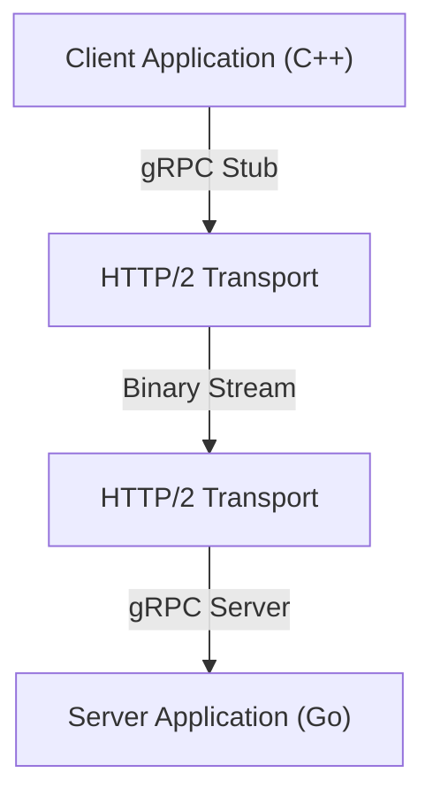

現代のシステム開発において、マイクロサービスアーキテクチャの採用は標準的な選択肢となりました。各サービスが独立してスケーリングし、異なる言語や技術スタックで開発できるという大きな利点がある一方で、サービス間の通信（プロセス間通信）がシステムのパフォーマンスや信頼性に与える影響はかつてないほど大きくなっています。

従来のマイクロサービス通信では、HTTP/1.1上のREST APIとJSONデータの組み合わせが広く用いられてきました。しかし、トラフィックの増大やリアルタイム性の要求が高まるにつれ、このアプローチの限界が顕著になってきています。そこで注目を集め、現在では多くの大規模システムでデファクトスタンダードとなっているのが、**gRPC**と**Protocol Buffers（Protobuf）**の組み合わせです。

本記事では、gRPCとProtocol Buffersがなぜこれほどまでに強力なのか、その仕組みと利点、JSON/RESTとの比較、そして実際の導入における課題について、詳細に解説します。

## 1. RESTとJSONの限界

gRPCの優位性を理解するためには、まず従来のREST + JSONアプローチが抱える課題を整理する必要があります。

### JSONのパースコストとデータサイズ
JSON（JavaScript Object Notation）はテキストベースのフォーマットであり、人間にとって読みやすいという大きな利点があります。しかし、コンピュータにとっては必ずしも効率的ではありません。

1. **データサイズが肥大化しやすい**: JSONはフィールド名を毎回文字列として送信します。たとえば、`{"user_id": 12345, "status": "active"}` のようなデータにおいて、実際のペイロード（12345, active）よりも、キー名や括弧などのメタデータの方が多くのバイト数を占めることが頻繁にあります。
2. **シリアライズ・デシリアライズの負荷**: 文字列を数値やオブジェクトに変換する処理（パース処理）は、CPUリソースを著しく消費します。特にマイクロサービス間で大量のメッセージが飛び交う環境では、このパースコストが塵も積もって巨大なレイテンシとCPU使用率の増加をもたらします。

### HTTP/1.1のボトルネック
従来のREST APIは主にHTTP/1.1上で動作します。HTTP/1.1には以下のような構造的な限界があります。

- **Head-of-Line (HoL) ブロッキング**: 1つのTCP接続上で複数のリクエストを並行して処理することが難しく、先行するリクエストの処理が遅れると、後続のリクエストもブロックされてしまいます。
- **テキストベースのヘッダー**: ヘッダー情報が圧縮されずに毎回プレーンテキストで送信されるため、帯域を無駄に消費します。
- **単方向通信**: 基本的にクライアントからのリクエストに対してサーバーがレスポンスを返すというモデルであり、サーバーからのプッシュや双方向ストリーミングを実現するには、WebSocketなどの別の技術を組み合わせる必要がありました。

## 2. Protocol Buffers（Protobuf）とは何か？

Googleによって開発された**Protocol Buffers**（プロトコルバッファ、略してProtobuf）は、構造化データをシリアライズするための言語依存・プラットフォーム依存のない拡張可能なメカニズムです。XMLやJSONに似ていますが、より小さく、速く、シンプルです。

### バイナリシリアライズの力
Protobufはデータをバイナリ形式でエンコードします。JSONのようにフィールド名を文字列として送信するのではなく、事前に定義された整数の「タグ（フィールド番号）」を使用してデータを識別します。

```protobuf
// user.proto
syntax = "proto3";

package user;

message UserRequest {
  int32 user_id = 1;
  string include_details = 2;
}

message UserResponse {
  int32 user_id = 1;
  string name = 2;
  bool is_active = 3;
}
```

上記の `.proto` ファイルで定義されたスキーマに基づいて、データは非常にコンパクトなバイナリ列に変換されます。CPUは文字列のパースを行う必要がなく、バイナリデータを直接メモリ上の構造体にマッピングできるため、シリアライズおよびデシリアライズの速度はJSONと比較して数倍から数十倍高速になります。

### スキーマ駆動開発
Protobufを使用することで、APIの仕様（スキーマ）が `.proto` ファイルとして明確に定義されます。これは単なるドキュメントではなく、実行可能な契約（コントラクト）として機能します。
この `.proto` ファイルから、protocコンパイラを使用して、C++, Java, Python, Go, Ruby, C# など、さまざまな言語のデータアクセスクラスを自動生成できます。これにより、「ドキュメントと実装の乖離」というAPI開発における永遠の課題を解決します。

## 3. gRPCのアーキテクチャとHTTP/2

**gRPC**は、このProtocol Buffersをインターフェース定義言語（IDL）および基盤となるメッセージ交換フォーマットとして使用する、高性能なオープンソースのRPC（Remote Procedure Call）フレームワークです。



gRPCの最大の特徴は、通信プロトコルとして**HTTP/2**を全面的に採用している点です。

### HTTP/2による通信革命
HTTP/2は、HTTP/1.1の抱えていた多くの課題を解決するために設計されました。

1. **マルチプレキシング（多重化）**: 単一のTCP接続上で、複数のリクエストとレスポンスのストリームを同時に、順序を問わずに送受信できます。これにより、Head-of-Lineブロッキングが解消され、接続確立のオーバーヘッドが劇的に削減されます。
2. **バイナリフレーミング**: HTTP/1.1のテキストベースのプロトコルとは異なり、HTTP/2はすべてのデータをバイナリフレームに分割して送信します。これはProtobufのバイナリデータと非常に相性が良いです。
3. **ヘッダー圧縮（HPACK）**: 冗長なHTTPヘッダーを効率的に圧縮し、ネットワーク帯域を節約します。

### 4つの通信モデル
gRPCは、HTTP/2のストリーミング機能を活かして、単なるリクエスト・レスポンスにとどまらない4つの通信モデルを提供しています。

1. **Unary RPC**: クライアントが1つのリクエストを送り、サーバーが1つのレスポンスを返す。最も一般的なREST APIに近い形。
2. **Server Streaming RPC**: クライアントが1つのリクエストを送り、サーバーがデータのストリーム（複数のレスポンス）を返す。大量のデータを少しずつ返す場合などに有効。
3. **Client Streaming RPC**: クライアントがデータのストリームを送り、サーバーが1つのレスポンスを返す。大容量のファイルアップロードなどに適している。
4. **Bidirectional Streaming RPC**: クライアントとサーバー双方が独立したストリームを使用してデータを送受信する。チャットアプリやリアルタイムのオンラインゲームなど、複雑な双方向リアルタイム通信に最適。

## 4. マイクロサービス環境におけるgRPCの利点

マイクロサービスアーキテクチャにおいて、gRPCを採用することで得られる具体的なメリットは以下の通りです。

### 圧倒的なパフォーマンス
バイナリシリアライズとHTTP/2の多重化により、通信レイテンシが大幅に削減されます。特に、1つのユーザーリクエストを処理するために、内部で数十のマイクロサービスが連鎖的に通信を行うような環境（深いコールグラフ）においては、このレイテンシ削減効果がシステム全体のレスポンスタイム向上に直結します。

### 言語の壁を越えた連携
モダンなシステムでは、機械学習のコンポーネントはPythonで、高トラフィックなAPIゲートウェイはGoで、レガシーなバックエンドはJavaで書かれているといった「ポリグロット（多言語）」環境が珍しくありません。
gRPCとProtobufを使用すれば、`.proto` ファイルを共有するだけで、各言語に最適化された通信コードを自動生成できます。開発者は低レベルなネットワーク処理やJSONのパース処理を書く必要がなくなり、ビジネスロジックの実装に集中できます。

### 堅牢な型安全性と後方互換性
JSON APIでは、フィールド名のタイポやデータ型の不一致（数値を期待しているところに文字列が来るなど）による実行時エラーが頻発しがちです。Protobufは強力な静的型付けを提供するため、これらのエラーをコンパイル時に検出できます。
また、Protobufはフィールド番号を利用するため、古いクライアントと新しいサーバー間の通信においても、後方互換性と前方互換性を容易に維持できます。不要になったフィールドを削除（厳密には非推奨化し、番号を予約）したり、新しいフィールドを追加したりしても、通信が壊れることはありません。

## 5. gRPC導入における課題と対策

強力なgRPCですが、導入にはいくつかのハードルも存在します。

### ブラウザとの相性
gRPCはHTTP/2の高度な機能（特にTrailerヘッダーなど）に依存しているため、現在のWebブラウザからgRPCのAPIを直接呼び出すことは困難です。
この問題に対する一般的な解決策は以下の2つです。
- **gRPC-Web**: ブラウザから利用できるようにプロトコルを少し変換する技術。Envoyなどのプロキシを介してgRPCサーバーと通信します。
- **gRPC Gateway**: `.proto` ファイルにアノテーションを追加することで、gRPCサーバーと同時にリバースプロキシを自動生成し、RESTful JSON APIとしてもアクセスできるようにする手法。

### 人間にとっての可読性
JSONは `curl` コマンドで簡単に叩いて中身を見ることができますが、バイナリであるProtobufはそのままでは読めません。
開発時のデバッグには、`grpcurl` のような専用のCLIツールを使用したり、PostmanなどのgRPC対応APIクライアントを使用する必要があります。また、パケットキャプチャを行う際にも、Wiresharkに `.proto` ファイルを読み込ませて解析するなどの工夫が求められます。

## まとめ

gRPCとProtocol Buffersの組み合わせは、マイクロサービス間通信におけるパフォーマンス、型安全性、開発生産性を飛躍的に向上させます。
JSONとRESTが不要になるわけではありません。公開向けのパブリックAPIやフロントエンドとの通信には、依然としてREST/JSONが適しているケースが多いでしょう。しかし、バックエンド内部のサービス間通信において、gRPCはすでに「検討すべき選択肢」から「デフォルトの選択肢」へと移行しつつあります。

通信のオーバーヘッドに悩まされている、あるいはこれから大規模なマイクロサービスを構築しようとしているのであれば、gRPCの導入はシステムに劇的な進化をもたらすはずです。
