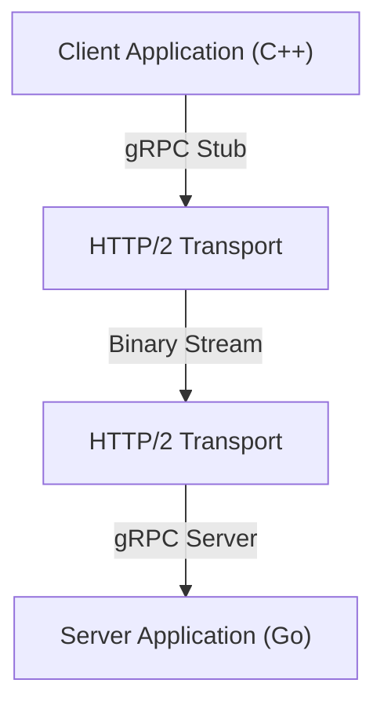

No desenvolvimento de sistemas modernos, a adoção da arquitetura de microsserviços tornou-se uma escolha padrão. Embora o fato de cada serviço escalar de forma independente e poder ser desenvolvido com diferentes linguagens e stacks tecnológicos seja uma grande vantagem, o impacto da comunicação entre serviços (comunicação interprocessos) no desempenho e na confiabilidade do sistema é maior do que nunca.

Na comunicação tradicional entre microsserviços, a combinação de APIs REST sobre HTTP/1.1 e dados JSON tem sido amplamente utilizada. No entanto, com o aumento do tráfego e das exigências de tempo real, as limitações dessa abordagem tornaram-se evidentes. É por isso que a combinação de **gRPC** e **Protocol Buffers (Protobuf)** tem atraído atenção e agora é o padrão de fato em muitos sistemas de grande escala.

Neste artigo, explicaremos detalhadamente por que o gRPC e o Protocol Buffers são tão poderosos, como funcionam, seus benefícios, uma comparação com JSON/REST, e os desafios na implementação real.

## 1. As limitações do REST e JSON

Para entender a superioridade do gRPC, primeiro precisamos organizar os desafios da abordagem tradicional de REST + JSON.

### O custo de parsing e o tamanho dos dados do JSON
JSON (JavaScript Object Notation) é um formato baseado em texto que tem a grande vantagem de ser legível por humanos. No entanto, não é necessariamente eficiente para os computadores.

1. **O tamanho dos dados tende a inchar**: O JSON envia os nomes dos campos como strings todas as vezes. Por exemplo, em dados como `{"user_id": 12345, "status": "active"}`, metadados como as chaves e aspas frequentemente ocupam mais bytes do que a carga útil real (12345, active).
2. **O custo de serialização e desserialização**: O processo de converter strings em números ou objetos (parsing) consome recursos significativos da CPU. Especialmente em ambientes onde uma grande quantidade de mensagens flui entre microsserviços, esse custo de parsing se acumula, resultando em latência massiva e aumento do uso da CPU.

### Os gargalos do HTTP/1.1
As APIs REST tradicionais operam principalmente sobre HTTP/1.1. O HTTP/1.1 tem as seguintes limitações estruturais:

- **Bloqueio Head-of-Line (HoL)**: É difícil processar várias requisições em paralelo em uma única conexão TCP. Se o processamento de uma requisição anterior for atrasado, as requisições subsequentes também serão bloqueadas.
- **Cabeçalhos baseados em texto**: As informações do cabeçalho são enviadas como texto simples todas as vezes, sem compressão, desperdiçando largura de banda.
- **Comunicação unidirecional**: Basicamente, é um modelo onde o servidor retorna uma resposta a uma requisição do cliente. Para realizar envio do servidor ou streaming bidirecional, era necessário combinar outras tecnologias como WebSockets.

## 2. O que é o Protocol Buffers (Protobuf)?

Desenvolvido pelo Google, o **Protocol Buffers** (frequentemente abreviado como Protobuf) é um mecanismo independente de linguagem, independente de plataforma e extensível para serializar dados estruturados. É semelhante a XML ou JSON, mas menor, mais rápido e mais simples.

### O poder da serialização binária
O Protobuf codifica os dados em formato binário. Em vez de enviar nomes de campos como strings, ele utiliza "tags" (números de campo) inteiras predefinidas para identificar os dados.

```protobuf
// user.proto
syntax = "proto3";

package user;

message UserRequest {
  int32 user_id = 1;
  string include_details = 2;
}

message UserResponse {
  int32 user_id = 1;
  string name = 2;
  bool is_active = 3;
}
```

Com base no esquema definido no arquivo `.proto` acima, os dados são convertidos em uma sequência binária extremamente compacta. Como a CPU não precisa analisar strings e pode mapear os dados binários diretamente para estruturas na memória, a velocidade de serialização e desserialização é de várias a dezenas de vezes mais rápida em comparação com JSON.

### Desenvolvimento orientado a esquema
Ao usar o Protobuf, a especificação da API (esquema) é claramente definida como um arquivo `.proto`. Isso não é apenas documentação, mas atua como um contrato executável.
A partir deste arquivo `.proto`, utilizando o compilador protoc, você pode gerar automaticamente classes de acesso a dados em várias linguagens, como C++, Java, Python, Go, Ruby e C#. Isso resolve o eterno problema no desenvolvimento de APIs de "discrepância entre documentação e implementação".

## 3. A arquitetura do gRPC e o HTTP/2

O **gRPC** é um framework de RPC (Remote Procedure Call) de código aberto de alto desempenho que utiliza este Protocol Buffers como Linguagem de Definição de Interface (IDL) e formato de troca de mensagens subjacente.



A maior característica do gRPC é a adoção total do **HTTP/2** como seu protocolo de comunicação.

### Revolução na comunicação com HTTP/2
O HTTP/2 foi projetado para resolver muitos dos problemas que o HTTP/1.1 enfrentava.

1. **Multiplexação**: Em uma única conexão TCP, vários fluxos de requisições e respostas podem ser enviados e recebidos simultaneamente, em qualquer ordem. Isso elimina o bloqueio Head-of-Line e reduz drasticamente a sobrecarga de estabelecimento de conexão.
2. **Framing Binário**: Diferente do protocolo baseado em texto do HTTP/1.1, o HTTP/2 divide todos os dados em frames binários para transmissão. Isso é altamente compatível com os dados binários do Protobuf.
3. **Compressão de cabeçalho (HPACK)**: Comprime eficientemente cabeçalhos HTTP redundantes, economizando largura de banda da rede.

### 4 modelos de comunicação
O gRPC aproveita os recursos de streaming do HTTP/2 para oferecer quatro modelos de comunicação que vão além do simples requisição-resposta.

1. **Unary RPC**: O cliente envia uma requisição e o servidor retorna uma resposta. É o mais próximo de uma API REST comum.
2. **Server Streaming RPC**: O cliente envia uma requisição e o servidor retorna um fluxo (stream) de dados (várias respostas). É útil ao retornar grandes quantidades de dados gradualmente.
3. **Client Streaming RPC**: O cliente envia um fluxo de dados e o servidor retorna uma única resposta. É adequado para fazer upload de arquivos grandes, etc.
4. **Bidirectional Streaming RPC**: O cliente e o servidor usam streams independentes para enviar e receber dados. É ideal para comunicação em tempo real bidirecional complexa, como aplicativos de chat ou jogos online em tempo real.

## 4. As vantagens do gRPC em um ambiente de microsserviços

Na arquitetura de microsserviços, os benefícios específicos de adotar o gRPC são os seguintes.

### Desempenho avassalador
Devido à serialização binária e multiplexação do HTTP/2, a latência de comunicação é substancialmente reduzida. Especialmente em ambientes onde dezenas de microsserviços se comunicam em cadeia internamente para processar uma única requisição de usuário (gráfico de chamadas profundo), esse efeito de redução de latência está diretamente ligado à melhoria do tempo de resposta de todo o sistema.

### Colaboração além das barreiras da linguagem
Em sistemas modernos, ambientes "poliglotas" não são incomuns, onde os componentes de aprendizado de máquina são escritos em Python, gateways de API de alto tráfego em Go, e back-ends legados em Java.
Ao usar gRPC e Protobuf, você pode gerar automaticamente código de comunicação otimizado para cada linguagem apenas compartilhando o arquivo `.proto`. Os desenvolvedores não precisam mais escrever processamento de rede de baixo nível ou código de parsing JSON, permitindo que se concentrem na implementação da lógica de negócios.

### Segurança de tipagem robusta e compatibilidade com versões anteriores
Com APIs JSON, erros de tempo de execução devido a erros de digitação em nomes de campos ou incompatibilidades de tipos de dados (como receber uma string quando se espera um número) ocorrem com frequência. Como o Protobuf fornece tipagem estática forte, esses erros podem ser detectados em tempo de compilação.
Além disso, como o Protobuf usa números de campo, é fácil manter a compatibilidade com versões anteriores (backward) e futuras (forward) na comunicação entre clientes antigos e novos servidores. Mesmo que campos desnecessários sejam removidos (estritamente falando, preteridos e seus números reservados) ou novos campos sejam adicionados, a comunicação não será quebrada.

## 5. Desafios e contramedidas na introdução do gRPC

O gRPC é poderoso, mas também existem alguns obstáculos para sua introdução.

### Compatibilidade com navegadores
Como o gRPC depende de recursos avançados do HTTP/2 (especialmente cabeçalhos Trailer, etc.), atualmente é difícil chamar APIs gRPC diretamente a partir de navegadores web.
As duas soluções gerais para este problema são:
- **gRPC-Web**: Uma tecnologia que transforma ligeiramente o protocolo para que possa ser usado a partir de navegadores. Ele se comunica com o servidor gRPC através de um proxy, como o Envoy.
- **gRPC-Gateway**: Um método de adicionar anotações ao arquivo `.proto` para gerar automaticamente um proxy reverso simultaneamente com o servidor gRPC, permitindo acesso também como uma API RESTful JSON.

### Legibilidade para humanos
Você pode visualizar facilmente o conteúdo do JSON com um comando `curl`, mas o Protobuf, por ser binário, não pode ser lido como está.
Para depuração durante o desenvolvimento, é necessário usar ferramentas CLI dedicadas, como `grpcurl`, ou clientes de API compatíveis com gRPC, como o Postman. Além disso, ao realizar capturas de pacotes, é necessário algum esforço, como carregar o arquivo `.proto` no Wireshark para análise.

## Conclusão

A combinação do gRPC e do Protocol Buffers melhora drasticamente o desempenho, a segurança de tipos e a produtividade no desenvolvimento na comunicação entre microsserviços.
Isso não significa que JSON e REST se tornaram desnecessários. Em muitos casos, REST/JSON continuam adequados para APIs públicas voltadas para o exterior e para a comunicação com o front-end. No entanto, para a comunicação interna de serviço a serviço no back-end, o gRPC já está mudando de uma "opção a ser considerada" para a "opção padrão".

Se você está sofrendo com sobrecarga de comunicação ou está prestes a construir um sistema de microsserviços de grande escala, a introdução do gRPC certamente trará uma evolução dramática ao seu sistema.
