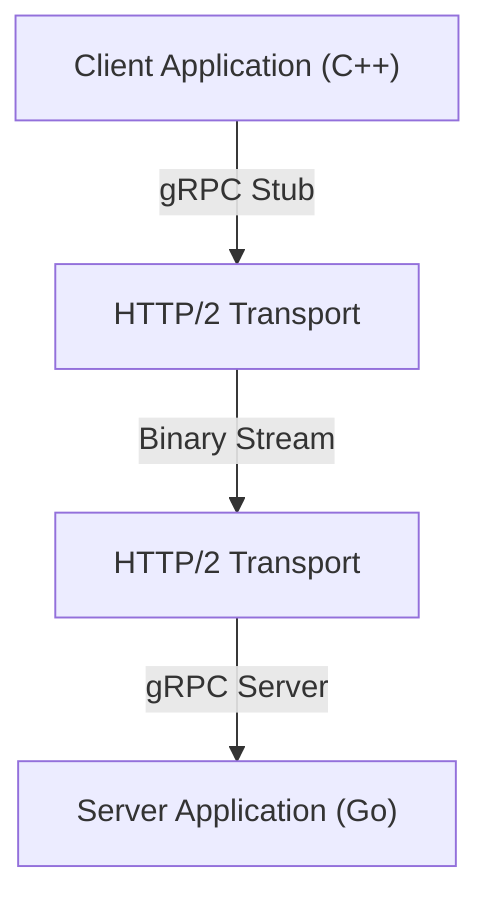

В современной разработке систем использование микросервисной архитектуры стало стандартным выбором. В то время как есть большое преимущество в том, что каждый сервис может масштабироваться независимо и разрабатываться с использованием различных языков и технологических стеков, влияние межсервисного взаимодействия (межпроцессного взаимодействия) на производительность и надежность системы велико как никогда.

В традиционном микросервисном взаимодействии широко использовалась комбинация REST API поверх HTTP/1.1 и данных в формате JSON. Однако по мере роста трафика и требований к реальному времени, ограничения этого подхода становятся очевидными. Поэтому комбинация **gRPC** и **Protocol Buffers (Protobuf)** привлекает внимание и сейчас является стандартом де-факто для многих крупномасштабных систем.

В этой статье мы подробно объясним, почему gRPC и Protocol Buffers настолько эффективны, их устройство и преимущества, сравнение с JSON/REST, а также проблемы, возникающие при их реальном внедрении.

## 1. Ограничения REST и JSON

Чтобы понять преимущества gRPC, необходимо сначала разобраться с проблемами, присущими традиционному подходу REST + JSON.

### Стоимость парсинга JSON и размер данных
JSON (JavaScript Object Notation) — это текстовый формат, главным преимуществом которого является то, что он легко читается человеком. Однако для компьютеров он не всегда эффективен.

1. **Тенденция к раздуванию размера данных**: JSON каждый раз передает имена полей в виде строк. Например, в таких данных, как `{"user_id": 12345, "status": "active"}`, метаданные, такие как имена ключей и скобки, часто занимают больше байтов, чем фактическая полезная нагрузка (12345, active).
2. **Нагрузка при сериализации и десериализации**: Процесс преобразования строк в числа или объекты (парсинг) потребляет значительные ресурсы процессора. Особенно в средах, где между микросервисами передается огромное количество сообщений, эти затраты на парсинг накапливаются, что приводит к огромным задержкам и увеличению загрузки ЦП.

### Узкие места HTTP/1.1
Традиционные REST API в основном работают поверх HTTP/1.1. HTTP/1.1 имеет следующие структурные ограничения.

- **Блокировка начала очереди (Head-of-Line, HoL)**: Сложно обрабатывать несколько запросов параллельно в рамках одного TCP-соединения, и если обработка предыдущего запроса задерживается, последующие запросы также блокируются.
- **Текстовые заголовки**: Информация заголовков передается открытым текстом каждый раз без сжатия, что впустую расходует пропускную способность.
- **Однонаправленная связь**: В основном это модель, в которой сервер возвращает ответ на запрос от клиента, а для реализации push-уведомлений от сервера или двунаправленной потоковой передачи необходимо комбинировать другие технологии, такие как WebSocket.

## 2. Что такое Protocol Buffers (Protobuf)?

Разработанный Google **Protocol Buffers** (сокращенно Protobuf) — это не зависящий от языка и платформы расширяемый механизм сериализации структурированных данных. Он похож на XML или JSON, но меньше, быстрее и проще.

### Сила бинарной сериализации
Protobuf кодирует данные в бинарном формате. Вместо передачи имен полей в виде строк, как в JSON, он использует заранее определенные целочисленные "теги" (номера полей) для идентификации данных.

```protobuf
// user.proto
syntax = "proto3";

package user;

message UserRequest {
  int32 user_id = 1;
  string include_details = 2;
}

message UserResponse {
  int32 user_id = 1;
  string name = 2;
  bool is_active = 3;
}
```

На основе схемы, определенной в вышеуказанном файле `.proto`, данные преобразуются в очень компактную последовательность бинарных данных. Поскольку процессору не нужно парсить строки, и он может напрямую отображать бинарные данные в структуры в памяти, скорость сериализации и десериализации в несколько, а то и в десятки раз выше по сравнению с JSON.

### Разработка на основе схем (Schema-Driven Development)
При использовании Protobuf спецификация API (схема) четко определяется в виде файла `.proto`. Он функционирует не просто как документация, а как исполняемый контракт.
Из этого файла `.proto` с помощью компилятора `protoc` можно автоматически генерировать классы доступа к данным для различных языков, таких как C++, Java, Python, Go, Ruby, C# и других. Это решает вечную проблему при разработке API — «расхождение между документацией и реализацией».

## 3. Архитектура gRPC и HTTP/2

**gRPC** — это высокопроизводительный фреймворк RPC (Remote Procedure Call) с открытым исходным кодом, который использует Protocol Buffers в качестве языка определения интерфейса (IDL) и базового формата обмена сообщениями.



Главной особенностью gRPC является то, что он полностью использует **HTTP/2** в качестве протокола связи.

### Революция в коммуникации благодаря HTTP/2
HTTP/2 был разработан для решения многих проблем, с которыми сталкивался HTTP/1.1.

1. **Мультиплексирование**: В рамках одного TCP-соединения можно одновременно отправлять и получать потоки нескольких запросов и ответов в любом порядке. Это устраняет блокировку начала очереди (HoL) и кардинально снижает накладные расходы на установку соединения.
2. **Бинарное кадрирование (Binary Framing)**: В отличие от текстовых протоколов HTTP/1.1, HTTP/2 разбивает все данные на бинарные кадры и отправляет их. Это очень хорошо сочетается с бинарными данными Protobuf.
3. **Сжатие заголовков (HPACK)**: Эффективно сжимает избыточные HTTP-заголовки, экономя пропускную способность сети.

### 4 модели взаимодействия
gRPC использует возможности потоковой передачи HTTP/2, предоставляя 4 модели взаимодействия, которые выходят за рамки простого запроса-ответа.

1. **Unary RPC (Унарный RPC)**: Клиент отправляет один запрос, а сервер возвращает один ответ. Наиболее близко к традиционному REST API.
2. **Server Streaming RPC (Потоковая передача с сервера)**: Клиент отправляет один запрос, а сервер возвращает поток данных (несколько ответов). Полезно, когда нужно возвращать большой объем данных частями.
3. **Client Streaming RPC (Потоковая передача от клиента)**: Клиент отправляет поток данных, а сервер возвращает один ответ. Подходит для загрузки больших файлов.
4. **Bidirectional Streaming RPC (Двунаправленная потоковая передача)**: Клиент и сервер отправляют и получают данные, используя независимые потоки. Идеально подходит для сложных двунаправленных коммуникаций в реальном времени, таких как чат-приложения или онлайн-игры.

## 4. Преимущества gRPC в микросервисной среде

В микросервисной архитектуре внедрение gRPC дает следующие конкретные преимущества.

### Потрясающая производительность
Благодаря бинарной сериализации и мультиплексированию HTTP/2 задержки связи значительно сокращаются. В частности, в средах, где десятки микросервисов последовательно взаимодействуют для обработки одного пользовательского запроса (глубокий граф вызовов), этот эффект снижения задержек напрямую приводит к улучшению времени отклика системы в целом.

### Взаимодействие поверх языковых барьеров
В современных системах нередка «полиглотная» (многоязычная) среда, где компоненты машинного обучения написаны на Python, высоконагруженный API-шлюз — на Go, а унаследованный бэкенд — на Java.
Используя gRPC и Protobuf, вы можете просто поделиться файлом `.proto` для автоматической генерации оптимизированного коммуникационного кода для каждого языка. Разработчикам больше не нужно писать низкоуровневый сетевой код или код парсинга JSON, и они могут сосредоточиться на реализации бизнес-логики.

### Строгая безопасность типов и обратная совместимость
В JSON API часто возникают ошибки во время выполнения из-за опечаток в именах полей или несоответствия типов данных (например, когда приходит строка там, где ожидается число). Protobuf обеспечивает строгую статическую типизацию, поэтому эти ошибки могут быть обнаружены во время компиляции.
Кроме того, поскольку Protobuf использует номера полей, он позволяет легко поддерживать обратную и прямую совместимость при взаимодействии между старым клиентом и новым сервером. Даже если вы удалите ненужное поле (строго говоря, объявите его устаревшим и зарезервируете номер) или добавите новое поле, связь не нарушится.

## 5. Проблемы внедрения gRPC и их решения

Несмотря на всю мощь gRPC, существуют определенные барьеры для его внедрения.

### Совместимость с браузерами
Поскольку gRPC зависит от продвинутых функций HTTP/2 (в частности, от Trailer заголовков), в настоящее время сложно вызывать gRPC API напрямую из веб-браузера.
Существуют два общих решения этой проблемы:
- **gRPC-Web**: Технология, которая немного преобразует протокол, чтобы его можно было использовать из браузера. Она взаимодействует с gRPC-сервером через прокси-сервер, такой как Envoy.
- **gRPC Gateway**: Метод добавления аннотаций в файл `.proto` для автоматической генерации обратного прокси-сервера вместе с сервером gRPC, что позволяет получать к нему доступ как к RESTful JSON API.

### Читаемость для человека
В то время как JSON можно легко просмотреть с помощью команды `curl`, бинарный Protobuf в исходном виде прочитать невозможно.
Для отладки во время разработки необходимо использовать специальные CLI-инструменты, такие как `grpcurl`, или gRPC-совместимые API-клиенты, такие как Postman. Кроме того, при перехвате пакетов требуются дополнительные усилия, например, загрузка файлов `.proto` в Wireshark для анализа.

## Заключение

Комбинация gRPC и Protocol Buffers радикально улучшает производительность, безопасность типов и продуктивность разработки при межсервисном взаимодействии.
Это не значит, что JSON и REST больше не нужны. Во многих случаях REST/JSON по-прежнему лучше подходит для публичных API или связи с фронтендом. Однако, что касается межсервисного взаимодействия внутри бэкенда, gRPC уже переходит из разряда «вариантов для рассмотрения» в категорию «варианта по умолчанию».

Если вы страдаете от накладных расходов на связь или планируете создать крупномасштабные микросервисы, внедрение gRPC должно принести вашей системе радикальную эволюцию.
