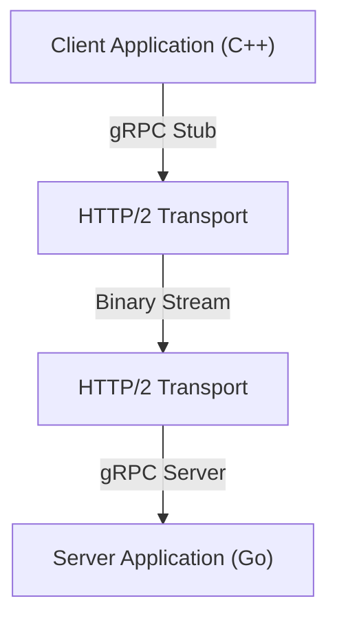

现代系统开发中，采用微服务架构已经成为了标准的选项。各个服务能够独立扩展，并且可以使用不同的语言和技术栈进行开发，这是其巨大的优势。但另一方面，服务间的通信（进程间通信）对系统的性能和可靠性产生的影响也前所未有地巨大。

在传统的微服务通信中，广泛使用基于HTTP/1.1的REST API与JSON数据的组合。然而，随着流量的增长和对实时性要求的提高，这种方法的局限性变得日益明显。因此，备受关注并且目前在许多大规模系统中成为事实标准的，就是**gRPC**与**Protocol Buffers（Protobuf）**的组合。

本文将详细探讨为什么gRPC和Protocol Buffers如此强大，它们的机制和优势，与JSON/REST的比较，以及实际应用中面临的挑战。

## 1. REST与JSON的局限性

为了理解gRPC的优势，我们必须首先梳理传统REST + JSON方法所面临的问题。

### JSON的解析成本与数据大小
JSON（JavaScript Object Notation）是一种基于文本的格式，其巨大的优势是对人类具有可读性。然而，对计算机来说它不一定高效。

1. **数据大小容易膨胀**: JSON每次都会将字段名作为字符串发送。例如，在像 `{"user_id": 12345, "status": "active"}` 这样的数据中，键名和括号等元数据所占用的字节数，通常会超过实际有效载荷（12345, active）。
2. **序列化与反序列化的负载**: 将字符串转换为数字或对象的过程（解析处理）会显著消耗CPU资源。特别是在微服务间有大量消息飞速传递的环境中，这种解析成本积少成多，会导致巨大的延迟和CPU使用率的增加。

### HTTP/1.1的瓶颈
传统的REST API主要运行在HTTP/1.1上。HTTP/1.1存在以下结构上的局限性：

- **队头阻塞 (Head-of-Line (HoL) Blocking)**: 很难在一个TCP连接上并行处理多个请求，如果前面请求的处理被延迟，后续的请求也会被阻塞。
- **基于文本的标头 (Header)**: 标头信息不会被压缩，每次都以纯文本形式发送，白白消耗了带宽。
- **单向通信**: 基本上是服务器对客户端的请求返回响应的模型。如果要实现服务器推送或双向流式传输，必须结合WebSocket等其他技术。

## 2. Protocol Buffers（Protobuf）是什么？

由Google开发的**Protocol Buffers**（简称Protobuf），是一种用于序列化结构化数据的、与语言和平台无关的可扩展机制。它类似于XML或JSON，但更小、更快、更简单。

### 二进制序列化的力量
Protobuf以二进制格式对数据进行编码。它不像JSON那样将字段名作为字符串发送，而是使用预先定义的整数“标签（字段编号）”来识别数据。

```protobuf
// user.proto
syntax = "proto3";

package user;

message UserRequest {
  int32 user_id = 1;
  string include_details = 2;
}

message UserResponse {
  int32 user_id = 1;
  string name = 2;
  bool is_active = 3;
}
```

基于上述 `.proto` 文件中定义的模式（Schema），数据将被转换为极其紧凑的二进制串。因为CPU不需要执行字符串解析，并且可以直接将二进制数据映射到内存中的结构体，所以序列化和反序列化的速度比JSON快几倍到几十倍。

### 模式驱动开发 (Schema-driven Development)
使用Protobuf，API的规范（模式）会被明确定义为 `.proto` 文件。这不仅仅是一个文档，而是作为可执行的契约（Contract）发挥作用。
通过这个 `.proto` 文件，使用protoc编译器，可以自动生成C++、Java、Python、Go、Ruby、C#等各种语言的数据访问类。这解决了API开发中永恒的难题——“文档与实现脱节”。

## 3. gRPC架构与HTTP/2

**gRPC**是一个高性能的开源RPC（Remote Procedure Call）框架，它将Protocol Buffers作为接口定义语言（IDL）和底层的消息交换格式。



gRPC最大的特点是全面采用**HTTP/2**作为通信协议。

### HTTP/2的通信革命
HTTP/2被设计用于解决HTTP/1.1所面临的诸多挑战。

1. **多路复用 (Multiplexing)**: 在单个TCP连接上，可以同时、不拘顺序地发送和接收多个请求和响应流。这消除了队头阻塞，并极大地降低了建立连接的开销。
2. **二进制分帧 (Binary Framing)**: 与HTTP/1.1基于文本的协议不同，HTTP/2将所有数据分割成二进制帧进行发送。这与Protobuf的二进制数据非常契合。
3. **标头压缩 (HPACK)**: 有效地压缩冗余的HTTP标头，节省网络带宽。

### 4种通信模型
gRPC利用HTTP/2的流式传输功能，提供了不仅限于简单请求-响应的4种通信模型。

1. **一元 RPC (Unary RPC)**: 客户端发送一个请求，服务器返回一个响应。最接近于一般REST API的形式。
2. **服务器流式 RPC (Server Streaming RPC)**: 客户端发送一个请求，服务器返回一个数据流（多个响应）。在逐步返回大量数据等情况下非常有效。
3. **客户端流式 RPC (Client Streaming RPC)**: 客户端发送一个数据流，服务器返回一个响应。适用于大容量文件上传等场景。
4. **双向流式 RPC (Bidirectional Streaming RPC)**: 客户端和服务器双方使用独立的流发送和接收数据。最适合聊天应用或实时在线游戏等复杂的双向实时通信。

## 4. 微服务环境中gRPC的优势

在微服务架构中，采用gRPC可以带来以下具体优势：

### 压倒性的性能
二进制序列化和HTTP/2的多路复用大幅降低了通信延迟。特别是在为了处理一个用户请求，内部会有数十个微服务进行链式通信的环境（深层调用图）中，这种降低延迟的效果会直接提升整个系统的响应时间。

### 跨越语言壁垒的协作
在现代系统中，“多语言（Polyglot）”环境并不罕见，例如机器学习组件用Python编写，高流量API网关用Go编写，而传统的后端系统用Java编写。
只要使用gRPC和Protobuf，只需共享 `.proto` 文件，即可自动生成针对各种语言优化的通信代码。开发人员不再需要编写底层的网络处理或JSON解析代码，可以专注于业务逻辑的实现。

### 坚固的类型安全与向后兼容性
在JSON API中，由于字段名拼写错误或数据类型不匹配（例如期待数字却传来字符串），经常会发生运行时错误。Protobuf提供了强大的静态类型检查，可以在编译时捕获这些错误。
此外，因为Protobuf利用字段编号，所以即使在旧客户端和新服务器之间的通信中，也很容易保持向后兼容性和向前兼容性。即使删除不需要的字段（严格来说是弃用并保留该编号）或添加新字段，也不会破坏通信。

## 5. 引入gRPC的挑战与对策

虽然gRPC非常强大，但在引入时也存在一些障碍。

### 与浏览器的兼容性
因为gRPC依赖于HTTP/2的高级功能（特别是Trailer标头等），目前很难从Web浏览器直接调用gRPC API。
针对这个问题的常见解决方案有以下两种：
- **gRPC-Web**: 一种稍微转换协议以便从浏览器使用的技术。通过Envoy等代理与gRPC服务器通信。
- **gRPC Gateway**: 通过在 `.proto` 文件中添加注解（Annotation），同时自动生成gRPC服务器和反向代理，使其也能作为RESTful JSON API被访问的方法。

### 对人类的可读性
虽然可以通过 `curl` 命令轻松地敲击并查看JSON的内容，但作为二进制的Protobuf原样是无法阅读的。
在开发调试时，需要使用像 `grpcurl` 这样的专用CLI工具，或Postman等支持gRPC的API客户端。此外，在进行抓包时，也需要采取诸如让Wireshark读取 `.proto` 文件进行解析等措施。

## 总结

gRPC和Protocol Buffers的组合实现了微服务间通信在性能、类型安全性和开发生产力方面的飞跃提升。
这并不意味着不再需要JSON和REST。对于面向公众的公共API或与前端的通信，依然有很多场景更适合REST/JSON。然而，在后端内部的服务间通信中，gRPC已经正在从“值得考虑的选项”转变为“默认的选项”。

如果你正为通信开销而苦恼，或者正准备构建大规模微服务，引入gRPC必然会为你的系统带来革命性的进化。
