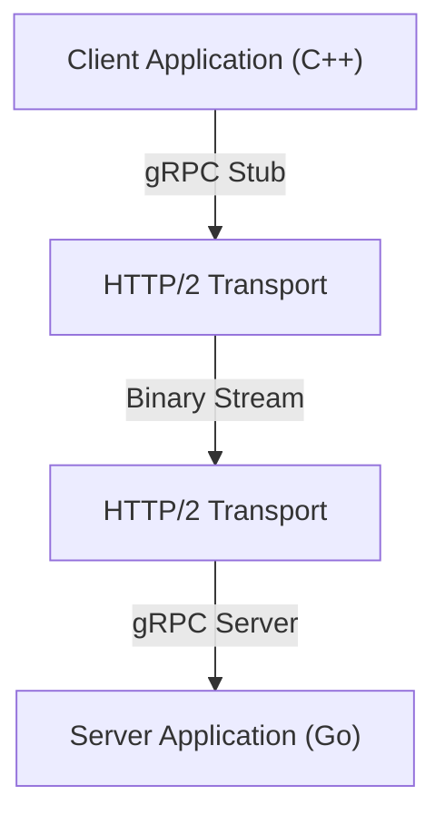

在現代的系統開發中，採用微服務架構已成為標準的選擇。雖然各服務能獨立擴展、使用不同語言或技術堆疊進行開發是一大優勢，但服務間的通訊（行程間通訊）對系統效能與可靠性的影響，卻變得前所未有地巨大。

在傳統的微服務通訊中，廣泛使用的是基於HTTP/1.1的REST API與JSON資料的組合。然而，隨著流量增加與對即時性要求的提升，這種方法的侷限性變得日益明顯。因此，**gRPC**與**Protocol Buffers (Protobuf)**的組合吸引了眾多目光，現今更成為許多大型系統的實質標準（de facto standard）。

本文將詳細解說為何gRPC與Protocol Buffers如此強大、其運作機制與優勢、與JSON/REST的比較，以及實際導入時會面臨的挑戰。

## 1. REST與JSON的極限

為了理解gRPC的優勢，首先必須釐清傳統的REST + JSON方法所面臨的問題。

### JSON的解析成本與資料大小

JSON (JavaScript Object Notation) 是一種基於文字的格式，擁有易於人類閱讀的極大優勢。然而，這對電腦來說卻未必有效率。

1. **資料大小容易膨脹**：JSON每次都會將欄位名稱作為字串傳送。例如在 `{"user_id": 12345, "status": "active"}` 這樣的資料中，鍵名與括號等中介資料（metadata）所佔用的位元組數量，往往比實際的承載資料（payload，即12345與active）還要多。
2. **序列化與反序列化的負載**：將字串轉換為數值或物件的處理（解析處理），會顯著消耗CPU資源。特別是在微服務間有大量訊息往來的環境中，這些解析成本積少成多，將導致巨大的延遲與CPU使用率的攀升。

### HTTP/1.1的瓶頸

傳統的REST API主要在HTTP/1.1上運作。HTTP/1.1存在著以下結構性的限制。

- **隊頭阻塞 (Head-of-Line Blocking, HoL)**：難以在單一TCP連線上並行處理多個請求，若前一個請求的處理發生延遲，後續的請求也會跟著被阻塞。
- **基於文字的標頭 (Header)**：標頭資訊未經壓縮，每次皆以純文字傳送，白白消耗了頻寬。
- **單向通訊**：基本模型是伺服器針對客戶端的請求做出回應，若要實現伺服器推送（push）或雙向串流（streaming），就必須結合如WebSocket等其他技術。

## 2. 什麼是Protocol Buffers (Protobuf)？

由Google開發的**Protocol Buffers**（簡稱Protobuf），是一種用於將結構化資料序列化的擴充機制，且不依賴特定語言或平台。它與XML或JSON相似，但體積更小、速度更快且更為簡單。

### 二進位序列化的威力

Protobuf會將資料編碼為二進位格式。它不會像JSON那樣將欄位名稱當作字串傳送，而是使用預先定義好的整數「標籤（欄位編號）」來識別資料。

```protobuf
// user.proto
syntax = "proto3";

package user;

message UserRequest {
  int32 user_id = 1;
  string include_details = 2;
}

message UserResponse {
  int32 user_id = 1;
  string name = 2;
  bool is_active = 3;
}
```

基於上述 `.proto` 檔案中定義的綱要（schema），資料會被轉換為極度緊湊的二進位序列。由於CPU無需進行字串解析，可將二進位資料直接對應到記憶體中的結構體上，因此序列化與反序列化的速度與JSON相比，可快上數倍至數十倍。

### 綱要驅動開發 (Schema-Driven Development)

透過使用Protobuf，API的規格（綱要）將會明確定義為 `.proto` 檔案。這不僅僅是文件，更發揮了可執行的契約（contract）的作用。
從這份 `.proto` 檔案出發，可使用protoc編譯器自動生成C++、Java、Python、Go、Ruby、C#等多種語言的資料存取類別。這解決了API開發中「文件與實作脫節」這個永恆的難題。

## 3. gRPC的架構與HTTP/2

**gRPC** 是一個高效能的開源RPC (Remote Procedure Call) 框架，它正是使用Protocol Buffers作為介面定義語言 (IDL) 以及底層的訊息交換格式。



gRPC最大的特徵在於，它全面採用了**HTTP/2**作為通訊協定。

### 基於HTTP/2的通訊革命

HTTP/2的設計旨在解決HTTP/1.1所面臨的許多問題。

1. **多工處理 (Multiplexing)**：在單一TCP連線上，可以不限順序地同時傳送與接收多個請求與回應的串流。這消除了隊頭阻塞問題，並大幅減少了建立連線的額外開銷 (overhead)。
2. **二進位分幀 (Binary Framing)**：與HTTP/1.1基於文字的協定不同，HTTP/2會將所有資料分割成二進位幀 (frame) 來傳送。這與Protobuf的二進位資料非常契合。
3. **標頭壓縮 (HPACK)**：高效率地壓縮冗長的HTTP標頭，以節省網路頻寬。

### 4種通訊模型

gRPC活用了HTTP/2的串流功能，提供了不侷限於單純請求與回應的4種通訊模型。

1. **Unary RPC (單一RPC)**：客戶端發送一個請求，伺服器回傳一個回應。這是最接近一般REST API的形式。
2. **Server Streaming RPC (伺服器串流RPC)**：客戶端發送一個請求，伺服器回傳一個資料流（多個回應）。適用於需分批回傳大量資料的情況。
3. **Client Streaming RPC (客戶端串流RPC)**：客戶端發送一個資料流，伺服器回傳一個回應。適合用於大容量檔案上傳等場景。
4. **Bidirectional Streaming RPC (雙向串流RPC)**：客戶端與伺服器雙方皆使用獨立的串流來傳送與接收資料。非常適合聊天應用程式或即時連線遊戲等複雜的雙向即時通訊。

## 4. 在微服務環境中gRPC的優勢

在微服務架構中，採用gRPC所能獲得的具體優勢如下：

### 壓倒性的效能

藉由二進位序列化與HTTP/2的多工處理，通訊延遲獲得了大幅度的縮減。特別是為了處理單一使用者請求，內部可能會有數十個微服務進行連鎖通訊的環境（深層呼叫圖）中，這種降低延遲的效果將直接帶來整個系統回應時間的提升。

### 跨越語言隔閡的協同合作

在現代系統中，機器學習元件用Python編寫、高流量的API Gateway用Go編寫、而遺留的後端則用Java編寫，這類「多語言 (Polyglot)」環境並不罕見。
只要使用gRPC與Protobuf，僅需共享 `.proto` 檔案，即可自動生成針對各語言最佳化的通訊程式碼。開發者無需再撰寫低階的網路處理或JSON解析程式碼，能夠更專注於商業邏輯的實作。

### 堅固的型別安全性與向下相容性

在JSON API中，經常會因為欄位名稱拼字錯誤或資料型別不一致（例如預期是數值卻傳來字串）而頻繁發生執行階段錯誤。Protobuf提供了強大的靜態型別，因此可以在編譯時期就捕捉到這些錯誤。
此外，由於Protobuf利用了欄位編號，即使在舊客戶端與新伺服器之間的通訊中，也能輕易維持向下相容性與向上相容性。即使移除不再需要的欄位（嚴格來說是標記為廢棄並保留該編號），或是新增了欄位，也不會導致通訊中斷。

## 5. 導入gRPC的挑戰與對策

雖然gRPC非常強大，但在導入時仍會面臨一些門檻。

### 與瀏覽器的相容性

由於gRPC依賴HTTP/2的高階功能（尤其是Trailer標頭等），從目前的網頁瀏覽器直接呼叫gRPC API是一件困難的事。
針對此問題，常見的解決方案有以下兩種：
- **gRPC-Web**：稍微轉換通訊協定，使其能從瀏覽器中使用的技術。它會透過如Envoy等代理伺服器 (Proxy) 與gRPC伺服器進行通訊。
- **gRPC Gateway**：透過在 `.proto` 檔案中加入註解 (Annotation)，在建立gRPC伺服器的同時自動生成反向代理 (Reverse Proxy)，讓外部也能以RESTful JSON API的方式進行存取的手法。

### 對人類的可讀性

JSON可以輕易地透過 `curl` 指令來敲打並檢視內容，但身為二進位的Protobuf卻無法直接閱讀。
在開發時的除錯過程中，必須使用如 `grpcurl` 這類專用的CLI工具，或是使用如Postman等支援gRPC的API客戶端。此外，在進行封包擷取時，也需要將 `.proto` 檔案匯入Wireshark進行分析等額外處理。

## 總結

gRPC與Protocol Buffers的組合，讓微服務間通訊的效能、型別安全性以及開發產能獲得飛躍性的提升。
這並不代表JSON與REST變得不再需要。對於對外公開的Public API或與前端之間的通訊，在許多情況下REST/JSON依然是較合適的選擇。然而，在後端內部的服務間通訊上，gRPC已經從「值得考慮的選項」逐漸轉變為「預設的選項」了。

如果您正為通訊的額外開銷所苦，又或是正準備建構大規模的微服務，那麼導入gRPC勢必能為系統帶來戲劇性的進化。
