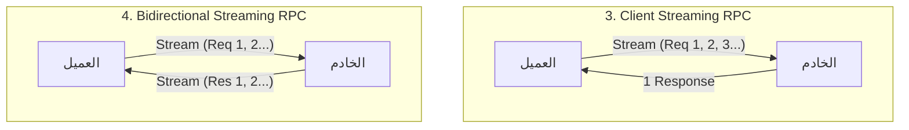
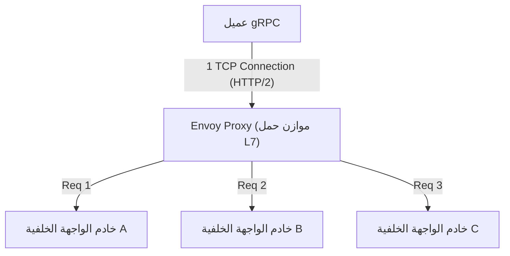

# gRPC و Protocol Buffers: معيار الاتصال بين الخدمات المصغرة

في تطوير البرمجيات الحديثة، أصبحت "بنية الخدمات المصغرة"، التي تقسم النظام إلى عدة خدمات صغيرة تعمل معًا، المعيار الفعلي لتطوير وتشغيل التطبيقات واسعة النطاق بشكل قابل للتوسع.
ومع ذلك، من خلال تقسيم الخدمات، تتحول المعالجة التي كانت تكتمل مسبقًا في الذاكرة كاستدعاءات دوال إلى "نظام موزع" يتواصل عبر الشبكة. تصميم اتصال الشبكة هذا يؤثر بشكل كبير على الأداء العام للنظام، وموثوقيته، وكفاءة تطويره.

لفترة طويلة، تم استخدام واجهات برمجة التطبيقات RESTful المعتمدة على JSON (HTTP/1.1) على نطاق واسع للاتصال بين الخدمات المصغرة. لكن مع زيادة حجم الأنظمة وزيادة المتطلبات لحجم الاتصالات والوقت الفعلي، أصبحت قيود JSON/REST واضحة.
لحل هذه التحديات من جذورها وإرساء مكانة راسخة كمعيار لاتصالات الخدمات المصغرة من الجيل التالي، قامت Google بتطوير **gRPC** وتنسيق التسلسل الخاص به **Protocol Buffers (Protobuf)**.

في هذه المقالة، سننطلق من خلفية سبب عدم كفاية JSON/REST، ونتعمق في التفاصيل الكاملة لـ gRPC، بما في ذلك مزايا التطوير الموجه بالمخطط، وآلية التشفير الثنائي عالية الكفاءة لـ Protocol Buffers، ونماذج التدفق الأربعة التي تستفيد من HTTP/2، وتحديات موازنة الحمل الخاصة بالبيئات الموزعة مع حلول وكيل Envoy.

---

## 1. قيود وتحديات اتصال JSON/REST

مزيج واجهة برمجة تطبيقات REST و JSON سهل القراءة والكتابة بالنسبة للبشر ويتوافق جيدًا مع متصفحات الويب، لذلك لا يزال سائدًا في الاتصال بين الواجهة الأمامية والخلفية (اتصال الشمال-الجنوب). ومع ذلك، في الحالات التي تتواصل فيها خدمات الواجهة الخلفية مع بعضها البعض بسرعات عالية (اتصال الشرق-الغرب)، هناك العديد من الاختناقات الخطيرة كما يلي:

### 1.1. تكلفة تسلسل وتحليل النصوص (JSON)
JSON هو تنسيق قائم على النصوص. يتم تمثيل جميع البيانات، مثل الأرقام والقيم المنطقية، كسلاسل نصية، مما يتطلب معالجة (تسلسل/إلغاء تسلسل) لتحويل الهياكل في الذاكرة إلى سلاسل على الجانب المرسل، وتحليل السلاسل واستعادتها مرة أخرى إلى هياكل في الذاكرة على الجانب المستقبل.
تحليل النص (التحليل النحوي، وتحويل ترميز الأحرف، وتحويل الأرقام) يستهلك الكثير من دورات وحدة المعالجة المركزية. في بيئة الخدمات المصغرة، ليس من غير المألوف أن يؤدي طلب مستخدم واحد إلى عشرات الاتصالات بين الخدمات، وترتبط التكلفة التراكمية لتحليل JSON في كل عقدة ارتباطًا مباشرًا بزيادة زمن الانتقال في النظام بأكمله وإهدار موارد وحدة المعالجة المركزية.

### 1.2. تضخم حجم الحمولة
JSON هو تنسيق متكرر. يتضمن كل سجل بيانات دائمًا سلسلة اسم المفتاح (اسم الحقل).
```json
{
  "user_id": 12345,
  "first_name": "Taro",
  "last_name": "Yamada",
  "is_active": true
}
```
حتى عند إرسال واستقبال كميات كبيرة من البيانات بنفس البنية، يتم إرسال أسماء المفاتيح بشكل متكرر، مما يؤدي إلى إهدار حجم نقل البيانات (النطاق الترددي). يمكن تقليل الحجم عن طريق الضغط (مثل gzip)، ولكن هذا يضيف عبئًا إضافيًا على وحدة المعالجة المركزية للضغط وفك الضغط.

### 1.3. عدم وجود مخطط صارم وصعوبة إدارة الإصدارات
لا يحتوي JSON نفسه على مخطط (تعريفات لأنواع البيانات وما إذا كانت إلزامية/اختيارية). على الرغم من أنه من الممكن تحديد المواصفات باستخدام OpenAPI (Swagger) وما إلى ذلك، إلا أن هناك دائمًا خطر حدوث اختلاف بين وثيقة المواصفات والتنفيذ الفعلي. تؤدي إضافة حقول غير متوقعة إلى استجابة واجهة برمجة التطبيقات أو تغيير الأنواع (مثل من أرقام إلى سلاسل) إلى وقوع حوادث متكررة حيث تتسبب الخدمة المستقبلة في حدوث أخطاء في وقت التشغيل.

### 1.4. إدارة اتصالات HTTP/1.1 وقيود التدفق
تعمل معظم واجهات برمجة تطبيقات REST على HTTP/1.1. يعتمد HTTP/1.1 أساسًا على نموذج إرجاع استجابة واحدة لطلب واحد، وتتطلب معالجة طلبات متعددة في وقت واحد إنشاء اتصالات TCP متعددة (مشكلة حظر رأس الخط). بالإضافة إلى ذلك، لتحقيق دفع البيانات غير المتزامن من الخادم إلى العميل، أو التدفق ثنائي الاتجاه، من الضروري دمج تقنيات أخرى مثل أحداث مرسلة من الخادم (SSE) أو WebSocket، مما يزيد من تعقيد النظام.

---

## 2. Protocol Buffers والتطوير الموجه بالمخطط

السلاح القوي لحل تحديات JSON/REST هذه هو **Protocol Buffers (Protobuf)**. تعد Protobuf نسخة مفتوحة المصدر للغة وصف البيانات وآلية التسلسل التي كانت Google تستخدمها داخليًا.

### 2.1. التطوير الموجه بالمخطط (Schema-Driven Development)
تتخذ عملية التطوير باستخدام gRPC و Protobuf نهج "المخطط أولاً". أولاً، نقوم بتعريف بنية البيانات (الرسائل) المراد تبادلها، وواجهات برمجة التطبيقات (الخدمات) المقدمة، في ملف IDL (لغة تعريف الواجهة) يسمى `.proto`.

```protobuf
syntax = "proto3";

package user.v1;

// رسالة تمثل معلومات المستخدم
message User {
  int32 user_id = 1;
  string first_name = 2;
  string last_name = 3;
  bool is_active = 4;
}

// رسالة الطلب
message GetUserRequest {
  int32 user_id = 1;
}

// الخدمة التي تقدم معلومات المستخدم
service UserService {
  rpc GetUser (GetUserRequest) returns (User);
}
```

يصبح ملف `.proto` هذا **"المصدر الوحيد للحقيقة"** للنظام بأكمله. من هذا الملف، نستخدم مترجم `protoc` لإنشاء كود (stubs) للعميل والخادم بشكل تلقائي لمختلف اللغات مثل Go و Java و Python و C++ و Node.js وما إلى ذلك.

**مزايا التطوير الموجه بالمخطط:**
- **ضمان أمان النوع**: نظرًا لإجراء فحص النوع في وقت الترجمة، يمكن تقليل أخطاء النوع في وقت التشغيل (مثل أخطاء تحليل JSON) بشكل كبير.
- **العمل كوثيقة**: يعمل ملف `.proto` نفسه كمواصفات دقيقة لواجهة برمجة التطبيقات. لن يحدث أي انحراف عن التنفيذ.
- **التوافقية مع الإصدارات السابقة واللاحقة**: يتم تعيين رقم علامة فريد مثل `1` و `2` لكل حقل. حتى إذا تمت إضافة حقول جديدة، يمكن للعملاء القدامى تجاهلها إذا كانت أرقام العلامات مختلفة، وعلى العكس من ذلك، عند حذف حقول قديمة، يمكن منع إعادة استخدامها عن طريق تحديد رقم العلامة الخاص بها كـ `reserved`. يتيح ذلك ترقية إصدارات واجهة برمجة التطبيقات بأمان.

### 2.2. كفاءة التسلسل المذهلة للتنسيق الثنائي
السبب الأكبر وراء كون Protobuf أسرع وأخف من JSON هو آلية التشفير الثنائي الخاصة به. تقوم Protobuf بتسلسل البيانات بتنسيق يسمى **Tag-WireType-Value (تغيير لـ TLV: Type-Length-Value)**.

دعونا نرى كيف يتم تسلسل `user_id = 12345` (رقم العلامة 1، نوع int32) لرسالة `User` السابقة.

1. **الجمع بين العلامة و WireType**:
   يتم دمج رقم العلامة و WireType (نوع البيانات، على سبيل المثال 0 لـ Varint) في بايت واحد. الصيغة هي `(field_number << 3) | wire_type`.
   في حالة رقم العلامة 1، و WireType 0، يكون الناتج `(1 << 3) | 0 = 00001000` (بالنظام السداسي عشر `0x08`). هذا يوضح "أي حقل هذا وكيف يجب قراءته" في بايت واحد فقط.
   (لا حاجة لسلسلة نصية بحجم 10 بايت مثل `"user_id":` كما في JSON)

2. **تشفير القيمة (Varint)**:
   يستخدم تشفير الأعداد الصحيحة متغيرة الطول (Varint) لتمثيل قيم الأعداد الصحيحة. يمكن تمثيل الأرقام الأصغر بعدد أقل من البايتات. يستخدم البت الأكثر أهمية (MSB) لبايت واحد كبت استمرارية، ويتم تخزين حمولة البيانات في البتات السبعة المتبقية.
   في حالة 12345، يتم تمثيلها بواسطة 2 بايت `0x39 0x60` باستخدام تشفير Varint.

ونتيجة لذلك، يتم ضغط `user_id: 12345` إلى 3 بايت فقط كالتالي `0x08 0x39 0x60`. في حالة JSON، يتطلب الأمر 15 بايت لـ `"user_id":12345`.
أثناء التحليل أيضًا، يمكن تعيين البيانات مباشرة من النظام الثنائي إلى قيم صحيحة في الذاكرة وغيرها، لذلك لا يحدث أي معالجة ثقيلة مثل تحليل السلاسل النصية على الإطلاق. هذا هو السبب وراء السرعة الفائقة لـ Protobuf.

---

## 3. فوائد HTTP/2 ونماذج اتصال التدفق الأربعة

يعتمد gRPC على **HTTP/2** كطبقة نقل. يتمتع HTTP/2 بميزات مثل التأطير الثنائي، وتعدد الإرسال (Multiplexing)، وضغط الرأس (HPACK)، والتي تدعم بشكل كبير أداء ووظائف gRPC.

### 3.1. تعدد الإرسال والتسريع بواسطة HTTP/2
لحل مشكلة حظر رأس الخط في HTTP/1.1، يسمح HTTP/2 بتبادل تدفقات متعددة (طلبات/استجابات) في وقت واحد عبر اتصال TCP واحد. في الاتصال بين الخدمات، يقوم gRPC عادةً بإنشاء اتصال TCP مستمر واحد (قناة) وتنفيذ العديد من استدعاءات RPC بشكل متوازٍ عليه. يقلل هذا من تكلفة مصافحة TCP ويحقق إنتاجية عالية.

### 3.2. نماذج الاتصال الأربعة
لا يقتصر gRPC على مجرد الطلب والاستجابة، بل يستفيد من قدرات الاتصال ثنائي الاتجاه لـ HTTP/2 لدعم ما مجموعه أربعة أنواع من طرق الاتصال (التدفق).




1. **Unary RPC (الاتصال الأحادي)**:
   النوع الأكثر شيوعًا، وهو اتصال يشبه REST يُرجع استجابة واحدة لطلب واحد.
2. **Server Streaming RPC (تدفق الخادم)**:
   طريقة يقوم فيها العميل بإرسال طلب واحد ويقوم الخادم بإرجاع تدفق من البيانات (رسائل متعددة). وهي مناسبة لإرجاع نتائج البحث لمجموعات بيانات كبيرة بالتتابع، أو الاشتراك في خلاصات أسعار الأسهم في الوقت الفعلي.
3. **Client Streaming RPC (تدفق العميل)**:
   طريقة يقوم فيها العميل بإرسال تدفق من البيانات، وبعد الانتهاء من إرسال كل شيء، يقوم الخادم بإرجاع استجابة واحدة. وهي مثالية لتحميل الملفات الكبيرة، أو إرسال دفعات كبيرة من بيانات مستشعرات إنترنت الأشياء (IoT).
4. **Bidirectional Streaming RPC (التدفق ثنائي الاتجاه)**:
   طريقة يستخدم فيها كل من العميل والخادم تدفقات مستقلة لقراءة البيانات وكتابتها في كلا الاتجاهين مع الحفاظ على ترتيب الرسائل. وهي فعالة للغاية في تطبيقات الدردشة، والاتصالات في الوقت الفعلي للألعاب التنافسية، وأنظمة التعرف على الصوت في الوقت الفعلي.

تكمن قوة gRPC في أنه يمكن تنفيذ كل هذه النماذج المتنوعة للاتصال بشكل متسق في نفس الإطار وعلى نفس المنفذ (فوق HTTP/2).

---

## 4. تحديات موازنة الحمل ودور Envoy Proxy

عند نشر gRPC في بيئة إنتاج فعلية (بيئات تنسيق الحاويات مثل Kubernetes)، فإن إحدى العقبات الرئيسية التي يواجهها العديد من المطورين هي **"موازنة الحمل (Load Balancing)"**.

### 4.1. فخ موازن الحمل L4 (TCP)
في اتصالات HTTP/1.1 التقليدية، كان التوزيع الدائري (Round-robin) على مستوى اتصال TCP بواسطة موازنات الحمل L4 (طبقة النقل) مثل AWS ELB أو Nginx يعمل بشكل جيد تمامًا. نظرًا لإنشاء اتصال جديد لكل طلب أو قطعه عبر Connection: close، فقد تم توزيع الحمل بشكل طبيعي على كل خادم واجهة خلفية.

ومع ذلك، تختلف الأمور في gRPC (HTTP/2). كما ذُكر سابقًا، من أجل تحسين الأداء، يقوم gRPC بـ **الحفاظ على اتصال TCP واحد (Keep-Alive) ويقوم بتعدد إرسال الطلبات عليه**.
يحدد موازن الحمل L4 وجهة التوجيه مرة واحدة فقط عند إنشاء اتصال TCP. لذلك، بمجرد توصيل اتصال TCP من عميل معين بالخادم A، ستستمر جميع طلبات gRPC (التدفقات) اللاحقة في التركيز على الخادم A فقط، ولن يتم إرسال أي طلبات إلى الخادم B أو C، مما يؤدي إلى حدوث "انحياز".

### 4.2. موازنة الحمل من جانب العميل مقابل الوكيل (L7)
لحل هذه المشكلة، بدلاً من اتصال TCP (L4)، من الضروري تفسير تدفق HTTP/2 (L7: طبقة التطبيق) الذي يتدفق عبره، وتنفيذ التوجيه على أساس كل طلب. هناك حلان رئيسيان لذلك:

1. **موازنة الحمل من جانب العميل (Thick Client)**:
   طريقة تتمثل في إضافة وظيفة موازنة الحمل إلى مكتبة عميل gRPC نفسها. يقوم العميل بالاستعلام عن DNS أو اكتشاف الخدمة (مثل Consul أو ZooKeeper) للحصول على قائمة بعناوين IP لجميع الواجهات الخلفية، وينفذ التوزيع الدائري وما إلى ذلك بنفسه. إنها فعالة، لكن العبء يكون كبيرًا لتنفيذ وتشغيل نفس المنطق بجميع لغات العملاء.

2. **موازنة حمل وكيل L7 (Envoy Proxy)**:
   وهو النهج القياسي الأكثر شيوعًا حاليًا في البنية التحتية للخدمات المصغرة. يتضمن وضع خادم وكيل عالي الأداء يدعم gRPC و HTTP/2 بشكل أصلي في المنتصف. الممثل الأبرز لذلك هو **Envoy**.



يقبل Envoy اتصال TCP واحدًا من العميل ويقوم بتحليل إطارات HTTP/2 المتدفقة عبره. بعد ذلك، يستخرج طلبات RPC الفردية (التدفقات) ويقوم بموازنة الحمل بشكل متساوٍ (على مستوى كل طلب) عبر خوادم الواجهة الخلفية المتعددة.
في بيئات Kubernetes، في بنى شبكة الخدمات (Service Mesh) مثل Istio و Linkerd، يتم نشر وكيل Envoy هذا كمركب جانبي (Sidecar) لكل Pod، مما يحقق توجيه حركة مرور gRPC المتقدم، وإعادة المحاولة، والمهلات الزمنية، وقواطع الدوائر (Circuit Breakers) دون إجراء أي تغييرات على كود التطبيق.

---

## 5. الخلاصة: متى يجب تبني gRPC ومتى لا يجب

تعتبر gRPC و Protocol Buffers تقنيات ممتازة للغاية من حيث الأداء، والمتانة، وإنتاجية التطوير، ولكنها ليست الحل السحري لكل شيء. من المهم استخدامها بشكل مناسب في الأماكن المناسبة.

### الحالات التي يجب فيها تبني gRPC
- **الاتصالات الخلفية (الشرق-الغرب) بين الخدمات المصغرة**: البيئات التي تتطلب زمن انتقال منخفض وإنتاجية عالية.
- **البيئات متعددة اللغات (Polyglot)**: حتى لو كانت الفِرق تستخدم لغات مختلفة مثل Go و Java و Node.js، يمكن إنشاء واجهة موحدة تلقائيًا من ملف Proto.
- **الأنظمة التي تتطلب معالجة التدفق**: التطبيقات التي تتطلب نقل كميات كبيرة من البيانات أو اتصالاً ثنائي الاتجاه في الوقت الفعلي.
- **الأنظمة واسعة النطاق التي تتطلب مخططًا صارمًا**: عندما تريد منع أخطاء التنسيق بين الفِرق وإجراء إدارة آمنة لإصدارات واجهة برمجة التطبيقات.

### الحالات التي لا ينبغي فيها تبني gRPC (ويجب النظر في REST/JSON)
- **الاتصال المباشر مع الواجهة الأمامية (المتصفح)**: من الممكن استدعاء gRPC من المتصفح باستخدام تقنية تُسمى `grpc-web`، ولكن لا يزال إعداد البيئة معقدًا. من الشائع اعتماد أنماط GraphQL أو REST أو BFF (Backend for Frontend) للواجهة الأمامية.
- **واجهات برمجة التطبيقات العامة للإصدار الخارجي**: عند توفير واجهة برمجة تطبيقات لمطوري الطرف الثالث، يكون الجمع بين HTTP/REST و JSON أكثر انتشارًا بشكل هائل، وحاجز الدخول أقل نظرًا لسهولة اختباره باستخدام أوامر مثل curl.
- **الأنظمة الصغيرة جدًا**: في النماذج الأولية أو الأنظمة التي تتكون من عدد قليل من الخدمات، قد تفوق تكلفة الإعدادات المسبقة (Boilerplate) مثل إدارة ملفات Proto وبناء مسارات البناء الفوائدَ المحتملة.

مع تطور بنية الأنظمة، أصبح gRPC بالتأكيد "المعيار" لاتصالات الواجهة الخلفية من الجيل التالي. من خلال فهم التمثيل الفعال للبيانات بواسطة Protocol Buffers وآلية النقل القوية بواسطة HTTP/2، ودمجهما بشكل مناسب في النظام، ستتمكن من تحقيق خدمات مصغرة أكثر قوة وقابلية للتوسع.
