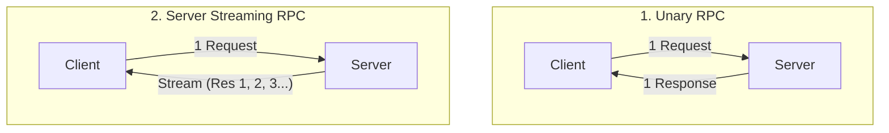
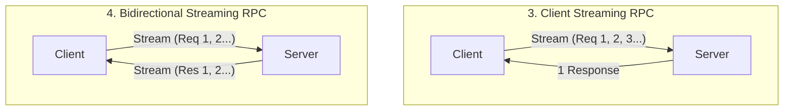
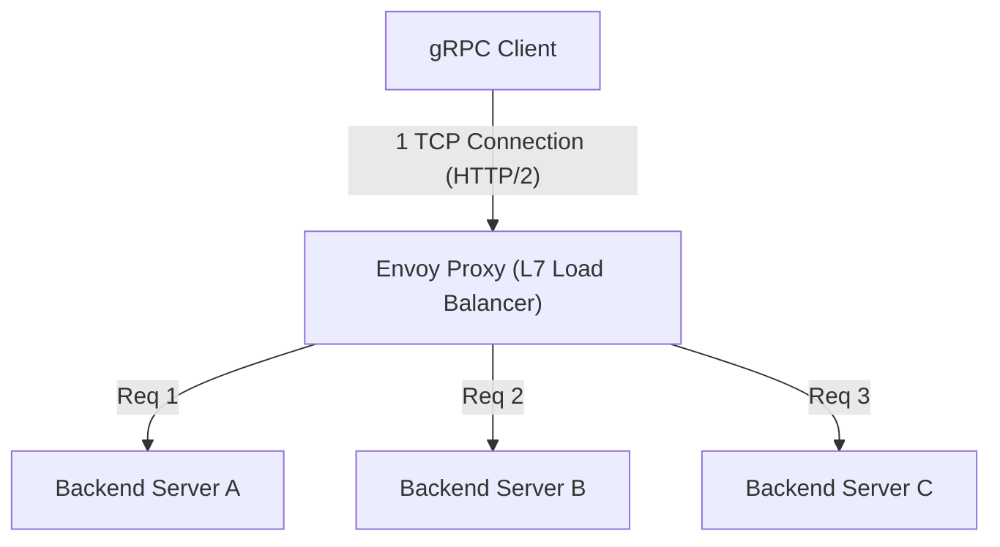

# gRPC und Protocol Buffers: Der Standard für die Kommunikation zwischen Microservices

In der modernen Softwareentwicklung ist die „Microservices-Architektur“, bei der ein System in mehrere kleine, zusammenarbeitende Dienste aufgeteilt wird, zum De-facto-Standard für die skalierbare Entwicklung und den Betrieb großer Anwendungen geworden.
Durch die Aufteilung der Dienste wandeln sich die bisher als Funktionsaufrufe im Speicher abgewickelten Prozesse jedoch in ein „verteiltes System“, das über ein Netzwerk kommuniziert. Das Design dieser Netzwerkkommunikation hat entscheidenden Einfluss auf die Leistung, Zuverlässigkeit und Entwicklungseffizienz des gesamten Systems.

Lange Zeit wurde für die Kommunikation zwischen Microservices hauptsächlich die auf JSON basierende RESTful API (HTTP/1.1) verwendet. Doch mit wachsender Systemgröße und steigenden Anforderungen an Datenvolumen und Echtzeitfähigkeit wurden die Grenzen von JSON/REST deutlich.
Das von Google entwickelte **gRPC** und dessen Serialisierungsformat **Protocol Buffers (Protobuf)** haben dieses Problem grundlegend gelöst und sich als Standard für die nächste Generation der Kommunikation zwischen Microservices etabliert.

Dieser Artikel geht der Frage auf den Grund, warum JSON/REST nicht mehr ausreichte, und beleuchtet die Vorteile der schemagetriebenen Entwicklung, die äußerst effiziente binäre Codierung von Protocol Buffers, die vier von HTTP/2 profitierenden Streaming-Modelle sowie die Herausforderungen des Load-Balancings in verteilten Umgebungen und deren Lösung durch den Envoy-Proxy.

---

## 1. Grenzen und Herausforderungen der JSON/REST-Kommunikation

Die Kombination aus REST-API und JSON ist für Menschen leicht zu lesen und zu schreiben und funktioniert gut mit Webbrowsern. Daher ist sie bei der Kommunikation zwischen Frontend und Backend (North-South-Kommunikation) nach wie vor vorherrschend. Wenn jedoch Backend-Dienste mit hoher Geschwindigkeit miteinander kommunizieren (East-West-Kommunikation), treten einige schwerwiegende Engpässe auf:

### 1.1. Serialisierungs- und Parsing-Kosten eines textbasierten Formats (JSON)
JSON ist ein textbasiertes Format. Da selbst Daten wie Zahlen und Wahrheitswerte als Zeichenfolgen dargestellt werden, muss der Sender die Speicherstrukturen in Zeichenfolgen konvertieren, und der Empfänger muss diese parsen, um sie wieder in Speicherstrukturen umzuwandeln (Serialisierung und Deserialisierung).
Die Textanalyse (Parsing, Zeichensatzkonvertierung, Zahlenkonvertierung) verbraucht viele CPU-Zyklen. In einer Microservices-Umgebung ist es nicht ungewöhnlich, dass eine einzige Benutzeranfrage Dutzende von Kommunikationen zwischen Diensten auslöst, und die kumulierten Kosten für das JSON-Parsing an jedem Knoten führen direkt zu erhöhter Latenz und der Verschwendung von CPU-Ressourcen im gesamten System.

### 1.2. Aufblähen der Payload-Größe
JSON ist ein redundantes Format. Jeder Datensatz enthält unweigerlich die Zeichenfolge des Schlüsselnamens (Feldnamens).
```json
{
  "user_id": 12345,
  "first_name": "Taro",
  "last_name": "Yamada",
  "is_active": true
}
```
Selbst wenn große Mengen von Daten mit derselben Struktur gesendet und empfangen werden, werden die Schlüsselnamen wiederholt gesendet, was die Datenübertragungsmenge (Bandbreite) verschwendet. Durch Komprimierung (wie gzip) kann die Größe zwar reduziert werden, dies verursacht jedoch zusätzlichen CPU-Overhead für das Komprimieren und Entpacken.

### 1.3. Fehlen eines strengen Schemas und Schwierigkeiten bei der Versionierung
JSON selbst besitzt kein Schema (Definition von Datentypen oder ob Felder erforderlich/optional sind). Es ist zwar möglich, Spezifikationen mithilfe von OpenAPI (Swagger) usw. zu definieren, aber es besteht immer das Risiko einer Diskrepanz zwischen der Spezifikation und der tatsächlichen Implementierung. Unerwartet hinzugefügte Felder in API-Antworten oder Typänderungen (z. B. von einer Zahl zu einer Zeichenfolge) führen häufig zu Laufzeitfehlern bei den empfangenden Diensten.

### 1.4. HTTP/1.1 Verbindungsmanagement und Einschränkungen beim Streaming
Die meisten REST-APIs arbeiten über HTTP/1.1. In HTTP/1.1 gilt im Grunde das Modell, auf eine Anfrage eine Antwort zurückzugeben. Um mehrere Anfragen gleichzeitig zu verarbeiten, müssen mehrere TCP-Verbindungen aufgebaut werden (Head-of-Line-Blocking-Problem). Um asynchrone Daten-Pushes vom Server zum Client oder bidirektionales Streaming zu realisieren, müssen andere Technologien wie Server-Sent Events (SSE) oder WebSockets kombiniert werden, was das System komplexer macht.

---

## 2. Protocol Buffers und schemagetriebene Entwicklung

Eine leistungsstarke Waffe zur Lösung dieser JSON/REST-Probleme sind die **Protocol Buffers (Protobuf)**. Protobuf ist eine Open-Source-Version der Datenbeschreibungssprache und des Serialisierungsmechanismus, die Google intern verwendet hat.

### 2.1. Schemagetriebene Entwicklung (Schema-Driven Development)
Die Entwicklung mit gRPC und Protobuf verfolgt einen „Schema-First“-Ansatz. Zuerst definieren Sie die Struktur der auszutauschenden Daten (Nachrichten) und die bereitzustellende API (Dienste) in einer IDL-Datei (Interface Definition Language) namens `.proto`.

```protobuf
syntax = "proto3";

package user.v1;

// Nachricht zur Darstellung von Benutzerinformationen
message User {
  int32 user_id = 1;
  string first_name = 2;
  string last_name = 3;
  bool is_active = 4;
}

// Anforderungsnachricht
message GetUserRequest {
  int32 user_id = 1;
}

// Dienst zur Bereitstellung von Benutzerinformationen
service UserService {
  rpc GetUser (GetUserRequest) returns (User);
}
```

Diese `.proto`-Datei wird zur **„einzigen Quelle der Wahrheit“ (Single Source of Truth)** für das gesamte System. Aus dieser Datei werden mithilfe des Compilers `protoc` Client- und Server-Code (Stubs) für verschiedene Sprachen wie Go, Java, Python, C++ und Node.js automatisch generiert.

**Vorteile der schemagetriebenen Entwicklung:**
- **Garantie der Typsicherheit**: Da die Typprüfung zur Kompilierzeit stattfindet, können Typfehler zur Laufzeit (wie JSON-Parsing-Fehler) drastisch reduziert werden.
- **Funktion als Dokumentation**: Die `.proto`-Datei selbst fungiert als genaue API-Spezifikation. Es gibt keine Diskrepanz zur Implementierung.
- **Rückwärts- und Vorwärtskompatibilität**: Jedem Feld wird eine eindeutige Tag-Nummer wie `1` oder `2` zugewiesen. Wenn ein neues Feld hinzugefügt wird, können alte Clients es ignorieren, wenn sich die Tag-Nummer unterscheidet. Wenn hingegen ein altes Feld gelöscht wird, kann eine Wiederverwendung verhindert werden, indem dessen Tag-Nummer auf `reserved` gesetzt wird. Dies ermöglicht sichere API-Versions-Upgrades.

### 2.2. Die überwältigende Serialisierungseffizienz des binären Formats
Der wichtigste Grund, warum Protobuf schneller und leichter als JSON ist, liegt in seinem binären Codierungsmechanismus. Protobuf serialisiert Daten in einem Format namens **Tag-WireType-Value (TLV: eine Variante von Type-Length-Value)**.

Schauen wir uns an, wie `user_id = 12345` (Tag-Nummer 1, Typ int32) aus der vorherigen `User`-Nachricht serialisiert wird.

1. **Kombination von Tag und WireType**:
   Die Tag-Nummer und der WireType (Datentyp, z. B. 0 für Varint) werden in einem einzigen Byte verpackt. Die Berechnungsformel lautet `(field_number << 3) | wire_type`.
   Bei Tag-Nummer 1 und WireType 0 ergibt dies `(1 << 3) | 0 = 00001000` (`0x08` in Hexadezimal). Nur 1 Byte gibt an: "Welches Feld ist das und wie soll es gelesen werden?".
   (Ein 10-Byte-String wie `"user_id":` wie bei JSON ist nicht erforderlich).

2. **Codierung des Wertes (Varint)**:
   Zur Darstellung von Ganzzahlen wird die Codierung mit variabler Länge (Varint) verwendet. Je kleiner die Zahl, desto weniger Bytes werden zur Darstellung benötigt. Das höchstwertige Bit (MSB) eines Bytes wird als Fortsetzungsbit verwendet, und die verbleibenden 7 Bits enthalten die Daten-Nutzlast.
   Im Falle von 12345 wird es durch die Varint-Codierung in den 2 Bytes `0x39 0x60` dargestellt.

Als Ergebnis wird `user_id: 12345` auf nur 3 Bytes `0x08 0x39 0x60` komprimiert. Bei JSON wären für `"user_id":12345` 15 Bytes erforderlich.
Beim Parsen können Binärdaten direkt auf Integer-Werte im Speicher abgebildet werden, sodass schwere Verarbeitungen wie die Zeichenfolgenanalyse überhaupt nicht auftreten. Das ist der Grund, warum Protobuf so extrem schnell ist.

---

## 3. Die Vorteile von HTTP/2 und die 4 Streaming-Kommunikationsmodelle

gRPC verwendet **HTTP/2** als Transportschicht. HTTP/2 verfügt über Funktionen wie binäres Framing, Multiplexing und Header-Kompression (HPACK), die die Leistung und Funktionalität von gRPC stark unterstützen.

### 3.1. Multiplexing und Beschleunigung durch HTTP/2
Um das Head-of-Line-Blocking-Problem von HTTP/1.1 zu lösen, ermöglicht HTTP/2 den gleichzeitigen Austausch mehrerer Streams (Anfragen/Antworten) über eine einzige TCP-Verbindung. Bei der Kommunikation zwischen Diensten stellt gRPC in der Regel eine persistente TCP-Verbindung (Kanal) her und führt daraufhin zahlreiche RPC-Aufrufe parallel aus. Dies reduziert die Kosten für TCP-Handshakes und sorgt für einen hohen Durchsatz.

### 3.2. Die 4 Kommunikationsparadigmen
gRPC unterstützt nicht nur einfache Request-Response-Aufrufe, sondern nutzt die bidirektionalen Kommunikationsfähigkeiten von HTTP/2, um insgesamt 4 Kommunikationsmethoden (Streaming) anzubieten.





1. **Unary RPC (Unäre RPC)**:
   Die gängigste REST-ähnliche Kommunikation, die eine Antwort auf eine Anfrage zurückgibt.
2. **Server Streaming RPC (Server-Streaming)**:
   Der Client sendet eine Anfrage und der Server gibt einen Datenstrom (mehrere Nachrichten) zurück. Geeignet für die sequentielle Rückgabe von Suchergebnissen in großen Datensätzen oder das Abonnieren von Echtzeit-Aktienkursen.
3. **Client Streaming RPC (Client-Streaming)**:
   Der Client sendet einen Datenstrom, und nachdem alle gesendet wurden, gibt der Server eine Antwort zurück. Ideal für das Hochladen großer Dateien oder das Batch-Senden großer Mengen von IoT-Sensordaten.
4. **Bidirectional Streaming RPC (Bidirektionales Streaming)**:
   Client und Server verwenden unabhängige Streams und lesen und schreiben Daten bidirektional, wobei die Reihenfolge der Nachrichten erhalten bleibt. Besonders nützlich für Chat-Anwendungen, Echtzeitkommunikation in Multiplayer-Spielen und Echtzeit-Spracherkennungssysteme.

Die Stärke von gRPC besteht darin, dass all diese verschiedenen Kommunikationsmodelle konsistent mit demselben Framework und demselben Port (über HTTP/2) implementiert werden können.

---

## 4. Herausforderungen beim Load-Balancing und die Rolle des Envoy-Proxys

Bei der Bereitstellung von gRPC in einer tatsächlichen Produktionsumgebung (Container-Orchestrierungsumgebungen wie Kubernetes) ist das **„Load-Balancing (Lastverteilung)“** eine große Hürde, auf die viele Entwickler stoßen.

### 4.1. Die Falle von L4 (TCP) Load-Balancern
Bei der herkömmlichen HTTP/1.1-Kommunikation reichte die Round-Robin-Verteilung auf TCP-Verbindungsebene durch L4 (Transportschicht)-Load-Balancer wie AWS ELB oder Nginx völlig aus. Da für jede Anfrage eine neue Verbindung geöffnet oder durch `Connection: close` getrennt wurde, wurde die Last auf natürliche Weise auf die Backend-Server verteilt.

Bei gRPC (HTTP/2) ist die Situation jedoch anders. Wie bereits erwähnt, **hält gRPC zur Leistungssteigerung eine einzige TCP-Verbindung aufrecht (Keep-Alive) und multiplext Anfragen darüber**.
Ein L4-Load-Balancer legt das Ziel nur einmal beim Aufbau einer TCP-Verbindung fest. Daher werden alle folgenden gRPC-Anfragen (Streams) nur noch auf Server A konzentriert, nachdem eine TCP-Verbindung von einem Client zu Server A hergestellt wurde, während Server B und C überhaupt keine Anfragen erhalten. Es entsteht eine "Schieflage".

### 4.2. Clientseitiges Load-Balancing vs. Proxy (L7)
Um dieses Problem zu lösen, müssen nicht die TCP-Verbindungen (L4), sondern die HTTP/2-Streams (L7: Anwendungsschicht) darin interpretiert und auf Anfragebasis geroutet werden. Es gibt im Wesentlichen zwei Lösungen:

1. **Clientseitiges Load-Balancing (Thick Client)**:
   Ein Ansatz, bei dem die gRPC-Client-Bibliothek selbst über Load-Balancing-Funktionen verfügt. Der Client fragt DNS oder Service-Discovery (Consul, ZooKeeper usw.) ab, um die IP-Liste aller Backends zu erhalten, und führt selbst Round-Robin usw. aus. Dies ist effizient, birgt jedoch die erhebliche Belastung, dieselbe Logik in allen Client-Sprachen zu implementieren und zu pflegen.

2. **L7 Proxy Load-Balancing (Envoy Proxy)**:
   Dies ist derzeit der Standardansatz in der Infrastruktur von Microservices. Ein hochleistungsfähiger Proxy-Server, der gRPC und HTTP/2 nativ unterstützt, wird dazwischengeschaltet. Der prominenteste Vertreter ist **Envoy**.



Envoy akzeptiert eine einzige TCP-Verbindung vom Client und parst die darin fließenden HTTP/2-Frames. Anschließend extrahiert es die einzelnen RPC-Anfragen (Streams) und verteilt die Last (auf Anfragebasis) gleichmäßig auf mehrere Backend-Server.
In Kubernetes-Umgebungen wie Istio oder Linkerd-Service-Mesh-Architekturen wird dieser Envoy-Proxy als Sidecar für jeden Pod bereitgestellt, wodurch erweitertes gRPC-Traffic-Routing, Wiederholungen, Timeouts und Circuit Breaker realisiert werden, ohne dass Anwendungscode geändert werden muss.

---

## 5. Fazit: Wann gRPC eingesetzt werden sollte und wann nicht

gRPC und Protocol Buffers sind in Bezug auf Leistung, Robustheit und Entwicklungsproduktivität ausgezeichnete Technologien, aber sie sind kein Allheilmittel. Es ist wichtig, sie je nach Anwendungsfall richtig einzusetzen.

### Fälle, in denen gRPC eingesetzt werden sollte
- **Backend (East-West)-Kommunikation zwischen Microservices**: Umgebungen, die niedrige Latenz und hohen Durchsatz erfordern.
- **Polyglotte (mehrsprachige) Umgebungen**: Auch wenn verschiedene Teams unterschiedliche Sprachen wie Go, Java oder Node.js verwenden, können einheitliche Schnittstellen automatisch aus Proto-Dateien generiert werden.
- **Systeme, die Streaming-Verarbeitung erfordern**: Anwendungen, für die die Übertragung großer Datenmengen oder Echtzeit-bidirektionale Kommunikation unerlässlich ist.
- **Große Systeme, die ein strenges Schema erfordern**: Um Kommunikationsfehler zwischen Teams zu vermeiden und eine sichere API-Versionierung zu gewährleisten.

### Fälle, in denen gRPC nicht eingesetzt werden sollte (REST/JSON in Betracht gezogen werden sollte)
- **Direkte Kommunikation mit dem Frontend (Browser)**: Es ist zwar möglich, gRPC vom Browser aus mit einer Technologie namens `grpc-web` aufzurufen, aber die Einrichtung der Umgebung ist noch komplex. Für Frontends ist es üblicher, GraphQL, REST oder BFF (Backend for Frontend)-Muster zu verwenden.
- **Öffentliche APIs für externe Zwecke**: Wenn APIs für Entwickler von Drittanbietern veröffentlicht werden, ist die Kombination aus HTTP/REST und JSON überwältigend beliebter, und die Einstiegshürde ist niedrig, da sie einfach mit curl-Befehlen usw. getestet werden können.
- **Sehr kleine Systeme**: Bei Prototypen oder Systemen, die nur aus wenigen Diensten bestehen, können die Vorbereitungskosten (Boilerplate) wie die Verwaltung von Proto-Dateien und der Aufbau von Build-Pipelines die Vorteile überwiegen.

Mit der Entwicklung von Systemarchitekturen ist gRPC zweifellos zum „Standard“ für die Backend-Kommunikation der nächsten Generation geworden. Durch das Verständnis der effizienten Datendarstellung durch Protocol Buffers und des leistungsstarken Transportmechanismus durch HTTP/2 sowie deren angemessene Integration in das System lassen sich weitaus robustere und skalierbarere Microservices realisieren.
