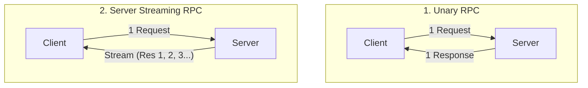
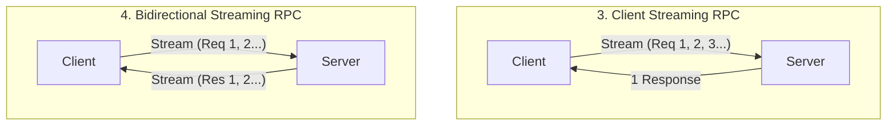
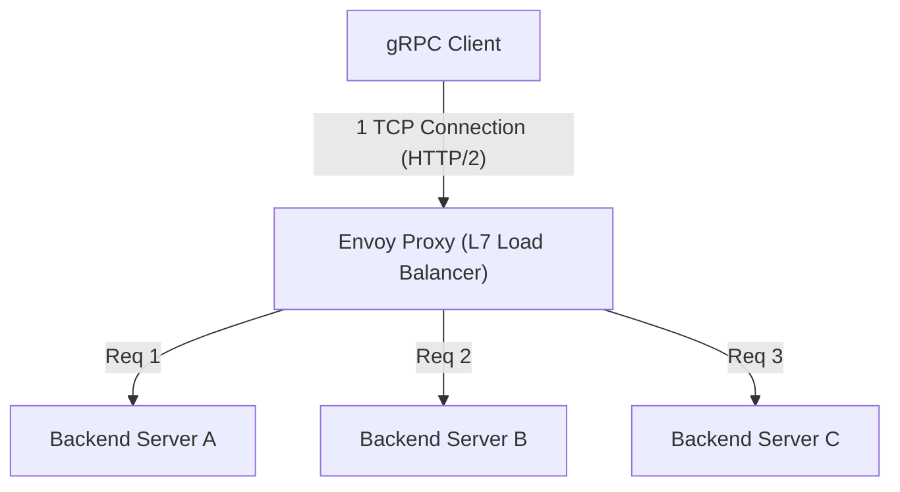

# gRPC and Protocol Buffers: The Standard for Microservices Communication

In modern software development, the "microservices architecture," which divides a system into multiple small services that work together, has become the de facto standard for scalably developing and operating large-scale applications.
However, by dividing services, processes that previously completed in memory as function calls are transformed into a "distributed system" that communicates over a network. The design of this network communication greatly influences the overall system's performance, reliability, and development efficiency.

For a long time, RESTful APIs (HTTP/1.1) based on JSON have been widely used for communication between microservices. However, as the scale of systems expanded and demands for traffic volume and real-time performance increased, the limitations of JSON/REST became apparent.
Solving these issues fundamentally and establishing a firm position as the standard for next-generation microservices communication are **gRPC**, developed by Google, and its serialization format, **Protocol Buffers (Protobuf)**.

This article starts from the background of why JSON/REST was insufficient, and digs deep into the entire picture of gRPC: explaining the advantages of schema-driven development, the extremely efficient binary encoding mechanism of Protocol Buffers, the four streaming models benefiting from HTTP/2, and load balancing challenges specific to distributed environments along with solutions using the Envoy proxy.

---

## 1. Limitations and Challenges of JSON/REST Communication

The combination of REST APIs and JSON is easy for humans to read and write, and has good compatibility with web browsers, so it remains the mainstream for communication between frontend and backend (North-South communication). However, in situations where backend services communicate with each other at high speed (East-West communication), several serious bottlenecks exist as follows.

### 1.1. Serialization and Parsing Costs of Text-based (JSON)
JSON is a text-based format. Since all data, such as numbers and booleans, are represented as strings, the sender needs to convert in-memory structures to strings, and the receiver needs to parse the strings and restore them back to in-memory structures (serialization and deserialization).
Text parsing (syntax analysis, character code conversion, numerical conversion) consumes a large amount of CPU cycles. In a microservices environment, it is not uncommon for a single user request to trigger dozens of inter-service communications, and the cumulative cost of JSON parsing at each node directly leads to increased latency for the entire system and a waste of CPU resources.

### 1.2. Bloating of Payload Size
JSON is a verbose format. Each data record must include the string of the key name (field name).
```json
{
  "user_id": 12345,
  "first_name": "Taro",
  "last_name": "Yamada",
  "is_active": true
}
```
Even when sending and receiving a large amount of data with the same structure, the key names are sent repeatedly, unnecessarily consuming data transfer volume (bandwidth). While compression (such as gzip) can reduce the size, it introduces additional CPU overhead for compression and decompression.

### 1.3. Lack of Strict Schemas and Difficulty of Versioning
JSON itself has no schema (definitions of data types or mandatory/optional fields). While it is possible to define specifications using OpenAPI (Swagger), there is always a risk that the specifications and the actual implementation will diverge. Unexpected fields being added to API responses or type changes (e.g., from numbers to strings) frequently cause runtime errors in the receiving services.

### 1.4. HTTP/1.1 Connection Management and Streaming Limitations
Many REST APIs run on HTTP/1.1. HTTP/1.1 basically follows a model of returning one response for one request, and processing multiple requests simultaneously requires establishing multiple TCP connections (Head-of-Line Blocking problem). Furthermore, achieving asynchronous data push from the server to the client or bidirectional streaming requires combining other technologies such as Server-Sent Events (SSE) or WebSockets, complicating the system.

---

## 2. Protocol Buffers and Schema-Driven Development

A powerful weapon to solve these JSON/REST issues is **Protocol Buffers (Protobuf)**. Protobuf is an open-source version of the data description language and serialization mechanism that Google used internally.

### 2.1. Schema-Driven Development
Development using gRPC and Protobuf takes a "schema-first" approach. First, you define the structure of the data to be exchanged (messages) and the API to be provided (services) in an IDL (Interface Definition Language) file called `.proto`.

```protobuf
syntax = "proto3";

package user.v1;

// Message representing user information
message User {
  int32 user_id = 1;
  string first_name = 2;
  string last_name = 3;
  bool is_active = 4;
}

// Request message
message GetUserRequest {
  int32 user_id = 1;
}

// Service providing user information
service UserService {
  rpc GetUser (GetUserRequest) returns (User);
}
```

This `.proto` file becomes the **"Single Source of Truth"** for the entire system. From this file, the `protoc` compiler is used to automatically generate client and server code (stubs) in various languages such as Go, Java, Python, C++, and Node.js.

**Advantages of Schema-Driven Development:**
- **Guarantee of Type Safety**: Since type checking is performed at compile time, runtime type errors (such as JSON parsing errors) can be drastically reduced.
- **Functioning as Documentation**: The `.proto` file itself functions as an accurate specification document for the API. No divergence from the implementation occurs.
- **Backward and Forward Compatibility**: Each field is assigned a unique tag number like `1` or `2`. If a new field is added, old clients can ignore it as long as the tag number is different, and conversely, when deleting an old field, specifying its tag number as `reserved` prevents reuse. This allows for safe API version upgrades.

### 2.2. Overwhelming Serialization Efficiency of the Binary Format
The biggest reason Protobuf is faster and lighter than JSON lies in its binary encoding mechanism. Protobuf serializes data in a format called **Tag-WireType-Value (a variation of TLV: Type-Length-Value)**.

Let's look at how `user_id = 12345` (tag number 1, int32 type) in the `User` message from earlier is serialized.

1. **Combining Tag and WireType**:
   The tag number and WireType (the kind of data, e.g., 0 for Varint) are packed into a single byte. The formula is `(field_number << 3) | wire_type`.
   For tag number 1 and WireType 0, `(1 << 3) | 0 = 00001000` (`0x08` in hexadecimal). Just 1 byte indicates "which field this is and how it should be read."
   (Unlike JSON, a 10-byte string like `"user_id":` is unnecessary)

2. **Value Encoding (Varint)**:
   Variable-length integer (Varint) encoding is used to represent integer values. Smaller numbers can be represented with fewer bytes. The most significant bit (MSB) of 1 byte is used as a continuation bit, and the remaining 7 bits store the data payload.
   In the case of 12345, it is represented by the 2 bytes `0x39 0x60` using Varint encoding.

As a result, `user_id: 12345` is compressed into just 3 bytes: `0x08 0x39 0x60`. In the case of JSON, 15 bytes are required for `"user_id":12345`.
During parsing as well, it can be mapped directly from binary to integer values in memory, so heavy processing like string analysis never occurs. This is why Protobuf is extremely fast.

---

## 3. Benefits of HTTP/2 and the 4 Streaming Communication Models

gRPC adopts **HTTP/2** as the transport layer. HTTP/2 is equipped with features such as binary framing, multiplexing, and header compression (HPACK), which greatly support gRPC's performance and functionality.

### 3.1. Multiplexing and Acceleration by HTTP/2
To solve the Head-of-Line Blocking problem of HTTP/1.1, HTTP/2 allows multiple streams (requests/responses) to be exchanged simultaneously over a single TCP connection. In inter-service communication, gRPC typically establishes a single persistent TCP connection (channel) and executes many RPC calls in parallel over it. This reduces the TCP handshake cost and achieves high throughput.

### 3.2. Four Communication Paradigms
gRPC leverages the bidirectional communication capabilities of HTTP/2 to support a total of four types of communication methods (streaming), not just simple request-response.





1. **Unary RPC**:
   The most common REST-like communication that returns one response to one request.
2. **Server Streaming RPC**:
   A method where the client sends one request, and the server returns a stream of data (multiple messages). Suitable for sequentially returning search results of a large dataset or subscribing to real-time stock price feeds.
3. **Client Streaming RPC**:
   A method where the client sends a stream of data, and the server returns a single response after all data has been sent. Ideal for uploading large files or batch transmission of massive IoT sensor data.
4. **Bidirectional Streaming RPC**:
   A method where the client and server use independent streams to read and write data bidirectionally while preserving message order. Powerful for chat applications, real-time communication in competitive games, and real-time voice recognition systems.

The strength of gRPC is that these diverse communication models can all be implemented consistently using the same framework and the same port (over HTTP/2).

---

## 4. Load Balancing Challenges and the Role of Envoy Proxy

When deploying gRPC to an actual production environment (container orchestration environments like Kubernetes), a major wall that many developers face is **"load balancing"**.

### 4.1. The Trap of L4 (TCP) Load Balancers
In conventional HTTP/1.1 communication, round-robin distribution at the TCP connection level by L4 (transport layer) load balancers like AWS ELB or Nginx worked sufficiently well. This is because a new connection is established for each request or disconnected by Connection: close, naturally distributing the load to each backend server.

However, the situation is different with gRPC (HTTP/2). As mentioned earlier, gRPC **maintains a single TCP connection (Keep-Alive) and multiplexes requests over it** to improve performance.
An L4 load balancer determines the destination only once when establishing a TCP connection. Therefore, when a TCP connection from a certain client is connected to Server A, all subsequent gRPC requests (streams) will concentrate only on Server A, resulting in a "bias" where no requests are sent to Server B or C at all.

### 4.2. Client-Side Load Balancing vs Proxy (L7)
To solve this problem, it is necessary to route on a per-request basis by interpreting the HTTP/2 streams (L7: application layer) flowing through the TCP connection (L4). There are mainly two solutions.

1. **Client-Side Load Balancing (Thick Client)**:
   A method where the gRPC client library itself has a load balancing function. The client queries DNS or service discovery (Consul, ZooKeeper, etc.) to get an IP list of all backends and executes round-robin, etc. by itself. It is efficient, but implementing and operating equivalent logic in all client languages is a heavy burden.

2. **L7 Proxy Load Balancing (Envoy Proxy)**:
   This is currently the most standard approach in microservices infrastructure. A high-performance proxy server that natively supports gRPC and HTTP/2 is inserted in the middle. The prime example is **Envoy**.



Envoy accepts a single TCP connection from the client and parses the HTTP/2 frames flowing through it. It then extracts individual RPC requests (streams) and evenly load-balances them (per request) across multiple backend servers.
In a Kubernetes environment, in service mesh architectures like Istio or Linkerd, this Envoy proxy is deployed as a sidecar for each pod, realizing advanced gRPC traffic routing, retries, timeouts, and circuit breakers without modifying the application code.

---

## 5. Conclusion: When to Adopt gRPC and When Not To

While gRPC and Protocol Buffers are excellent technologies in terms of performance, robustness, and development productivity, they are not silver bullets. It is important to use them appropriately in the right places.

### Cases where gRPC should be adopted
- **Backend (East-West) communication between microservices**: Environments requiring low latency and high throughput.
- **Polyglot (multi-language) environments**: Even if different teams use different languages like Go, Java, or Node.js, a unified interface can be automatically generated from the Proto file.
- **Systems requiring streaming processing**: Applications where large-capacity data transfer or real-time bidirectional communication is essential.
- **Large-scale systems requiring strict schemas**: When you want to prevent coordination mistakes between teams and safely manage API versions.

### Cases where gRPC should NOT be adopted (REST/JSON should be considered)
- **Direct communication with the frontend (browser)**: While it is possible to call gRPC from a browser using a technology called `grpc-web`, the environment setup is still complex. For the frontend, it is common to adopt GraphQL, REST, or the BFF (Backend for Frontend) pattern.
- **Public APIs exposed to the outside**: When exposing APIs to third-party developers, the combination of HTTP/REST and JSON is overwhelmingly widespread, and the barrier to entry is low as testing can be easily done with curl commands, etc.
- **Very small-scale systems**: For prototypes or systems consisting of a small number of services, the preparation costs (boilerplate) such as managing Proto files and building pipelines may outweigh the benefits.

With the evolution of system architectures, gRPC has undoubtedly become the "standard" for next-generation backend communication. By understanding the efficient data representation of Protocol Buffers and the powerful transport mechanism of HTTP/2, and properly incorporating them into your system, you will be able to achieve more robust and scalable microservices.
