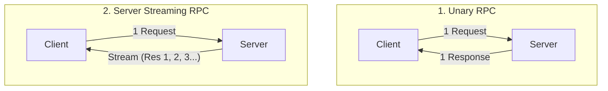
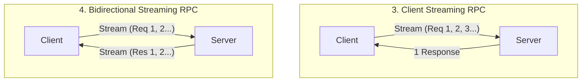
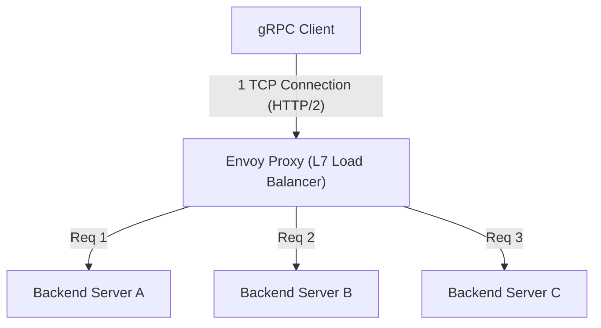

# gRPC y Protocol Buffers: El estándar para la comunicación entre microservicios

En el desarrollo de software moderno, la "arquitectura de microservicios", que divide un sistema en múltiples servicios pequeños que trabajan juntos, se ha convertido en el estándar de facto para desarrollar y operar aplicaciones a gran escala de forma escalable.
Sin embargo, al dividir los servicios, el procesamiento que solía completarse en la memoria como llamadas a funciones se transforma en un "sistema distribuido" que se comunica a través de la red. El diseño de esta comunicación de red influye en gran medida en el rendimiento, la fiabilidad y la eficiencia de desarrollo de todo el sistema.

Durante mucho tiempo, la API RESTful (HTTP/1.1) basada en JSON se ha utilizado ampliamente para la comunicación entre microservicios. Sin embargo, a medida que aumenta la escala del sistema y crecen las demandas de volumen de comunicación y tiempo real, las limitaciones de JSON/REST se han vuelto evidentes.
Lo que resolvió este problema desde la raíz y estableció una posición sólida como el estándar de próxima generación para la comunicación entre microservicios fue **gRPC**, desarrollado por Google, y su formato de serialización, **Protocol Buffers (Protobuf)**.

Este artículo profundiza en la totalidad de gRPC, comenzando con el contexto de por qué JSON/REST era insuficiente, pasando por los beneficios del desarrollo basado en esquemas, el mecanismo de codificación binaria extremadamente eficiente de Protocol Buffers, los cuatro modelos de streaming beneficiados por HTTP/2, y hasta los desafíos del balanceo de carga específicos de los entornos distribuidos y su solución a través del proxy Envoy.

---

## 1. Limitaciones y desafíos de la comunicación JSON/REST

La combinación de la API REST y JSON es fácil de leer y escribir para los humanos y tiene buena compatibilidad con los navegadores web, por lo que sigue siendo la corriente principal en la comunicación entre el frontend y el backend (comunicación North-South). Sin embargo, en situaciones donde los servicios del backend se comunican entre sí a alta velocidad (comunicación East-West), existen varios cuellos de botella severos, como se describe a continuación.

### 1.1. Costos de serialización y análisis del formato basado en texto (JSON)
JSON es un formato basado en texto. Dado que datos como números y valores booleanos se representan todos como cadenas de texto, el remitente necesita convertir las estructuras en memoria en cadenas, y el receptor necesita analizar (parsear) las cadenas y restaurarlas nuevamente en estructuras en memoria (serialización y deserialización).
El análisis de texto (análisis sintáctico, conversión de codificación de caracteres, conversión numérica) consume una gran cantidad de ciclos de CPU. En un entorno de microservicios, no es raro que una sola solicitud de usuario desencadene docenas de comunicaciones entre servicios, y el costo acumulado del análisis de JSON en cada nodo se traduce directamente en un aumento de la latencia y un desperdicio de los recursos de la CPU de todo el sistema.

### 1.2. Hinchazón del tamaño de la carga útil
JSON es un formato redundante. Cada registro de datos siempre incluye la cadena del nombre de la clave (nombre del campo).
```json
{
  "user_id": 12345,
  "first_name": "Taro",
  "last_name": "Yamada",
  "is_active": true
}
```
Incluso cuando se envía y recibe una gran cantidad de datos con la misma estructura, los nombres de las claves se envían repetidamente, lo que desperdicia la cantidad de transferencia de datos (ancho de banda). Aunque el tamaño se puede reducir usando compresión (como gzip), esto incurre en una sobrecarga de CPU adicional para la compresión y descompresión.

### 1.3. Falta de esquema estricto y dificultad en el versionado
JSON en sí mismo no tiene un esquema (definiciones de tipos de datos y si son requeridos/opcionales). Es posible definir especificaciones usando OpenAPI (Swagger), etc., pero siempre existe el riesgo de que la especificación y la implementación real diverjan. Los accidentes donde el servicio receptor causa errores en tiempo de ejecución ocurren con frecuencia debido a la adición de campos inesperados a la respuesta de la API o cambios de tipo (por ejemplo, de número a cadena).

### 1.4. Limitaciones del manejo de conexiones y streaming en HTTP/1.1
Muchas API REST operan sobre HTTP/1.1. En HTTP/1.1, el modelo básico es devolver una respuesta para una solicitud, y para procesar múltiples solicitudes simultáneamente, es necesario establecer múltiples conexiones TCP (problema de Head-of-Line Blocking). Además, para lograr la transmisión asíncrona de datos desde el servidor al cliente o el streaming bidireccional, es necesario combinar otras tecnologías como Server-Sent Events (SSE) o WebSockets, lo que complica el sistema.

---

## 2. Protocol Buffers y el desarrollo basado en esquemas

El arma poderosa para resolver estos problemas de JSON/REST es **Protocol Buffers (Protobuf)**. Protobuf es una versión de código abierto del lenguaje de descripción de datos y el mecanismo de serialización que Google usaba internamente.

### 2.1. Desarrollo basado en esquemas (Schema-Driven Development)
El desarrollo con gRPC y Protobuf adopta un enfoque "schema-first". Primero, en un archivo IDL (Lenguaje de Definición de Interfaz) con extensión `.proto`, se definen la estructura de los datos a intercambiar (mensajes) y la API proporcionada (servicios).

```protobuf
syntax = "proto3";

package user.v1;

// Mensaje que representa la información del usuario
message User {
  int32 user_id = 1;
  string first_name = 2;
  string last_name = 3;
  bool is_active = 4;
}

// Mensaje de solicitud
message GetUserRequest {
  int32 user_id = 1;
}

// Servicio que proporciona la información del usuario
service UserService {
  rpc GetUser (GetUserRequest) returns (User);
}
```

Este archivo `.proto` se convierte en la **"única fuente de verdad (Single Source of Truth)"** de todo el sistema. A partir de este archivo, utilizando el compilador `protoc`, se genera automáticamente el código para el cliente y el servidor (stubs) en varios lenguajes como Go, Java, Python, C++, Node.js, etc.

**Ventajas del desarrollo basado en esquemas:**
- **Garantía de seguridad de tipos**: Dado que la comprobación de tipos se realiza en el momento de la compilación, los errores de tipo en tiempo de ejecución (como errores de análisis de JSON) se pueden reducir drásticamente.
- **Función como documentación**: El propio archivo `.proto` funciona como una especificación exacta de la API. No hay discrepancia con la implementación.
- **Compatibilidad hacia atrás y hacia adelante**: A cada campo se le asigna un número de etiqueta único como `1`, `2`. Incluso si se agrega un nuevo campo, los clientes antiguos pueden ignorarlo si el número de etiqueta es diferente. Por el contrario, si se elimina un campo antiguo, se puede evitar su reutilización designando ese número de etiqueta como `reserved`. Esto permite actualizaciones de versión seguras de la API.

### 2.2. La abrumadora eficiencia de serialización del formato binario
La principal razón por la que Protobuf es más rápido y ligero que JSON reside en su mecanismo de codificación binaria. Protobuf serializa los datos en un formato llamado **Tag-WireType-Value (TLV: una variante de Type-Length-Value)**.

Veamos cómo se serializa `user_id = 12345` (número de etiqueta 1, tipo int32) del mensaje `User` anterior.

1. **Combinación de Tag y WireType**:
   El número de etiqueta y el WireType (tipo de dato, por ejemplo, 0 para Varint) se empaquetan en un solo byte. La fórmula de cálculo es `(field_number << 3) | wire_type`.
   Para el número de etiqueta 1 y WireType 0, es `(1 << 3) | 0 = 00001000` (`0x08` en hexadecimal). Solo 1 byte indica "qué campo es y cómo debe leerse".
   (No se requiere una cadena de 10 bytes como `"user_id":` en JSON).

2. **Codificación de Value (Varint)**:
   Se utiliza la codificación de enteros de longitud variable (Varint) para representar valores enteros. Los números más pequeños se pueden representar con menos bytes. El bit más significativo (MSB) de 1 byte se usa como bit de continuación, y la carga útil de datos se almacena en los 7 bits restantes.
   En el caso de 12345, mediante la codificación Varint, se representa en 2 bytes como `0x39 0x60`.

Como resultado, `user_id: 12345` se comprime a solo 3 bytes: `0x08 0x39 0x60`. En el caso de JSON, se necesitan 15 bytes para `"user_id":12345`.
Además, durante el análisis (parsing), se puede mapear directamente desde el binario a un valor entero en memoria, por lo que no hay procesamiento pesado como el análisis de cadenas. Esta es la razón por la que Protobuf es extremadamente rápido.

---

## 3. Beneficios de HTTP/2 y los cuatro modelos de comunicación de streaming

gRPC adopta **HTTP/2** como capa de transporte. HTTP/2 tiene características como el enmarcado binario (binary framing), la multiplexación (multiplexing) y la compresión de cabeceras (HPACK), que respaldan en gran medida el rendimiento y la funcionalidad de gRPC.

### 3.1. Multiplexación y aceleración mediante HTTP/2
Para resolver el problema de Head-of-Line Blocking de HTTP/1.1, HTTP/2 permite el intercambio simultáneo de múltiples flujos (solicitudes/respuestas) sobre una sola conexión TCP. En la comunicación entre servicios, gRPC generalmente establece una conexión TCP persistente (canal) y ejecuta muchas llamadas RPC en paralelo sobre ella. Esto reduce el costo del saludo inicial (handshake) TCP y logra un alto rendimiento.

### 3.2. 4 paradigmas de comunicación
gRPC no es solo una simple solicitud/respuesta, sino que admite un total de 4 tipos de métodos de comunicación (streaming) aprovechando las capacidades de comunicación bidireccional de HTTP/2.





1. **Unary RPC (Comunicación unaria)**:
   La comunicación de tipo REST más común que devuelve una respuesta para una solicitud.
2. **Server Streaming RPC (Streaming de servidor)**:
   Un método donde el cliente envía una solicitud y el servidor devuelve un flujo de datos (múltiples mensajes). Es adecuado para devolver resultados de búsqueda de conjuntos de datos grandes de forma secuencial o para suscribirse a un flujo de cotizaciones de acciones en tiempo real.
3. **Client Streaming RPC (Streaming de cliente)**:
   Un método donde el cliente envía un flujo de datos y, después de enviar todo, el servidor devuelve una respuesta. Es ideal para cargar archivos grandes o enviar lotes de grandes cantidades de datos de sensores IoT.
4. **Bidirectional Streaming RPC (Streaming bidireccional)**:
   Un método donde el cliente y el servidor utilizan flujos independientes para leer y escribir datos bidireccionalmente manteniendo el orden de los mensajes. Es muy eficaz en aplicaciones de chat, comunicación en tiempo real para juegos multijugador, sistemas de reconocimiento de voz en tiempo real, etc.

La fuerza de gRPC es que todos estos diversos modelos de comunicación se pueden implementar de manera consistente dentro del mismo marco y en el mismo puerto (sobre HTTP/2).

---

## 4. El desafío del balanceo de carga y el papel de Envoy Proxy

Al implementar gRPC en un entorno de producción real (un entorno de orquestación de contenedores como Kubernetes), un gran obstáculo al que se enfrentan muchos desarrolladores es el **"balanceo de carga (load balancing)"**.

### 4.1. La trampa del balanceador de carga L4 (TCP)
En la comunicación tradicional HTTP/1.1, la distribución round-robin a nivel de conexión TCP mediante un balanceador de carga de capa 4 (capa de transporte) como AWS ELB o Nginx funcionaba lo suficientemente bien. Esto se debe a que se establecía una nueva conexión para cada solicitud o se desconectaba con Connection: close, por lo que la carga se distribuía naturalmente a cada servidor backend.

Sin embargo, la situación es diferente con gRPC (HTTP/2). Como se mencionó anteriormente, gRPC **mantiene una única conexión TCP (Keep-Alive) y multiplexa las solicitudes sobre ella** para mejorar el rendimiento.
Un balanceador de carga L4 determina el destino solo una vez cuando se establece la conexión TCP. Por lo tanto, cuando una conexión TCP de un cliente se conecta al servidor A, todas las solicitudes gRPC posteriores (flujos) se concentrarán solo en el servidor A, y se produce un "sesgo" en el que no se envía ninguna solicitud a los servidores B o C.

### 4.2. Balanceo de carga del lado del cliente vs Proxy (L7)
Para resolver este problema, es necesario enrutar por solicitud analizando los flujos HTTP/2 (L7: capa de aplicación) que fluyen a través de ella, en lugar de la conexión TCP (L4). Hay dos soluciones principales:

1. **Balanceo de carga del lado del cliente (Thick Client)**:
   Un método que incorpora la función de balanceo de carga en la propia biblioteca del cliente gRPC. El cliente consulta DNS o el descubrimiento de servicios (Consul, ZooKeeper, etc.) para obtener la lista de IP de todos los backends y ejecuta el round-robin él mismo. Es eficiente, pero la carga de implementar y operar una lógica equivalente en todos los lenguajes de los clientes es grande.

2. **Balanceo de carga de proxy L7 (Envoy Proxy)**:
   El enfoque más estándar actualmente en la infraestructura de microservicios. Se interpone un servidor proxy de alto rendimiento que admite gRPC y HTTP/2 de forma nativa. El representante de esto es **Envoy**.



Envoy acepta una sola conexión TCP del cliente y analiza las tramas HTTP/2 que fluyen a través de ella. Luego, extrae las solicitudes RPC individuales (flujos) y balancea la carga equitativamente (por solicitud) entre varios servidores en el backend.
En entornos Kubernetes, en arquitecturas de malla de servicios (service mesh) como Istio y Linkerd, este proxy Envoy se implementa como un sidecar en cada pod, y proporciona enrutamiento avanzado de tráfico gRPC, reintentos, tiempos de espera y disyuntores (circuit breakers) sin modificar el código de la aplicación.

---

## 5. Conclusión: Cuándo adoptar gRPC y cuándo no

gRPC y Protocol Buffers son tecnologías muy superiores en términos de rendimiento, robustez y productividad de desarrollo, pero no son balas de plata. Es importante usarlas en los lugares adecuados.

### Casos en los que se debe adoptar gRPC
- **Comunicación backend (East-West) entre microservicios**: Entornos que requieren baja latencia y alto rendimiento.
- **Entornos políglotas (multilenguaje)**: Incluso si diferentes equipos usan diferentes lenguajes como Go, Java, Node.js, etc., se puede generar automáticamente una interfaz unificada a partir del archivo Proto.
- **Sistemas que requieren procesamiento de streaming**: Aplicaciones donde la transferencia de gran cantidad de datos o la comunicación bidireccional en tiempo real es esencial.
- **Sistemas a gran escala que requieren un esquema estricto**: Casos donde desea evitar errores de coordinación entre equipos y gestionar las versiones de la API de forma segura.

### Casos en los que no se debe adoptar gRPC (Se debe considerar REST/JSON)
- **Comunicación directa con el frontend (navegador)**: Es posible llamar a gRPC desde el navegador usando una tecnología llamada `grpc-web`, pero la configuración del entorno aún es compleja. Para el frontend, es común adoptar patrones como GraphQL, REST y BFF (Backend for Frontend).
- **API pública para exposición externa**: Al exponer una API a desarrolladores de terceros, la combinación de HTTP/REST y JSON está abrumadoramente extendida y se puede probar fácilmente con comandos como curl, por lo que la barrera de entrada es baja.
- **Sistemas a muy pequeña escala**: En prototipos o sistemas que constan de unos pocos servicios, los costos de preparación (código boilerplate) como la gestión de archivos Proto y la construcción de canalizaciones de compilación pueden superar los beneficios.

Junto con la evolución de la arquitectura del sistema, gRPC se ha convertido de manera constante en el "estándar" para la comunicación backend de próxima generación. Al comprender la representación eficiente de datos con Protocol Buffers y el poderoso mecanismo de transporte de HTTP/2, e incorporarlos adecuadamente en su sistema, podrá construir microservicios más robustos y escalables.
