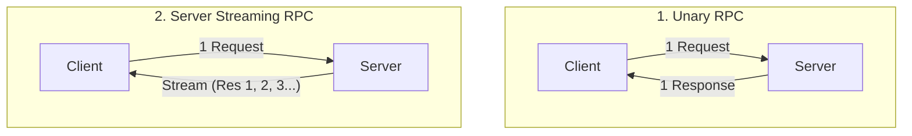
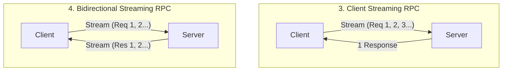
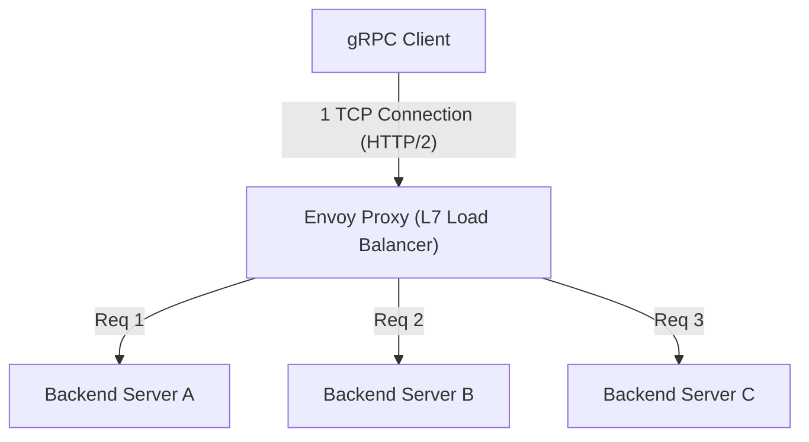

# gRPC et Protocol Buffers : Le standard pour la communication entre microservices

Dans le développement logiciel moderne, l'"architecture de microservices", qui divise un système en plusieurs petits services fonctionnant ensemble, est devenue la norme de facto pour le développement et l'exploitation d'applications à grande échelle de manière évolutive.
Cependant, en divisant les services, les traitements qui se faisaient auparavant en mémoire sous forme d'appels de fonctions se transforment en "système distribué" communicant sur un réseau. La conception de cette communication réseau influence grandement les performances globales, la fiabilité et l'efficacité du développement du système.

Pendant longtemps, les API RESTful (HTTP/1.1) basées sur JSON ont été largement utilisées pour la communication entre microservices. Toutefois, à mesure que l'échelle des systèmes s'est agrandie et que les exigences en matière de volume de communication et de temps réel ont augmenté, les limites de JSON/REST sont devenues évidentes.
Ce sont **gRPC** et son format de sérialisation **Protocol Buffers (Protobuf)**, développés par Google, qui ont résolu ces problèmes de manière fondamentale et se sont imposés comme le standard de la communication entre microservices de nouvelle génération.

Cet article explique en profondeur gRPC, en partant des raisons pour lesquelles JSON/REST était insuffisant, et en explorant les avantages du développement basé sur les schémas, le mécanisme d'encodage binaire extrêmement efficace de Protocol Buffers, les 4 modèles de streaming qui bénéficient de HTTP/2, ainsi que les défis d'équilibrage de charge propres aux environnements distribués et leur solution avec le proxy Envoy.

---

## 1. Les limites et les défis de la communication JSON/REST

La combinaison de l'API REST et de JSON est facile à lire et à écrire pour les humains et fonctionne bien avec les navigateurs web, elle reste donc dominante pour la communication entre le frontend et le backend (communication Nord-Sud). Cependant, dans une situation où les services backend communiquent rapidement entre eux (communication Est-Ouest), plusieurs goulots d'étranglement sérieux existent.

### 1.1. Coût de sérialisation et d'analyse du format texte (JSON)
JSON est un format basé sur du texte. Étant donné que les données telles que les nombres ou les valeurs booléennes sont toutes représentées sous forme de chaînes de caractères, l'expéditeur doit convertir les structures en mémoire en chaînes (sérialisation), et le récepteur doit analyser ces chaînes pour les restaurer en structures en mémoire (désérialisation).
L'analyse de texte (analyse syntaxique, conversion d'encodage, conversion de nombres) consomme beaucoup de cycles CPU. Dans un environnement de microservices, il n'est pas rare qu'une seule requête utilisateur déclenche des dizaines de communications inter-services, et le coût cumulé de l'analyse JSON sur chaque nœud se traduit directement par une augmentation de la latence du système et un gaspillage des ressources CPU.

### 1.2. Gonflement de la taille de la charge utile (Payload)
JSON est un format redondant. Chaque enregistrement de données contient toujours la chaîne du nom de la clé (nom du champ).
```json
{
  "user_id": 12345,
  "first_name": "Taro",
  "last_name": "Yamada",
  "is_active": true
}
```
Même si une grande quantité de données ayant la même structure est envoyée et reçue, le nom de la clé est envoyé à plusieurs reprises, gaspillant ainsi la bande passante de transfert de données. Bien que la taille puisse être réduite en utilisant la compression (comme gzip), cela introduit une surcharge CPU supplémentaire pour la compression et la décompression.

### 1.3. Manque de schémas stricts et difficulté de gestion des versions
JSON lui-même n'a pas de schéma (définition du type de données, obligatoire/optionnel). Il est possible de définir des spécifications en utilisant OpenAPI (Swagger), mais il y a toujours un risque que la spécification s'écarte de l'implémentation réelle. Si des champs inattendus sont ajoutés à la réponse de l'API ou si des types sont modifiés (par exemple, d'un nombre à une chaîne), cela provoque fréquemment des erreurs d'exécution du côté du service récepteur.

### 1.4. Gestion des connexions et limites du streaming dans HTTP/1.1
La plupart des API REST fonctionnent sur HTTP/1.1. HTTP/1.1 a fondamentalement un modèle d'une réponse pour une requête, et pour traiter plusieurs requêtes simultanément, il faut ouvrir plusieurs connexions TCP (problème de Head-of-Line Blocking). De plus, pour réaliser un envoi asynchrone de données du serveur vers le client ou un streaming bidirectionnel, il faut combiner d'autres technologies comme Server-Sent Events (SSE) ou WebSocket, ce qui complexifie le système.

---

## 2. Protocol Buffers et le développement basé sur les schémas

**Protocol Buffers (Protobuf)** est une arme puissante pour résoudre ces problèmes de JSON/REST. Protobuf est une version open source du langage de description de données et du mécanisme de sérialisation que Google utilisait en interne.

### 2.1. Développement basé sur les schémas (Schema-Driven Development)
Le développement utilisant gRPC et Protobuf adopte une approche "Schema First". Tout d'abord, la structure des données à échanger (messages) et l'API fournie (services) sont définies dans un fichier IDL (Interface Definition Language) appelé `.proto`.

```protobuf
syntax = "proto3";

package user.v1;

// Message représentant les informations de l'utilisateur
message User {
  int32 user_id = 1;
  string first_name = 2;
  string last_name = 3;
  bool is_active = 4;
}

// Message de requête
message GetUserRequest {
  int32 user_id = 1;
}

// Service fournissant les informations de l'utilisateur
service UserService {
  rpc GetUser (GetUserRequest) returns (User);
}
```

Ce fichier `.proto` devient la **"Source Unique de Vérité" (Single Source of Truth)** de l'ensemble du système. À partir de ce fichier, le compilateur `protoc` est utilisé pour générer automatiquement du code client/serveur (stubs) dans différents langages tels que Go, Java, Python, C++, Node.js.

**Avantages du développement basé sur les schémas :**
- **Garantie de la sécurité des types :** Étant donné que la vérification des types est effectuée au moment de la compilation, les erreurs de type à l'exécution (comme les erreurs d'analyse JSON) peuvent être considérablement réduites.
- **Fonction de documentation :** Le fichier `.proto` lui-même agit comme une spécification précise de l'API. Il n'y a pas d'écart avec l'implémentation.
- **Compatibilité ascendante et descendante :** Un numéro de balise unique (tag), tel que `1` ou `2`, est attribué à chaque champ. Si un nouveau champ est ajouté avec un numéro de balise différent, les anciens clients peuvent l'ignorer. À l'inverse, si un ancien champ est supprimé, son numéro peut être défini sur `reserved` pour éviter qu'il ne soit réutilisé. Cela permet de mettre à jour la version de l'API en toute sécurité.

### 2.2. L'efficacité écrasante de la sérialisation du format binaire
La principale raison pour laquelle Protobuf est plus rapide et plus léger que JSON réside dans son mécanisme d'encodage binaire. Protobuf sérialise les données sous la forme **Tag-WireType-Value (TLV: une variante de Type-Length-Value)**.

Voyons comment `user_id = 12345` (numéro de balise 1, type int32) du message `User` précédent est sérialisé.

1. **Combinaison de Tag et WireType :**
   Le numéro de balise et le WireType (type de données, par exemple 0 pour Varint) sont regroupés dans un seul octet. La formule est `(field_number << 3) | wire_type`.
   Pour la balise 1 et le WireType 0, cela donne `(1 << 3) | 0 = 00001000` (`0x08` en hexadécimal). Un seul octet indique "quel est ce champ et comment il doit être lu".
   (Une chaîne de 10 octets comme `"user_id":` en JSON n'est pas nécessaire).

2. **Encodage de la valeur (Varint) :**
   L'encodage d'entier de longueur variable (Varint) est utilisé pour représenter les valeurs entières. Les nombres plus petits peuvent être représentés avec moins d'octets. Le bit de poids fort (MSB) d'un octet est utilisé comme bit de continuation, et la charge utile de données est stockée dans les 7 bits restants.
   Dans le cas de 12345, il est représenté par 2 octets, `0x39 0x60`, grâce à l'encodage Varint.

En conséquence, `user_id: 12345` est compressé en seulement 3 octets, `0x08 0x39 0x60`. Avec JSON, 15 octets sont nécessaires pour `"user_id":12345`.
Lors de l'analyse, le binaire peut être directement mappé sur une valeur entière en mémoire, évitant ainsi tout traitement lourd comme l'analyse de chaînes. C'est la raison de la rapidité extrême de Protobuf.

---

## 3. Les avantages de HTTP/2 et les 4 modèles de communication en streaming

gRPC adopte **HTTP/2** comme couche de transport. HTTP/2 possède des fonctionnalités telles que le tramage binaire (binary framing), le multiplexage (Multiplexing) et la compression d'en-tête (HPACK), qui soutiennent grandement les performances et les fonctionnalités de gRPC.

### 3.1. Multiplexage et accélération par HTTP/2
Pour résoudre le problème du Head-of-Line Blocking de HTTP/1.1, HTTP/2 permet d'échanger simultanément plusieurs flux (requêtes/réponses) sur une seule connexion TCP. gRPC établit généralement une seule connexion TCP persistante (canal) pour la communication entre les services, et exécute en parallèle de nombreux appels RPC sur celle-ci. Cela réduit le coût du handshake TCP et permet d'atteindre un débit élevé.

### 3.2. 4 paradigmes de communication
gRPC ne se limite pas à de simples requêtes-réponses, mais exploite les capacités de communication bidirectionnelle de HTTP/2 pour prendre en charge un total de 4 types de méthodes de communication (streaming).





1. **Unary RPC (RPC Unaire) :**
   La communication la plus courante, de type REST, où une seule réponse est renvoyée pour une seule requête.
2. **Server Streaming RPC (Streaming Serveur) :**
   Le client envoie une requête, et le serveur renvoie un flux de données (plusieurs messages). Adapté pour renvoyer séquentiellement les résultats de recherche de grands ensembles de données, ou pour s'abonner à des flux boursiers en temps réel.
3. **Client Streaming RPC (Streaming Client) :**
   Le client envoie un flux de données, et le serveur renvoie une seule réponse après avoir tout reçu. Idéal pour le téléchargement de gros fichiers ou l'envoi par lots d'une grande quantité de données de capteurs IoT.
4. **Bidirectional Streaming RPC (Streaming Bidirectionnel) :**
   Le client et le serveur utilisent des flux indépendants pour lire et écrire des données dans les deux sens tout en conservant l'ordre des messages. Très efficace pour les applications de chat, la communication en temps réel dans les jeux multijoueurs, et les systèmes de reconnaissance vocale en temps réel.

La force de gRPC réside dans le fait que ces divers modèles de communication peuvent tous être implémentés de manière cohérente avec le même framework et sur le même port (sur HTTP/2).

---

## 4. Les défis de l'équilibrage de charge et le rôle d'Envoy Proxy

Lors du déploiement de gRPC dans un environnement de production réel (comme un environnement d'orchestration de conteneurs tel que Kubernetes), un obstacle majeur auquel de nombreux développeurs sont confrontés est **l'équilibrage de charge (Load Balancing)**.

### 4.1. Le piège des équilibreurs de charge L4 (TCP)
Dans la communication HTTP/1.1 traditionnelle, la répartition Round-Robin au niveau de la connexion TCP par des équilibreurs de charge de niveau L4 (couche de transport) comme AWS ELB ou Nginx fonctionnait parfaitement. Comme une nouvelle connexion était établie ou coupée via `Connection: close` à chaque requête, la charge était naturellement répartie sur chaque serveur backend.

Cependant, la situation est différente avec gRPC (HTTP/2). Comme mentionné précédemment, gRPC **maintient une seule connexion TCP (Keep-Alive) et multiplexe les requêtes dessus** pour améliorer les performances.
Un équilibreur de charge L4 décide de la destination uniquement lors de l'établissement de la connexion TCP. Par conséquent, une fois qu'une connexion TCP d'un client est connectée au serveur A, toutes les requêtes gRPC (flux) suivantes continuent d'être concentrées uniquement sur le serveur A, créant un "déséquilibre" où aucune requête n'est envoyée aux serveurs B ou C.

### 4.2. Équilibrage de charge côté client vs Proxy (L7)
Pour résoudre ce problème, il est nécessaire de router au niveau de la requête en interprétant les flux HTTP/2 (L7 : couche application) qui circulent à l'intérieur de la connexion TCP (L4). Il y a principalement deux solutions.

1. **Équilibrage de charge côté client (Thick Client) :**
   Une méthode où la bibliothèque cliente gRPC elle-même possède la fonction d'équilibrage de charge. Le client interroge le DNS ou le service de découverte (Consul, ZooKeeper, etc.) pour obtenir la liste des IP de tous les backends, et exécute lui-même le Round-Robin, etc. C'est efficace, mais la charge d'implémentation et de maintenance de la même logique dans tous les langages clients est importante.

2. **Équilibrage de charge par proxy L7 (Envoy Proxy) :**
   C'est l'approche la plus standard aujourd'hui pour l'infrastructure de microservices. Un serveur proxy performant prenant en charge nativement gRPC et HTTP/2 est placé entre les deux. Le représentant de cela est **Envoy**.



Envoy accepte une seule connexion TCP du client et analyse les trames HTTP/2 qui y circulent. Ensuite, il extrait les requêtes RPC individuelles (flux) et répartit la charge de manière égale (au niveau de la requête) sur plusieurs serveurs en backend.
Dans un environnement Kubernetes, dans une architecture de maillage de services (Service Mesh) telle que Istio ou Linkerd, ce proxy Envoy est déployé en tant que sidecar (Sidecar) pour chaque pod, permettant un routage avancé du trafic gRPC, des tentatives (retries), des délais d'attente (timeouts) et des disjoncteurs (circuit breakers) sans apporter de modifications au code de l'application.

---

## 5. Résumé : Quand adopter gRPC et quand l'éviter

gRPC et Protocol Buffers sont des technologies excellentes en termes de performances, de robustesse et de productivité de développement, mais ce ne sont pas des balles d'argent. Il est important de les utiliser au bon endroit.

### Cas où gRPC devrait être adopté
- **Communication backend (Est-Ouest) entre microservices :** Environnements nécessitant une faible latence et un débit élevé.
- **Environnements polyglottes (multilingues) :** Même si chaque équipe utilise des langages différents tels que Go, Java, Node.js, des interfaces uniformes peuvent être générées automatiquement à partir de fichiers Proto.
- **Systèmes nécessitant un traitement en streaming :** Applications pour lesquelles le transfert de grands volumes de données ou la communication bidirectionnelle en temps réel est indispensable.
- **Systèmes à grande échelle nécessitant des schémas stricts :** Lorsque vous souhaitez éviter les erreurs de communication entre les équipes et gérer les versions d'API en toute sécurité.

### Cas où gRPC ne devrait pas être adopté (où REST/JSON devrait être envisagé)
- **Communication directe avec le frontend (navigateur) :** Il est possible d'appeler gRPC depuis un navigateur en utilisant une technologie appelée `grpc-web`, mais la configuration de l'environnement reste complexe. Pour le frontend, il est courant d'adopter GraphQL, REST ou le modèle BFF (Backend for Frontend).
- **API publique à usage externe :** Lorsque vous exposez une API à des développeurs tiers, la combinaison HTTP/REST et JSON est de loin la plus répandue, et la barrière à l'entrée est faible car elle peut être facilement testée avec des commandes comme `curl`.
- **Systèmes à très petite échelle :** Dans les systèmes constitués de prototypes ou d'un petit nombre de services, les coûts de préparation (boilerplate) tels que la gestion des fichiers Proto et la configuration des pipelines de construction peuvent l'emporter sur les avantages.

Avec l'évolution de l'architecture des systèmes, gRPC est certainement devenu le "standard" pour la communication backend de la prochaine génération. En comprenant la représentation efficace des données de Protocol Buffers et le puissant mécanisme de transport de HTTP/2, et en les intégrant de manière appropriée dans un système, vous pourrez réaliser des microservices plus robustes et évolutifs.
