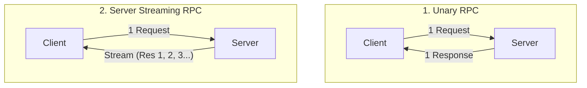
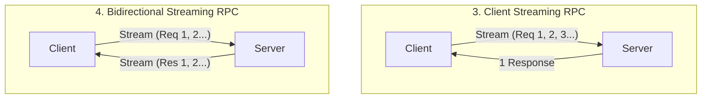
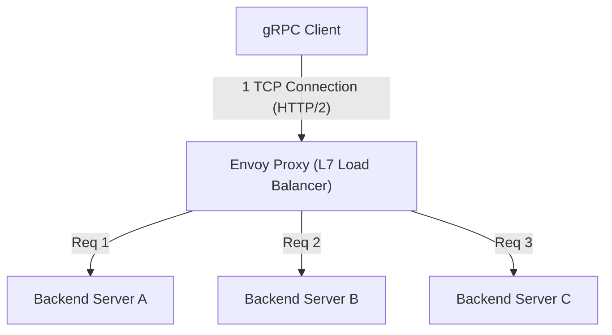

# gRPC और Protocol Buffers: माइक्रोसेवाओं के बीच संचार का मानक

आधुनिक सॉफ्टवेयर विकास में, "माइक्रोसर्विस आर्किटेक्चर" (Microservices Architecture), जो एक प्रणाली को कई छोटी सेवाओं में विभाजित करता है और उन्हें एक साथ काम करने देता है, बड़े पैमाने के अनुप्रयोगों को स्केलेबल तरीके से विकसित और संचालित करने के लिए डि फैक्टो मानक बन गया है।
हालांकि, सेवाओं को विभाजित करके, जो प्रक्रिया पहले मेमोरी में एक फ़ंक्शन कॉल के रूप में पूरी हो जाती थी, अब एक "वितरित प्रणाली" (Distributed System) में बदल जाती है जो नेटवर्क पर संचार करती है। इस नेटवर्क संचार का डिज़ाइन समग्र सिस्टम प्रदर्शन, विश्वसनीयता और विकास दक्षता को बहुत प्रभावित करता है।

लंबे समय तक, JSON पर आधारित RESTful APIs (HTTP/1.1) का व्यापक रूप से माइक्रोसेवाओं के बीच संचार के लिए उपयोग किया जाता रहा है। हालांकि, जैसे-जैसे सिस्टम का पैमाना बढ़ता है और ट्रैफ़िक वॉल्यूम और रीयल-टाइम प्रदर्शन की आवश्यकता बढ़ती है, JSON/REST की सीमाएँ स्पष्ट हो गई हैं।
इन चुनौतियों को मौलिक रूप से हल करने और अगली पीढ़ी के माइक्रोसर्विस संचार के मानक के रूप में खुद को मजबूती से स्थापित करने वाला है Google द्वारा विकसित **gRPC** और इसका सीरियलाइज़ेशन प्रारूप **Protocol Buffers (Protobuf)**।

इस लेख में, हम इस पृष्ठभूमि से शुरू करेंगे कि JSON/REST क्यों अपर्याप्त था, और स्कीमा-संचालित विकास के लाभों, Protocol Buffers के अत्यंत कुशल बाइनरी एन्कोडिंग तंत्र, HTTP/2 से लाभान्वित होने वाले 4 स्ट्रीमिंग मॉडल और वितरित वातावरण के लिए विशिष्ट लोड बैलेंसिंग चुनौतियों और Envoy प्रॉक्सी द्वारा प्रदान किए गए समाधानों सहित gRPC के संपूर्ण परिदृश्य की गहराई से पड़ताल करेंगे।

---

## 1. JSON/REST संचार की सीमाएँ और चुनौतियाँ

REST API और JSON का संयोजन इंसानों के लिए पढ़ने और लिखने में आसान है और वेब ब्राउज़र के साथ अच्छी तरह से काम करता है, इसलिए यह अभी भी फ्रंटएंड और बैकएंड (North-South संचार) के बीच संचार की मुख्यधारा है। हालांकि, ऐसी स्थितियों में जहां बैकएंड सेवाएं एक-दूसरे के साथ तेज गति (East-West संचार) से संचार करती हैं, वहाँ कुछ गंभीर बाधाएं मौजूद हैं:

### 1.1. टेक्स्ट-आधारित (JSON) सीरियलाइज़ेशन और पार्सिंग की लागत
JSON एक टेक्स्ट-आधारित प्रारूप है। चूँकि संख्याएँ और बूलियन मान भी स्ट्रिंग के रूप में व्यक्त किए जाते हैं, भेजने वाले पक्ष को मेमोरी में संरचनाओं को स्ट्रिंग में बदलना पड़ता है, और प्राप्त करने वाले पक्ष को स्ट्रिंग को पार्स करके उसे फिर से मेमोरी में संरचनाओं में बदलना पड़ता है (सीरियलाइज़ेशन और डीसीरियलाइज़ेशन)।
टेक्स्ट का विश्लेषण (पार्सिंग, कैरेक्टर एनकोडिंग कन्वर्जन, न्यूमेरिक कन्वर्जन) बहुत सारे CPU चक्रों की खपत करता है। माइक्रोसर्विस परिवेशों में, एक एकल उपयोगकर्ता अनुरोध के लिए दर्जनों अंतर-सेवा संचारों को ट्रिगर करना असामान्य नहीं है, और प्रत्येक नोड पर संचयी JSON पार्सिंग लागत सीधे सिस्टम विलंबता में वृद्धि और CPU संसाधनों की बर्बादी का कारण बनती है।

### 1.2. पेलोड आकार का बढ़ना
JSON एक अनावश्यक प्रारूप है। प्रत्येक डेटा रिकॉर्ड में हमेशा कुंजी नाम (फ़ील्ड नाम) की एक स्ट्रिंग शामिल होती है।
```json
{
  "user_id": 12345,
  "first_name": "Taro",
  "last_name": "Yamada",
  "is_active": true
}
```
समान संरचना वाले डेटा की एक बड़ी मात्रा भेजते और प्राप्त करते समय भी, कुंजी नाम बार-बार भेजे जाते हैं, जिससे डेटा ट्रांसफर वॉल्यूम (बैंडविड्थ) बर्बाद होता है। कम्प्रेशन (जैसे gzip) का उपयोग करके आकार को कम किया जा सकता है, लेकिन इससे कम्प्रेशन और डीकम्प्रेशन के लिए अतिरिक्त CPU ओवरहेड होता है।

### 1.3. सख्त स्कीमा की कमी और वर्ज़निंग में कठिनाई
JSON में स्वयं कोई स्कीमा (डेटा प्रकार या आवश्यक/वैकल्पिक परिभाषाएँ) नहीं है। OpenAPI (Swagger) आदि का उपयोग करके विशिष्टताओं को परिभाषित करना संभव है, लेकिन विनिर्देश और वास्तविक कार्यान्वयन के बीच विसंगति का जोखिम हमेशा बना रहता है। जब API प्रतिक्रिया में अनपेक्षित फ़ील्ड जोड़े जाते हैं, या प्रकार बदले जाते हैं (जैसे संख्या से स्ट्रिंग में), तो प्राप्त करने वाली सेवा के रनटाइम त्रुटि उत्पन्न होने की दुर्घटनाएं अक्सर होती हैं।

### 1.4. HTTP/1.1 कनेक्शन प्रबंधन और स्ट्रीमिंग सीमाएँ
अधिकांश REST API HTTP/1.1 पर चलते हैं। HTTP/1.1 मूल रूप से एक अनुरोध के लिए एक प्रतिक्रिया वापस करने का मॉडल है, और कई अनुरोधों को एक साथ संसाधित करने के लिए कई TCP कनेक्शन (Head-of-Line Blocking समस्या) स्थापित करना आवश्यक है। इसके अलावा, सर्वर से क्लाइंट तक एसिंक्रोनस डेटा पुश या द्विदिश स्ट्रीमिंग को प्राप्त करने के लिए Server-Sent Events (SSE) या WebSocket जैसी अन्य तकनीकों को संयोजित करना आवश्यक है, जो सिस्टम को जटिल बनाता है।

---

## 2. Protocol Buffers और स्कीमा-संचालित विकास

इन JSON/REST चुनौतियों को हल करने के लिए एक शक्तिशाली हथियार **Protocol Buffers (Protobuf)** है। Protobuf एक ओपन-सोर्स डेटा विवरण भाषा और सीरियलाइज़ेशन तंत्र है जिसका उपयोग Google आंतरिक रूप से करता था।

### 2.1. स्कीमा-संचालित विकास (Schema-Driven Development)
gRPC और Protobuf का उपयोग करने वाले विकास में "स्कीमा-फ़र्स्ट" दृष्टिकोण अपनाया जाता है। सबसे पहले, इंटरफ़ेस डेफ़िनेशन लैंग्वेज (IDL) फ़ाइल `.proto` में डेटा संरचनाओं (संदेशों) और प्रदान किए जाने वाले API (सेवाओं) को परिभाषित किया जाता है।

```protobuf
syntax = "proto3";

package user.v1;

// उपयोगकर्ता की जानकारी का प्रतिनिधित्व करने वाला संदेश
message User {
  int32 user_id = 1;
  string first_name = 2;
  string last_name = 3;
  bool is_active = 4;
}

// अनुरोध संदेश
message GetUserRequest {
  int32 user_id = 1;
}

// उपयोगकर्ता जानकारी प्रदान करने वाली सेवा
service UserService {
  rpc GetUser (GetUserRequest) returns (User);
}
```

यह `.proto` फ़ाइल संपूर्ण सिस्टम के लिए **"सत्य का एकमात्र स्रोत (Single Source of Truth)"** बन जाती है। इस फ़ाइल से, `protoc` कंपाइलर का उपयोग करके Go, Java, Python, C++, Node.js आदि विभिन्न भाषाओं के लिए क्लाइंट और सर्वर कोड (स्टब्स) स्वचालित रूप से उत्पन्न किए जाते हैं।

**स्कीमा-संचालित विकास के लाभ:**
- **प्रकार सुरक्षा की गारंटी**: संकलन समय (compile-time) पर टाइप चेकिंग की जाती है, जो रनटाइम प्रकार की त्रुटियों (जैसे JSON पार्सिंग त्रुटियों) को नाटकीय रूप से कम कर सकती है।
- **दस्तावेज़ीकरण के रूप में कार्य**: `.proto` फ़ाइल स्वयं API के लिए सटीक विनिर्देश के रूप में कार्य करती है। कार्यान्वयन के साथ कोई विसंगति नहीं होती है।
- **पिछली और अगली संगतता (Backward and Forward Compatibility)**: प्रत्येक फ़ील्ड को `1`, `2` जैसी एक अनूठी टैग संख्या असाइन की जाती है। यदि आप एक नया फ़ील्ड जोड़ते हैं, तो पुराने क्लाइंट इसे अनदेखा कर सकते हैं यदि टैग संख्या अलग है, और इसके विपरीत, किसी पुराने फ़ील्ड को हटाते समय, आप उस टैग संख्या को `reserved` के रूप में निर्दिष्ट करके उसके पुन: उपयोग को रोक सकते हैं। यह सुरक्षित API अपग्रेड सक्षम करता है।

### 2.2. बाइनरी प्रारूप की अत्यधिक सीरियलाइज़ेशन दक्षता
Protobuf के JSON की तुलना में तेज़ और हल्का होने का सबसे बड़ा कारण इसका बाइनरी एन्कोडिंग तंत्र है। Protobuf डेटा को **Tag-WireType-Value (TLV: Type-Length-Value का एक रूप)** प्रारूप में क्रमबद्ध करता है।

आइए देखें कि उपरोक्त `User` संदेश में `user_id = 12345` (टैग संख्या 1, int32 प्रकार) को कैसे सीरियलाइज़ किया जाता है।

1. **Tag और WireType का संयोजन**:
   टैग संख्या और WireType (डेटा प्रकार, उदाहरण के लिए Varint के लिए 0) को एक ही बाइट में पैक किया जाता है। गणना सूत्र `(field_number << 3) | wire_type` है।
   टैग नंबर 1 और WireType 0 के लिए, यह `(1 << 3) | 0 = 00001000` (हेक्साडेसिमल में `0x08`) होगा। केवल एक बाइट इंगित करता है कि "यह कौन सा फ़ील्ड है और इसे कैसे पढ़ा जाना चाहिए"।
   (JSON की तरह `"user_id":` जैसी 10-बाइट स्ट्रिंग की आवश्यकता नहीं है)

2. **Value एन्कोडिंग (Varint)**:
   पूर्णांक मानों को दर्शाने के लिए वेरिएबल-लेंथ इंटीजर (Varint) एन्कोडिंग का उपयोग किया जाता है। संख्या जितनी छोटी होगी, उसे दर्शाने के लिए उतने ही कम बाइट्स की आवश्यकता होगी। 1 बाइट के सबसे महत्वपूर्ण बिट (MSB) का उपयोग निरंतरता बिट (continuation bit) के रूप में किया जाता है, और शेष 7 बिट्स डेटा पेलोड संग्रहीत करते हैं।
   12345 के मामले में, यह Varint एन्कोडिंग द्वारा 2 बाइट्स `0x39 0x60` में दर्शाया गया है।

परिणामस्वरूप, `user_id: 12345` को केवल 3 बाइट्स `0x08 0x39 0x60` में संकुचित किया जाता है। JSON के मामले में, `"user_id":12345` के लिए 15 बाइट्स की आवश्यकता होती है।
पार्सिंग के समय भी, बाइनरी को सीधे मेमोरी में एक पूर्णांक मान पर मैप किया जा सकता है, इसलिए स्ट्रिंग पार्सिंग जैसी कोई भारी प्रक्रिया नहीं होती है। यही कारण है कि Protobuf इतनी तेज़ है।

---

## 3. HTTP/2 के लाभ और 4 स्ट्रीमिंग संचार मॉडल

gRPC ट्रांसपोर्ट लेयर के रूप में **HTTP/2** को अपनाता है। HTTP/2 में बाइनरी फ्रेमिंग, मल्टीप्लेक्सिंग (Multiplexing) और हेडर कम्प्रेशन (HPACK) जैसी विशेषताएं हैं जो gRPC के प्रदर्शन और कार्यक्षमता का बहुत समर्थन करती हैं।

### 3.1. HTTP/2 के साथ मल्टीप्लेक्सिंग और त्वरण
HTTP/1.1 की Head-of-Line Blocking समस्या को हल करने के लिए, HTTP/2 कई स्ट्रीम्स (अनुरोध/प्रतिक्रिया) का एक साथ एक ही TCP कनेक्शन पर आदान-प्रदान करने की अनुमति देता है। सेवाओं के बीच संचार में, gRPC आमतौर पर एक स्थायी TCP कनेक्शन (चैनल) स्थापित करता है और उस पर समानांतर में कई RPC कॉल निष्पादित करता है। यह TCP हैंडशेक की लागत को कम करता है और उच्च थ्रूपुट प्राप्त करता है।

### 3.2. 4 संचार प्रतिमान (Paradigms)
gRPC न केवल सरल अनुरोध और प्रतिक्रियाओं का समर्थन करता है, बल्कि HTTP/2 की द्विदिश (bidirectional) संचार क्षमताओं का उपयोग करके कुल 4 प्रकार की संचार विधियों (स्ट्रीमिंग) का भी समर्थन करता है।





1. **Unary RPC (यूनरी संचार)**:
   सबसे सामान्य REST जैसी संचार विधि है जहाँ एक अनुरोध पर एक प्रतिक्रिया वापस आती है।
2. **Server Streaming RPC (सर्वर स्ट्रीमिंग)**:
   एक विधि जहाँ क्लाइंट एक अनुरोध भेजता है और सर्वर डेटा की एक स्ट्रीम (कई संदेश) वापस करता है। बड़े डेटासेट के खोज परिणामों को क्रमिक रूप से लौटाने या रीयल-टाइम स्टॉक प्राइस फ़ीड्स की सदस्यता लेने के लिए उपयुक्त है।
3. **Client Streaming RPC (क्लाइंट स्ट्रीमिंग)**:
   एक विधि जहाँ क्लाइंट डेटा की एक स्ट्रीम भेजता है, और सभी डेटा भेजे जाने के बाद सर्वर एक प्रतिक्रिया देता है। बड़ी फ़ाइलों को अपलोड करने या बड़ी मात्रा में IoT सेंसर डेटा बैचों में भेजने के लिए आदर्श।
4. **Bidirectional Streaming RPC (द्विदिश स्ट्रीमिंग)**:
   एक विधि जहाँ क्लाइंट और सर्वर स्वतंत्र स्ट्रीम का उपयोग करते हैं और संदेशों के क्रम को बनाए रखते हुए दोनों दिशाओं में डेटा पढ़ते और लिखते हैं। चैट एप्लिकेशन, प्रतिस्पर्धी खेलों में रीयल-टाइम संचार और रीयल-टाइम वाक् पहचान प्रणालियों में बहुत शक्तिशाली है।

यह gRPC की ताकत है कि इन सभी विविध संचार मॉडलों को एक ही ढांचे और एक ही पोर्ट (HTTP/2 पर) में लगातार लागू किया जा सकता है।

---

## 4. लोड बैलेंसिंग की चुनौतियाँ और Envoy Proxy की भूमिका

जब gRPC को वास्तविक उत्पादन वातावरण (जैसे Kubernetes जैसे कंटेनर ऑर्केस्ट्रेशन वातावरण) में तैनात किया जाता है, तो कई डेवलपर्स के सामने आने वाली एक बड़ी बाधा **"लोड बैलेंसिंग" (Load Balancing)** है।

### 4.1. L4 (TCP) लोड बैलेंसर का जाल
पारंपरिक HTTP/1.1 संचार में, AWS ELB या Nginx जैसे L4 (ट्रांसपोर्ट लेयर) लोड बैलेंसर का उपयोग करके TCP कनेक्शन-स्तरीय राउंड-रॉबिन वितरण काफी अच्छी तरह से काम करता था। ऐसा इसलिए है क्योंकि प्रत्येक अनुरोध के लिए एक नया कनेक्शन स्थापित किया जाता है या Connection: close के साथ काट दिया जाता है, जिससे लोड स्वाभाविक रूप से प्रत्येक बैकएंड सर्वर पर वितरित हो जाता है।

हालांकि, gRPC (HTTP/2) के साथ स्थिति अलग है। जैसा कि ऊपर बताया गया है, gRPC प्रदर्शन में सुधार करने के लिए **एकल TCP कनेक्शन बनाए रखता है (Keep-Alive) और उस पर अनुरोधों को मल्टीप्लेक्स करता है**।
L4 लोड बैलेंसर केवल एक बार गंतव्य निर्धारित करता है जब TCP कनेक्शन स्थापित होता है। इसलिए, जब क्लाइंट का TCP कनेक्शन सर्वर A से जुड़ता है, तो उसके बाद के सभी gRPC अनुरोध (स्ट्रीम्स) सर्वर A पर केंद्रित होते हैं, और सर्वर B या C पर कोई अनुरोध नहीं भेजा जाता है, जिससे "पूर्वाग्रह (bias)" पैदा होता है।

### 4.2. क्लाइंट-साइड लोड बैलेंसिंग बनाम प्रॉक्सी (L7)
इस समस्या को हल करने के लिए, TCP कनेक्शन (L4) के बजाय उसके भीतर बहने वाले HTTP/2 स्ट्रीम (L7: एप्लिकेशन लेयर) की व्याख्या करके अनुरोध-स्तर पर रूटिंग करना आवश्यक है। इसके दो मुख्य उपाय हैं:

1. **क्लाइंट-साइड लोड बैलेंसिंग (Thick Client)**:
   gRPC क्लाइंट लाइब्रेरी में ही लोड बैलेंसिंग फ़ंक्शन रखने की एक विधि। क्लाइंट DNS या सर्विस डिस्कवरी (जैसे Consul, ZooKeeper) को सभी बैकएंड के IP की सूची प्राप्त करने के लिए क्वेरी करता है और स्वयं राउंड-रॉबिन आदि निष्पादित करता है। यह कुशल है, लेकिन सभी क्लाइंट भाषाओं में समान तर्क (logic) को लागू करने और संचालित करने का बोझ बड़ा है।

2. **L7 प्रॉक्सी लोड बैलेंसिंग (Envoy Proxy)**:
   माइक्रोसेवाओं के बुनियादी ढांचे में वर्तमान में यह सबसे मानक दृष्टिकोण है। gRPC और HTTP/2 का मूल रूप से समर्थन करने वाला एक उच्च-प्रदर्शन प्रॉक्सी सर्वर बीच में रखा जाता है। **Envoy** इसका एक प्रमुख उदाहरण है।



Envoy क्लाइंट से एक एकल TCP कनेक्शन स्वीकार करता है और इसके भीतर बहने वाले HTTP/2 फ्रेम को पार्स करता है। यह फिर व्यक्तिगत RPC अनुरोधों (स्ट्रीम्स) को निकालता है और उन्हें कई बैकएंड सर्वरों (प्रति अनुरोध के आधार पर) में समान रूप से वितरित करता है।
Kubernetes वातावरण में, Istio या Linkerd जैसे सर्विस मेश आर्किटेक्चर में, इस Envoy प्रॉक्सी को प्रत्येक पॉड के साइडकार के रूप में तैनात किया जाता है, जिससे एप्लिकेशन कोड को बदले बिना उन्नत gRPC ट्रैफ़िक रूटिंग, री-ट्राई, टाइमआउट और सर्किट ब्रेकर प्राप्त होते हैं।

---

## 5. निष्कर्ष: gRPC कब अपनाएं, कब नहीं

gRPC और Protocol Buffers प्रदर्शन, मजबूती और विकास उत्पादकता के मामले में उत्कृष्ट प्रौद्योगिकियां हैं, लेकिन वे कोई सिल्वर बुलेट नहीं हैं। सही जगह पर सही चीज़ का उपयोग करना महत्वपूर्ण है।

### ऐसे मामले जहाँ gRPC अपनाया जाना चाहिए
- **माइक्रोसेवाओं के बीच बैकएंड (East-West) संचार**: ऐसे वातावरण जहाँ कम विलंबता (low latency) और उच्च थ्रूपुट की आवश्यकता होती है।
- **पॉलीग्लॉट (बहुभाषी) वातावरण**: भले ही टीमें Go, Java, Node.js जैसी विभिन्न भाषाओं का उपयोग करती हों, आप Proto फ़ाइलों से स्वचालित रूप से एक एकीकृत इंटरफ़ेस उत्पन्न कर सकते हैं।
- **ऐसे सिस्टम जहाँ स्ट्रीमिंग प्रोसेसिंग आवश्यक है**: ऐसे एप्लिकेशन जहाँ बड़ी मात्रा में डेटा ट्रांसफर या रीयल-टाइम द्विदिश संचार आवश्यक है।
- **ऐसे बड़े पैमाने के सिस्टम जहाँ सख्त स्कीमा आवश्यक है**: जब आप टीमों के बीच संचार त्रुटियों को रोकना चाहते हैं और सुरक्षित API संस्करण प्रबंधन करना चाहते हैं।

### ऐसे मामले जहाँ gRPC को नहीं अपनाया जाना चाहिए (REST/JSON पर विचार करना चाहिए)
- **फ्रंटएंड (ब्राउज़र) के साथ सीधा संचार**: यद्यपि `grpc-web` नामक तकनीक का उपयोग करके ब्राउज़र से gRPC कॉल करना संभव है, लेकिन वातावरण का सेटअप अभी भी जटिल है। फ्रंटएंड के लिए GraphQL, REST, या BFF (Backend for Frontend) पैटर्न को अपनाना आम है।
- **बाहरी रिलीज़ के लिए सार्वजनिक API**: जब थर्ड-पार्टी डेवलपर्स को API उजागर किया जाता है, तो HTTP/REST और JSON का संयोजन अत्यधिक लोकप्रिय होता है, और प्रवेश के लिए बाधा कम होती है क्योंकि इसका आसानी से curl कमांड आदि के साथ परीक्षण किया जा सकता है।
- **बहुत छोटे सिस्टम**: प्रोटोटाइप या कुछ सेवाओं से बने सिस्टम के लिए, Proto फ़ाइलों के प्रबंधन और बिल्ड पाइपलाइन स्थापित करने (बॉयलरप्लेट) की अग्रिम तैयारी लागत लाभों से अधिक हो सकती है।

सिस्टम आर्किटेक्चर के विकास के साथ, gRPC निश्चित रूप से अगली पीढ़ी के बैकएंड संचार के लिए "मानक" बन गया है। Protocol Buffers के माध्यम से कुशल डेटा प्रतिनिधित्व और HTTP/2 के शक्तिशाली परिवहन तंत्र को समझकर, और उन्हें उचित रूप से सिस्टम में शामिल करके, आप अधिक मजबूत और स्केलेबल माइक्रोसेवाओं का एहसास कर पाएंगे।
