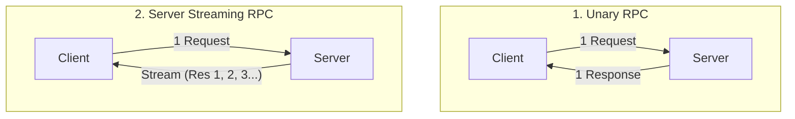
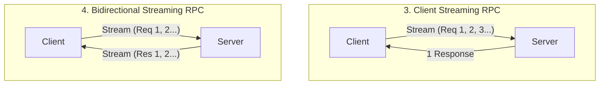
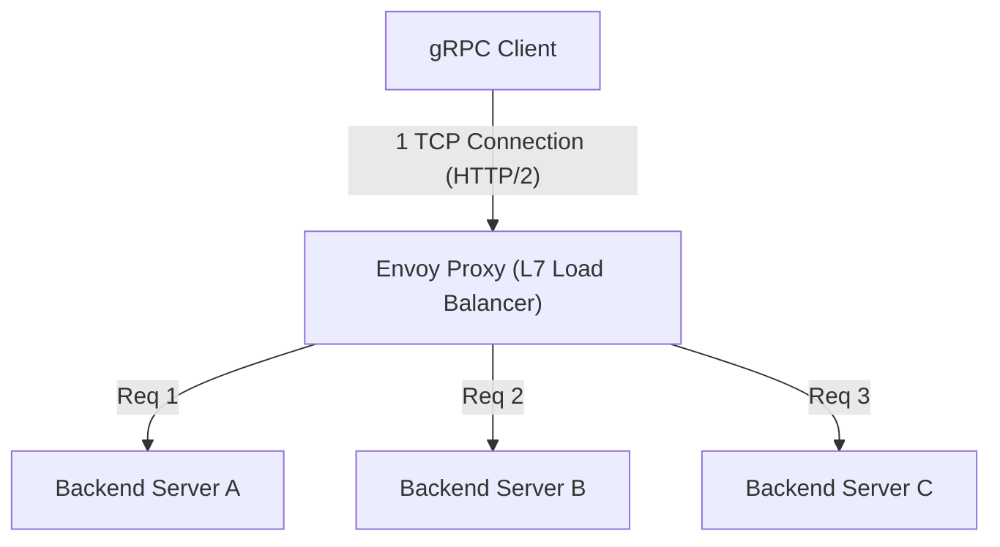

# gRPC dan Protocol Buffers: Standar Komunikasi Antar Microservices

Dalam pengembangan perangkat lunak modern, "arsitektur microservices", di mana sistem dibagi menjadi beberapa layanan kecil yang bekerja sama, telah menjadi standar de facto untuk mengembangkan dan mengoperasikan aplikasi berskala besar secara skalabel.
Namun, dengan membagi layanan, proses yang sebelumnya selesai di memori sebagai pemanggilan fungsi kini berubah menjadi "sistem terdistribusi" yang berkomunikasi melalui jaringan. Desain komunikasi jaringan ini sangat memengaruhi kinerja, keandalan, dan efisiensi pengembangan sistem secara keseluruhan.

Untuk waktu yang lama, RESTful API berbasis JSON (HTTP/1.1) banyak digunakan untuk komunikasi antar microservices. Namun, seiring bertambahnya skala sistem dan meningkatnya kebutuhan akan volume komunikasi dan respons real-time, keterbatasan JSON/REST mulai terlihat jelas.
Yang memecahkan masalah ini dari akarnya dan mengukuhkan posisinya sebagai standar komunikasi antar microservices generasi berikutnya adalah **gRPC**, yang dikembangkan oleh Google, beserta format serialisasinya yaitu **Protocol Buffers (Protobuf)**.

Artikel ini akan membahas gRPC secara mendalam, mulai dari latar belakang mengapa JSON/REST tidak lagi memadai, keuntungan dari pengembangan berbasis skema, mekanisme encoding biner Protocol Buffers yang sangat efisien, empat model streaming yang didukung oleh HTTP/2, hingga tantangan load balancing khusus di lingkungan terdistribusi dan solusinya dengan Envoy proxy.

---

## 1. Keterbatasan dan Tantangan Komunikasi JSON/REST

Kombinasi REST API dan JSON mudah dibaca dan ditulis oleh manusia, serta memiliki kompatibilitas yang baik dengan web browser, sehingga masih menjadi arus utama dalam komunikasi antara frontend dan backend (komunikasi North-South). Namun, dalam situasi di mana layanan backend saling berkomunikasi dengan kecepatan tinggi (komunikasi East-West), terdapat beberapa hambatan serius sebagai berikut.

### 1.1. Biaya Serialisasi dan Parsing Berbasis Teks (JSON)
JSON adalah format berbasis teks. Karena data seperti angka dan nilai boolean semuanya direpresentasikan sebagai string, pihak pengirim perlu mengubah struktur di memori menjadi string, dan pihak penerima perlu memparsing string tersebut untuk mengembalikannya menjadi struktur di memori (serialisasi dan deserialisasi).
Analisis teks (parsing sintaks, konversi kode karakter, konversi angka) menghabiskan banyak siklus CPU. Dalam lingkungan microservices, tidak jarang satu permintaan pengguna memicu puluhan komunikasi antar layanan, dan akumulasi biaya parsing JSON di setiap node berakibat langsung pada peningkatan latensi dan pemborosan sumber daya CPU sistem secara keseluruhan.

### 1.2. Pembengkakan Ukuran Payload
JSON adalah format yang redundan. Setiap record data selalu menyertakan string nama kunci (nama field).
```json
{
  "user_id": 12345,
  "first_name": "Taro",
  "last_name": "Yamada",
  "is_active": true
}
```
Meskipun mengirim dan menerima data dengan struktur yang sama dalam jumlah besar, nama kunci dikirim berulang kali, sehingga membuang-buang jumlah transfer data (bandwidth). Ukuran dapat dikurangi dengan kompresi (seperti gzip), tetapi ini akan menambah overhead CPU untuk kompresi dan dekompresi.

### 1.3. Kurangnya Skema yang Ketat dan Kesulitan dalam Versioning
JSON sendiri tidak memiliki skema (definisi tipe data dan opsional/wajib). Meskipun spesifikasi dapat ditentukan menggunakan OpenAPI (Swagger) dan sejenisnya, selalu ada risiko penyimpangan antara spesifikasi dan implementasi aktual. Insiden di mana layanan penerima mengalami kesalahan saat runtime (runtime error) sering terjadi karena field tak terduga ditambahkan ke respons API atau tipe data diubah (misalnya dari angka menjadi string).

### 1.4. Manajemen Koneksi HTTP/1.1 dan Keterbatasan Streaming
Sebagian besar REST API berjalan di atas HTTP/1.1. HTTP/1.1 pada dasarnya menggunakan model satu respons untuk satu permintaan, dan untuk memproses banyak permintaan secara bersamaan, beberapa koneksi TCP harus dibuat (masalah Head-of-Line Blocking). Selain itu, untuk mewujudkan pendorongan data asinkron dari server ke klien atau streaming dua arah, perlu digabungkan dengan teknologi lain seperti Server-Sent Events (SSE) atau WebSocket, yang membuat sistem menjadi rumit.

---

## 2. Protocol Buffers dan Pengembangan Berbasis Skema

Senjata ampuh untuk memecahkan masalah JSON/REST ini adalah **Protocol Buffers (Protobuf)**. Protobuf adalah versi open-source dari bahasa deskripsi data dan mekanisme serialisasi yang digunakan secara internal oleh Google.

### 2.1. Pengembangan Berbasis Skema (Schema-Driven Development)
Pengembangan menggunakan gRPC dan Protobuf mengambil pendekatan "schema-first". Pertama, struktur data (pesan) yang dipertukarkan dan API yang disediakan (layanan) didefinisikan dalam file IDL (Interface Definition Language) yaitu `.proto`.

```protobuf
syntax = "proto3";

package user.v1;

// Pesan yang mewakili informasi pengguna
message User {
  int32 user_id = 1;
  string first_name = 2;
  string last_name = 3;
  bool is_active = 4;
}

// Pesan permintaan
message GetUserRequest {
  int32 user_id = 1;
}

// Layanan yang menyediakan informasi pengguna
service UserService {
  rpc GetUser (GetUserRequest) returns (User);
}
```

File `.proto` ini menjadi **"satu-satunya sumber kebenaran (Single Source of Truth)"** untuk keseluruhan sistem. Dari file ini, kode (stub) untuk klien dan server dalam berbagai bahasa seperti Go, Java, Python, C++, Node.js, dll., dihasilkan secara otomatis menggunakan kompilator `protoc`.

**Keuntungan Pengembangan Berbasis Skema:**
- **Jaminan Keamanan Tipe**: Karena pengecekan tipe dilakukan pada saat kompilasi, kesalahan tipe saat runtime (seperti kesalahan parsing JSON) dapat dikurangi secara drastis.
- **Berfungsi sebagai Dokumentasi**: File `.proto` itu sendiri berfungsi sebagai spesifikasi API yang akurat. Tidak ada penyimpangan dengan implementasi.
- **Kompatibilitas Mundur dan Maju**: Setiap field diberi nomor tag unik seperti `1`, `2`. Jika field baru ditambahkan dan nomor tagnya berbeda, klien lama dapat mengabaikannya, dan sebaliknya jika field lama dihapus, penggunaannya kembali dapat dicegah dengan menetapkan nomor tag tersebut sebagai `reserved`. Ini memungkinkan pembaruan versi API yang aman.

### 2.2. Efisiensi Serialisasi Format Biner yang Luar Biasa
Alasan terbesar mengapa Protobuf lebih cepat dan lebih ringan daripada JSON terletak pada mekanisme encoding binernya. Protobuf menserialisasikan data dalam format **Tag-WireType-Value (varian dari TLV: Type-Length-Value)**.

Mari kita lihat bagaimana `user_id = 12345` (nomor tag 1, tipe int32) dari pesan `User` sebelumnya diserialisasikan.

1. **Penggabungan Tag dan WireType**:
   Nomor tag dan WireType (jenis data, misalnya 0 untuk Varint) dikemas ke dalam satu byte. Rumus perhitungannya adalah `(field_number << 3) | wire_type`.
   Untuk nomor tag 1 dan WireType 0, menjadi `(1 << 3) | 0 = 00001000` (`0x08` dalam heksadesimal). Hanya dengan 1 byte, ini menunjukkan "field mana ini, dan bagaimana cara membacanya".
   (String 10 byte seperti `"user_id":` seperti pada JSON tidak diperlukan)

2. **Encoding Value (Varint)**:
   Encoding bilangan bulat panjang bervariasi (Varint) digunakan untuk merepresentasikan nilai integer. Semakin kecil angkanya, semakin sedikit jumlah byte yang dapat digunakan untuk merepresentasikannya. Bit paling signifikan (MSB) dari 1 byte digunakan sebagai bit kelanjutan, dan 7 bit sisanya menyimpan payload data.
   Dalam kasus 12345, diwakili oleh 2 byte `0x39 0x60` melalui encoding Varint.

Hasilnya, `user_id: 12345` dikompresi menjadi hanya 3 byte, yaitu `0x08 0x39 0x60`. Dalam kasus JSON, 15 byte diperlukan untuk `"user_id":12345`.
Saat memparsing, karena dapat dipetakan langsung dari biner ke nilai integer dll di memori, proses berat seperti parsing string sama sekali tidak terjadi. Inilah alasan mengapa Protobuf sangat cepat.

---

## 3. Manfaat HTTP/2 dan Empat Model Komunikasi Streaming

gRPC mengadopsi **HTTP/2** sebagai lapisan transportasinya. HTTP/2 memiliki fitur seperti pembingkaian biner (binary framing), multiplexing, dan kompresi header (HPACK), yang sangat mendukung kinerja dan fungsionalitas gRPC.

### 3.1. Multiplexing dan Akselerasi oleh HTTP/2
Untuk memecahkan masalah Head-of-Line Blocking pada HTTP/1.1, HTTP/2 memungkinkan banyak aliran (permintaan/respons) dipertukarkan secara bersamaan pada satu koneksi TCP. Dalam komunikasi antar layanan, gRPC biasanya membuat satu koneksi TCP persisten (channel) dan mengeksekusi banyak panggilan RPC secara paralel di atasnya. Ini mengurangi biaya jabat tangan TCP dan mencapai throughput tinggi.

### 3.2. 4 Paradigma Komunikasi
gRPC tidak hanya mendukung request-response sederhana, tetapi juga mendukung total 4 jenis metode komunikasi (streaming) dengan memanfaatkan kemampuan komunikasi dua arah dari HTTP/2.





1. **Unary RPC (Komunikasi Uniter)**:
   Komunikasi paling umum, mirip dengan REST, yang mengembalikan satu respons untuk satu permintaan.
2. **Server Streaming RPC (Streaming Server)**:
   Metode di mana klien mengirim satu permintaan dan server mengembalikan aliran data (beberapa pesan). Cocok untuk kasus di mana hasil pencarian dari kumpulan data besar dikembalikan secara berurutan, atau berlangganan feed harga saham real-time.
3. **Client Streaming RPC (Streaming Klien)**:
   Metode di mana klien mengirim aliran data, dan setelah semuanya terkirim, server mengembalikan satu respons. Ideal untuk mengunggah file besar atau mengirim sekumpulan besar data sensor IoT secara massal.
4. **Bidirectional Streaming RPC (Streaming Dua Arah)**:
   Metode di mana klien dan server menggunakan aliran independen untuk membaca dan menulis data secara dua arah dengan mempertahankan urutan pesan. Sangat efektif dalam aplikasi obrolan, komunikasi real-time dalam game multipemain, dan sistem pengenalan suara real-time.

Kekuatan gRPC adalah semua model komunikasi yang beragam ini dapat diimplementasikan secara konsisten menggunakan framework yang sama dan port yang sama (di atas HTTP/2).

---

## 4. Tantangan Load Balancing dan Peran Envoy Proxy

Ketika menerapkan gRPC ke lingkungan produksi nyata (lingkungan orkestrasi kontainer seperti Kubernetes), salah satu rintangan besar yang dihadapi banyak pengembang adalah **"Load Balancing (Penyeimbangan Beban)"**.

### 4.1. Perangkap Load Balancer L4 (TCP)
Dalam komunikasi HTTP/1.1 tradisional, distribusi round-robin pada tingkat koneksi TCP dengan load balancer L4 (lapisan transport) seperti AWS ELB atau Nginx berfungsi dengan cukup baik. Karena koneksi baru dibuat untuk setiap permintaan, atau diputuskan oleh Connection: close, beban secara alami didistribusikan ke setiap server backend.

Namun, dengan gRPC (HTTP/2), situasinya berbeda. Seperti yang disebutkan sebelumnya, untuk meningkatkan kinerja, gRPC **mempertahankan koneksi TCP tunggal (Keep-Alive) dan melakukan multiplexing permintaan di atasnya**.
Load balancer L4 menentukan tujuan distribusi hanya sekali saat koneksi TCP dibuat. Oleh karena itu, ketika koneksi TCP dari klien tertentu terhubung ke Server A, semua permintaan gRPC (aliran) berikutnya akan terus terpusat hanya ke Server A, sehingga terjadi "ketidakseimbangan" di mana tidak ada permintaan yang masuk ke Server B atau C.

### 4.2. Load Balancing Sisi Klien vs Proxy (L7)
Untuk mengatasi masalah ini, routing harus dilakukan per permintaan dengan menafsirkan aliran HTTP/2 (L7: lapisan aplikasi) yang mengalir di dalamnya, bukan koneksi TCP (L4). Ada dua solusi utama.

1. **Client-side Load Balancing (Klien Tebal)**:
   Pendekatan di mana library klien gRPC itu sendiri memiliki fungsionalitas load balancing. Klien melakukan kueri ke DNS atau penemuan layanan (seperti Consul, ZooKeeper) untuk mendapatkan daftar IP semua backend, dan mengeksekusi round-robin, dll. secara mandiri. Ini efisien, tetapi beban untuk mengimplementasikan dan mengoperasikan logika setara dalam bahasa klien semua akan menjadi besar.

2. **L7 Proxy Load Balancing (Envoy Proxy)**:
   Pendekatan yang saat ini paling standar dalam infrastruktur microservices. Menyisipkan server proxy berkinerja tinggi yang secara native mendukung gRPC dan HTTP/2 di tengah. Representasi utamanya adalah **Envoy**.



Envoy menerima koneksi TCP tunggal dari klien dan memparsing frame HTTP/2 yang mengalir di dalamnya. Kemudian, ia mengekstraksi permintaan RPC (aliran) individual dan menyeimbangkan beban secara merata (per permintaan) di berbagai server backend.
Dalam lingkungan Kubernetes, dalam arsitektur service mesh seperti Istio atau Linkerd, proxy Envoy ini di-deploy sebagai sidecar dari setiap pod, mewujudkan perutean lalu lintas gRPC tingkat lanjut, coba lagi, waktu tunggu, dan pemutus sirkuit tanpa perlu memodifikasi kode aplikasi.

---

## 5. Kesimpulan: Kapan Harus dan Tidak Harus Menggunakan gRPC

gRPC dan Protocol Buffers adalah teknologi yang sangat baik dalam hal kinerja, ketangguhan, dan produktivitas pengembangan, tetapi bukan merupakan obat mujarab (silver bullet). Penting untuk menggunakannya secara tepat dan sesuai dengan situasi.

### Kasus yang Sebaiknya Menggunakan gRPC
- **Komunikasi Backend (East-West) Antar Microservices**: Lingkungan yang membutuhkan latensi rendah dan throughput tinggi.
- **Lingkungan Poliglot (Banyak Bahasa)**: Meskipun setiap tim menggunakan bahasa yang berbeda seperti Go, Java, Node.js, antarmuka terpadu dapat dihasilkan secara otomatis dari file Proto.
- **Sistem yang Membutuhkan Pemrosesan Streaming**: Aplikasi yang memerlukan transfer data berkapasitas besar atau komunikasi dua arah real-time.
- **Sistem Skala Besar yang Membutuhkan Skema Ketat**: Ketika Anda ingin mencegah kesalahan koordinasi antar tim dan mengelola versi API dengan aman.

### Kasus yang Sebaiknya Tidak Menggunakan gRPC (Pertimbangkan REST/JSON)
- **Komunikasi Langsung dengan Frontend (Browser)**: Meskipun memungkinkan untuk memanggil gRPC dari browser dengan teknologi yang disebut `grpc-web`, penyiapan lingkungannya masih rumit. Umumnya lebih baik menggunakan GraphQL, REST, atau pola BFF (Backend for Frontend) untuk antarmuka pengguna.
- **API Publik Eksternal**: Jika Anda mengekspos API kepada pengembang pihak ketiga, kombinasi HTTP/REST dan JSON jauh lebih populer, dan memiliki hambatan masuk yang lebih rendah karena mudah diuji dengan perintah curl dan sebagainya.
- **Sistem Berskala Sangat Kecil**: Untuk prototipe atau sistem yang terdiri dari sedikit layanan, biaya persiapan (boilerplate) seperti manajemen file Proto dan membangun pipeline build mungkin melebihi manfaatnya.

Seiring dengan evolusi arsitektur sistem, gRPC pastinya telah menjadi "standar" untuk komunikasi backend generasi berikutnya. Dengan memahami representasi data yang efisien oleh Protocol Buffers dan mekanisme transportasi yang kuat dari HTTP/2, serta mengintegrasikannya dengan tepat ke dalam sistem, Anda akan dapat mewujudkan microservices yang lebih tangguh dan dapat diskalakan.
