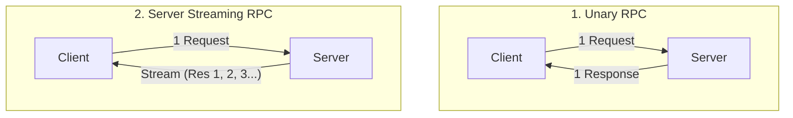
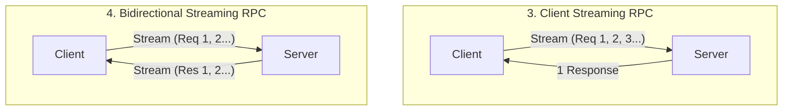
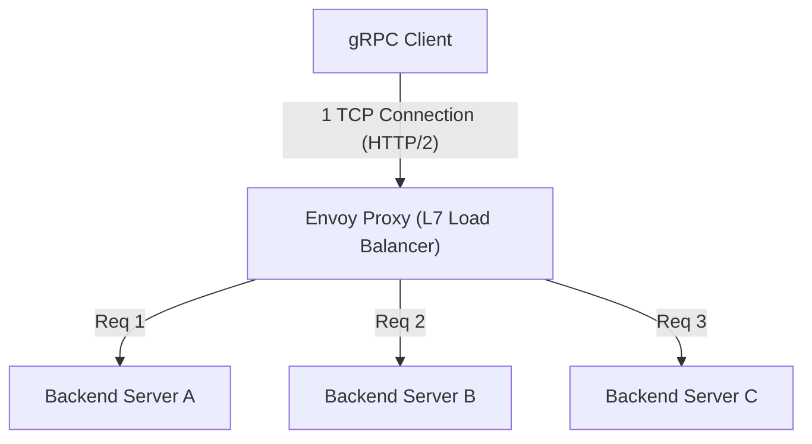

# gRPC와 Protocol Buffers: 마이크로서비스 간 통신의 표준

현대 소프트웨어 개발에서 시스템을 여러 작은 서비스로 분할하여 협조 동작시키는 '마이크로서비스 아키텍처'는 대규모 애플리케이션을 확장 가능하게 개발 및 운영하기 위한 사실상의 표준이 되었습니다.
그러나 서비스를 분할함으로써, 이전에는 함수 호출로서 메모리상에서 완결되던 처리가 네트워크 너머로 통신을 수행하는 '분산 시스템'으로 변화합니다. 이 네트워크 통신 설계가 시스템 전체의 성능, 신뢰성, 그리고 개발 효율을 크게 좌우합니다.

오랫동안 마이크로서비스 간 통신에는 JSON을 기반으로 한 RESTful API(HTTP/1.1)가 널리 사용되어 왔습니다. 하지만 시스템 규모가 커지고 통신량이나 실시간성에 대한 요구가 높아짐에 따라 JSON/REST의 한계가 표면화되었습니다.
그 과제를 근본적으로 해결하고 차세대 마이크로서비스 간 통신의 표준으로서 확고한 지위를 구축한 것이 Google이 개발한 **gRPC**와 그 직렬화 포맷인 **Protocol Buffers (Protobuf)**입니다.

본 기사에서는 왜 JSON/REST로는 불충분했는가 하는 배경에서 출발하여, 스키마 주도 개발의 이점, Protocol Buffers의 극히 효율적인 바이너리 인코딩 구조, HTTP/2의 혜택을 받은 4가지 스트리밍 모델, 그리고 분산 환경 특유의 로드 밸런싱 과제와 Envoy 프록시를 통한 해결책까지 gRPC의 전모를 깊이 파헤쳐 해설합니다.

---

## 1. JSON/REST 통신의 한계와 과제

REST API와 JSON의 조합은 인간이 읽고 쓰기 쉬우며 웹 브라우저와의 호환성도 좋기 때문에, 현재도 프론트엔드와 백엔드 간 통신(North-South 통신)에서는 주류를 이룹니다. 그러나 백엔드 서비스끼리 고속으로 통신하는 상황(East-West 통신)에서는 다음과 같은 몇 가지 심각한 병목 현상이 존재합니다.

### 1.1. 텍스트 기반(JSON)의 직렬화·파싱 비용
JSON은 텍스트 기반 포맷입니다. 수치나 진위값 등의 데이터도 모두 문자열로 표현되므로, 송신 측에서는 메모리상의 구조체를 문자열로 변환하고 수신 측에서는 문자열을 파싱하여 다시 메모리상의 구조체로 복원하는 처리(직렬화·역직렬화)가 필요합니다.
텍스트 분석(구문 분석, 문자 코드 변환, 수치 변환)은 CPU 사이클을 대량으로 소비합니다. 마이크로서비스 환경에서는 1개의 사용자 요청이 수십 번의 서비스 간 통신을 일으키는 일도 드물지 않으며, 각 노드에서의 JSON 파싱 누적 비용이 시스템 전체의 지연 시간 증가와 CPU 리소스 낭비로 직결됩니다.

### 1.2. 페이로드 크기의 비대화
JSON은 장황한 포맷입니다. 각 데이터 레코드에는 반드시 키 이름(필드명) 문자열이 포함됩니다.
```json
{
  "user_id": 12345,
  "first_name": "Taro",
  "last_name": "Yamada",
  "is_active": true
}
```
동일한 구조의 데이터를 대량으로 송수신하는 경우에도 키 이름이 반복해서 전송되기 때문에 데이터 전송량(대역폭)을 낭비합니다. 압축(gzip 등)을 수행하면 크기는 줄일 수 있지만, 이 경우 압축 및 해제를 위한 CPU 오버헤드가 추가로 발생하게 됩니다.

### 1.3. 엄격한 스키마의 부재와 버전 관리의 어려움
JSON 자체에는 스키마(데이터 타입이나 필수/선택 정의)가 존재하지 않습니다. OpenAPI(Swagger) 등을 이용하여 사양을 정의하는 것은 가능하지만, 사양서와 실제 구현이 괴리될 위험이 항상 따라다닙니다. API 응답에 예기치 않은 필드가 추가되거나 타입 변경(수치에서 문자열로 등)이 이루어짐으로써 수신 측 서비스가 런타임 에러를 일으키는 사고가 빈발합니다.

### 1.4. HTTP/1.1의 커넥션 관리와 스트리밍의 제한
대부분의 REST API는 HTTP/1.1 상에서 동작합니다. HTTP/1.1에서는 기본적으로 1개의 요청에 대해 1개의 응답을 반환하는 모델이며, 여러 요청을 동시에 처리하려면 여러 TCP 커넥션을 맺어야 합니다(Head-of-Line Blocking 문제). 또한 서버에서 클라이언트로의 비동기적인 데이터 푸시나 양방향 스트리밍을 구현하려면 Server-Sent Events (SSE)나 WebSocket 등 다른 기술을 조합해야 하므로 시스템이 복잡해집니다.

---

## 2. Protocol Buffers와 스키마 주도 개발

이러한 JSON/REST의 과제를 해결하기 위한 강력한 무기가 **Protocol Buffers (Protobuf)**입니다. Protobuf는 Google이 내부적으로 사용하던 데이터 기술 언어 및 직렬화 구조를 오픈 소스화한 것입니다.

### 2.1. 스키마 주도 개발 (Schema-Driven Development)
gRPC와 Protobuf를 이용한 개발에서는 '스키마 퍼스트' 접근 방식을 취합니다. 먼저 `.proto`라는 IDL(인터페이스 정의 언어) 파일에 주고받을 데이터 구조(메시지)와 제공할 API(서비스)를 정의합니다.

```protobuf
syntax = "proto3";

package user.v1;

// 사용자 정보를 나타내는 메시지
message User {
  int32 user_id = 1;
  string first_name = 2;
  string last_name = 3;
  bool is_active = 4;
}

// 요청 메시지
message GetUserRequest {
  int32 user_id = 1;
}

// 사용자 정보를 제공하는 서비스
service UserService {
  rpc GetUser (GetUserRequest) returns (User);
}
```

이 `.proto` 파일이 시스템 전체의 **'유일한 진실의 공급원(Single Source of Truth)'**이 됩니다. 이 파일로부터 `protoc` 컴파일러를 사용하여 Go, Java, Python, C++, Node.js 등 다양한 언어의 클라이언트 및 서버용 코드(스텁)를 자동 생성합니다.

**스키마 주도 개발의 이점:**
- **타입 안전성 보장**: 컴파일 시 타입 검사가 이루어지므로 런타임 시의 타입 에러(JSON 파싱 에러 등)를 극적으로 줄일 수 있습니다.
- **문서로서의 기능**: `.proto` 파일 자체가 API의 정확한 사양서로 기능합니다. 구현과의 괴리가 발생하지 않습니다.
- **하위 호환성과 상위 호환성**: 각 필드에는 `1`, `2`와 같은 고유한 태그 번호가 할당됩니다. 새 필드를 추가해도 태그 번호가 다르면 구형 클라이언트는 이를 무시할 수 있고, 반대로 구형 필드를 삭제할 때는 해당 태그 번호를 `reserved`로 지정하여 재사용을 막을 수 있습니다. 이를 통해 안전한 API 버전 업이 가능해집니다.

### 2.2. 바이너리 포맷의 압도적인 직렬화 효율성
Protobuf가 JSON보다 빠르고 가벼운 가장 큰 이유는 그 바이너리 인코딩 구조에 있습니다. Protobuf는 데이터를 **Tag-WireType-Value (TLV: Type-Length-Value의 변형)**라는 형식으로 직렬화합니다.

앞서 살펴본 `User` 메시지의 `user_id = 12345`(태그 번호 1, int32 타입)가 어떻게 직렬화되는지 살펴보겠습니다.

1. **Tag와 WireType의 결합**:
   태그 번호와 WireType(데이터 종류, 예: Varint라면 0)을 1개의 바이트에 묶습니다. 계산식은 `(field_number << 3) | wire_type`입니다.
   태그 번호 1, WireType 0인 경우, `(1 << 3) | 0 = 00001000`(16진수로 `0x08`)이 됩니다. 단 1바이트로 '이것이 어떤 필드인지, 어떻게 읽어야 하는지'를 나타냅니다.
   (JSON처럼 `"user_id":`라는 10바이트의 문자열은 필요하지 않습니다.)

2. **Value 인코딩 (Varint)**:
   정수값을 표현하기 위해 가변 길이 정수(Varint) 인코딩을 사용합니다. 작은 수치일수록 적은 바이트 수로 표현할 수 있습니다. 1바이트의 최상위 비트(MSB)를 연속 비트로 사용하고, 나머지 7비트에 데이터 페이로드를 저장합니다.
   12345의 경우, Varint 인코딩에 의해 `0x39 0x60`의 2바이트로 표현됩니다.

결과적으로 `user_id: 12345`는 `0x08 0x39 0x60`이라는 불과 3바이트로 압축됩니다. JSON의 경우는 `"user_id":12345`로 15바이트가 필요합니다.
파싱할 때도 바이너리에서 직접 메모리상의 정수값 등에 매핑할 수 있기 때문에 문자열 분석과 같은 무거운 처리는 일절 발생하지 않습니다. 이것이 Protobuf가 폭발적으로 빠른 이유입니다.

---

## 3. HTTP/2의 혜택과 4가지 스트리밍 통신 모델

gRPC는 전송 계층으로 **HTTP/2**를 채택하고 있습니다. HTTP/2는 바이너리 프레이밍, 다중화(Multiplexing), 헤더 압축(HPACK) 등의 기능을 갖추고 있어 gRPC의 성능과 기능성을 크게 뒷받침합니다.

### 3.1. HTTP/2를 통한 다중화와 고속화
HTTP/1.1의 Head-of-Line Blocking 문제를 해결하기 위해, HTTP/2에서는 1개의 TCP 커넥션 상에서 여러 스트림(요청/응답)을 동시에 주고받을 수 있습니다. gRPC는 서비스 간 통신에 있어 통상적으로 1개의 지속적인 TCP 커넥션(채널)을 맺고, 그 위에서 다수의 RPC 호출을 병렬로 실행합니다. 이를 통해 TCP의 핸드셰이크 비용을 줄이고 높은 처리량을 실현합니다.

### 3.2. 4가지 통신 패러다임
gRPC는 단순한 요청·응답뿐만 아니라, HTTP/2의 양방향 통신 능력을 활용하여 총 4가지 종류의 통신 방식(스트리밍)을 지원합니다.





1. **Unary RPC (단일 통신)**:
   가장 일반적인, 1개의 요청에 대해 1개의 응답을 반환하는 REST 방식의 통신입니다.
2. **Server Streaming RPC (서버 스트리밍)**:
   클라이언트가 1개의 요청을 보내면, 서버가 데이터 스트림(여러 번의 메시지)을 반환하는 방식. 대규모 데이터셋의 검색 결과를 순차적으로 반환하는 경우나 실시간 주가 피드 구독 등에 적합합니다.
3. **Client Streaming RPC (클라이언트 스트리밍)**:
   클라이언트가 데이터 스트림을 보내고 모두 전송이 끝난 뒤에 서버가 1개의 응답을 반환하는 방식. 대용량 파일 업로드나 대량의 IoT 센서 데이터 일괄 전송 등에 최적입니다.
4. **Bidirectional Streaming RPC (양방향 스트리밍)**:
   클라이언트와 서버가 독립적인 스트림을 사용하여 메시지 순서를 유지하면서 양방향으로 데이터를 읽고 쓰는 방식. 채팅 애플리케이션, 대전 게임의 실시간 통신, 실시간 음성 인식 시스템 등에서 위력을 발휘합니다.

이러한 다양한 통신 모델을 모두 동일한 프레임워크와 동일한 포트(HTTP/2 상)에서 일관성 있게 구현할 수 있다는 점이 gRPC의 강점입니다.

---

## 4. 로드 밸런싱의 과제와 Envoy 프록시의 역할

gRPC를 실제 프로덕션 환경(Kubernetes 등의 컨테이너 오케스트레이션 환경)에 배포할 때, 많은 개발자가 직면하는 큰 장벽이 **'로드 밸런싱(부하 분산)'**입니다.

### 4.1. L4(TCP) 로드 밸런서의 함정
기존 HTTP/1.1 통신에서는 AWS ELB나 Nginx 등 L4(전송 계층) 로드 밸런서를 통한 TCP 커넥션 수준의 라운드 로빈 분산으로 충분히 기능했습니다. 요청마다 새로운 커넥션이 맺어지거나 Connection: close로 끊어지기 때문에 자연스럽게 각 백엔드 서버로 부하가 분산되었기 때문입니다.

그러나 gRPC(HTTP/2)에서는 사정이 다릅니다. 앞서 언급했듯이 gRPC는 성능 향상을 위해 **단일 TCP 커넥션을 유지(Keep-Alive)하고, 그 위에서 요청을 다중화**합니다.
L4 로드 밸런서는 TCP 커넥션 확립 시에 한 번만 분배 대상을 결정합니다. 따라서 어떤 클라이언트로부터의 TCP 커넥션이 서버 A에 연결되면, 그 이후의 모든 gRPC 요청(스트림)이 서버 A에만 계속 집중되어 서버 B나 C에는 전혀 요청이 가지 않는 '편중'이 발생합니다.

### 4.2. 클라이언트 사이드 로드 밸런싱 vs 프록시(L7)
이 문제를 해결하기 위해서는 TCP 커넥션(L4)이 아니라, 그 안을 흐르는 HTTP/2의 스트림(L7: 애플리케이션 계층)을 해석하여 요청 단위로 라우팅을 수행해야 합니다. 해결책은 크게 두 가지가 있습니다.

1. **클라이언트 사이드 로드 밸런싱(Thick Client)**:
   gRPC 클라이언트 라이브러리 자체에 로드 밸런싱 기능을 갖게 하는 방식. 클라이언트가 DNS나 서비스 디스커버리(Consul, ZooKeeper 등)에 질의하여 전체 백엔드의 IP 목록을 가져와서 스스로 라운드 로빈 등을 실행합니다. 효율적이지만 모든 클라이언트 언어에서 동일한 로직을 구현하고 운영해야 하는 부담이 큽니다.

2. **L7 프록시 로드 밸런싱(Envoy Proxy)**:
   마이크로서비스의 인프라 기반에 있어 현재 가장 표준적인 접근 방식입니다. gRPC와 HTTP/2를 기본적으로 지원하는 고성능 프록시 서버를 중간에 끼워 넣습니다. 그 대표 주자가 **Envoy**입니다.



Envoy는 클라이언트로부터 단일 TCP 커넥션을 받아들여, 그 안을 흐르는 HTTP/2 프레임을 파싱합니다. 그리고 개별 RPC 요청(스트림)을 꺼내어 백엔드의 여러 서버에 균등하게(요청 단위로) 부하 분산을 수행합니다.
Kubernetes 환경에서는 Istio나 Linkerd 등의 서비스 메시 아키텍처에서 이 Envoy 프록시가 각 포드의 사이드카로 배포되어, 애플리케이션 코드 변경 없이 고도화된 gRPC 트래픽 라우팅, 재시도, 타임아웃, 서킷 브레이커 등을 구현하고 있습니다.

---

## 5. 요약: gRPC를 채택해야 할 때, 하지 말아야 할 때

gRPC와 Protocol Buffers는 성능, 견고성, 개발 생산성 측면에서 매우 뛰어난 기술이지만 만병통치약은 아닙니다. 적재적소에 구분하여 사용하는 것이 중요합니다.

### gRPC를 채택해야 하는 경우
- **마이크로서비스 간 백엔드(East-West) 통신**: 낮은 지연 시간, 높은 처리량이 요구되는 환경.
- **폴리글롯(다국어) 환경**: 팀마다 Go, Java, Node.js 등 서로 다른 언어를 사용하더라도 Proto 파일에서 통일된 인터페이스를 자동 생성할 수 있습니다.
- **스트리밍 처리가 필요한 시스템**: 대용량 데이터 전송이나 실시간 양방향 통신이 필수인 애플리케이션.
- **엄격한 스키마가 필요한 대규모 시스템**: 팀 간 연동 실수를 방지하고 안전한 API 버전 관리를 수행하고자 할 때.

### gRPC를 채택하지 말아야 하는 (REST/JSON을 고려해야 하는) 경우
- **프론트엔드(브라우저)와의 직접 통신**: `grpc-web`이라는 기술로 브라우저에서 gRPC를 호출하는 것은 가능하지만 아직 환경 구축이 복잡합니다. 프론트엔드 용으로는 GraphQL이나 REST, BFF(Backend for Frontend) 패턴을 채택하는 것이 일반적입니다.
- **외부 공개용 퍼블릭 API**: 서드파티 개발자에게 API를 공개할 경우 HTTP/REST와 JSON의 조합이 압도적으로 널리 보급되어 있으며, curl 명령 등으로 간단히 테스트할 수 있어 진입 장벽이 낮습니다.
- **극히 소규모 시스템**: 프로토타입이나 소수의 서비스로 구성된 시스템에서는 Proto 파일 관리나 빌드 파이프라인 구축과 같은 사전 준비(보일러플레이트) 비용이 이점을 상회할 가능성이 있습니다.

시스템 아키텍처의 진화와 함께 gRPC는 확실히 차세대 백엔드 통신의 '표준'이 되었습니다. Protocol Buffers를 통한 효율적인 데이터 표현과 HTTP/2를 통한 강력한 전송 메커니즘을 이해하고 시스템에 적절히 반영함으로써 더욱 견고하고 확장 가능한 마이크로서비스를 구현할 수 있을 것입니다.
