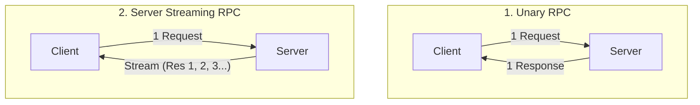
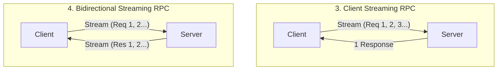
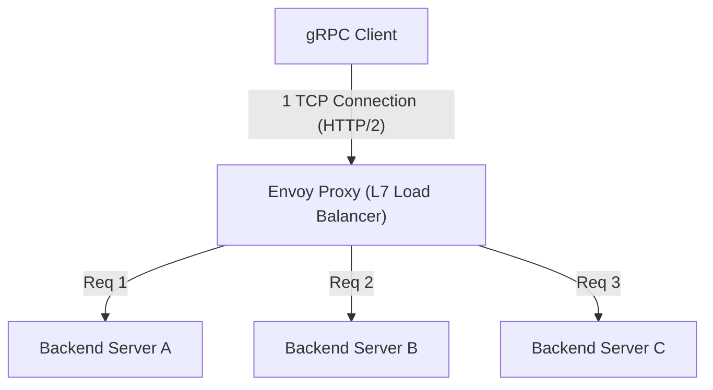

# gRPCとProtocol Buffers：マイクロサービス間通信の標準

現代のソフトウェア開発において、システムを複数の小さなサービスに分割して協調動作させる「マイクロサービスアーキテクチャ」は、大規模なアプリケーションをスケーラブルに開発・運用するためのデファクトスタンダードとなりました。
しかし、サービスを分割することで、それまで関数呼び出しとしてメモリ上で完結していた処理が、ネットワーク越しに通信を行う「分散システム」へと変化します。このネットワーク通信の設計が、システム全体のパフォーマンス、信頼性、そして開発効率を大きく左右します。

長らく、マイクロサービス間の通信にはJSONをベースとしたRESTful API（HTTP/1.1）が広く用いられてきました。しかし、システムの規模が拡大し、通信量やリアルタイム性の要求が高まるにつれて、JSON/RESTの限界が顕在化してきました。
その課題を根本から解決し、次世代のマイクロサービス間通信の標準として確固たる地位を築いたのが、Googleが開発した**gRPC**と、そのシリアライズフォーマットである**Protocol Buffers (Protobuf)**です。

本記事では、なぜJSON/RESTでは不十分だったのかという背景から出発し、スキーマ駆動開発の利点、Protocol Buffersの極めて効率的なバイナリエンコーディングの仕組み、HTTP/2の恩恵を受けた4つのストリーミングモデル、そして分散環境特有のロードバランシングの課題とEnvoyプロキシによる解決策まで、gRPCの全貌を深く掘り下げて解説します。

---

## 1. JSON/REST通信の限界と課題

REST APIとJSONの組み合わせは、人間にとって読み書きが容易であり、Webブラウザとの相性も良いため、現在でもフロントエンドとバックエンド間の通信（North-South通信）においては主流です。しかし、バックエンドのサービス同士が高速に通信し合う状況（East-West通信）においては、以下のようないくつかの深刻なボトルネックが存在します。

### 1.1. テキストベース（JSON）のシリアライズ・パースコスト
JSONはテキストベースのフォーマットです。数値や真偽値などのデータもすべて文字列として表現されるため、送信側ではメモリ上の構造体を文字列に変換し、受信側では文字列をパースして再びメモリ上の構造体に復元するという処理（シリアライズ・デシリアライズ）が必要になります。
テキストの解析（構文解析、文字コード変換、数値変換）はCPUサイクルを大量に消費します。マイクロサービス環境では、1つのユーザーリクエストが数十のサービス間通信を引き起こすことも珍しくなく、各ノードでのJSONパースの累積コストが、システム全体のレイテンシ増加とCPUリソースの浪費に直結します。

### 1.2. ペイロードサイズの肥大化
JSONは冗長なフォーマットです。各データレコードには必ずキー名（フィールド名）の文字列が含まれます。
```json
{
  "user_id": 12345,
  "first_name": "Taro",
  "last_name": "Yamada",
  "is_active": true
}
```
同じ構造のデータを大量に送受信する場合でも、キー名が繰り返し送信されるため、データ転送量（帯域幅）を無駄に消費します。圧縮（gzip等）を行えばサイズは削減できますが、今度は圧縮・展開のためのCPUオーバーヘッドが追加で発生してしまいます。

### 1.3. 厳密なスキーマの欠如とバージョニングの難しさ
JSON自体にはスキーマ（データの型や必須/任意の定義）が存在しません。OpenAPI（Swagger）などを利用して仕様を定義することは可能ですが、仕様書と実際の実装が乖離するリスクが常に付きまといます。APIのレスポンスに予期せぬフィールドが追加されたり、型の変更（数値から文字列へなど）が行われたりすることで、受信側のサービスが実行時エラーを起こす事故が頻発します。

### 1.4. HTTP/1.1のコネクション管理とストリーミングの制限
REST APIの多くはHTTP/1.1上で動作します。HTTP/1.1では、基本的に1つのリクエストに対して1つのレスポンスを返すというモデルであり、複数のリクエストを同時に処理するには複数のTCPコネクションを張る必要があります（Head-of-Line Blocking問題）。また、サーバーからクライアントへの非同期なデータプッシュや、双方向のストリーミングを実現するには、Server-Sent Events (SSE)やWebSocketなど、別の技術を組み合わせる必要があり、システムが複雑化します。

---

## 2. Protocol Buffersとスキーマ駆動開発

これらのJSON/RESTの課題を解決するための強力な武器が、**Protocol Buffers (Protobuf)** です。Protobufは、Googleが内部で利用していたデータ記述言語およびシリアライズの仕組みをオープンソース化したものです。

### 2.1. スキーマ駆動開発 (Schema-Driven Development)
gRPCとProtobufを利用した開発では、「スキーマファースト」のアプローチをとります。まず `.proto` というIDL（インターフェース定義言語）ファイルに、やり取りするデータの構造（メッセージ）と、提供するAPI（サービス）を定義します。

```protobuf
syntax = "proto3";

package user.v1;

// ユーザー情報を表すメッセージ
message User {
  int32 user_id = 1;
  string first_name = 2;
  string last_name = 3;
  bool is_active = 4;
}

// リクエストメッセージ
message GetUserRequest {
  int32 user_id = 1;
}

// ユーザー情報を提供するサービス
service UserService {
  rpc GetUser (GetUserRequest) returns (User);
}
```

この `.proto` ファイルがシステム全体の**「唯一の真実のソース（Single Source of Truth）」**となります。このファイルから、`protoc` コンパイラを使用して、Go, Java, Python, C++, Node.jsなど、様々な言語のクライアント・サーバ用コード（スタブ）を自動生成します。

**スキーマ駆動開発の利点:**
- **型安全性の保証**: コンパイル時に型チェックが行われるため、実行時の型エラー（JSONパースエラーなど）を劇的に減らすことができます。
- **ドキュメントとしての機能**: `.proto` ファイル自体がAPIの正確な仕様書として機能します。実装との乖離は発生しません。
- **後方互換性と前方互換性**: 各フィールドには `1`, `2` のような一意のタグ番号が割り当てられます。新しいフィールドを追加してもタグ番号が異なれば古いクライアントはそれを無視でき、逆に古いフィールドを削除する場合はそのタグ番号を `reserved` に指定することで再利用を防げます。これにより、安全なAPIのバージョンアップが可能になります。

### 2.2. バイナリフォーマットの圧倒的なシリアライズ効率
ProtobufがJSONよりも高速で軽量な最大の理由は、そのバイナリエンコーディングの仕組みにあります。Protobufはデータを **Tag-WireType-Value (TLV: Type-Length-Valueの変形)** という形式でシリアライズします。

先ほどの `User` メッセージの `user_id = 12345` (タグ番号1、int32型) がどのようにシリアライズされるか見てみましょう。

1. **TagとWireTypeの結合**:
   タグ番号とWireType（データの種類、例えばVarintなら0）を1つのバイトにパックします。計算式は `(field_number << 3) | wire_type` です。
   タグ番号1、WireType 0の場合、`(1 << 3) | 0 = 00001000` (16進数で `0x08`) となります。たった1バイトで「これはどのフィールドか、どうやって読み取るべきか」を示します。
   （JSONのように `"user_id":` という10バイトの文字列は不要です）

2. **Valueのエンコーディング (Varint)**:
   整数値を表現するために可変長整数（Varint）エンコーディングを使用します。小さい数値ほど少ないバイト数で表現できます。1バイトの最上位ビット（MSB）を継続ビットとして使用し、残り7ビットにデータペイロードを格納します。
   12345 の場合、Varintエンコーディングにより `0x39 0x60` の2バイトで表現されます。

結果として、`user_id: 12345` は `0x08 0x39 0x60` のわずか3バイトに圧縮されます。JSONの場合は `"user_id":12345` で15バイト必要です。
パース時も、バイナリから直接メモリ上の整数値などにマッピングできるため、文字列解析のような重い処理は一切発生しません。これがProtobufが爆速である理由です。

---

## 3. HTTP/2の恩恵と4つのストリーミング通信モデル

gRPCはトランスポート層として **HTTP/2** を採用しています。HTTP/2はバイナリフレーミング、多重化（Multiplexing）、ヘッダー圧縮（HPACK）などの機能を備えており、gRPCのパフォーマンスと機能性を大きく支えています。

### 3.1. HTTP/2による多重化と高速化
HTTP/1.1のHead-of-Line Blocking問題を解決するため、HTTP/2では1つのTCPコネクション上で複数のストリーム（リクエスト/レスポンス）を同時にやり取りできます。gRPCはサービス間の通信において、通常1つの永続的なTCPコネクション（チャネル）を張り、その上で多数のRPC呼び出しを並列に実行します。これにより、TCPのハンドシェイクコストを削減し、高スループットを実現しています。

### 3.2. 4つの通信パラダイム
gRPCは単なるリクエスト・レスポンスだけでなく、HTTP/2の双方向通信能力を活かして、合計4種類の通信方式（ストリーミング）をサポートしています。





1. **Unary RPC (ユニタリー通信)**:
   最も一般的な、1つのリクエストに対して1つのレスポンスを返すRESTライクな通信です。
2. **Server Streaming RPC (サーバーストリーミング)**:
   クライアントが1つのリクエストを送り、サーバーがデータのストリーム（複数回のメッセージ）を返す方式。大規模なデータセットの検索結果を順次返す場合や、リアルタイムの株価フィードの購読などに適しています。
3. **Client Streaming RPC (クライアントストリーミング)**:
   クライアントがデータのストリームを送り、すべて送信し終わった後にサーバーが1つのレスポンスを返す方式。大容量ファイルのアップロードや、大量のIoTセンサーデータのバッチ送信などに最適です。
4. **Bidirectional Streaming RPC (双方向ストリーミング)**:
   クライアントとサーバーが独立したストリームを使用し、メッセージの順序を保ちながら双方向にデータの読み書きを行う方式。チャットアプリケーション、対戦ゲームのリアルタイム通信、リアルタイム音声認識システムなどで威力を発揮します。

これらの多様な通信モデルが、すべて同じフレームワーク・同じポート（HTTP/2上）で一貫して実装できるのがgRPCの強みです。

---

## 4. ロードバランシングの課題とEnvoy Proxyの役割

gRPCを実際のプロダクション環境（Kubernetesなどのコンテナオーケストレーション環境）にデプロイする際、多くの開発者が直面する大きな壁が**「ロードバランシング（負荷分散）」**です。

### 4.1. L4（TCP）ロードバランサの罠
従来のHTTP/1.1通信では、AWS ELBやNginx等のL4（トランスポート層）ロードバランサによるTCPコネクションレベルのラウンドロビン分散で十分に機能していました。リクエストごとに新しいコネクションが張られたり、Connection: closeで切断されたりするため、自然と各バックエンドサーバーに負荷が分散されたからです。

しかし、gRPC（HTTP/2）では事情が異なります。前述の通り、gRPCはパフォーマンス向上のため**単一のTCPコネクションを維持（Keep-Alive）し、その上でリクエストを多重化**します。
L4ロードバランサはTCPコネクションの確立時に一度だけ振り分け先を決定します。そのため、あるクライアントからのTCPコネクションがサーバーAに接続されると、その後のすべてのgRPCリクエスト（ストリーム）がサーバーAにだけ集中し続け、サーバーBやCには全くリクエストが飛ばないという「偏り」が発生します。

### 4.2. クライアントサイドロードバランシング vs プロキシ（L7）
この問題を解決するためには、TCPコネクション（L4）ではなく、その中を流れるHTTP/2のストリーム（L7：アプリケーション層）を解釈してリクエスト単位でルーティングを行う必要があります。解決策は主に2つあります。

1. **クライアントサイドロードバランシング（Thick Client）**:
   gRPCクライアントライブラリ自体にロードバランシング機能を持たせる手法。クライアントがDNSやサービスディスカバリ（Consul, ZooKeeper等）に問い合わせて全バックエンドのIPリストを取得し、自身でラウンドロビン等を実行します。効率的ですが、すべてのクライアント言語で同等のロジックを実装・運用する負担が大きくなります。

2. **L7プロキシロードバランシング（Envoy Proxy）**:
   マイクロサービスのインフラ基盤において、現在最も標準的なアプローチです。gRPCとHTTP/2をネイティブにサポートする高性能なプロキシサーバーを間に挟みます。その代表格が **Envoy** です。



Envoyは、クライアントからの単一のTCPコネクションを受け入れ、その中を流れるHTTP/2フレームをパースします。そして、個々のRPCリクエスト（ストリーム）を取り出し、バックエンドの複数のサーバーに対して均等に（リクエスト単位で）負荷分散を行います。
Kubernetes環境では、IstioやLinkerdなどのサービスメッシュアーキテクチャにおいて、このEnvoyプロキシが各ポッドのサイドカーとしてデプロイされ、アプリケーションコードに変更を加えることなく、高度なgRPCトラフィックのルーティング、リトライ、タイムアウト、サーキットブレーカーを実現しています。

---

## 5. まとめ：gRPCを採用すべき時、すべきでない時

gRPCとProtocol Buffersは、パフォーマンス、堅牢性、開発生産性の面で非常に優れた技術ですが、銀の弾丸ではありません。適材適所で使い分けることが重要です。

### gRPCを採用すべきケース
- **マイクロサービス間のバックエンド（East-West）通信**: 低レイテンシ、高スループットが求められる環境。
- **ポリグロット（多言語）環境**: チームごとにGo, Java, Node.jsなど異なる言語を使用していても、Protoファイルから統一されたインターフェースを自動生成できる。
- **ストリーミング処理が必要なシステム**: 大容量データの転送や、リアルタイムの双方向通信が必須なアプリケーション。
- **厳密なスキーマが必要な大規模システム**: チーム間の連携ミスを防ぎ、安全なAPIのバージョン管理を行いたい場合。

### gRPCを採用すべきでない（REST/JSONを検討すべき）ケース
- **フロントエンド（ブラウザ）との直接通信**: `grpc-web` という技術でブラウザからgRPCを呼ぶことは可能ですが、まだ環境構築が複雑です。フロントエンド向けにはGraphQLやREST、BFF（Backend for Frontend）パターンを採用するのが一般的です。
- **外部公開用パブリックAPI**: サードパーティの開発者にAPIを公開する場合、HTTP/RESTとJSONの組み合わせの方が圧倒的に普及しており、curlコマンド等で簡単にテストできるため参入障壁が低いです。
- **ごく小規模なシステム**: プロトタイプや少数のサービスからなるシステムでは、Protoファイルの管理やビルドパイプラインの構築といった事前準備（ボイラープレート）のコストがメリットを上回る可能性があります。

システムアーキテクチャの進化とともに、gRPCは確実に次世代のバックエンド通信の「標準」となりました。Protocol Buffersによる効率的なデータの表現と、HTTP/2による強力なトランスポートメカニズムを理解し、適切にシステムに組み込むことで、より堅牢でスケーラブルなマイクロサービスを実現することができるでしょう。
