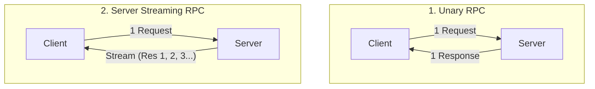
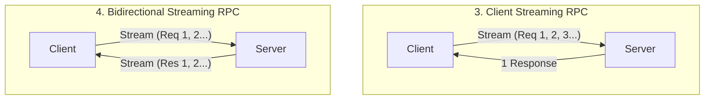
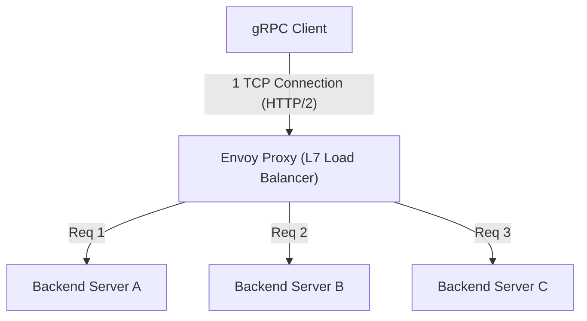

# gRPC e Protocol Buffers: O Padrão para Comunicação entre Microsserviços

No desenvolvimento de software moderno, a "arquitetura de microsserviços", que divide o sistema em vários pequenos serviços que trabalham juntos, tornou-se o padrão de fato para desenvolver e operar aplicações em larga escala de forma escalável.
No entanto, ao dividir os serviços, o processamento que até então era concluído na memória como chamadas de função, muda para um "sistema distribuído" que se comunica através da rede. O design desta comunicação de rede influencia grandemente o desempenho, confiabilidade e eficiência de desenvolvimento de todo o sistema.

Por muito tempo, as APIs RESTful (HTTP/1.1) baseadas em JSON têm sido amplamente utilizadas para a comunicação entre microsserviços. Contudo, à medida que a escala dos sistemas se expande e as demandas por volume de comunicação e tempo real aumentam, as limitações do JSON/REST tornam-se evidentes.
O que resolveu fundamentalmente essas questões e estabeleceu uma posição firme como o padrão de comunicação entre microsserviços da próxima geração foi o **gRPC**, desenvolvido pelo Google, e seu formato de serialização, o **Protocol Buffers (Protobuf)**.

Neste artigo, partindo do contexto de por que o JSON/REST era insuficiente, exploraremos a fundo todo o cenário do gRPC, explicando as vantagens do desenvolvimento orientado a esquemas, o mecanismo de codificação binária extremamente eficiente do Protocol Buffers, os 4 modelos de streaming beneficiados pelo HTTP/2, os desafios de balanceamento de carga específicos de ambientes distribuídos e a solução com o proxy Envoy.

---

## 1. Limitações e Desafios da Comunicação JSON/REST

A combinação de API REST e JSON é fácil de ler e escrever para os humanos e tem boa compatibilidade com navegadores web, por isso ainda é a principal escolha para comunicação entre frontend e backend (comunicação North-South). No entanto, em situações onde os serviços de backend se comunicam uns com os outros em alta velocidade (comunicação East-West), existem vários gargalos graves, como os listados abaixo.

### 1.1. Custo de Serialização e Análise (Parsing) Baseado em Texto (JSON)
JSON é um formato baseado em texto. Como dados como números e valores booleanos são todos representados como strings, é necessário um processo (serialização e desserialização) no qual o lado emissor converte as estruturas de dados na memória em strings, e o lado receptor analisa a string e a restaura novamente para a estrutura na memória.
A análise de texto (análise sintática, conversão de codificação de caracteres, conversão numérica) consome muitos ciclos de CPU. Em um ambiente de microsserviços, não é incomum que uma única solicitação de usuário desencadeie dezenas de comunicações entre serviços, e o custo cumulativo de análise JSON em cada nó leva diretamente ao aumento da latência de todo o sistema e ao desperdício de recursos da CPU.

### 1.2. Inchaço do Tamanho do Payload
O JSON é um formato redundante. Cada registro de dados sempre contém a string do nome da chave (nome do campo).
```json
{
  "user_id": 12345,
  "first_name": "Taro",
  "last_name": "Yamada",
  "is_active": true
}
```
Mesmo ao enviar e receber grandes quantidades de dados com a mesma estrutura, o nome da chave é transmitido repetidamente, o que consome o volume de transferência de dados (largura de banda) desnecessariamente. Embora o tamanho possa ser reduzido com compactação (como gzip), isso gera uma sobrecarga extra na CPU para compactar e descompactar.

### 1.3. Falta de Esquema Estrito e Dificuldade no Versionamento
O JSON em si não possui esquema (definição de tipos de dados ou opcional/obrigatório). É possível usar ferramentas como OpenAPI (Swagger) para definir especificações, mas sempre existe o risco de que a especificação e a implementação real diverjam. Se campos inesperados forem adicionados à resposta da API ou se os tipos forem alterados (de número para string, por exemplo), ocorrem frequentemente acidentes em que o serviço receptor lança um erro de execução.

### 1.4. Gerenciamento de Conexões e Limitações de Streaming do HTTP/1.1
Muitas APIs REST operam sobre HTTP/1.1. No HTTP/1.1, o modelo básico é retornar uma resposta para cada solicitação, e para processar várias solicitações simultaneamente, é necessário abrir várias conexões TCP (problema de Head-of-Line Blocking). Além disso, para implementar o envio assíncrono de dados do servidor para o cliente (push) ou streaming bidirecional, é necessário combinar outras tecnologias, como Server-Sent Events (SSE) ou WebSocket, o que torna o sistema mais complexo.

---

## 2. Protocol Buffers e o Desenvolvimento Orientado a Esquemas

A arma poderosa para resolver esses problemas do JSON/REST é o **Protocol Buffers (Protobuf)**. O Protobuf é a versão de código aberto da linguagem de descrição de dados e mecanismo de serialização que o Google usava internamente.

### 2.1. Desenvolvimento Orientado a Esquemas (Schema-Driven Development)
No desenvolvimento usando gRPC e Protobuf, adota-se a abordagem "schema-first". Primeiro, define-se a estrutura dos dados a serem trocados (mensagens) e as APIs fornecidas (serviços) em um arquivo IDL (Interface Definition Language) chamado `.proto`.

```protobuf
syntax = "proto3";

package user.v1;

// Mensagem representando as informações do usuário
message User {
  int32 user_id = 1;
  string first_name = 2;
  string last_name = 3;
  bool is_active = 4;
}

// Mensagem de requisição
message GetUserRequest {
  int32 user_id = 1;
}

// Serviço que fornece informações do usuário
service UserService {
  rpc GetUser (GetUserRequest) returns (User);
}
```

Este arquivo `.proto` torna-se a **"Única Fonte de Verdade" (Single Source of Truth)** para todo o sistema. A partir desse arquivo, o compilador `protoc` é usado para gerar automaticamente códigos (stubs) para cliente e servidor em várias linguagens, como Go, Java, Python, C++, Node.js, etc.

**Vantagens do Desenvolvimento Orientado a Esquemas:**
- **Garantia de Segurança de Tipos (Type Safety)**: Como a verificação de tipos é feita em tempo de compilação, os erros de tipo em tempo de execução (como erros de análise JSON) podem ser reduzidos drasticamente.
- **Função como Documentação**: O próprio arquivo `.proto` funciona como uma especificação precisa da API. Não há divergência em relação à implementação.
- **Compatibilidade Retroativa e Futura**: Cada campo recebe um número de tag exclusivo, como `1`, `2`. Se você adicionar um novo campo, os clientes mais antigos poderão ignorá-lo se o número da tag for diferente e, inversamente, se você excluir um campo antigo, poderá evitar a reutilização especificando seu número de tag como `reserved`. Isso permite atualizações seguras de versão da API.

### 2.2. A Eficiência Esmagadora de Serialização do Formato Binário
O maior motivo pelo qual o Protobuf é mais rápido e leve que o JSON está no seu mecanismo de codificação binária. O Protobuf serializa dados no formato **Tag-WireType-Value (uma variação de TLV: Type-Length-Value)**.

Vejamos como `user_id = 12345` (número da tag 1, tipo int32) da mensagem `User` mostrada anteriormente é serializado.

1. **Combinação de Tag e WireType**:
   O número da tag e o WireType (o tipo de dados, por exemplo, 0 para Varint) são agrupados em um único byte. A fórmula de cálculo é `(field_number << 3) | wire_type`.
   No caso do número da tag 1 e WireType 0, será `(1 << 3) | 0 = 00001000` (em hexadecimal, `0x08`). Apenas 1 byte indica "qual é este campo e como deve ser lido".
   (Diferente do JSON, a string de 10 bytes `"user_id":` é desnecessária)

2. **Codificação do Valor (Varint)**:
   A codificação de número inteiro de comprimento variável (Varint) é usada para representar valores inteiros. Quanto menor o número, menos bytes são necessários para representá-lo. O bit mais significativo (MSB) de 1 byte é usado como um bit de continuação, e o payload de dados é armazenado nos 7 bits restantes.
   No caso de 12345, devido à codificação Varint, ele é representado por 2 bytes: `0x39 0x60`.

Como resultado, `user_id: 12345` é compactado em apenas 3 bytes: `0x08 0x39 0x60`. No caso do JSON, `"user_id":12345` requer 15 bytes.
Durante a análise, os dados podem ser mapeados diretamente do binário para valores inteiros na memória, portanto, não ocorre nenhum processamento pesado como a análise de strings. É por isso que o Protobuf é extremamente rápido.

---

## 3. Os Benefícios do HTTP/2 e os 4 Modelos de Comunicação de Streaming

O gRPC adota o **HTTP/2** como sua camada de transporte. O HTTP/2 possui recursos como framing binário, multiplexação (Multiplexing) e compactação de cabeçalho (HPACK), que suportam significativamente o desempenho e a funcionalidade do gRPC.

### 3.1. Multiplexação e Aceleração com HTTP/2
Para resolver o problema Head-of-Line Blocking do HTTP/1.1, o HTTP/2 permite a troca simultânea de vários streams (requisições/respostas) em uma única conexão TCP. Na comunicação entre serviços, o gRPC normalmente estabelece uma conexão TCP persistente (canal) e executa várias chamadas RPC paralelamente sobre ela. Isso reduz o custo de handshake do TCP e alcança alto rendimento (throughput).

### 3.2. Os 4 Paradigmas de Comunicação
O gRPC suporta um total de 4 tipos de métodos de comunicação (streaming) aproveitando as capacidades de comunicação bidirecional do HTTP/2, e não apenas requisição/resposta simples.





1. **Unary RPC (Comunicação Unária)**:
   É a comunicação mais comum do tipo REST, retornando uma resposta para uma solicitação.
2. **Server Streaming RPC (Streaming de Servidor)**:
   O cliente envia uma requisição e o servidor retorna um fluxo de dados (múltiplas mensagens). É adequado para retornar os resultados de pesquisa de um grande conjunto de dados sequencialmente ou assinar feeds de cotações de ações em tempo real.
3. **Client Streaming RPC (Streaming de Cliente)**:
   O cliente envia um fluxo de dados e, depois que tudo é enviado, o servidor retorna uma única resposta. É ideal para upload de arquivos grandes ou envio em lote de grandes quantidades de dados de sensores IoT.
4. **Bidirectional Streaming RPC (Streaming Bidirecional)**:
   Um método em que o cliente e o servidor usam streams independentes para ler e escrever dados bidirecionalmente, mantendo a ordem das mensagens. É poderoso em aplicações de bate-papo, comunicação em tempo real em jogos multiplayer, sistemas de reconhecimento de voz em tempo real, etc.

A força do gRPC é que todos esses diversos modelos de comunicação podem ser implementados consistentemente sob a mesma estrutura e na mesma porta (sobre HTTP/2).

---

## 4. Desafios do Balanceamento de Carga e o Papel do Envoy Proxy

Ao implantar o gRPC em um ambiente de produção real (como ambientes de orquestração de contêineres como o Kubernetes), a grande barreira que muitos desenvolvedores enfrentam é o **"balanceamento de carga (Load Balancing)"**.

### 4.1. A Armadilha dos Balanceadores de Carga L4 (TCP)
Na comunicação HTTP/1.1 tradicional, a distribuição round-robin no nível de conexão TCP por balanceadores de carga L4 (camada de transporte), como AWS ELB e Nginx, funcionava suficientemente bem. Como uma nova conexão era criada para cada solicitação ou desconectada com `Connection: close`, a carga era naturalmente distribuída entre cada servidor de backend.

No entanto, a situação é diferente com o gRPC (HTTP/2). Como mencionado anteriormente, o gRPC **mantém uma única conexão TCP (Keep-Alive) e multiplexa solicitações nela** para melhorar o desempenho.
Os balanceadores de carga L4 decidem o destino do roteamento apenas uma vez quando a conexão TCP é estabelecida. Portanto, se uma conexão TCP de um determinado cliente for conectada ao Servidor A, todas as solicitações (streams) gRPC subsequentes ficarão concentradas apenas no Servidor A, e ocorrerá um "desequilíbrio" onde nenhuma solicitação será enviada para os Servidores B ou C.

### 4.2. Balanceamento de Carga no Lado do Cliente vs Proxy (L7)
Para resolver esse problema, é necessário interpretar os streams HTTP/2 (L7: camada de aplicação) que fluem dentro da conexão TCP (L4) e realizar o roteamento com base em cada solicitação. Existem basicamente duas soluções:

1. **Balanceamento de Carga no Lado do Cliente (Thick Client)**:
   Um método onde a própria biblioteca cliente gRPC possui funcionalidade de balanceamento de carga. O cliente consulta o DNS ou serviço de descoberta (Consul, ZooKeeper, etc.) para obter a lista de IPs de todos os backends e executa ele mesmo o round-robin, etc. É eficiente, mas o fardo de implementar e operar lógica equivalente em todas as linguagens de cliente é grande.

2. **Balanceamento de Carga com Proxy L7 (Envoy Proxy)**:
   Atualmente é a abordagem mais padrão na infraestrutura de microsserviços. Insere-se no meio um servidor proxy de alto desempenho que suporta gRPC e HTTP/2 nativamente. O representante principal é o **Envoy**.



O Envoy aceita uma única conexão TCP do cliente e analisa os quadros HTTP/2 que fluem através dela. Em seguida, ele extrai solicitações RPC individuais (streams) e distribui a carga uniformemente (por solicitação) em vários servidores de backend.
No ambiente Kubernetes, arquiteturas de malha de serviço (Service Mesh) como Istio e Linkerd implantam este proxy Envoy como um sidecar em cada pod, alcançando roteamento de tráfego gRPC avançado, retentativas, timeouts e circuit breakers sem modificar o código da aplicação.

---

## 5. Conclusão: Quando Adotar o gRPC e Quando Não Adotar

O gRPC e o Protocol Buffers são tecnologias excepcionais em termos de desempenho, robustez e produtividade de desenvolvimento, mas não são a "bala de prata". É importante utilizá-los de forma adequada nos lugares certos.

### Casos Onde Você Deve Adotar o gRPC
- **Comunicação de Backend (East-West) entre Microsserviços**: Ambientes que exigem baixa latência e alto rendimento.
- **Ambientes Poliglotas (Várias Linguagens)**: Mesmo se equipes diferentes usarem linguagens diferentes como Go, Java, Node.js, uma interface unificada pode ser gerada automaticamente a partir de um arquivo Proto.
- **Sistemas que Exigem Processamento de Streaming**: Aplicativos onde a transferência de dados em grande escala ou a comunicação bidirecional em tempo real são essenciais.
- **Sistemas de Grande Escala que Exigem Esquemas Estritos**: Para prevenir erros de colaboração entre as equipes e realizar o gerenciamento seguro de versão de API.

### Casos Onde Você Não Deve Adotar o gRPC (Onde o REST/JSON Deve Ser Considerado)
- **Comunicação Direta com o Frontend (Navegador)**: É possível chamar gRPC do navegador usando uma tecnologia chamada `grpc-web`, mas a configuração do ambiente ainda é complexa. O padrão geral é adotar padrões como GraphQL, REST e BFF (Backend for Frontend) para o frontend.
- **APIs Públicas Expostas Externamente**: Ao expor APIs a desenvolvedores terceiros, a combinação de HTTP/REST e JSON é esmagadoramente mais popular e a barreira de entrada é menor, pois pode ser facilmente testada com o comando curl, etc.
- **Sistemas de Escala Muito Pequena**: Em protótipos ou sistemas compostos por um número pequeno de serviços, o custo de preparação (boilerplate), como o gerenciamento de arquivos Proto e a construção de um pipeline de compilação, pode superar os benefícios.

Com a evolução da arquitetura de sistemas, o gRPC definitivamente se tornou o "padrão" para comunicação de backend de próxima geração. Ao entender a representação eficiente de dados do Protocol Buffers e o poderoso mecanismo de transporte do HTTP/2, e integrá-los adequadamente em seu sistema, você será capaz de construir microsserviços mais robustos e escaláveis.
