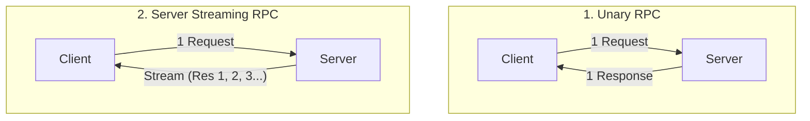
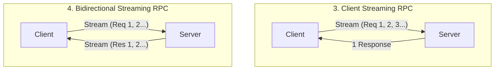
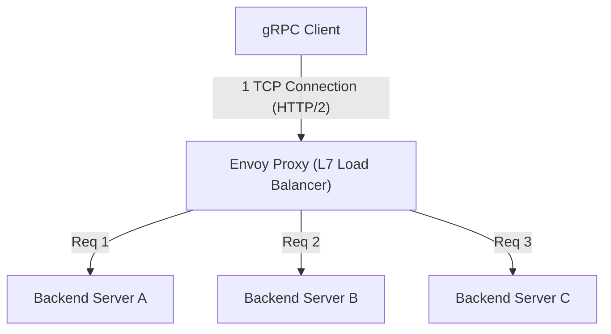

# gRPC и Protocol Buffers: Стандарт межсервисного взаимодействия микросервисов

В современной разработке программного обеспечения «микросервисная архитектура», при которой система разделяется на множество небольших взаимодействующих сервисов, стала стандартом де-факто для масштабируемой разработки и эксплуатации крупных приложений.
Однако из-за разделения на сервисы обработка, которая раньше представляла собой вызовы функций в памяти, превращается в «распределенную систему», осуществляющую связь по сети. Проектирование этой сетевой связи во многом определяет производительность, надежность и эффективность разработки всей системы в целом.

Долгое время для связи между микросервисами широко использовался RESTful API на базе JSON (HTTP/1.1). Однако по мере роста масштабов систем и повышения требований к объему трафика и производительности в реальном времени, ограничения JSON/REST стали очевидны.
Технология, которая кардинально решила эти проблемы и прочно утвердилась в качестве стандарта межсервисного взаимодействия следующего поколения, — это **gRPC**, разработанная Google, и ее формат сериализации **Protocol Buffers (Protobuf)**.

В этой статье мы подробно рассмотрим концепцию gRPC, начиная с причин, по которым JSON/REST оказался недостаточным. Мы обсудим преимущества разработки на основе схем (Schema-driven development), механизм высокоэффективного бинарного кодирования Protocol Buffers, четыре модели потоковой передачи на базе HTTP/2, а также специфические для распределенных сред проблемы балансировки нагрузки и их решение с помощью прокси-сервера Envoy.

---

## 1. Ограничения и проблемы связи на основе JSON/REST

Сочетание REST API и JSON легко читается и пишется людьми, а также хорошо совместимо с веб-браузерами, поэтому оно по-прежнему доминирует в связи между фронтендом и бэкендом (North-South трафик). Тем не менее, в ситуациях, когда сервисы бэкенда должны быстро взаимодействовать друг с другом (East-West трафик), возникают следующие серьезные узкие места.

### 1.1. Затраты на сериализацию и парсинг текстового формата (JSON)
JSON — это текстовый формат. Все данные, включая числа и логические значения, представляются в виде строк. Это означает, что отправляющая сторона должна преобразовать структуры данных в памяти в строки, а принимающая сторона должна проанализировать эти строки (парсинг) и восстановить их обратно в структуры данных в памяти (сериализация и десериализация).
Анализ текста (синтаксический анализ, преобразование кодировки символов, преобразование чисел) потребляет много процессорного времени. В микросервисной среде один пользовательский запрос часто вызывает десятки межсервисных вызовов, и совокупная стоимость парсинга JSON на каждом узле напрямую приводит к увеличению задержек всей системы и пустой трате ресурсов процессора.

### 1.2. Раздувание размера полезной нагрузки (Payload)
JSON — избыточный формат. Каждая запись данных должна содержать строки с именами ключей (именами полей).
```json
{
  "user_id": 12345,
  "first_name": "Taro",
  "last_name": "Yamada",
  "is_active": true
}
```
Даже при отправке или получении больших объемов данных одной и той же структуры, имена ключей передаются повторно, что приводит к пустой трате пропускной способности сети. Размер можно уменьшить с помощью сжатия (например, gzip), но это приводит к дополнительным затратам процессора на сжатие и распаковку.

### 1.3. Отсутствие строгой схемы и сложности с версионированием
Сам по себе JSON не имеет схемы (определения типов данных, обязательных/необязательных полей). Можно использовать OpenAPI (Swagger) для определения спецификаций, но всегда существует риск расхождения между спецификацией и фактической реализацией. Если в ответ API добавляются неожиданные поля или изменяются типы (например, число на строку), часто происходят сбои, приводящие к ошибкам времени выполнения на стороне сервиса-получателя.

### 1.4. Ограничения управления соединениями и потоковой передачи в HTTP/1.1
Большинство REST API работают поверх HTTP/1.1. Модель HTTP/1.1 в основном подразумевает один ответ на один запрос. Для одновременной обработки нескольких запросов необходимо устанавливать несколько TCP-соединений (проблема блокировки начала очереди, Head-of-Line Blocking). Кроме того, для реализации асинхронной отправки данных (push) от сервера к клиенту или двунаправленной потоковой передачи (streaming) необходимо комбинировать другие технологии, такие как Server-Sent Events (SSE) или WebSocket, что усложняет систему.

---

## 2. Protocol Buffers и разработка на основе схем (Schema-Driven Development)

Мощным инструментом для решения этих проблем JSON/REST является **Protocol Buffers (Protobuf)**. Protobuf — это язык описания данных и механизм сериализации, который изначально использовался внутри Google, а затем был выпущен как открытый исходный код.

### 2.1. Разработка на основе схем (Schema-Driven Development)
Разработка с использованием gRPC и Protobuf использует подход «схема прежде всего» (schema-first). Сначала в файле `.proto`, который является языком определения интерфейса (IDL), определяются структура передаваемых данных (сообщения) и предоставляемые API (сервисы).

```protobuf
syntax = "proto3";

package user.v1;

// Сообщение, представляющее информацию о пользователе
message User {
  int32 user_id = 1;
  string first_name = 2;
  string last_name = 3;
  bool is_active = 4;
}

// Сообщение запроса
message GetUserRequest {
  int32 user_id = 1;
}

// Сервис, предоставляющий информацию о пользователе
service UserService {
  rpc GetUser (GetUserRequest) returns (User);
}
```

Этот файл `.proto` становится **«единственным источником истины» (Single Source of Truth)** для всей системы. Из этого файла с помощью компилятора `protoc` автоматически генерируется код (заглушки или stubs) для клиентов и серверов на различных языках, таких как Go, Java, Python, C++, Node.js и других.

**Преимущества разработки на основе схем:**
- **Гарантия типобезопасности**: Поскольку проверка типов выполняется во время компиляции, количество ошибок типизации во время выполнения (например, ошибок парсинга JSON) может быть значительно сокращено.
- **Функция документации**: Сам файл `.proto` служит точной спецификацией API. Расхождений с реализацией не возникает.
- **Обратная и прямая совместимость**: Каждому полю присваивается уникальный номер тега, например `1`, `2`. Если добавляется новое поле, старые клиенты могут игнорировать его, так как номер тега отличается. И наоборот, если старое поле удаляется, его номер тега можно пометить как `reserved`, чтобы предотвратить его повторное использование. Это обеспечивает безопасное обновление версий API.

### 2.2. Невероятная эффективность сериализации бинарного формата
Главная причина, по которой Protobuf быстрее и легче, чем JSON, заключается в механизме его бинарного кодирования. Protobuf сериализует данные в формате **Tag-WireType-Value (разновидность TLV: Type-Length-Value)**.

Давайте посмотрим, как сериализуется `user_id = 12345` (номер тега 1, тип int32) из нашего сообщения `User`.

1. **Комбинация Tag и WireType**:
   Номер тега и WireType (тип данных, например, 0 для Varint) упаковываются в один байт. Формула вычисления: `(field_number << 3) | wire_type`.
   Для номера тега 1 и WireType 0 это будет `(1 << 3) | 0 = 00001000` (`0x08` в шестнадцатеричной системе). Всего один байт указывает «какое это поле и как его следует читать».
   (В отличие от JSON, где требуется 10-байтная строка `"user_id":`).

2. **Кодирование Value (Varint)**:
   Для представления целых чисел используется кодирование целых чисел переменной длины (Varint). Чем меньше число, тем меньше байтов нужно для его представления. Самый старший бит (MSB) 1 байта используется как бит продолжения, а остальные 7 бит хранят полезную нагрузку данных.
   В случае 12345 кодировка Varint представляет его в 2 байтах как `0x39 0x60`.

В результате `user_id: 12345` сжимается всего до 3 байтов: `0x08 0x39 0x60`. В случае JSON для `"user_id":12345` требуется 15 байтов.
При парсинге бинарные данные можно напрямую отобразить в целочисленное значение в памяти, поэтому никаких ресурсоемких операций вроде анализа строк не происходит. Именно поэтому Protobuf работает невероятно быстро.

---

## 3. Преимущества HTTP/2 и 4 модели потоковой связи (Streaming)

gRPC использует **HTTP/2** в качестве транспортного уровня. HTTP/2 предлагает такие функции, как бинарное фреймирование (binary framing), мультиплексирование (multiplexing) и сжатие заголовков (HPACK), которые в значительной степени обеспечивают производительность и функциональность gRPC.

### 3.1. Мультиплексирование и ускорение за счет HTTP/2
Чтобы решить проблему блокировки начала очереди (Head-of-Line Blocking) HTTP/1.1, HTTP/2 позволяет одновременно обмениваться несколькими потоками (запросами/ответами) по одному TCP-соединению. Во время межсервисного взаимодействия gRPC обычно устанавливает одно постоянное TCP-соединение (канал) и параллельно выполняет через него множество RPC-вызовов. Это снижает затраты на «рукопожатие» (handshake) TCP и обеспечивает высокую пропускную способность.

### 3.2. Четыре парадигмы связи
gRPC не ограничивается простым механизмом «запрос-ответ», а использует возможности двунаправленной связи HTTP/2 для поддержки в общей сложности четырех типов связи (потоковой передачи).





1. **Unary RPC (Унитарный RPC)**:
   Наиболее распространенная REST-подобная связь, когда возвращается один ответ на один запрос.
2. **Server Streaming RPC (Серверный потоковый RPC)**:
   Клиент отправляет один запрос, а сервер возвращает поток данных (несколько сообщений). Подходит для последовательного возврата результатов поиска по большим наборам данных или подписки на ленту котировок акций в реальном времени.
3. **Client Streaming RPC (Клиентский потоковый RPC)**:
   Клиент отправляет поток данных, и после того как все данные отправлены, сервер возвращает один ответ. Идеально подходит для загрузки больших файлов или пакетной передачи огромных объемов данных с датчиков IoT.
4. **Bidirectional Streaming RPC (Двунаправленный потоковый RPC)**:
   Клиент и сервер используют независимые потоки для двунаправленного чтения и записи данных, сохраняя порядок сообщений. Отлично подходит для чат-приложений, связи в реальном времени в соревновательных играх и систем распознавания речи в реальном времени.

Преимущество gRPC заключается в том, что все эти разнообразные модели связи могут быть реализованы единообразно с использованием одного и того же фреймворка и одного и того же порта (поверх HTTP/2).

---

## 4. Проблемы балансировки нагрузки и роль Envoy Proxy

При развертывании gRPC в реальных производственных средах (например, в средах оркестрации контейнеров, таких как Kubernetes), главным препятствием, с которым сталкиваются многие разработчики, является **«балансировка нагрузки» (Load Balancing)**.

### 4.1. Ловушка балансировщика нагрузки L4 (TCP)
В традиционной связи HTTP/1.1 балансировки нагрузки TCP-соединений по принципу Round-Robin с помощью балансировщиков уровня L4 (транспортный уровень), таких как AWS ELB или Nginx, было вполне достаточно. Это связано с тем, что для каждого запроса устанавливается новое соединение или оно закрывается через `Connection: close`, что естественным образом распределяет нагрузку по всем бэкенд-серверам.

Однако с gRPC (HTTP/2) ситуация иная. Как упоминалось ранее, для повышения производительности gRPC **поддерживает одно TCP-соединение (Keep-Alive) и мультиплексирует запросы через него**.
Балансировщик нагрузки L4 определяет место назначения только один раз — при установке TCP-соединения. Поэтому, когда TCP-соединение от определенного клиента подключается к серверу A, все последующие gRPC-запросы (потоки) будут концентрироваться только на сервере A, а на серверы B и C запросы вообще не поступят. Возникает «перекос» нагрузки.

### 4.2. Балансировка нагрузки на стороне клиента (Client-side) против Прокси (L7)
Чтобы решить эту проблему, необходимо интерпретировать потоки HTTP/2 (L7: прикладной уровень), протекающие внутри TCP-соединения (L4), и выполнять маршрутизацию на уровне каждого отдельного запроса. Существует два основных решения:

1. **Балансировка нагрузки на стороне клиента (Thick Client)**:
   Метод, при котором функция балансировки нагрузки встраивается в саму клиентскую библиотеку gRPC. Клиент обращается к DNS или службе обнаружения сервисов (Service Discovery, например, Consul, ZooKeeper), получает список IP-адресов всех бэкендов и самостоятельно выполняет Round-Robin или другой алгоритм распределения. Это эффективно, но требует значительных усилий для реализации и поддержки одной и той же логики на всех клиентских языках.

2. **Балансировка нагрузки через L7-прокси (Envoy Proxy)**:
   В настоящее время это наиболее стандартный подход в инфраструктуре микросервисов. Между клиентом и сервером устанавливается высокопроизводительный прокси-сервер, который нативно поддерживает gRPC и HTTP/2. Самым ярким представителем является **Envoy**.



Envoy принимает единственное TCP-соединение от клиента и парсит проходящие через него фреймы HTTP/2. Затем он извлекает отдельные RPC-запросы (потоки) и равномерно (позапросно) распределяет нагрузку между несколькими бэкенд-серверами.
В среде Kubernetes, в архитектурах сервисных сеток (Service Mesh), таких как Istio или Linkerd, этот прокси-сервер Envoy развертывается как «sidecar» (боковой прицеп) для каждого пода. Это позволяет реализовать сложную маршрутизацию трафика gRPC, повторные попытки (retries), таймауты и автоматические выключатели (circuit breakers) без необходимости вносить какие-либо изменения в код приложения.

---

## 5. Заключение: когда стоит и когда не стоит использовать gRPC

gRPC и Protocol Buffers — отличные технологии с точки зрения производительности, надежности и продуктивности разработки, но это не «серебряная пуля». Важно использовать правильный инструмент для правильной задачи.

### Когда следует использовать gRPC:
- **Внутренняя бэкенд-связь между микросервисами (East-West)**: Среды, требующие низкой задержки и высокой пропускной способности.
- **Полиглот-среды (многоязычные)**: Даже если разные команды используют разные языки, такие как Go, Java, Node.js, из `.proto` файла можно автоматически сгенерировать унифицированные интерфейсы.
- **Системы, требующие потоковой обработки**: Приложения, для которых обязательна передача больших объемов данных или двунаправленная связь в реальном времени.
- **Крупномасштабные системы, требующие строгой схемы**: Когда необходимо предотвратить ошибки взаимодействия между командами и обеспечить безопасное управление версиями API.

### Когда не следует использовать gRPC (когда лучше рассмотреть REST/JSON):
- **Прямая связь с фронтендом (браузером)**: Хотя вызов gRPC из браузера возможен с использованием технологии `grpc-web`, настройка среды все еще остается сложной. Для фронтенда обычно используются шаблоны GraphQL, REST или BFF (Backend for Frontend).
- **Публичные API для внешнего использования**: При предоставлении API сторонним разработчикам комбинация HTTP/REST и JSON гораздо более распространена. Барьер для входа ниже, поскольку API можно легко протестировать с помощью команд вроде `curl`.
- **Очень маленькие системы**: В прототипах или системах, состоящих из небольшого числа сервисов, затраты на предварительную подготовку, такие как управление файлами `.proto` и настройка пайплайнов сборки (boilerplate-код), могут превысить преимущества.

По мере развития архитектуры систем gRPC уверенно становится «стандартом» для связи на стороне бэкенда следующего поколения. Понимая эффективное представление данных с помощью Protocol Buffers и мощный транспортный механизм HTTP/2, а также правильно интегрируя их в вашу систему, вы сможете создавать более надежные и масштабируемые микросервисы.
