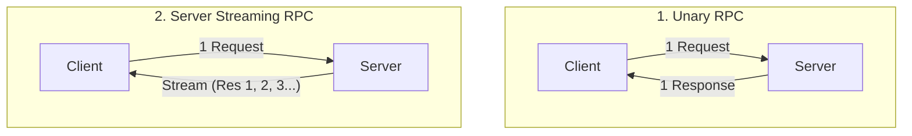
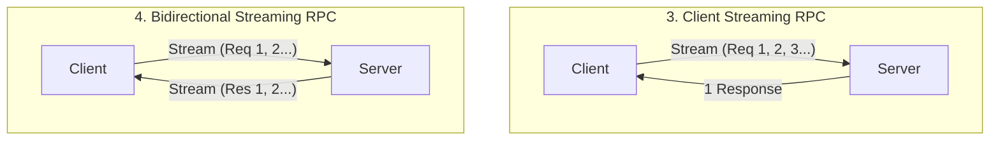
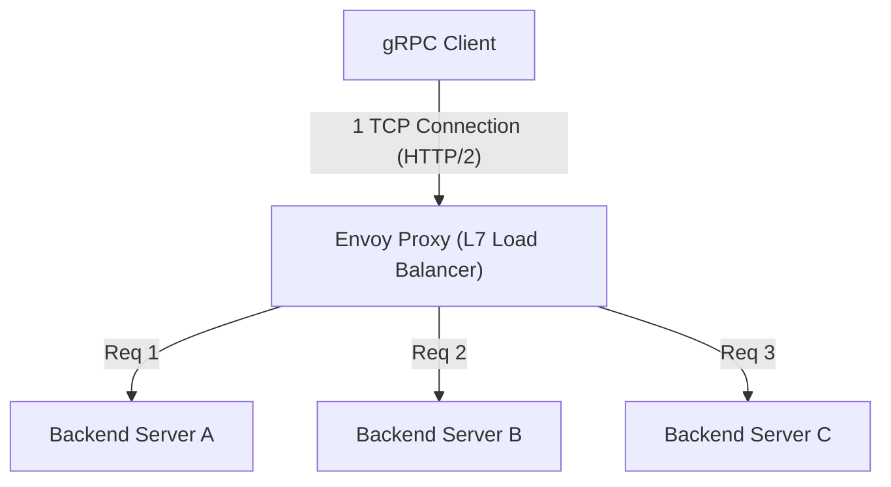

# gRPC与Protocol Buffers：微服务间通信的标准

在现代软件开发中，将系统拆分为多个小服务并使其协同工作的“微服务架构”已成为大规模应用程序可扩展开发和运营的事实标准。
然而，由于服务的拆分，原本作为内存中函数调用完成的处理，变成了通过网络进行通信的“分布式系统”。这种网络通信的设计极大地影响了整个系统的性能、可靠性和开发效率。

长期以来，基于JSON的RESTful API（HTTP/1.1）被广泛用于微服务间的通信。但是，随着系统规模的扩大以及对通信量和实时性要求的提高，JSON/REST的局限性也日益显现。
从根本上解决这些问题，并确立其作为下一代微服务间通信标准地位的，是Google开发的**gRPC**及其序列化格式**Protocol Buffers (Protobuf)**。

本文将从为何JSON/REST不足的背景出发，深入探讨gRPC的全貌，包括模式驱动开发的优势、Protocol Buffers极其高效的二进制编码机制、得益于HTTP/2的四种流式模型，以及分布式环境特有的负载均衡挑战和Envoy代理的解决方案。

---

## 1. JSON/REST通信的局限性与挑战

REST API与JSON的组合对人类读写非常友好，并且与Web浏览器的兼容性也很好，因此在目前的前端与后端之间的通信（南北向通信）中仍然是主流。但是，在后端服务之间高速相互通信的情况下（东西向通信），存在以下几个严重的瓶颈。

### 1.1. 基于文本（JSON）的序列化与解析成本
JSON是一种基于文本的格式。数值和布尔值等数据也全部表示为字符串，因此发送方需要将内存中的结构体转换为字符串，接收方需要解析字符串并将其恢复为内存中的结构体（序列化与反序列化）。
文本的解析（语法分析、字符编码转换、数值转换）会消耗大量的CPU周期。在微服务环境中，一个用户请求引发数十次服务间通信的情况并不罕见，每个节点累积的JSON解析成本直接导致整个系统延迟的增加和CPU资源的浪费。

### 1.2. 负载大小的膨胀
JSON是一种冗余格式。每个数据记录必然包含键名（字段名）的字符串。
```json
{
  "user_id": 12345,
  "first_name": "Taro",
  "last_name": "Yamada",
  "is_active": true
}
```
即使大量发送和接收相同结构的数据，也会因为重复发送键名而浪费数据传输量（带宽）。虽然通过压缩（如gzip）可以减小体积，但这又会带来额外的压缩和解压的CPU开销。

### 1.3. 缺乏严格的模式与版本控制的困难
JSON本身不存在模式（数据类型及必需/可选的定义）。虽然可以使用OpenAPI（Swagger）等来定义规范，但规范文档与实际实现产生偏差的风险始终存在。由于API的响应中意外添加了字段，或者类型的更改（例如从数字变为字符串），经常会导致接收端服务在运行时发生错误。

### 1.4. HTTP/1.1的连接管理与流式限制
许多REST API在HTTP/1.1上运行。在HTTP/1.1中，基本模型是对一个请求返回一个响应，要同时处理多个请求，需要建立多个TCP连接（队头阻塞问题，Head-of-Line Blocking）。此外，要实现服务器向客户端的异步数据推送或双向流式传输，必须结合Server-Sent Events (SSE)或WebSocket等其他技术，这会使系统复杂化。

---

## 2. Protocol Buffers与模式驱动开发

为了解决JSON/REST的这些挑战，一个强大的武器就是**Protocol Buffers (Protobuf)**。Protobuf是Google内部使用的数据描述语言和序列化机制的开源版本。

### 2.1. 模式驱动开发 (Schema-Driven Development)
使用gRPC和Protobuf的开发采用了“模式优先（Schema-First）”的方法。首先在 `.proto` 这个IDL（接口定义语言）文件中，定义要交互的数据结构（消息）和提供的API（服务）。

```protobuf
syntax = "proto3";

package user.v1;

// 表示用户信息的消息
message User {
  int32 user_id = 1;
  string first_name = 2;
  string last_name = 3;
  bool is_active = 4;
}

// 请求消息
message GetUserRequest {
  int32 user_id = 1;
}

// 提供用户信息的服务
service UserService {
  rpc GetUser (GetUserRequest) returns (User);
}
```

这个 `.proto` 文件成为了整个系统的**“唯一事实来源（Single Source of Truth）”**。通过这个文件，可以使用 `protoc` 编译器自动生成Go、Java、Python、C++、Node.js等各种语言的客户端和服务器端代码（存根，stub）。

**模式驱动开发的优势:**
- **保证类型安全**: 因为在编译时会进行类型检查，所以可以大幅减少运行时的类型错误（如JSON解析错误等）。
- **作为文档的功能**: `.proto` 文件本身就作为API的精确规范说明书。不会发生与实现不一致的情况。
- **向后兼容性与向前兼容性**: 每个字段都被分配了如 `1`、`2` 这样的唯一标签号。即使添加了新字段，只要标签号不同，旧客户端就可以忽略它；反之，如果删除旧字段，可以通过将其标签号指定为 `reserved` 来防止被重新使用。这使得安全的API版本升级成为可能。

### 2.2. 二进制格式压倒性的序列化效率
Protobuf比JSON更快、更轻量的最大原因在于其二进制编码机制。Protobuf将数据序列化为 **Tag-WireType-Value (TLV: Type-Length-Value的变体)** 的格式。

让我们看看前面 `User` 消息中的 `user_id = 12345`（标签号1，int32类型）是如何被序列化的。

1. **Tag与WireType的结合**:
   将标签号和WireType（数据类型，例如Varint为0）打包到一个字节中。计算公式为 `(field_number << 3) | wire_type`。
   标签号1，WireType为0的情况下，计算为 `(1 << 3) | 0 = 00001000`（十六进制为 `0x08`）。仅仅用1个字节就表示了“这是哪个字段，应该如何读取”。
   （不需要像JSON中那样需要 `"user_id":` 这样10个字节的字符串）

2. **Value的编码 (Varint)**:
   为了表示整数值，使用了可变长整数（Varint）编码。数值越小，需要的字节数就越少。使用1个字节的最高有效位（MSB）作为延续位，剩余7位存储数据有效载荷。
   对于12345，通过Varint编码将其表示为 `0x39 0x60` 这2个字节。

结果是，`user_id: 12345` 被压缩为了仅3个字节的 `0x08 0x39 0x60`。在JSON的情况下，`"user_id":12345` 则需要15个字节。
在解析时，可以直接从二进制映射到内存中的整数值，因此完全不会产生像字符串解析那样繁重的处理。这就是Protobuf速度极快的原因。

---

## 3. 得益于HTTP/2与4种流式通信模型

gRPC在传输层采用了 **HTTP/2**。HTTP/2具备二进制分帧、多路复用（Multiplexing）、头部压缩（HPACK）等功能，这些功能极大地支撑了gRPC的性能和功能性。

### 3.1. HTTP/2的多路复用与加速
为了解决HTTP/1.1的队头阻塞问题，HTTP/2允许在一个TCP连接上同时并发传输多个流（请求/响应）。在服务间通信中，gRPC通常建立一个持久的TCP连接（通道），并在其上并行执行大量的RPC调用。这减少了TCP握手的成本，实现了高吞吐量。

### 3.2. 4种通信范式
gRPC不仅仅是简单的请求和响应，它利用HTTP/2的双向通信能力，总共支持4种通信方式（流式传输）。





1. **Unary RPC (一元通信)**:
   最常见的、类似REST的通信方式，对一个请求返回一个响应。
2. **Server Streaming RPC (服务端流式传输)**:
   客户端发送一个请求，服务器返回一个数据流（多次消息）的方式。适用于依次返回大规模数据集的搜索结果，或者订阅实时股价流等情况。
3. **Client Streaming RPC (客户端流式传输)**:
   客户端发送一个数据流，在全部发送完毕后，服务器返回一个响应的方式。非常适合大容量文件的上传或大量IoT传感器数据的批量发送等。
4. **Bidirectional Streaming RPC (双向流式传输)**:
   客户端和服务器使用独立的流，在保持消息顺序的同时双向进行数据读写的方式。在聊天应用程序、对战游戏的实时通信、实时语音识别系统等场景中发挥着巨大威力。

这些多样化的通信模型，能够全部在同一个框架下、同一个端口（HTTP/2上）一致地实现，这就是gRPC的强大之处。

---

## 4. 负载均衡的挑战与Envoy Proxy的作用

在将gRPC部署到实际的生产环境（如Kubernetes等容器编排环境）时，许多开发者面临的一个巨大障碍就是**“负载均衡”**。

### 4.1. L4（TCP）负载均衡器的陷阱
在传统的HTTP/1.1通信中，通过AWS ELB或Nginx等L4（传输层）负载均衡器进行TCP连接级别的轮询分配就足以正常工作了。因为对于每个请求都会建立新的连接，或者通过Connection: close断开连接，所以负载会自然而然地分散到各个后端服务器上。

然而，在gRPC（HTTP/2）中情况有所不同。如前所述，为了提升性能，gRPC**保持单个TCP连接（Keep-Alive），并在其上多路复用请求**。
L4负载均衡器仅在建立TCP连接时决定一次分发目标。因此，当来自某个客户端的TCP连接连接到服务器A后，其后的所有gRPC请求（流）将持续集中在服务器A上，而服务器B或C则完全接收不到请求，从而产生“倾斜”。

### 4.2. 客户端负载均衡 vs 代理（L7）
为了解决这个问题，不是在TCP连接（L4）层面上进行路由，而是需要解析其中流动的HTTP/2流（L7：应用层），并以请求为单位进行路由。主要有两种解决方案。

1. **客户端负载均衡（Thick Client）**:
   在gRPC客户端库本身中实现负载均衡功能的方法。客户端向DNS或服务发现（如Consul、ZooKeeper等）查询以获取所有后端的IP列表，并自行执行轮询等操作。虽然效率很高，但在所有客户端语言中实现和维护同等逻辑的负担很大。

2. **L7代理负载均衡（Envoy Proxy）**:
   在微服务的基础架构中，这是目前最标准的方法。在中间加入原生支持gRPC和HTTP/2的高性能代理服务器。其代表就是 **Envoy**。



Envoy接收来自客户端的单个TCP连接，并解析其中流动的HTTP/2帧。然后提取出各个RPC请求（流），并将负载均匀地（以请求为单位）分散到后端的多个服务器上。
在Kubernetes环境中，在Istio或Linkerd等服务网格架构中，这个Envoy代理作为各Pod的Sidecar被部署，无需对应用程序代码进行任何修改，就能实现高级的gRPC流量路由、重试、超时和断路器。

---

## 5. 总结：何时应该采用gRPC，何时不应该

gRPC和Protocol Buffers在性能、健壮性和开发生产力方面是非常出色的技术，但它们并不是银弹。在合适的场景下恰当使用非常重要。

### 应该采用gRPC的场景
- **微服务间的后端（东西向）通信**: 需要低延迟、高吞吐量的环境。
- **多语言（Polyglot）环境**: 即便各团队使用Go、Java、Node.js等不同语言，也能从Proto文件自动生成统一的接口。
- **需要流处理的系统**: 需要传输大容量数据或必须进行实时双向通信的应用程序。
- **需要严格模式的大规模系统**: 当希望防止团队间的协作失误并进行安全的API版本管理时。

### 不应该采用gRPC（应考虑REST/JSON）的场景
- **与前端（浏览器）的直接通信**: 虽然可以通过名为 `grpc-web` 的技术从浏览器调用gRPC，但环境搭建目前仍然比较复杂。对于前端，通常采用GraphQL、REST或BFF（Backend for Frontend）模式更为普遍。
- **向外公开的公共API**: 如果是向第三方开发者公开API，HTTP/REST与JSON的组合更为普及，能够用curl命令等轻松进行测试，进入门槛较低。
- **非常小规模的系统**: 对于原型或由少数服务组成的系统，管理Proto文件和构建管道等前期准备（样板代码）的成本可能会超过其带来的收益。

随着系统架构的演进，gRPC确实已经成为了下一代后端通信的“标准”。通过理解Protocol Buffers高效的数据表示和HTTP/2强大的传输机制，并将其恰当地集成到系统中，我们将能够实现更加健壮且可扩展的微服务。
