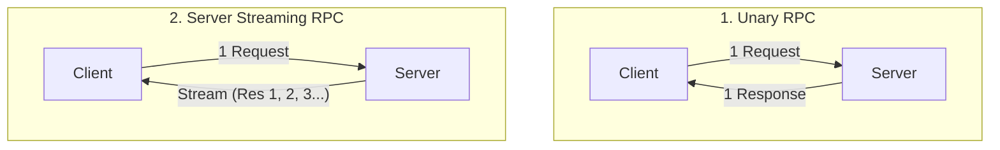
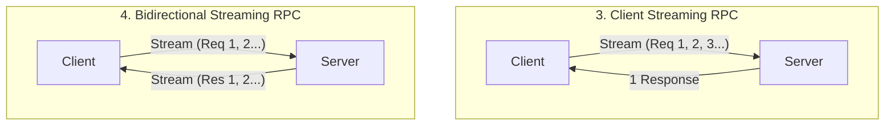
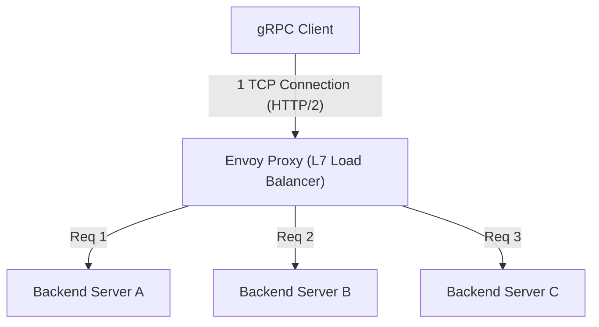

# gRPC與Protocol Buffers：微服務間通訊的標準

在現代軟體開發中，將系統分割成多個小型服務並協同運作的「微服務架構」，已成為開發與維運大規模可擴展應用程式的業界標準。
然而，透過分割服務，原本作為函式呼叫而在記憶體上完成的處理，變成了透過網路進行通訊的「分散式系統」。這個網路通訊的設計，將大幅左右整個系統的效能、可靠性以及開發效率。

長期以來，基於JSON的RESTful API（HTTP/1.1）被廣泛用於微服務間的通訊。但是，隨著系統規模擴大，對通訊量與即時性的要求提高，JSON/REST的極限也逐漸顯現。
為從根本解決這個問題，並在次世代微服務間通訊的標準中建立堅固地位的，正是Google所開發的**gRPC**，及其序列化格式**Protocol Buffers (Protobuf)**。

本文將從為何JSON/REST已不敷使用的背景出發，深入探討Schema驅動開發的優勢、Protocol Buffers極其高效的二進位編碼機制、受惠於HTTP/2的四種串流模型，以及分散式環境特有的負載平衡問題與Envoy代理的解決方案，徹底解說gRPC的全貌。

---

## 1. JSON/REST通訊的極限與課題

REST API與JSON的組合對人類來說容易閱讀與撰寫，與Web瀏覽器的相容性也很好，因此現在在前端與後端間的通訊（南北向通訊）中依然是主流。然而，在後端服務之間需要高速通訊的情況下（東西向通訊），存在著以下幾個嚴重的瓶頸。

### 1.1. 基於文字（JSON）的序列化與解析成本
JSON是基於文字的格式。數字或布林值等資料全數以字串表示，因此在發送端需要將記憶體上的結構體轉換為字串，而在接收端則需要解析字串並重新還原為記憶體上的結構體（序列化與反序列化）。
文字解析（語法解析、字元編碼轉換、數值轉換）會消耗大量的CPU週期。在微服務環境中，單一使用者請求引發數十次服務間通訊的情況並不罕見，各節點上JSON解析的累積成本，將直接導致系統整體的延遲增加與CPU資源浪費。

### 1.2. 負載大小的膨脹
JSON是冗長的格式。每一筆資料記錄必定包含鍵名（欄位名稱）的字串。
```json
{
  "user_id": 12345,
  "first_name": "Taro",
  "last_name": "Yamada",
  "is_active": true
}
```
即使大量發送或接收相同結構的資料，由於鍵名會被重複發送，將浪費資料傳輸量（頻寬）。雖然可以透過壓縮（如gzip）來減少大小，但這又會額外產生壓縮與解壓縮的CPU負載（Overhead）。

### 1.3. 缺乏嚴謹的Schema與版本控制的困難
JSON本身不存在Schema（資料型態或必填/選填的定義）。雖然可以利用OpenAPI（Swagger）等工具來定義規格，但規格書與實際實作產生落差的風險始終存在。API的回應中若追加了預期之外的欄位，或進行了型態變更（如從數字變為字串），經常會導致接收端的服務發生執行階段錯誤的事故。

### 1.4. HTTP/1.1的連線管理與串流限制
大多數的REST API運行於HTTP/1.1之上。在HTTP/1.1中，基本上採用一個請求對應一個回應的模型，要同時處理多個請求就必須建立多個TCP連線（隊頭阻塞問題，Head-of-Line Blocking）。此外，為了實現從伺服器到客戶端的非同步資料推送或雙向串流，必須結合Server-Sent Events (SSE)或WebSocket等其他技術，這將使系統變得複雜。

---

## 2. Protocol Buffers與Schema驅動開發

為解決這些JSON/REST的課題，強大的武器就是**Protocol Buffers (Protobuf)**。Protobuf是Google將其內部使用的資料描述語言及序列化機制開源化而成的。

### 2.1. Schema驅動開發 (Schema-Driven Development)
在使用gRPC與Protobuf的開發中，採取「Schema優先（Schema-First）」的方法。首先在名為 `.proto` 的IDL（介面定義語言）檔案中，定義要交換的資料結構（Message）與提供的API（Service）。

```protobuf
syntax = "proto3";

package user.v1;

// 表示使用者資訊的Message
message User {
  int32 user_id = 1;
  string first_name = 2;
  string last_name = 3;
  bool is_active = 4;
}

// 請求Message
message GetUserRequest {
  int32 user_id = 1;
}

// 提供使用者資訊的Service
service UserService {
  rpc GetUser (GetUserRequest) returns (User);
}
```

這個 `.proto` 檔案將成為整個系統的**「單一真理來源（Single Source of Truth）」**。透過此檔案，使用 `protoc` 編譯器可自動產生Go、Java、Python、C++、Node.js等多種語言的客戶端與伺服器端程式碼（Stub）。

**Schema驅動開發的優勢:**
- **保證型態安全**: 由於在編譯時會進行型態檢查，能大幅減少執行階段的型態錯誤（如JSON解析錯誤等）。
- **作為文件的功能**: `.proto` 檔案本身就具備API精確規格書的功能。不會發生與實作產生落差的情況。
- **向後相容性與向前相容性**: 每個欄位都會被分配如 `1`, `2` 般唯一的標籤號碼。即使追加新欄位，只要標籤號碼不同，舊客戶端就能忽略它；反之，若要刪除舊欄位，可將該標籤號碼指定為 `reserved` 來防止重複使用。藉此，可以安全地進行API的版本升級。

### 2.2. 二進位格式壓倒性的序列化效率
Protobuf比JSON更快且更輕量的最大原因，在於其二進位編碼的機制。Protobuf將資料以 **Tag-WireType-Value (TLV: Type-Length-Value的變形)** 的格式進行序列化。

讓我們來看看前述 `User` Message 中的 `user_id = 12345` （標籤號碼1，int32型態）是如何被序列化的。

1. **Tag與WireType的結合**:
   將標籤號碼與WireType（資料種類，例如Varint為0）封裝在一個位元組中。計算公式為 `(field_number << 3) | wire_type`。
   標籤號碼1、WireType 0的情況，`(1 << 3) | 0 = 00001000` （十六進位為 `0x08`）。僅用1位元組就表示了「這是哪個欄位，以及該如何讀取」。
   （不需要像JSON那樣 `"user_id":` 的10位元組字串）

2. **Value的編碼 (Varint)**:
   使用可變長度整數（Varint）編碼來表示整數值。數值越小，能用越少的位元組表示。使用1位元組的最高有效位元（MSB）作為延續位元，剩下的7個位元用來儲存資料負載。
   12345 的情況下，透過Varint編碼將以 `0x39 0x60` 的2位元組表示。

結果，`user_id: 12345` 被壓縮到了 `0x08 0x39 0x60` 僅僅3個位元組。而JSON的情況下 `"user_id":12345` 則需要15位元組。
在解析時，也能直接從二進位映射到記憶體上的整數值等，完全不會發生像字串解析那樣繁重的處理。這就是Protobuf速度極快的原因。

---

## 3. HTTP/2的恩惠與4種串流通訊模型

gRPC採用 **HTTP/2** 作為傳輸層。HTTP/2具備二進位分框（Binary Framing）、多路復用（Multiplexing）、標頭壓縮（HPACK）等功能，大幅支撐了gRPC的效能與功能性。

### 3.1. 透過HTTP/2實現的多路復用與高速化
為了解決HTTP/1.1的隊頭阻塞（Head-of-Line Blocking）問題，HTTP/2能在單一TCP連線上同時進行多個串流（請求/回應）。gRPC在服務間的通訊中，通常會建立一個持久的TCP連線（Channel），並在其上並列執行多個RPC呼叫。藉此減少TCP的交握（Handshake）成本，實現高吞吐量。

### 3.2. 4種通訊典範
gRPC不僅僅是單純的請求與回應，它活用了HTTP/2的雙向通訊能力，共支援4種通訊方式（串流）。





1. **Unary RPC (單元RPC通訊)**:
   最常見的、類似REST的通訊方式，一個請求對應一個回應。
2. **Server Streaming RPC (伺服器串流)**:
   客戶端發送一個請求，伺服器回傳資料串流（多次訊息）的方式。適用於依序回傳大規模資料集的搜尋結果，或訂閱即時的股價動態等。
3. **Client Streaming RPC (客戶端串流)**:
   客戶端發送資料串流，全部發送完畢後，伺服器回傳一個回應的方式。最適合用於大容量檔案的上傳，或大量IoT感測器資料的批次發送等。
4. **Bidirectional Streaming RPC (雙向串流)**:
   客戶端與伺服器使用獨立的串流，在保持訊息順序的情況下雙向讀寫資料的方式。在聊天應用程式、對戰遊戲的即時通訊、即時語音辨識系統中能發揮強大的作用。

能夠在同一個框架、同一個連接埠（於HTTP/2之上）一致地實作這些多樣的通訊模型，正是gRPC的優勢。

---

## 4. 負載平衡的課題與Envoy Proxy的角色

當將gRPC部署到實際的正式環境（如Kubernetes等容器編排環境）時，許多開發者面臨的一大障礙就是**「負載平衡（Load Balancing）」**。

### 4.1. L4（TCP）負載平衡器的陷阱
在傳統的HTTP/1.1通訊中，透過AWS ELB或Nginx等L4（傳輸層）負載平衡器進行TCP連線級別的輪詢（Round-Robin）分散就能充分發揮作用。因為每個請求都會建立新的連線，或因Connection: close而斷線，自然地就會將負載分散到各個後端伺服器上。

但是，在gRPC（HTTP/2）中情況就不同了。如前所述，gRPC為了提升效能**會維持單一TCP連線（Keep-Alive），並在其上多工處理請求**。
L4負載平衡器只在TCP連線建立時決定一次分配目標。因此，當某個客戶端的TCP連線連接到伺服器A後，其後所有的gRPC請求（串流）都將只集中在伺服器A，而伺服器B或C完全不會收到請求，產生了「偏載」的情況。

### 4.2. 客戶端負載平衡 vs 代理伺服器（L7）
為了解決這個問題，必須針對流經TCP連線（L4）內部的HTTP/2串流（L7：應用層）進行解析，並以請求為單位進行路由。主要有兩種解決方案：

1. **客戶端負載平衡（Thick Client）**:
   讓gRPC客戶端函式庫本身具備負載平衡功能的手法。客戶端向DNS或服務發現（如Consul、ZooKeeper等）查詢取得所有後端的IP清單，並自行執行輪詢等操作。雖然有效率，但在所有客戶端語言中實作並維護同等邏輯的負擔很大。

2. **L7代理負載平衡（Envoy Proxy）**:
   在微服務的基礎架構中，這是目前最標準的方法。在中間插入原生支援gRPC與HTTP/2的高效能代理伺服器。其代表就是 **Envoy**。



Envoy接收來自客戶端的單一TCP連線，並解析其中流動的HTTP/2分框。接著取出個別的RPC請求（串流），對後端的多個伺服器均勻地（以請求為單位）進行負載平衡。
在Kubernetes環境中，於Istio或Linkerd等服務網格（Service Mesh）架構下，此Envoy代理會作為各Pod的Sidecar部署，無須修改應用程式碼，即可實現進階的gRPC流量路由、重試、超時與斷路器（Circuit Breaker）等功能。

---

## 5. 總結：何時該採用gRPC，何時不該

gRPC與Protocol Buffers在效能、堅固性以及開發產能方面是極為優異的技術，但並非銀彈。適才適所地靈活運用非常重要。

### 該採用gRPC的情況
- **微服務間的後端（東西向）通訊**: 需要低延遲、高吞吐量的環境。
- **多語言（Polyglot）環境**: 即使各團隊使用Go、Java、Node.js等不同語言，也能從Proto檔案自動產生統一的介面。
- **需要串流處理的系統**: 大容量資料傳輸或必須即時雙向通訊的應用程式。
- **需要嚴謹Schema的大規模系統**: 為了防止團隊間的合作失誤，並安全地進行API版本管理時。

### 不該採用gRPC（應考慮REST/JSON）的情況
- **與前端（瀏覽器）的直接通訊**: 雖然可以透過 `grpc-web` 技術從瀏覽器呼叫gRPC，但環境建置仍然複雜。對前端通常採用GraphQL、REST或BFF（Backend for Frontend）模式。
- **對外公開的Public API**: 若要向第三方開發者公開API，HTTP/REST與JSON的組合普及率具備壓倒性優勢，且能用curl指令輕鬆測試，進入門檻較低。
- **極小規模的系統**: 在原型或僅由少數服務組成的系統中，管理Proto檔案與建置構建管線等事前準備（Boilerplate）的成本可能會超越其優勢。

隨著系統架構的演進，gRPC已確立為次世代後端通訊的「標準」。理解Protocol Buffers高效率的資料表示，以及HTTP/2強大的傳輸機制，並適切地整合至系統中，將能實現更堅固且可擴展的微服務。
