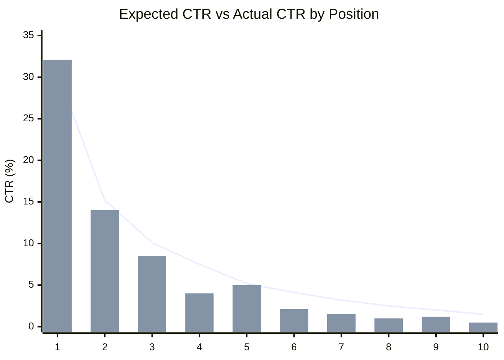
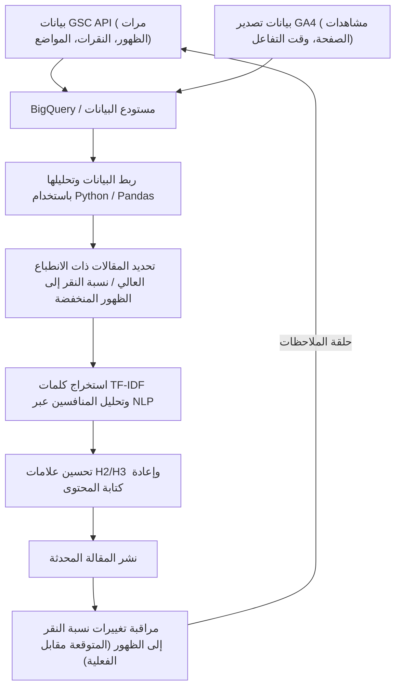

## 1. مقدمة: أهمية إعادة الكتابة في المدونات التقنية والنهج القائم على البيانات

عند إدارة مدونة تقنية أو وسائط مملوكة للمطورين، فإن "إعادة كتابة المقالات السابقة" لا تقل أهمية، بل قد تكون أكثر أهمية، من كتابة مقالات جديدة باستمرار. خاصة في المواضيع المتعلقة بتكنولوجيا المعلومات والتقنية، تتقادم المعلومات بسرعة، وليس من النادر أن تصبح مقتطفات الأكواد أو مواصفات واجهة برمجة التطبيقات (API) التي تمت كتابتها قبل بضع سنوات مهملة (Deprecated) في الوقت الحالي. ومع ذلك، فإن مجرد تحديث المقالات القديمة بشكل عشوائي لن يزيد من حركة المرور (الزيارات) من محركات البحث إلى الحد الأقصى.

لذلك، ستشرح هذه المقالة استراتيجية متقدمة لتحديد المقالات التقنية التي يجب إعادة كتابتها، وتحسين ترتيب البحث ومعدل النقر إلى الظهور (CTR) بشكل كبير، باستخدام بيانات **Google Search Console (GSC)** و **Google Analytics 4 (GA4)**، من خلال نهج قائم على البيانات ورياضي.

على وجه التحديد، سنشرح بشكل شامل كيفية دمج بيانات GSC و GA4 باستخدام Python و BigQuery، بدءًا من كيفية اكتشاف "مقالات الفرص الضائعة" ذات معدل النقر إلى الظهور (CTR) المنخفض مقارنة بعدد مرات الظهور (مرات العرض)، إلى طريقة استخدام تحليل TF-IDF في معالجة اللغات الطبيعية (NLP) لتحديد الكلمات الرئيسية المفقودة في عناوين H2 و H3، وسد الفجوات في المحتوى بكفاءة.

---

## 2. تحليل الفجوة بين نسبة النقر إلى الظهور المتوقعة والفعلية (مقدمة النموذج الرياضي)

أحد المؤشرات الأساسية في تحسين محركات البحث (SEO) هو "نسبة النقر إلى الظهور (CTR) بالنسبة لترتيب البحث". بشكل عام، إذا كان ترتيب البحث هو المركز الأول، فإن نسبة النقر إلى الظهور تبلغ حوالي 25-30%، وفي المركز الثاني حوالي 15%، وتنخفض بشكل حاد بعد ذلك. يمكن نمذجة هذه العلاقة بين الترتيب ومعدل النقر إلى الظهور كتوزيع يتبع قانون القوة (Power Law).

من المعروف أن نسبة النقر إلى الظهور المتوقعة $CTR(r)$ للترتيب $r$ يتم تقريبها بواسطة الصيغة التالية:

$$
CTR(r) = a \cdot r^{-b}
$$

هنا، يمثل $a$ معدل النقر إلى الظهور المتوقع عندما يكون الترتيب الأول (على سبيل المثال: $0.30$ لـ 30%)، و $b$ يمثل معلمة التضاؤل (بشكل عام بين $1.0$ و $1.5$).

النهج الأكثر فعالية عند اختيار المقالات لإعادة كتابتها هو **العثور على المقالات (الكلمات الرئيسية) حيث يكون "معدل النقر إلى الظهور الفعلي" أقل بكثير من "معدل النقر إلى الظهور المتوقع"**. على سبيل المثال، إذا كان ترتيب البحث هو المركز الثالث (معدل النقر المتوقع حوالي 10%) ولكن معدل النقر الفعلي هو 2% فقط، فمن المحتمل جدًا أن يكون هناك اختلاف بين نية البحث والعنوان/الوصف، أو أن النقرات يتم سلبها بسبب عوامل تنافسية مثل المقتطفات المنسقة.

الرسم البياني أدناه هو تصور يوضح الفجوة بين معدل النقر إلى الظهور المتوقع ومعدل النقر إلى الظهور الفعلي في مدونة تقنية معينة.



(* يمثل الرسم البياني الخطي معدل النقر المتوقع، ويمثل الرسم البياني الشريطي معدل النقر الفعلي. يمكن ملاحظة أنه ينخفض بشكل كبير في المركزين الرابع والثامن.)

---

## 3. الاستخراج التلقائي لبيانات أداء البحث باستخدام واجهة برمجة تطبيقات GSC (Python)

على الرغم من أنه من الممكن تنزيل ملف CSV من واجهة مستخدم الويب الخاصة بـ GSC وتحليله، إلا أنه بالنسبة للمدونات واسعة النطاق والتحليل المستمر، فمن الأفضل بناء نظام لاستخراج البيانات تلقائيًا باستخدام Python و GSC API.

أدناه مقتطف Python يستخدم `google-api-python-client` للحصول على بيانات الأداء حسب الصفحة والاستعلام (النقرات، مرات الظهور، معدل النقر إلى الظهور، متوسط الترتيب) خلال فترة محددة.

```python
import pandas as pd
from google.oauth2 import service_account
from googleapiclient.discovery import build

def get_gsc_data(key_path, site_url, start_date, end_date):
    # تحميل بيانات الاعتماد وبناء عميل API
    credentials = service_account.Credentials.from_service_account_file(
        key_path, scopes=['https://www.googleapis.com/auth/webmasters.readonly']
    )
    service = build('searchconsole', 'v1', credentials=credentials)

    # إعداد حمولة طلب API (تحديد الصفحة والاستعلام كأبعاد)
    request = {
        'startDate': start_date,
        'endDate': end_date,
        'dimensions': ['page', 'query'],
        'rowLimit': 25000
    }

    # تنفيذ API
    response = service.searchanalytics().query(
        siteUrl=site_url, body=request
    ).execute()

    # استخراج البيانات من الاستجابة وتحويلها إلى Pandas DataFrame
    rows = response.get('rows', [])
    data = []
    for row in rows:
        keys = row['keys']
        data.append({
            'page': keys[0],
            'query': keys[1],
            'clicks': row['clicks'],
            'impressions': row['impressions'],
            'ctr': row['ctr'],
            'position': row['position']
        })
    
    return pd.DataFrame(data)

# مثال على التنفيذ
# df_gsc = get_gsc_data('credentials.json', 'https://kenji.blog/', '2026-08-01', '2026-08-31')
# print(df_gsc.head())
```

يتيح لك هذا البرنامج النصي الحصول على بيانات مفصلة تربط عناوين URL للصفحات باستعلامات البحث في صورة DataFrame. يجعل هذا من الممكن الفهم الشامل للكلمات الرئيسية التي تظهر بها مقالة معينة.

---

## 4. تصفية الكلمات الرئيسية التقنية باستخدام التعبيرات العادية (Regex)

إحدى الميزات القوية للغاية في تحليل المدونات التقنية هي **مرشح التعبيرات العادية (Regex)** في GSC.
على سبيل المثال، إذا كنت تكتب مقالات تغطي مجموعة واسعة من المواضيع، من الواجهة الأمامية إلى الواجهة الخلفية والبنية التحتية، فقد ترغب في استخراج "مقالات الأخطاء والبرامج التعليمية المتعلقة بـ Python و Pandas" فقط لتحديد أولوية إعادة الكتابة.

باستخدام مرشحات التعبيرات العادية المخصصة في GSC، يمكنك تضييق نطاق الاستعلامات بناءً على شروط معقدة.

**أمثلة فعلية على تصفية الكلمات الرئيسية التقنية:**
- التحقيق في الأخطاء المتعلقة بـ Python: `^(python|pandas|numpy|matplotlib).* (error|exception|bug|خطأ|لا يعمل)`
- بناء البنية التحتية المتعلقة بـ AWS: `(aws|amazon web services|ec2|s3|lambda).* (بناء|إعداد|برنامج تعليمي|tutorial|كيفية)`
- ترقية إصدار مكتبة معينة: `(react|vue|angular) (v17|v18|v3) (migration|ترحيل|انتقال)`

لدمج هذا في طلبات واجهة برمجة تطبيقات GSC، استخدم `dimensionFilterGroups` لإضافة شروط التعبيرات العادية. من خلال الاستفادة من هذه التصفية، يمكنك تحديد الكلمات الرئيسية عالية القيمة والتي تركز على حل المشكلات التي "يعلق فيها المطورون حاليًا ويبحثون عنها".

---

## 5. دمج بيانات GA4 و GSC باستخدام BigQuery/Pandas

بيانات GSC وحدها لا تخبرنا سوى "بترتيب البحث ومعدل النقر إلى الظهور". لمعرفة "إلى أي مدى بقي المستخدمون الذين وصلوا إلى تلك المقالة بالفعل وما إذا كانوا قد وصلوا إلى التحويل (مثل الانتقال إلى مستودع GitHub أو التسجيل في النشرة الإخبارية)"، من الضروري دمج البيانات (JOIN) مع بيانات **Google Analytics 4 (GA4)**.

إذا كنت تخزن بيانات تصدير GA4 وبيانات التصدير المجمع لـ GSC في BigQuery، فيمكنك ضمهما مع استعلام SQL التالي لاستخراج "المقالات التي تحتوي على العديد من مرات الظهور وترتيب بحث مرتفع إلى حد ما، ولكن معدل ارتدادها مرتفع ووقت التفاعل فيها قصير".

```sql
WITH gsc_data AS (
  SELECT
    url AS page_path,
    SUM(impressions) AS total_impressions,
    SUM(clicks) AS total_clicks,
    AVG(sum_top_position) AS avg_position
  FROM
    `project.searchconsole.searchdata_url_impression`
  WHERE
    data_date BETWEEN '2026-08-01' AND '2026-08-31'
  GROUP BY
    url
),
ga4_data AS (
  SELECT
    REGEXP_REPLACE(
      (SELECT value.string_value FROM UNNEST(event_params) WHERE key = 'page_location'),
      r'^https?://[^/]+', ''
    ) AS page_path,
    COUNT(DISTINCT user_pseudo_id) AS users,
    AVG((SELECT value.int_value FROM UNNEST(event_params) WHERE key = 'engagement_time_msec')) / 1000 AS avg_engagement_sec
  FROM
    `project.analytics_123456789.events_*`
  WHERE
    event_name = 'page_view'
  GROUP BY
    page_path
)

SELECT
  g.page_path,
  g.total_impressions,
  g.total_clicks,
  SAFE_DIVIDE(g.total_clicks, g.total_impressions) AS ctr,
  g.avg_position,
  a.users,
  a.avg_engagement_sec
FROM
  gsc_data g
JOIN
  ga4_data a ON g.page_path = a.page_path
WHERE
  g.total_impressions > 1000
  AND g.avg_position BETWEEN 3 AND 15
ORDER BY
  g.total_impressions DESC
```

باستخدام هذه النتيجة، نصنف المقالات التي سيتم إعادة كتابتها بالمصفوفة التالية:

1. **انطباع عالي، نسبة نقر إلى ظهور منخفضة، تفاعل عالي**:
   المقالات التي يرضى عنها القراء بمجرد النقر عليها في نتائج البحث. يجب إعطاء الأولوية القصوى **لتعديل العنوان ووصف الميتا** فقط.
2. **نسبة نقر إلى ظهور عالية، تفاعل منخفض**:
   المقالات التي يتم النقر عليها ولكن يتم التخلي عنها لأن المحتوى كان مخيباً للآمال. تتطلب إعادة كتابة شاملة للنص، مثل **تحسين الفقرة الافتتاحية، والتحديث إلى أحدث الأكواد، وتحسين شمولية المعلومات (إضافة H2/H3)**.

---

## 6. تحليل فجوة المحتوى باستخدام البرمجة اللغوية العصبية (NLP) و TF-IDF

بمجرد تحديد المقالات التي يجب إعادة كتابتها، فإن الخطوة التالية هي تحليل "العناوين (H2/H3) والكلمات الرئيسية المحددة التي يجب إضافتها". هنا أيضًا، بدلاً من الاعتماد على الحدس، نستخدم **TF-IDF (تردد المصطلح - تردد المستند العكسي) في معالجة اللغات الطبيعية (NLP)**.

TF-IDF هو مقياس إحصائي يُستخدم لتقييم مدى أهمية كلمة معينة داخل ذلك المستند.

$$
TF\text{-}IDF(t, d) = tf(t, d) \times \log\left(\frac{N}{df(t)}\right)
$$

هنا:
- $tf(t, d)$ هو تكرار الكلمة $t$ في المستند $d$
- $N$ هو العدد الإجمالي للمستندات
- $df(t)$ هو عدد المستندات التي تظهر فيها الكلمة $t$

**النهج:**
1. الحصول على البيانات النصية لأعلى 10 مقالات (المواقع المنافسة) للكلمة الرئيسية المستهدفة عبر استخراج البيانات (Scraping) أو وسائل أخرى.
2. تحضير البيانات النصية للمقالة المستهدفة على موقعك الخاص.
3. باستخدام `TfidfVectorizer` من `scikit-learn` في Python، استخرج الكلمات الرئيسية (كلمات الميزات) التي تظهر بدرجة عالية بشكل شائع في مجموعة المقالات المنافسة الأولى، ولكنها غير موجودة في مقالتك، أو درجتها منخفضة بشكل ملحوظ.

```python
from sklearn.feature_extraction.text import TfidfVectorizer
import pandas as pd
import numpy as np

# documents = [نص موقعك, نص المقالة المنافسة 1, نص المقالة المنافسة 2, ...]
# يفترض هنا قائمة نصوص تم تقسيمها بواسطة التحليل الصرفي (مثل MeCab) للغة اليابانية

def extract_missing_keywords(documents):
    vectorizer = TfidfVectorizer(max_df=0.9, min_df=2)
    tfidf_matrix = vectorizer.fit_transform(documents)
    
    feature_names = vectorizer.get_feature_names_out()
    
    # حساب متوسط درجات TF-IDF للمقالات المنافسة (الفهرس 1 وما بعده)
    competitor_mean_tfidf = np.mean(tfidf_matrix[1:].toarray(), axis=0)
    
    # الحصول على درجات TF-IDF لمقالة موقعك (الفهرس 0)
    my_article_tfidf = tfidf_matrix[0].toarray()[0]
    
    # حساب الفجوة للكلمات المهمة للمنافسين ولكنها غير موجودة (أو قليلة) في موقعك
    gap_scores = competitor_mean_tfidf - my_article_tfidf
    
    # استخراج أفضل الكلمات ذات الفجوات الكبيرة
    df_gap = pd.DataFrame({'keyword': feature_names, 'gap_score': gap_scores})
    df_gap = df_gap.sort_values(by='gap_score', ascending=False)
    
    return df_gap.head(20)

# مثال: missing_keywords = extract_missing_keywords(processed_docs)
# print(missing_keywords)
```

من خلال هذا التحليل، يمكنك اكتشاف **النواقص في المواضيع (فجوات المحتوى)** كميًا، مثل "في الواقع، تشير المقالات الأولى أيضًا إلى『طريقة النشر في حاويات Docker』أو『بناء مسار CI/CD』، ولكن مقالتي لا تتطرق إلى ذلك".

لا ينبغي أن تُنثر الكلمات الرئيسية المهمة المكتشفة في النص فحسب، بل يمكن تحسين تقييم Google بشكل كبير من خلال إضافتها كأقسام ذات مغزى كعناوين **H2 أو H3 (علامات العناوين)** وكتابة شروحات فنية مفصلة ومقتطفات برمجية لتلك العناوين.

---

## 7. خط أنابيب البيانات ودورة التحسين المستمر

إن العمليات الموضحة حتى الآن لا ينبغي إجراؤها مرة واحدة ونسيانها؛ فمفتاح النجاح في تحسين محركات البحث هو تحويلها إلى خط أنابيب وتشغيلها باستمرار. يوضح المخطط الانسيابي أدناه لـ Mermaid البنية المعمارية العامة وسير العمل.



بهذه الطريقة، من خلال تنظيم سلسلة الخطوات لجمع البيانات من GSC و GA4، واختيار الهدف من خلال التحليل، وتحسين المحتوى عبر البرمجة اللغوية العصبية (NLP)، وأخيرًا مراقبة النتائج، ستصبح مدونتك أصلًا يستمر في النمو تلقائيًا.

---

## 8. الخاتمة والآفاق المستقبلية

إن إعادة كتابة المقالات التقنية باستخدام Google Search Console ليس مجرد تعديل للنص. بل هي هندسة متقدمة تقدم الحلول المثلى للخوارزميات المعقدة لمحركات البحث، وذلك بالاستفادة الكاملة من البيانات والنماذج الرياضية.

فيما يلي ملخص للطرق الموضحة في هذه المقالة:
1. حساب **الفجوة بين معدل النقر إلى الظهور (CTR) المتوقع والفعلي** وتحديد المقالات التي يكون لتعديلها تأثير كبير.
2. الاستخراج التلقائي لبيانات الأداء باستخدام **GSC API و Python**.
3. دمج بيانات تفاعل GA4 في **BigQuery** وتعديل نصوص المقالات ذات معدل الارتداد المرتفع.
4. اكتشاف فجوات المحتوى مع المنافسين من خلال **تحليل NLP باستخدام TF-IDF**، وتحسين العناوين (H2/H3).

تتغير الاتجاهات التكنولوجية باستمرار. للاستجابة بدقة للأخطاء والتحديات التي يواجهها القراء اليوم، يرجى دمج إعادة الكتابة الاستراتيجية المدعومة بالبيانات في عملياتك اليومية.
