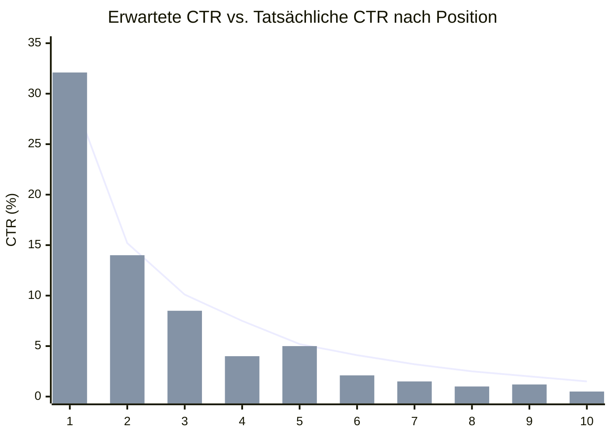
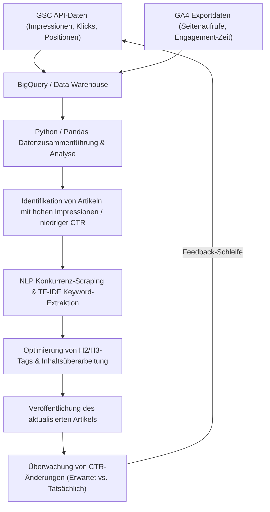

## 1. Einführung: Die Bedeutung der Überarbeitung von Technik-Blogs und der datengesteuerte Ansatz

Beim Betrieb eines Technik-Blogs oder eigener Medien für Entwickler ist das „Überarbeiten vergangener Artikel“ genauso wichtig oder sogar wichtiger als das kontinuierliche Schreiben neuer Artikel. Besonders bei IT- und Technik-Themen veralten Informationen schnell, und es ist nicht ungewöhnlich, dass Code-Snippets oder API-Spezifikationen, die vor einigen Jahren geschrieben wurden, heute veraltet (Deprecated) sind. Wenn Sie jedoch vergangene Artikel nur blind aktualisieren, können Sie den Traffic (Besucherstrom) von Suchmaschinen nicht maximieren.

Daher wird dieser Artikel eine fortgeschrittene Strategie erläutern, die Daten aus der **Google Search Console (im Folgenden GSC)** und **Google Analytics 4 (GA4)** nutzt und einen datengesteuerten sowie mathematischen Ansatz anwendet, um zu überarbeitende technische Artikel zu identifizieren und das Suchmaschinenranking sowie die Klickrate (CTR) drastisch zu verbessern.

Konkret wird umfassend erklärt, wie man GSC- und GA4-Daten mit Python und BigQuery integriert, um „Artikel mit verpassten Chancen“ zu finden, die im Verhältnis zu ihren Impressionen (Aufrufen) eine niedrige CTR aufweisen. Darüber hinaus wird gezeigt, wie man durch TF-IDF-Analyse der NLP (Verarbeitung natürlicher Sprache) fehlende Schlüsselwörter für H2- und H3-Überschriften identifiziert und inhaltliche Lücken effizient schließt.

---

## 2. Lückenanalyse zwischen erwarteter CTR und tatsächlicher CTR (Einführung eines mathematischen Modells)

Einer der grundlegendsten Indikatoren in der SEO ist die „Klickrate (CTR) in Bezug auf das Suchmaschinenranking“. Im Allgemeinen beträgt die CTR bei einem 1. Platz im Ranking etwa 25 bis 30 %, beim 2. Platz etwa 15 %, und danach fällt sie stark ab. Diese Beziehung zwischen Ranking und CTR kann als Verteilung modelliert werden, die einem Potenzgesetz (Power Law) folgt.

Es ist bekannt, dass die erwartete Klickrate $CTR(r)$ für das Ranking $r$ durch folgende Formel angenähert wird:

$$
CTR(r) = a \cdot r^{-b}
$$

Hierbei steht $a$ für die erwartete CTR auf dem 1. Platz (z. B. $0.30$ für 30 %) und $b$ für den Dämpfungsparameter (typischerweise zwischen $1.0$ und $1.5$).

Der effektivste Ansatz bei der Auswahl von zu überarbeitenden Artikeln besteht darin, **Artikel (Schlüsselwörter) zu finden, bei denen die „tatsächliche CTR“ deutlich unter dieser „erwarteten CTR“ liegt**. Wenn beispielsweise das Suchranking den 3. Platz belegt (erwartete CTR von etwa 10 %), die tatsächliche CTR aber nur 2 % beträgt, kann man mit hoher Wahrscheinlichkeit davon ausgehen, dass die Suchintention nicht mit dem Titel und der Beschreibung übereinstimmt, oder dass Klicks durch Wettbewerbsfaktoren wie Rich Snippets verloren gehen.

Das folgende Diagramm veranschaulicht die Diskrepanz zwischen der erwarteten CTR und der tatsächlichen CTR in einem Technik-Blog.



(* Die Linie zeigt die erwartete CTR, während das Balkendiagramm die tatsächliche CTR darstellt. Es ist zu erkennen, dass die Werte auf den Plätzen 4 und 8 deutlich darunter liegen.)

---

## 3. Automatische Extraktion von Suchleistungsdaten mit der GSC API (Python)

Obwohl es möglich ist, CSV-Dateien über die Web-Benutzeroberfläche der GSC herunterzuladen und zu analysieren, ist es für große Blogs oder kontinuierliche Analysen am besten, ein System zu entwickeln, das Daten automatisch mit Python und der GSC API extrahiert.

Im Folgenden wird ein Python-Snippet gezeigt, das `google-api-python-client` verwendet, um Leistungsdaten (Klicks, Impressionen, CTR, durchschnittliches Ranking) nach Seite und Abfrage für einen bestimmten Zeitraum abzurufen.

```python
import pandas as pd
from google.oauth2 import service_account
from googleapiclient.discovery import build

def get_gsc_data(key_path, site_url, start_date, end_date):
    # Authentifizierungsinformationen laden und API-Client erstellen
    credentials = service_account.Credentials.from_service_account_file(
        key_path, scopes=['https://www.googleapis.com/auth/webmasters.readonly']
    )
    service = build('searchconsole', 'v1', credentials=credentials)

    # API-Anfrage-Payload konfigurieren (Seite und Abfrage als Dimensionen angeben)
    request = {
        'startDate': start_date,
        'endDate': end_date,
        'dimensions': ['page', 'query'],
        'rowLimit': 25000
    }

    # API ausführen
    response = service.searchanalytics().query(
        siteUrl=site_url, body=request
    ).execute()

    # Daten aus der Antwort extrahieren und in einen Pandas DataFrame umwandeln
    rows = response.get('rows', [])
    data = []
    for row in rows:
        keys = row['keys']
        data.append({
            'page': keys[0],
            'query': keys[1],
            'clicks': row['clicks'],
            'impressions': row['impressions'],
            'ctr': row['ctr'],
            'position': row['position']
        })
    
    return pd.DataFrame(data)

# Ausführungsbeispiel
# df_gsc = get_gsc_data('credentials.json', 'https://kenji.blog/', '2026-08-01', '2026-08-31')
# print(df_gsc.head())
```

Mit diesem Skript können Sie detaillierte Daten, die Seiten-URLs mit Suchanfragen verknüpfen, als DataFrame abrufen. Dadurch wird es möglich, umfassend zu verstehen, für welche Schlüsselwörter bestimmte Artikel angezeigt werden.

---

## 4. Filtern technischer Schlüsselwörter mit regulären Ausdrücken (Regex)

Eine äußerst leistungsstarke Funktion bei der Analyse von Technik-Blogs ist der **Filter für reguläre Ausdrücke (Regex)** der GSC.
Wenn Sie beispielsweise Artikel schreiben, die von Frontend über Backend bis hin zu Infrastruktur reichen, möchten Sie möglicherweise nur "Artikel zu Fehlern oder Tutorials bezüglich Python und Pandas" extrahieren, um die Priorität für Überarbeitungen festzulegen.

Durch die Verwendung benutzerdefinierter Regex-Filter in der GSC können Sie Suchanfragen unter komplexen Bedingungen eingrenzen.

**Beispiele für die Filterung technischer Schlüsselwörter:**
- Fehlersuche im Zusammenhang mit Python: `^(python|pandas|numpy|matplotlib).* (error|exception|bug|エラー|動かない)`
- AWS-Infrastrukturaufbau: `(aws|amazon web services|ec2|s3|lambda).* (構築|設定|チュートリアル|tutorial|how to)`
- Versions-Upgrades spezifischer Bibliotheken: `(react|vue|angular) (v17|v18|v3) (migration|マイグレーション|移行)`

Wenn Sie dies in eine GSC-API-Anfrage integrieren, verwenden Sie `dimensionFilterGroups`, um Bedingungen für reguläre Ausdrücke hinzuzufügen. Durch die Nutzung dieser Filterung können Sie gezielt hochwertige, lösungsorientierte Schlüsselwörter extrahieren, nach denen Entwickler suchen, wenn sie "gerade jetzt in Schwierigkeiten stecken".

---

## 5. Integration von GA4- und GSC-Daten mit BigQuery/Pandas

GSC-Daten allein zeigen nur „Suchmaschinenranking und Klickrate“. Um herauszufinden, „wie lange ein Benutzer, der den Artikel gefunden hat, tatsächlich bleibt und ob es zu einer Konversion (z. B. Wechsel zu einem GitHub-Repository oder Anmeldung für einen Newsletter) kommt“, ist es notwendig, die Daten mit **Google Analytics 4 (GA4)** zu integrieren (JOIN).

Wenn Sie die GA4-Exportdaten und die GSC-Massenexportdaten in BigQuery speichern, können Sie diese mit der folgenden SQL-Abfrage kombinieren, um „Artikel mit vielen Impressionen und einem anständigen Suchranking, aber mit einer hohen Absprungrate oder kurzer Engagement-Zeit“ zu extrahieren.

```sql
WITH gsc_data AS (
  SELECT
    url AS page_path,
    SUM(impressions) AS total_impressions,
    SUM(clicks) AS total_clicks,
    AVG(sum_top_position) AS avg_position
  FROM
    `project.searchconsole.searchdata_url_impression`
  WHERE
    data_date BETWEEN '2026-08-01' AND '2026-08-31'
  GROUP BY
    url
),
ga4_data AS (
  SELECT
    REGEXP_REPLACE(
      (SELECT value.string_value FROM UNNEST(event_params) WHERE key = 'page_location'),
      r'^https?://[^/]+', ''
    ) AS page_path,
    COUNT(DISTINCT user_pseudo_id) AS users,
    AVG((SELECT value.int_value FROM UNNEST(event_params) WHERE key = 'engagement_time_msec')) / 1000 AS avg_engagement_sec
  FROM
    `project.analytics_123456789.events_*`
  WHERE
    event_name = 'page_view'
  GROUP BY
    page_path
)

SELECT
  g.page_path,
  g.total_impressions,
  g.total_clicks,
  SAFE_DIVIDE(g.total_clicks, g.total_impressions) AS ctr,
  g.avg_position,
  a.users,
  a.avg_engagement_sec
FROM
  gsc_data g
JOIN
  ga4_data a ON g.page_path = a.page_path
WHERE
  g.total_impressions > 1000
  AND g.avg_position BETWEEN 3 AND 15
ORDER BY
  g.total_impressions DESC
```

Anhand dieser Ergebnisse können Sie die zu überarbeitenden Artikel mit der folgenden Matrix klassifizieren.

1. **Hohe Impressionen, Niedrige CTR, Hohes Engagement**:
   Artikel, mit denen die Leser zufrieden sind, sobald sie in den Suchergebnissen darauf geklickt haben. Die **Überarbeitung des Titels und der Meta-Beschreibung** sollte höchste Priorität haben.
2. **Hohe CTR, Niedriges Engagement**:
   Artikel, die zwar angeklickt werden, aber verlassen werden, weil der Inhalt enttäuschend ist. Umfangreiche Textüberarbeitungen sind erforderlich, wie z. B. die **Verbesserung des Einleitungstextes, die Aktualisierung auf den neuesten Code und die Erhöhung der Informationsvollständigkeit (Hinzufügen von H2/H3)**.

---

## 6. Inhaltslückenanalyse mit NLP und TF-IDF

Sobald die zu überarbeitenden Artikel identifiziert sind, ist der nächste Schritt die Analyse, "welche spezifischen Überschriften (H2/H3) und Schlüsselwörter hinzugefügt werden sollten". Auch hier verlassen wir uns nicht auf unsere Intuition, sondern nutzen **TF-IDF (Term Frequency-Inverse Document Frequency) in der Verarbeitung natürlicher Sprache (NLP)**.

TF-IDF ist ein statistisches Maß, das bewertet, wie wichtig ein Wort innerhalb eines Dokuments ist.

$$
TF\text{-}IDF(t, d) = tf(t, d) \times \log\left(\frac{N}{df(t)}\right)
$$

Hierbei gilt:
- $tf(t, d)$ ist die Häufigkeit (Term Frequency) des Wortes $t$ im Dokument $d$.
- $N$ ist die Gesamtzahl der Dokumente.
- $df(t)$ ist die Anzahl der Dokumente, in denen das Wort $t$ vorkommt.

**Ansatz:**
1. Rufen Sie die Textdaten der Top 10 Artikel (Wettbewerber-Websites) für das Ziel-Schlüsselwort ab, z. B. durch Scraping.
2. Bereiten Sie die Textdaten des Zielartikels auf Ihrer eigenen Website vor.
3. Verwenden Sie den `TfidfVectorizer` von `scikit-learn` in Python, um Schlüsselwörter (Merkmalswörter) zu extrahieren, die in den Top-Artikeln der Konkurrenz durchgängig mit hohen Werten vorkommen, aber in den Artikeln Ihrer eigenen Website nicht existieren oder eine deutlich niedrigere Bewertung aufweisen.

```python
from sklearn.feature_extraction.text import TfidfVectorizer
import pandas as pd
import numpy as np

# documents = [Text der eigenen Website, Text des Konkurrenzartikels 1, Text des Konkurrenzartikels 2, ...]
# Hier wird eine Liste von Texten angenommen, die z.B. mit japanischer morphologischer Analyse (MeCab etc.) getrennt wurden

def extract_missing_keywords(documents):
    vectorizer = TfidfVectorizer(max_df=0.9, min_df=2)
    tfidf_matrix = vectorizer.fit_transform(documents)
    
    feature_names = vectorizer.get_feature_names_out()
    
    # Durchschnittlichen TF-IDF-Score der Konkurrenzartikel (Index 1 und folgende) berechnen
    competitor_mean_tfidf = np.mean(tfidf_matrix[1:].toarray(), axis=0)
    
    # TF-IDF-Score des Artikels der eigenen Website (Index 0) abrufen
    my_article_tfidf = tfidf_matrix[0].toarray()[0]
    
    # Lücken von Wörtern berechnen, die bei der Konkurrenz wichtig sind, aber auf der eigenen Website fehlen (oder selten sind)
    gap_scores = competitor_mean_tfidf - my_article_tfidf
    
    # Top-Wörter mit großen Lücken extrahieren
    df_gap = pd.DataFrame({'keyword': feature_names, 'gap_score': gap_scores})
    df_gap = df_gap.sort_values(by='gap_score', ascending=False)
    
    return df_gap.head(20)

# Beispiel: missing_keywords = extract_missing_keywords(processed_docs)
# print(missing_keywords)
```

Durch diese Analyse können Sie **fehlende Themen (Inhaltslücken)** quantitativ aufdecken, wie z. B.: "Eigentlich erwähnen die Top-Artikel auch 'Wie man in Docker-Containern deployt' oder 'Aufbau einer CI/CD-Pipeline', aber mein eigener Artikel behandelt diese nicht."

Die entdeckten wichtigen Schlüsselwörter sollten nicht nur im Text verstreut werden, sondern als bedeutungsvolle Abschnitte in **H2- oder H3-Überschriften (Heading-Tags)** hinzugefügt werden. Indem Sie detaillierte technische Erklärungen und Code-Snippets für die Überschriften verfassen, können Sie die Bewertung durch Google drastisch verbessern.

---

## 7. Daten-Pipeline und kontinuierlicher Verbesserungszyklus

Der bisher erklärte Prozess ist nicht mit einer einmaligen Durchführung abgeschlossen, sondern die Schlüssel zum SEO-Erfolg liegen darin, ihn in eine Pipeline umzuwandeln und kontinuierlich auszuführen. Im Folgenden wird die gesamte Architektur und der operative Ablauf in einem Mermaid-Flussdiagramm dargestellt.



Indem Sie diese Reihe von Schritten – von der Datenerfassung aus GSC und GA4 über die Zielauswahl durch Analyse, die Inhaltsoptimierung durch NLP bis hin zur Überwachung der Ergebnisse – systematisieren, wird Ihr Blog-Medium zu einem Asset, das automatisch weiter wächst.

---

## 8. Zusammenfassung und zukünftige Aussichten

Die Überarbeitung technischer Artikel unter Verwendung der Google Search Console ist nicht nur eine einfache Textkorrektur. Es ist fortgeschrittenes Engineering, das Daten und mathematische Modelle nutzt, um die optimale Lösung für die Blackbox der Suchmaschinenalgorithmen zu präsentieren.

Hier ist eine Zusammenfassung der in diesem Artikel erläuterten Methoden:
1. Berechnen Sie die **Diskrepanz zwischen erwarteter CTR und tatsächlicher CTR**, um Artikel zu identifizieren, bei denen Überarbeitungen große Auswirkungen haben.
2. Extrahieren Sie automatisch Leistungsdaten mithilfe der **GSC API und Python**.
3. Integrieren Sie diese mit GA4-Engagement-Daten in **BigQuery** und überarbeiten Sie den Textbereich von Artikeln mit hohen Absprungraten.
4. Entdecken Sie Inhaltslücken gegenüber Wettbewerbern durch **NLP-Analyse mit TF-IDF** und optimieren Sie Überschriften (H2/H3).

Technologietrends ändern sich ständig. Um genau auf die Fehler und Herausforderungen reagieren zu können, mit denen die Leser derzeit konfrontiert sind, sollten Sie diese strategische, datengestützte Überarbeitung unbedingt in Ihren täglichen Betrieb integrieren.
