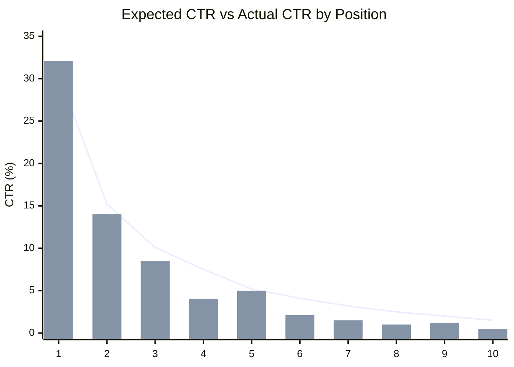
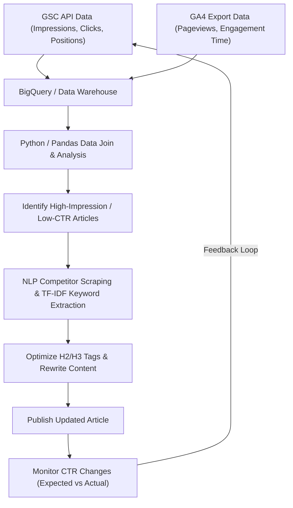

## 1. Introduction: The Importance of Rewriting in Tech Blogs and the Data-Driven Approach

When running a technical blog or a developer-oriented owned media, "rewriting past articles" is just as important as, or perhaps even more important than, continuously writing new articles. Especially in IT and technical topics, information becomes obsolete quickly, and it is not uncommon for code snippets or API specifications written a few years ago to be deprecated today. However, simply updating past articles blindly will not maximize traffic from search engines.

Therefore, this article explains an advanced strategy to drastically improve search rankings and click-through rates (CTR) by identifying technical articles that should be rewritten. We will use a data-driven and mathematical approach, leveraging data from **Google Search Console (GSC)** and **Google Analytics 4 (GA4)**.

Specifically, we will comprehensively cover everything from how to discover "missed opportunity articles" with low CTR relative to their impressions (display counts) by integrating GSC and GA4 data using Python and BigQuery, to how to efficiently fill content gaps by identifying keywords missing in H2 and H3 headings using TF-IDF analysis in NLP (Natural Language Processing).

---

## 2. Gap Analysis Between Expected CTR and Actual CTR (Introduction of a Mathematical Model)

One of the most fundamental metrics in SEO is the "Click-Through Rate (CTR) relative to search ranking". Generally, if a search ranking is 1st, the CTR is around 25-30%, for 2nd it is about 15%, and it drops sharply after that. This relationship between ranking and CTR can be modeled as a distribution following a Power Law.

It is known that the expected click-through rate $CTR(r)$ for ranking $r$ can be approximated by the following formula:

$$
CTR(r) = a \cdot r^{-b}
$$

Here, $a$ represents the expected CTR when ranked 1st (e.g., $0.30$ for 30%), and $b$ represents the decay parameter (generally between $1.0$ and $1.5$).

The most effective approach when selecting articles to rewrite is to **find articles (keywords) where the "actual CTR" falls significantly below this "expected CTR"**. For example, if a search ranking is 3rd (expected CTR of about 10%) but the actual CTR is only 2%, it is highly likely that either the search intent is misaligned with the title and description, or clicks are being stolen by competitive factors such as rich snippets.

The following graph is an image showing the divergence between expected CTR and actual CTR in a certain technical blog.



(* The line graph shows the expected CTR, and the bar graph shows the actual CTR. You can confirm that it falls significantly below at the 4th and 8th positions.)

---

## 3. Automatic Extraction of Search Performance Data Using GSC API (Python)

While it is possible to download CSVs from the GSC web UI for analysis, the best approach for large-scale blogs or continuous analysis is to build a system that automatically extracts data with Python using the GSC API.

Below is a Python snippet using `google-api-python-client` to retrieve page-level and query-level performance data (clicks, impressions, CTR, average position) over a specific period.

```python
import pandas as pd
from google.oauth2 import service_account
from googleapiclient.discovery import build

def get_gsc_data(key_path, site_url, start_date, end_date):
    # Load credentials and build API client
    credentials = service_account.Credentials.from_service_account_file(
        key_path, scopes=['https://www.googleapis.com/auth/webmasters.readonly']
    )
    service = build('searchconsole', 'v1', credentials=credentials)

    # Set API request payload (specify page and query as dimensions)
    request = {
        'startDate': start_date,
        'endDate': end_date,
        'dimensions': ['page', 'query'],
        'rowLimit': 25000
    }

    # Execute API
    response = service.searchanalytics().query(
        siteUrl=site_url, body=request
    ).execute()

    # Extract data from response and convert to Pandas DataFrame
    rows = response.get('rows', [])
    data = []
    for row in rows:
        keys = row['keys']
        data.append({
            'page': keys[0],
            'query': keys[1],
            'clicks': row['clicks'],
            'impressions': row['impressions'],
            'ctr': row['ctr'],
            'position': row['position']
        })
    
    return pd.DataFrame(data)

# Execution example
# df_gsc = get_gsc_data('credentials.json', 'https://kenji.blog/', '2026-08-01', '2026-08-31')
# print(df_gsc.head())
```

With this script, you can retrieve detailed data linking page URLs to search queries as a DataFrame. This makes it possible to comprehensively grasp what keywords are displaying a specific article.

---

## 4. Filtering Technical Keywords Using Regular Expressions (Regex)

An extremely powerful feature in analyzing technical blogs is GSC's **Regular Expression (Regex) filters**.
For example, if you write articles spanning diverse fields from frontend to backend and infrastructure, you might want to extract only "articles about errors or tutorials related to Python or Pandas" to prioritize rewriting.

Using GSC's custom regular expression filters allows you to narrow down queries with complex conditions.

**Examples of Technical Keyword Filtering:**
- Python-related error investigation: `^(python|pandas|numpy|matplotlib).* (error|exception|bug|not working)`
- AWS-related infrastructure setup: `(aws|amazon web services|ec2|s3|lambda).* (setup|configuration|tutorial|how to)`
- Version upgrades for specific libraries: `(react|vue|angular) (v17|v18|v3) (migration)`

When integrating this into a GSC API request, utilize `dimensionFilterGroups` to apply the regular expression conditions. By making full use of this filtering, you can pinpoint high-value, problem-solving keywords where developers are "currently stuck and searching for answers".

---

## 5. Integrating GA4 and GSC Data with BigQuery/Pandas

GSC data alone only reveals "search rankings and CTR". To know "how long users who reached the article actually stayed, and whether they achieved a conversion (e.g., navigating to a GitHub repository or signing up for a newsletter)", it needs to be integrated (JOINed) with **Google Analytics 4 (GA4)** data.

If you are storing GA4 export data and GSC bulk export data in BigQuery, you can use a SQL query like the following to combine both and extract articles that have "high impressions and decent search rankings, but a high bounce rate or short engagement time".

```sql
WITH gsc_data AS (
  SELECT
    url AS page_path,
    SUM(impressions) AS total_impressions,
    SUM(clicks) AS total_clicks,
    AVG(sum_top_position) AS avg_position
  FROM
    `project.searchconsole.searchdata_url_impression`
  WHERE
    data_date BETWEEN '2026-08-01' AND '2026-08-31'
  GROUP BY
    url
),
ga4_data AS (
  SELECT
    REGEXP_REPLACE(
      (SELECT value.string_value FROM UNNEST(event_params) WHERE key = 'page_location'),
      r'^https?://[^/]+', ''
    ) AS page_path,
    COUNT(DISTINCT user_pseudo_id) AS users,
    AVG((SELECT value.int_value FROM UNNEST(event_params) WHERE key = 'engagement_time_msec')) / 1000 AS avg_engagement_sec
  FROM
    `project.analytics_123456789.events_*`
  WHERE
    event_name = 'page_view'
  GROUP BY
    page_path
)

SELECT
  g.page_path,
  g.total_impressions,
  g.total_clicks,
  SAFE_DIVIDE(g.total_clicks, g.total_impressions) AS ctr,
  g.avg_position,
  a.users,
  a.avg_engagement_sec
FROM
  gsc_data g
JOIN
  ga4_data a ON g.page_path = a.page_path
WHERE
  g.total_impressions > 1000
  AND g.avg_position BETWEEN 3 AND 15
ORDER BY
  g.total_impressions DESC
```

Using these results, classify targets for rewriting with a matrix like the following:

1. **High Impression, Low CTR, High Engagement**:
   Articles where readers are satisfied as long as they click through from the search results. **Modifying the title and meta description** should be the top priority.
2. **High CTR, Low Engagement**:
   Articles that get clicked, but content is disappointing, causing users to leave. A large-scale rewrite of the main text is needed, such as **improving the lead paragraph, updating to the latest code, and enhancing information comprehensiveness (adding H2/H3)**.

---

## 6. Content Gap Analysis Using NLP and TF-IDF

Once the articles to be rewritten are identified, the next step is to analyze "specifically what headings (H2/H3) or keywords should be added". Rather than relying on intuition, we leverage **TF-IDF (Term Frequency-Inverse Document Frequency) in Natural Language Processing (NLP)**.

TF-IDF is a statistical measure used to evaluate how important a word is to a document within a collection.

$$
TF\text{-}IDF(t, d) = tf(t, d) \times \log\left(\frac{N}{df(t)}\right)
$$

Here,
- $tf(t, d)$ is the term frequency of word $t$ in document $d$
- $N$ is the total number of documents
- $df(t)$ is the number of documents containing the word $t$

**Approach:**
1. Obtain the text data of the top 10 articles (competitor sites) for the target keyword via scraping, etc.
2. Prepare the text data of the target article on your own site.
3. Using Python's `scikit-learn` `TfidfVectorizer`, extract keywords (feature words) that appear with high scores commonly across the top competitor articles, but are missing or have significantly low scores in your own site's article.

```python
from sklearn.feature_extraction.text import TfidfVectorizer
import pandas as pd
import numpy as np

# documents = [Text of own site, Text of competitor article 1, Text of competitor article 2, ...]
# Assuming a list of texts already tokenized (e.g., using morphological analysis like MeCab for Japanese)

def extract_missing_keywords(documents):
    vectorizer = TfidfVectorizer(max_df=0.9, min_df=2)
    tfidf_matrix = vectorizer.fit_transform(documents)
    
    feature_names = vectorizer.get_feature_names_out()
    
    # Calculate the average TF-IDF score of competitor articles (index 1 and onwards)
    competitor_mean_tfidf = np.mean(tfidf_matrix[1:].toarray(), axis=0)
    
    # Get the TF-IDF score of own site's article (index 0)
    my_article_tfidf = tfidf_matrix[0].toarray()[0]
    
    # Calculate the gap for words that are important to competitors but missing (or scarce) in your own site
    gap_scores = competitor_mean_tfidf - my_article_tfidf
    
    # Extract the top words with the largest gaps
    df_gap = pd.DataFrame({'keyword': feature_names, 'gap_score': gap_scores})
    df_gap = df_gap.sort_values(by='gap_score', ascending=False)
    
    return df_gap.head(20)

# Example: missing_keywords = extract_missing_keywords(processed_docs)
# print(missing_keywords)
```

Through this analysis, you can quantitatively discover **topic omissions (content gaps)**, such as "Top-ranking articles actually mention 'How to deploy to a Docker container' and 'Building a CI/CD pipeline', but my article doesn't touch on them".

The discovered important keywords shouldn't just be scattered throughout the text. Instead, they should be added as meaningful sections using **H2 or H3 headings (Heading tags)**, and by writing detailed technical explanations and code snippets for these headings, you can dramatically improve your Google evaluation.

---

## 7. Data Pipelines and Continuous Improvement Cycle

The processes explained so far are not meant to be executed just once. Building them into a pipeline for continuous execution is key to SEO success. Below is a Mermaid flowchart showing the overall architecture and operational flow.



By systematizing this entire flow—from data collection from GSC and GA4, target selection through analysis, content optimization via NLP, to result monitoring—a blog media becomes an asset that continues to grow automatically.

---

## 8. Conclusion and Future Outlook

Rewriting technical articles utilizing Google Search Console is not merely about correcting text. It is advanced engineering that presents optimal solutions to the black box of search engine algorithms by fully leveraging data and mathematical models.

To summarize the methods explained in this article:
1. Identify articles with a large potential impact for correction by calculating the **divergence between expected CTR and actual CTR**.
2. Automatically extract performance data using the **GSC API and Python**.
3. Join with GA4 engagement data on **BigQuery** to correct the main text of articles with high bounce rates.
4. Discover content gaps with competitors through **NLP analysis using TF-IDF** and optimize headings (H2/H3).

Technology trends are constantly changing. To accurately respond to the errors and challenges readers are currently facing, we highly recommend incorporating strategic rewriting backed by data into your daily operations.
