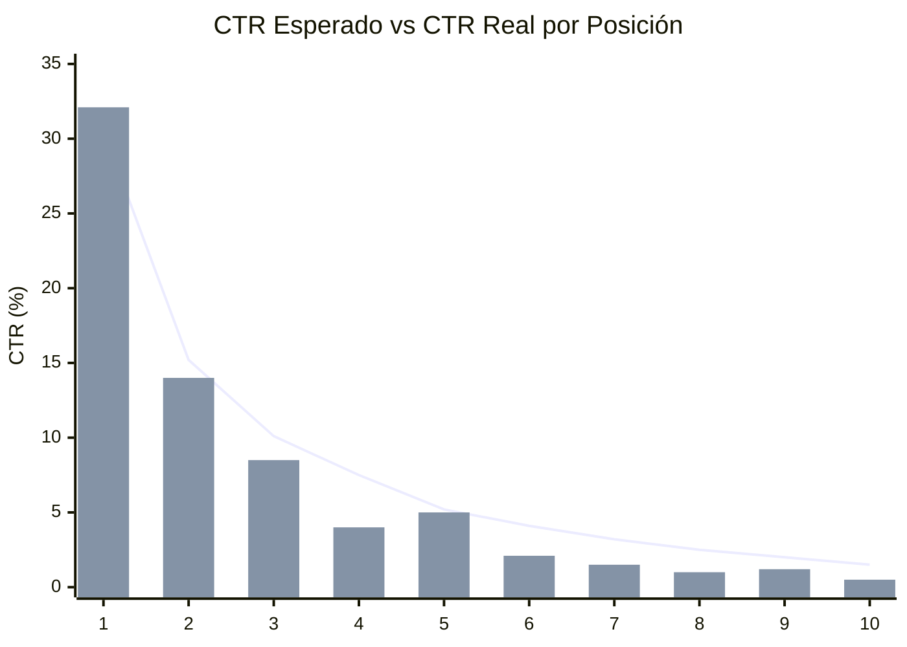
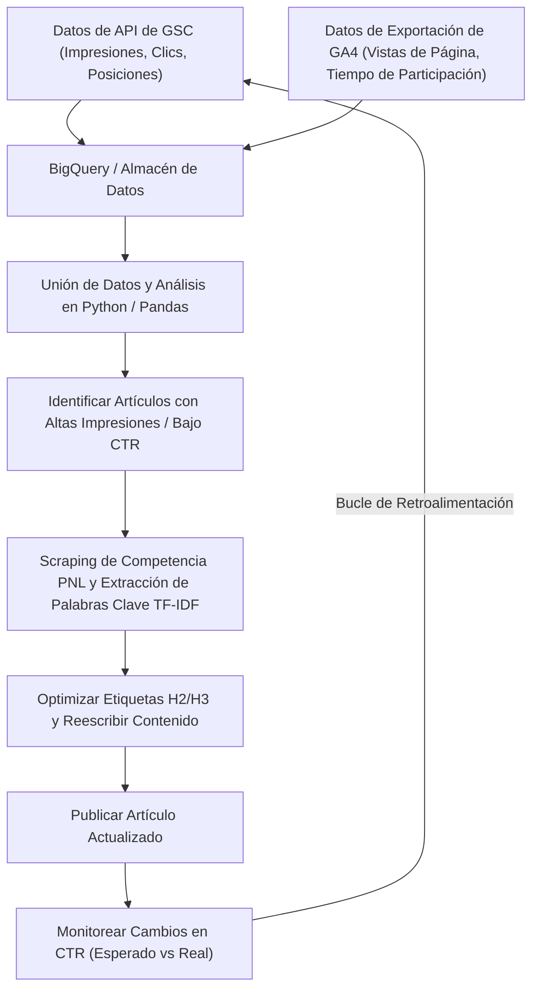

## 1. Introducción: La importancia de reescribir en blogs técnicos y el enfoque basado en datos

Al gestionar un blog técnico o medios propios para desarrolladores, "reescribir artículos pasados" es tan o más importante que la escritura continua de nuevos artículos. Especialmente en temas de TI y tecnología, la información se vuelve obsoleta rápidamente; no es raro que los fragmentos de código o las especificaciones de API escritos hace unos años estén ahora obsoletos (Deprecated). Sin embargo, simplemente actualizar ciegamente los artículos pasados no maximizará el tráfico (visitas) desde los motores de búsqueda.

Por lo tanto, en este artículo explicaremos una estrategia avanzada para identificar qué artículos técnicos se deben reescribir y mejorar drásticamente las clasificaciones de búsqueda y el porcentaje de clics (CTR) utilizando datos de **Google Search Console (GSC)** y **Google Analytics 4 (GA4)**, con un enfoque matemático y basado en datos.

Específicamente, cubriremos de manera exhaustiva todo, desde cómo integrar datos de GSC y GA4 usando Python o BigQuery para descubrir "artículos con pérdida de oportunidades" que tienen un CTR bajo en relación con el número de impresiones, hasta el uso del análisis TF-IDF de PNL (Procesamiento del Lenguaje Natural) para identificar palabras clave faltantes en los encabezados H2 y H3 y llenar eficientemente los vacíos de contenido.

---

## 2. Análisis de brechas entre el CTR esperado y el CTR real (Introducción al modelo matemático)

Uno de los indicadores más fundamentales en SEO es el "porcentaje de clics (CTR) frente a la clasificación de búsqueda". Generalmente, si la posición de búsqueda es el primer lugar, el CTR es de alrededor del 25-30%, en el segundo lugar es de aproximadamente el 15%, y disminuye drásticamente a partir de ahí. Esta relación entre la clasificación y el CTR se puede modelar como una distribución que sigue una ley de potencias (Power Law).

Se sabe que el porcentaje de clics esperado $CTR(r)$ para una clasificación $r$ se puede aproximar mediante la siguiente fórmula.

$$
CTR(r) = a \cdot r^{-b}
$$

Aquí, $a$ representa el CTR esperado cuando está en el primer lugar (por ejemplo, $0.30$ para 30%) y $b$ representa el parámetro de decaimiento (generalmente entre $1.0$ y $1.5$).

El enfoque más efectivo al seleccionar artículos para reescribir es **encontrar artículos (palabras clave) donde el "CTR real" esté significativamente por debajo de este "CTR esperado"**. Por ejemplo, si la posición de búsqueda es el 3er lugar (CTR esperado de aproximadamente 10%) pero el CTR real es solo del 2%, se puede determinar que es muy probable que haya una discrepancia entre la intención de búsqueda y el título/descripción, o que los factores de la competencia, como los fragmentos enriquecidos (rich snippets), estén robando los clics.

El siguiente gráfico es una imagen que muestra la discrepancia entre el CTR esperado y el CTR real en cierto blog técnico.



(* La gráfica de líneas muestra el CTR esperado y la gráfica de barras muestra el CTR real. Se puede confirmar que está significativamente por debajo en el 4º y 8º lugar.)

---

## 3. Extracción automática de datos de rendimiento de búsqueda utilizando la API de GSC (Python)

Si bien es posible descargar y analizar CSV desde la interfaz de usuario web de GSC, para blogs a gran escala o análisis continuos, lo mejor es construir un sistema que extraiga datos automáticamente en Python utilizando la API de GSC.

A continuación se muestra un fragmento de Python usando `google-api-python-client` para obtener datos de rendimiento por página y consulta (clics, impresiones, CTR, posición promedio) durante un período específico.

```python
import pandas as pd
from google.oauth2 import service_account
from googleapiclient.discovery import build

def get_gsc_data(key_path, site_url, start_date, end_date):
    # Cargar credenciales y construir el cliente API
    credentials = service_account.Credentials.from_service_account_file(
        key_path, scopes=['https://www.googleapis.com/auth/webmasters.readonly']
    )
    service = build('searchconsole', 'v1', credentials=credentials)

    # Configuración del payload de la solicitud API (especificando página y consulta como dimensiones)
    request = {
        'startDate': start_date,
        'endDate': end_date,
        'dimensions': ['page', 'query'],
        'rowLimit': 25000
    }

    # Ejecutar la API
    response = service.searchanalytics().query(
        siteUrl=site_url, body=request
    ).execute()

    # Extraer datos de la respuesta y convertirlos a un DataFrame de Pandas
    rows = response.get('rows', [])
    data = []
    for row in rows:
        keys = row['keys']
        data.append({
            'page': keys[0],
            'query': keys[1],
            'clicks': row['clicks'],
            'impressions': row['impressions'],
            'ctr': row['ctr'],
            'position': row['position']
        })
    
    return pd.DataFrame(data)

# Ejemplo de ejecución
# df_gsc = get_gsc_data('credentials.json', 'https://kenji.blog/', '2026-08-01', '2026-08-31')
# print(df_gsc.head())
```

Con este script, se pueden obtener datos detallados vinculando la URL de la página y las consultas de búsqueda como un DataFrame. Esto hace posible comprender de manera integral con qué palabras clave se muestran artículos específicos.

---

## 4. Filtrado de palabras clave técnicas mediante expresiones regulares (Regex)

Una característica muy poderosa al analizar blogs técnicos es el **filtro de expresiones regulares (Regex)** de GSC.
Por ejemplo, si escribe una amplia gama de artículos, desde frontend hasta backend e infraestructura, es posible que desee extraer solo "artículos de tutoriales o errores sobre Python o Pandas" y priorizar su reescritura.

El uso de filtros de expresiones regulares personalizados en GSC le permite refinar las consultas con condiciones complejas.

**Ejemplos de filtrado de palabras clave técnicas:**
- Investigación de errores relacionados con Python: `^(python|pandas|numpy|matplotlib).* (error|exception|bug|error|no funciona)`
- Construcción de infraestructura relacionada con AWS: `(aws|amazon web services|ec2|s3|lambda).* (construir|configurar|tutorial|tutorial|cómo hacer)`
- Actualizaciones de versión de una librería específica: `(react|vue|angular) (v17|v18|v3) (migration|migración|transición)`

Al incorporar esto a una solicitud de la API de GSC, utilice `dimensionFilterGroups` para aplicar condiciones de expresiones regulares. Al dominar este filtrado, se pueden identificar y extraer exactamente las palabras clave de alto valor orientadas a resolver problemas que los desarrolladores "están buscando en este momento por estar atascados".

---

## 5. Integración de datos de GA4 y GSC mediante BigQuery/Pandas

Solo con los datos de GSC, únicamente conocemos la "clasificación de búsqueda y el porcentaje de clics". Para saber "cuánto tiempo se quedó un usuario que llegó a ese artículo y si se convirtió (por ejemplo, al hacer la transición a un repositorio de GitHub o suscribirse al boletín de noticias)", es necesario integrar (JOIN) con los datos de **Google Analytics 4 (GA4)**.

Si almacena los datos de exportación de GA4 y los datos de exportación masiva de GSC en BigQuery, puede combinar ambos con una consulta SQL como la siguiente y extraer "artículos con muchas impresiones y clasificaciones de búsqueda decentes, pero con una alta tasa de rebote o un tiempo de interacción corto".

```sql
WITH gsc_data AS (
  SELECT
    url AS page_path,
    SUM(impressions) AS total_impressions,
    SUM(clicks) AS total_clicks,
    AVG(sum_top_position) AS avg_position
  FROM
    `project.searchconsole.searchdata_url_impression`
  WHERE
    data_date BETWEEN '2026-08-01' AND '2026-08-31'
  GROUP BY
    url
),
ga4_data AS (
  SELECT
    REGEXP_REPLACE(
      (SELECT value.string_value FROM UNNEST(event_params) WHERE key = 'page_location'),
      r'^https?://[^/]+', ''
    ) AS page_path,
    COUNT(DISTINCT user_pseudo_id) AS users,
    AVG((SELECT value.int_value FROM UNNEST(event_params) WHERE key = 'engagement_time_msec')) / 1000 AS avg_engagement_sec
  FROM
    `project.analytics_123456789.events_*`
  WHERE
    event_name = 'page_view'
  GROUP BY
    page_path
)

SELECT
  g.page_path,
  g.total_impressions,
  g.total_clicks,
  SAFE_DIVIDE(g.total_clicks, g.total_impressions) AS ctr,
  g.avg_position,
  a.users,
  a.avg_engagement_sec
FROM
  gsc_data g
JOIN
  ga4_data a ON g.page_path = a.page_path
WHERE
  g.total_impressions > 1000
  AND g.avg_position BETWEEN 3 AND 15
ORDER BY
  g.total_impressions DESC
```

Usando estos resultados, puede clasificar los artículos objetivo a reescribir con una matriz como esta:

1. **Alta impresión, bajo CTR, alta participación (Engagement)**:
   Artículos con los que los lectores están satisfechos si tan solo hicieran clic en los resultados de búsqueda. La principal prioridad debe ser **corregir el título y la metadescripción**.
2. **Alto CTR, baja participación (Engagement)**:
   Artículos en los que se hace clic, pero el contenido decepciona y los lectores abandonan la página. Requiere una reescritura importante del cuerpo principal, como **mejorar la introducción, actualizar con el código más reciente o aumentar la exhaustividad de la información (agregar H2/H3)**.

---

## 6. Análisis de brechas de contenido mediante PNL y TF-IDF

Una vez que se han identificado los artículos a reescribir, el siguiente paso es analizar "qué títulos específicos (H2/H3) o palabras clave deben agregarse". En lugar de confiar en la intuición aquí también, utilizaremos **TF-IDF (Frecuencia de término – frecuencia inversa de documento) en el Procesamiento del Lenguaje Natural (PNL)**.

TF-IDF es una estadística para evaluar qué tan importante es una palabra dentro de ese documento.

$$
TF\text{-}IDF(t, d) = tf(t, d) \times \log\left(\frac{N}{df(t)}\right)
$$

Donde:
- $tf(t, d)$ es la frecuencia de aparición de la palabra $t$ en el documento $d$
- $N$ es el número total de documentos
- $df(t)$ es el número de documentos en los que aparece la palabra $t$

**Enfoque:**
1. Obtener los datos de texto de los 10 artículos principales (sitios de la competencia) para la palabra clave objetivo usando scraping o similares.
2. Preparar los datos de texto del artículo objetivo de su propio sitio.
3. Usar `TfidfVectorizer` de `scikit-learn` en Python para extraer palabras clave (palabras características) que aparecen consistentemente con puntajes altos en los principales artículos competidores, pero que no existen o tienen un puntaje significativamente menor en el artículo de su propio sitio.

```python
from sklearn.feature_extraction.text import TfidfVectorizer
import pandas as pd
import numpy as np

# documents = [Texto del propio sitio, Texto del competidor 1, Texto del competidor 2, ...]
# Aquí se asume una lista de textos ya segmentados mediante análisis morfológico (MeCab, etc.) para japonés

def extract_missing_keywords(documents):
    vectorizer = TfidfVectorizer(max_df=0.9, min_df=2)
    tfidf_matrix = vectorizer.fit_transform(documents)
    
    feature_names = vectorizer.get_feature_names_out()
    
    # Calcular la puntuación TF-IDF media de los artículos competidores (índice 1 en adelante)
    competitor_mean_tfidf = np.mean(tfidf_matrix[1:].toarray(), axis=0)
    
    # Obtener la puntuación TF-IDF del artículo propio (índice 0)
    my_article_tfidf = tfidf_matrix[0].toarray()[0]
    
    # Calcular la brecha de las palabras que son importantes en la competencia pero faltan (o son pocas) en el sitio propio
    gap_scores = competitor_mean_tfidf - my_article_tfidf
    
    # Extraer las palabras principales con la brecha más grande
    df_gap = pd.DataFrame({'keyword': feature_names, 'gap_score': gap_scores})
    df_gap = df_gap.sort_values(by='gap_score', ascending=False)
    
    return df_gap.head(20)

# Ejemplo: missing_keywords = extract_missing_keywords(processed_docs)
# print(missing_keywords)
```

A través de este análisis, puede descubrir cuantitativamente **omisiones temáticas (brechas de contenido)** como: "En realidad, los principales artículos mencionan 'cómo implementar en contenedores Docker' o 'cómo construir canalizaciones CI/CD', pero mi artículo no lo aborda".

Las palabras clave importantes descubiertas no solo deben dispersarse en el cuerpo principal, sino que al agregarlas como secciones significativas como **títulos H2 o H3 (etiquetas de encabezado)** y escribir explicaciones técnicas detalladas y fragmentos de código para ellas, puede mejorar drásticamente su calificación en Google.

---

## 7. Flujo de datos y ciclo de mejora continua

El proceso explicado hasta ahora no es algo que se haga una vez y se acabe, sino que la clave del éxito en SEO es canalizarlo y ejecutarlo de forma continua. A continuación, se muestra la arquitectura general y el flujo operativo en un diagrama de flujo de Mermaid.



De esta manera, mediante la sistematización de la serie de pasos desde la recopilación de datos de GSC y GA4, la selección de objetivos a través del análisis, la optimización de contenido mediante PNL y la supervisión de resultados, los medios de un blog se convierten en un activo que sigue creciendo automáticamente.

---

## 8. Conclusión y perspectivas a futuro

Reescribir artículos técnicos utilizando Google Search Console no se trata simplemente de editar el texto. Es una ingeniería avanzada para presentar la solución óptima utilizando datos y modelos matemáticos a la caja negra que es el algoritmo del motor de búsqueda.

Se resumen a continuación los métodos explicados en este artículo:
1. Calcular la discrepancia entre el **CTR esperado y el CTR real** para identificar los artículos donde la corrección tendrá un gran impacto.
2. Extraer automáticamente los datos de rendimiento mediante la **API de GSC y Python**.
3. Unir los datos con el engagement de GA4 en **BigQuery** y revisar el cuerpo del texto de los artículos con altas tasas de rebote.
4. Mediante el **análisis PNL usando TF-IDF**, descubrir brechas de contenido con respecto a los competidores y optimizar los encabezados (H2/H3).

Las tendencias tecnológicas cambian constantemente. Para responder con precisión a los errores y problemas que tienen los lectores en este momento, considere incorporar estrategias de reescritura basadas en datos en sus operaciones diarias.
