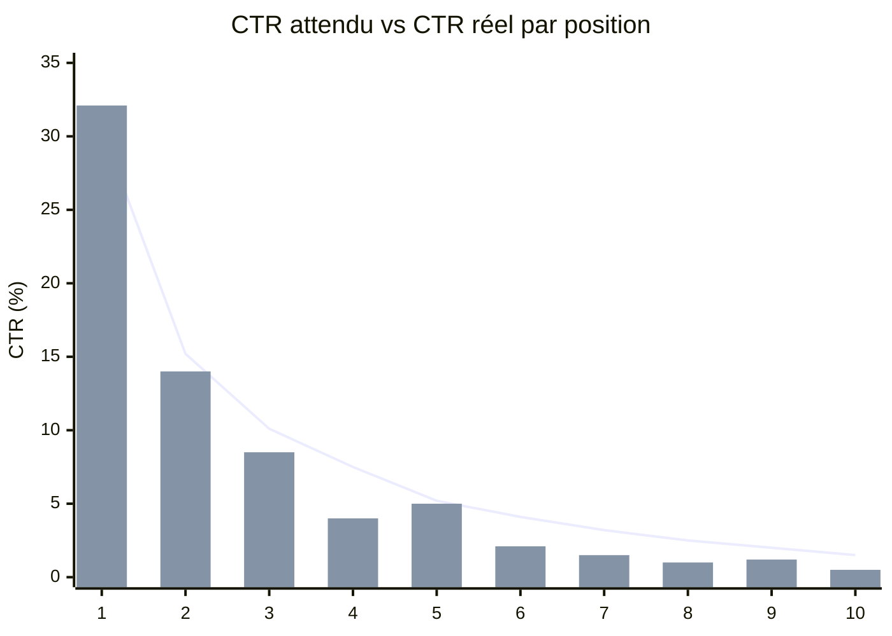
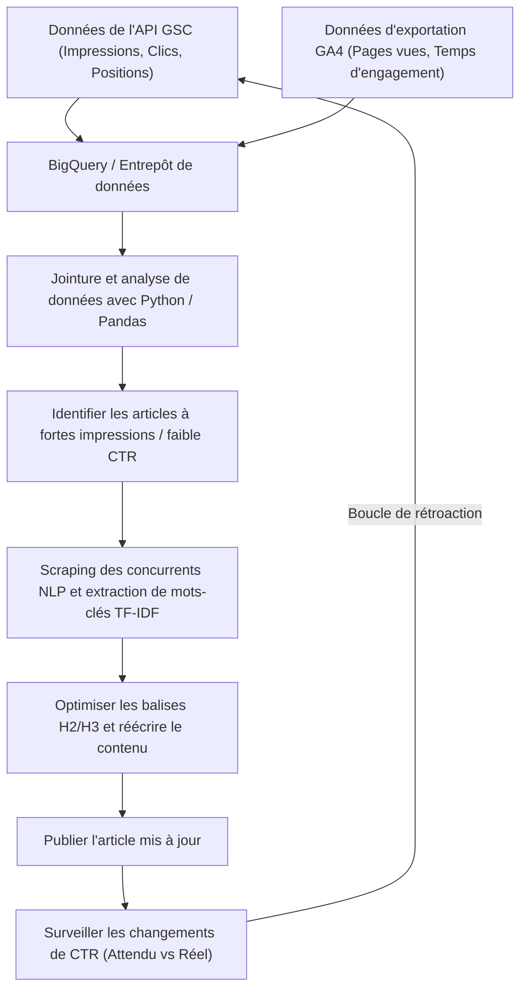

## 1. Introduction : L'importance de la réécriture dans les blogs techniques et l'approche axée sur les données

Lors de la gestion d'un blog technique ou d'un média propriétaire pour les développeurs, la réécriture d'articles passés est tout aussi importante, voire plus, que la rédaction continue de nouveaux articles. En particulier pour les sujets liés à l'informatique et à la technologie, l'information devient rapidement obsolète, et il n'est pas rare que des extraits de code ou des spécifications d'API écrits il y a quelques années soient désormais obsolètes (Deprecated). Cependant, le simple fait de mettre à jour aveuglément les articles passés ne permet pas de maximiser le trafic (afflux) en provenance des moteurs de recherche.

Dans cet article, nous utiliserons les données de **Google Search Console (GSC)** et **Google Analytics 4 (GA4)**, et emploierons une approche basée sur les données et mathématique pour identifier les articles techniques qui doivent être réécrits. Nous expliquerons une stratégie avancée pour améliorer considérablement le classement de recherche et le taux de clics (CTR).

Plus précisément, de l'intégration des données de GSC et GA4 à l'aide de Python et BigQuery pour découvrir des « articles d'opportunité perdue » avec un CTR faible par rapport aux impressions (nombre d'affichages), jusqu'à l'utilisation de l'analyse TF-IDF de la NLP (traitement du langage naturel) pour identifier les mots-clés manquants dans les titres H2 ou H3, nous couvrirons de manière exhaustive les méthodes pour combler efficacement les lacunes de contenu.

---

## 2. Analyse de l'écart entre le CTR attendu et le CTR réel (Introduction de modèles mathématiques)

L'un des indicateurs les plus fondamentaux du SEO est le « taux de clics par rapport au classement de recherche (CTR) ». En général, la nature est que le CTR est d'environ 25 à 30 % pour un classement de recherche de 1ère place, d'environ 15 % pour la 2ème place, et diminue fortement par la suite. Cette relation entre le classement et le CTR peut être modélisée comme une distribution obéissant à une loi de puissance (Power Law).

On sait que le taux de clics attendu $CTR(r)$ pour le classement $r$ est approximé par la formule suivante :

$$
CTR(r) = a \cdot r^{-b}
$$

Ici, $a$ représente le CTR attendu à la 1ère place (par exemple : $0.30$ pour 30 %), et $b$ représente le paramètre d'atténuation (généralement entre $1.0$ et $1.5$).

L'approche la plus efficace lors de la sélection des articles cibles pour la réécriture est de **trouver les articles (mots-clés) dont le « CTR réel » est nettement inférieur à ce « CTR attendu »**. Par exemple, si le classement de recherche est 3ème (CTR attendu d'environ 10 %) mais que le CTR réel n'est que de 2 %, il est fort probable qu'il y ait un décalage entre l'intention de recherche et le titre/la description, ou que les clics soient volés par des facteurs concurrentiels tels que les extraits enrichis (rich snippets).

Le graphique ci-dessous est une image montrant l'écart entre le CTR attendu et le CTR réel dans un certain blog technique.



(※ Le graphique linéaire indique le CTR attendu et le graphique à barres indique le CTR réel. On peut constater qu'il est nettement inférieur aux 4ème et 8ème places.)

---

## 3. Extraction automatique des données de performances de recherche à l'aide de l'API GSC (Python)

Bien qu'il soit possible de télécharger des fichiers CSV à partir de l'interface Web de GSC pour les analyser, pour les blogs à grande échelle ou les analyses continues, il est préférable de créer un système pour extraire automatiquement les données avec Python à l'aide de l'API GSC.

Vous trouverez ci-dessous un extrait Python utilisant `google-api-python-client` pour obtenir les données de performances (clics, impressions, CTR, position moyenne) par page et par requête pour une période donnée.

```python
import pandas as pd
from google.oauth2 import service_account
from googleapiclient.discovery import build

def get_gsc_data(key_path, site_url, start_date, end_date):
    # Chargement des informations d'identification et construction du client API
    credentials = service_account.Credentials.from_service_account_file(
        key_path, scopes=['https://www.googleapis.com/auth/webmasters.readonly']
    )
    service = build('searchconsole', 'v1', credentials=credentials)

    # Configuration de la charge utile de la requête API (spécification de la page et de la requête comme dimensions)
    request = {
        'startDate': start_date,
        'endDate': end_date,
        'dimensions': ['page', 'query'],
        'rowLimit': 25000
    }

    # Exécution de l'API
    response = service.searchanalytics().query(
        siteUrl=site_url, body=request
    ).execute()

    # Extraction des données à partir de la réponse et conversion en Pandas DataFrame
    rows = response.get('rows', [])
    data = []
    for row in rows:
        keys = row['keys']
        data.append({
            'page': keys[0],
            'query': keys[1],
            'clicks': row['clicks'],
            'impressions': row['impressions'],
            'ctr': row['ctr'],
            'position': row['position']
        })
    
    return pd.DataFrame(data)

# Exemple d'exécution
# df_gsc = get_gsc_data('credentials.json', 'https://kenji.blog/', '2026-08-01', '2026-08-31')
# print(df_gsc.head())
```

Avec ce script, vous pouvez obtenir des données détaillées liées aux URL de page et aux requêtes de recherche sous forme de DataFrame. Cela permet de comprendre de manière exhaustive avec quels mots-clés un article spécifique est affiché.

---

## 4. Filtrage des mots-clés techniques à l'aide d'expressions régulières (Regex)

Une fonctionnalité très puissante dans l'analyse de blogs techniques est le **filtre d'expression régulière (Regex)** de GSC.
Par exemple, si vous écrivez des articles sur un large éventail de sujets, du front-end au back-end en passant par l'infrastructure, vous voudrez peut-être extraire uniquement les « articles sur les erreurs ou tutoriels concernant Python ou Pandas » pour déterminer la priorité de réécriture.

À l'aide des filtres d'expressions régulières personnalisés de GSC, vous pouvez affiner les requêtes avec des conditions complexes.

**Exemples réels de filtrage de mots-clés techniques :**
- Enquête sur les erreurs liées à Python : `^(python|pandas|numpy|matplotlib).* (error|exception|bug|erreur|panne)`
- Construction d'infrastructure liée à AWS : `(aws|amazon web services|ec2|s3|lambda).* (construction|configuration|tutoriel|tutorial|how to)`
- Mise à jour de version d'une bibliothèque spécifique : `(react|vue|angular) (v17|v18|v3) (migration|mise à niveau|transition)`

Lors de l'intégration de cela dans une requête API GSC, utilisez `dimensionFilterGroups` pour appliquer des conditions d'expression régulière. En utilisant pleinement ce filtrage, vous pouvez extraire précisément des mots-clés de type résolution de problèmes de grande valeur pour lesquels les développeurs « cherchent des solutions parce qu'ils sont bloqués en ce moment ».

---

## 5. Intégration des données GA4 et GSC avec BigQuery/Pandas

Les données GSC seules ne fournissent que le « classement de recherche et le taux de clics ». Pour savoir « combien de temps les utilisateurs qui sont arrivés sur cet article y sont restés et s'ils ont converti (par exemple, passage à un dépôt GitHub, abonnement à une newsletter, etc.) », vous devez les intégrer (JOIN) avec les données de **Google Analytics 4 (GA4)**.

Si vous stockez les données d'exportation de GA4 et les données d'exportation en masse de GSC dans BigQuery, vous pouvez utiliser une requête SQL comme la suivante pour combiner les deux et extraire les articles avec « beaucoup d'impressions et un classement de recherche décent, mais avec un taux de rebond élevé ou un temps d'engagement court ».

```sql
WITH gsc_data AS (
  SELECT
    url AS page_path,
    SUM(impressions) AS total_impressions,
    SUM(clicks) AS total_clicks,
    AVG(sum_top_position) AS avg_position
  FROM
    `project.searchconsole.searchdata_url_impression`
  WHERE
    data_date BETWEEN '2026-08-01' AND '2026-08-31'
  GROUP BY
    url
),
ga4_data AS (
  SELECT
    REGEXP_REPLACE(
      (SELECT value.string_value FROM UNNEST(event_params) WHERE key = 'page_location'),
      r'^https?://[^/]+', ''
    ) AS page_path,
    COUNT(DISTINCT user_pseudo_id) AS users,
    AVG((SELECT value.int_value FROM UNNEST(event_params) WHERE key = 'engagement_time_msec')) / 1000 AS avg_engagement_sec
  FROM
    `project.analytics_123456789.events_*`
  WHERE
    event_name = 'page_view'
  GROUP BY
    page_path
)

SELECT
  g.page_path,
  g.total_impressions,
  g.total_clicks,
  SAFE_DIVIDE(g.total_clicks, g.total_impressions) AS ctr,
  g.avg_position,
  a.users,
  a.avg_engagement_sec
FROM
  gsc_data g
JOIN
  ga4_data a ON g.page_path = a.page_path
WHERE
  g.total_impressions > 1000
  AND g.avg_position BETWEEN 3 AND 15
ORDER BY
  g.total_impressions DESC
```

En utilisant ce résultat, nous classerons les cibles de réécriture avec la matrice suivante.

1. **High Impression, Low CTR, High Engagement** :
   Tant qu'il est cliqué dans les résultats de recherche, les lecteurs sont satisfaits de l'article. La priorité absolue doit être donnée à la **correction du titre et de la méta description** uniquement.
2. **High CTR, Low Engagement** :
   Il reçoit des clics, mais le contenu déçoit et les utilisateurs quittent la page. Une réécriture majeure du corps de l'article est nécessaire, comme **l'amélioration de l'introduction, la mise à jour avec le code le plus récent et l'amélioration de l'exhaustivité des informations (ajout de H2/H3)**.

---

## 6. Analyse des lacunes de contenu avec la NLP et le TF-IDF

Une fois les articles à réécrire identifiés, la prochaine étape est d'analyser « quels titres (H2/H3) et mots-clés spécifiques devraient être ajoutés ». Ici aussi, au lieu de nous fier à l'intuition, nous utiliserons le **TF-IDF (Term Frequency-Inverse Document Frequency) en traitement du langage naturel (NLP)**.

Le TF-IDF est une statistique permettant d'évaluer l'importance d'un mot au sein d'un document.

$$
TF\text{-}IDF(t, d) = tf(t, d) \times \log\left(\frac{N}{df(t)}\right)
$$

Où,
- $tf(t, d)$ est la fréquence d'apparition du mot $t$ dans le document $d$
- $N$ est le nombre total de documents
- $df(t)$ est le nombre de documents dans lesquels le mot $t$ apparaît

**Approche :**
1. Obtenez les données textuelles des 10 meilleurs articles (sites concurrents) pour le mot-clé cible, via le web scraping par exemple.
2. Préparez les données textuelles de l'article cible de votre propre site.
3. À l'aide du `TfidfVectorizer` de `scikit-learn` en Python, extrayez les mots-clés (mots caractéristiques) qui apparaissent avec un score élevé en commun parmi les meilleurs articles concurrents, mais qui n'existent pas dans l'article de votre site, ou qui ont un score significativement plus bas.

```python
from sklearn.feature_extraction.text import TfidfVectorizer
import pandas as pd
import numpy as np

# documents = [Texte de votre propre site, Texte de l'article concurrent 1, Texte de l'article concurrent 2, ...]
# Ici, nous supposons une liste de textes qui ont déjà été tokenisés pour l'analyse morphologique (MeCab, etc.)

def extract_missing_keywords(documents):
    vectorizer = TfidfVectorizer(max_df=0.9, min_df=2)
    tfidf_matrix = vectorizer.fit_transform(documents)
    
    feature_names = vectorizer.get_feature_names_out()
    
    # Calculer le score TF-IDF moyen des articles concurrents (index 1 et suivants)
    competitor_mean_tfidf = np.mean(tfidf_matrix[1:].toarray(), axis=0)
    
    # Obtenir le score TF-IDF de l'article de votre propre site (index 0)
    my_article_tfidf = tfidf_matrix[0].toarray()[0]
    
    # Calculer l'écart des mots qui sont importants pour les concurrents, mais absents (ou rares) sur votre site
    gap_scores = competitor_mean_tfidf - my_article_tfidf
    
    # Extraire les meilleurs mots avec un écart important
    df_gap = pd.DataFrame({'keyword': feature_names, 'gap_score': gap_scores})
    df_gap = df_gap.sort_values(by='gap_score', ascending=False)
    
    return df_gap.head(20)

# Exemple : missing_keywords = extract_missing_keywords(processed_docs)
# print(missing_keywords)
```

Grâce à cette analyse, vous pouvez découvrir quantitativement **des omissions de sujets (lacunes de contenu)**, comme « En fait, les meilleurs articles mentionnent également 'comment déployer sur des conteneurs Docker' et 'la construction de pipelines CI/CD', mais mon article ne l'aborde pas ».

Au lieu de simplement disperser les mots-clés importants découverts dans le texte, l'ajout de sections significatives en tant que **titres H2 ou H3 (balises de titre)** et la rédaction d'explications techniques détaillées et d'extraits de code pour ces titres peuvent améliorer considérablement l'évaluation de Google.

---

## 7. Pipeline de données et cycle d'amélioration continue

Les processus expliqués jusqu'à présent ne sont pas quelque chose que vous faites une fois et que vous terminez. En faire un pipeline et l'exécuter en continu est la clé du succès SEO. L'architecture globale et le flux opérationnel sont présentés ci-dessous dans un organigramme Mermaid.



En systématisant cette série d'étapes : de la collecte de données à partir de GSC et GA4, la sélection des cibles par l'analyse, l'optimisation du contenu par la NLP, jusqu'au suivi des résultats, votre média de blog deviendra un atout qui continuera à se développer automatiquement.

---

## 8. Conclusion et perspectives futures

La réécriture d'articles techniques à l'aide de Google Search Console n'est pas une simple correction de texte. C'est une ingénierie avancée qui utilise des données et des modèles mathématiques pour présenter des solutions optimales face à la boîte noire qu'est l'algorithme du moteur de recherche.

Pour résumer les méthodes expliquées dans cet article :
1. Calculer **l'écart entre le CTR attendu et le CTR réel** pour identifier les articles dont la modification aura un impact important.
2. Extraire automatiquement les données de performances en utilisant **l'API GSC et Python**.
3. Combiner cela avec les données d'engagement de GA4 sur **BigQuery** et corriger le corps des articles ayant un taux de rebond élevé.
4. Découvrir les lacunes de contenu avec les concurrents par **l'analyse NLP utilisant le TF-IDF**, et optimiser les titres (H2/H3).

Les tendances technologiques changent constamment. Afin de répondre avec précision aux erreurs et aux défis auxquels vos lecteurs sont actuellement confrontés, nous vous encourageons à intégrer une réécriture stratégique, avec les données de votre côté, dans vos opérations quotidiennes.
