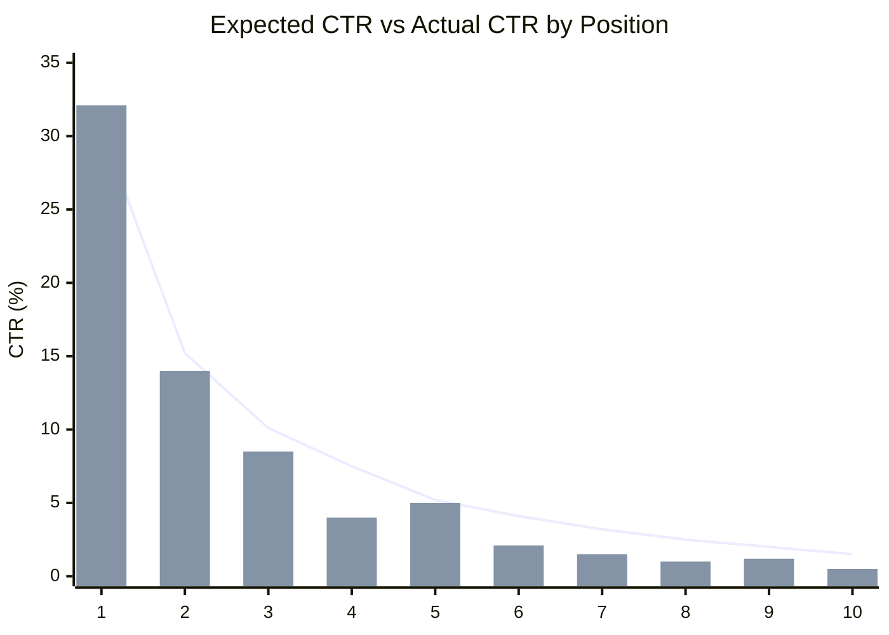
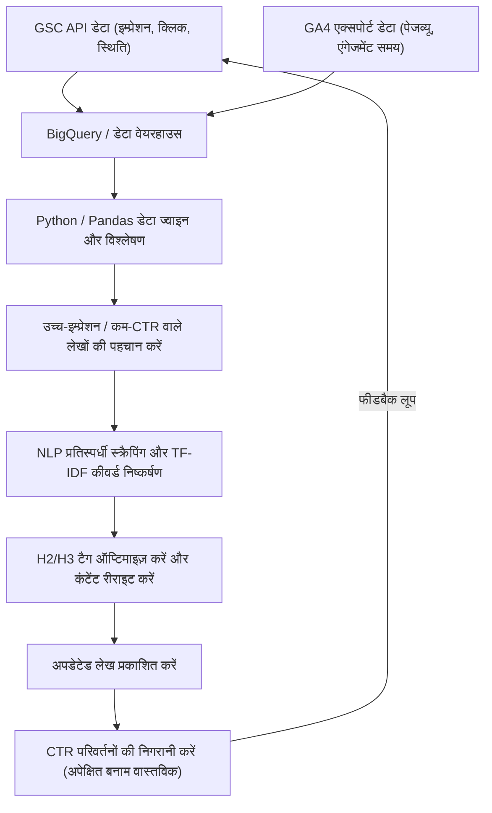

## 1. परिचय: तकनीकी ब्लॉग में रीराइट का महत्व और डेटा-संचालित दृष्टिकोण

तकनीकी ब्लॉग या डेवलपर्स के लिए ओन्ड मीडिया (owned media) चलाते समय, "पिछले लेखों को फिर से लिखना" (रीराइट) नए लेखों को लगातार लिखने के समान या उससे भी अधिक महत्वपूर्ण है। विशेष रूप से IT और तकनीक से जुड़े विषयों में जानकारी बहुत जल्दी पुरानी हो जाती है, और यह कोई असामान्य बात नहीं है कि कुछ साल पहले लिखे गए कोड स्निपेट या API विनिर्देश (specifications) अब अप्रचलित (Deprecated) हो गए हों। हालांकि, केवल पिछले लेखों को बिना सोचे-समझे अपडेट करने से सर्च इंजन से आने वाले ट्रैफ़िक को अधिकतम नहीं किया जा सकता है।

इसलिए, इस लेख में, हम **Google Search Console (इसके बाद GSC)** और **Google Analytics 4 (GA4)** के डेटा का उपयोग करते हुए, डेटा-संचालित और गणितीय दृष्टिकोण के माध्यम से यह पहचानने की एक उन्नत रणनीति की व्याख्या करेंगे कि किन तकनीकी लेखों को फिर से लिखा जाना चाहिए, और सर्च रैंकिंग तथा क्लिक-थ्रू रेट (CTR) में नाटकीय रूप से कैसे सुधार किया जाए।

विशेष रूप से, हम Python और BigQuery का उपयोग करके GSC और GA4 डेटा को एकीकृत करने, कम CTR वाले "अवसर खोने वाले लेखों" को खोजने, और NLP (प्राकृतिक भाषा प्रसंस्करण) के TF-IDF विश्लेषण का उपयोग करके H2 या H3 शीर्षकों में गायब कीवर्ड की पहचान कर कुशलतापूर्वक कंटेंट गैप को भरने के तरीकों पर विस्तार से चर्चा करेंगे।

---

## 2. अपेक्षित CTR और वास्तविक CTR के बीच अंतर का विश्लेषण (गणितीय मॉडल का परिचय)

SEO में सबसे बुनियादी मेट्रिक्स में से एक "सर्च रैंकिंग के संबंध में क्लिक-थ्रू रेट (CTR)" है। आम तौर पर, सर्च रैंकिंग में पहले स्थान पर होने पर CTR लगभग 25-30% होता है, दूसरे स्थान पर लगभग 15% होता है, और उसके बाद यह तेजी से कम होने लगता है। रैंकिंग और CTR के बीच इस संबंध को पावर लॉ (Power Law) के अनुसार एक वितरण के रूप में मॉडल किया जा सकता है।

रैंकिंग $r$ के लिए अपेक्षित क्लिक-थ्रू रेट $CTR(r)$ को निम्नलिखित गणितीय सूत्र द्वारा अनुमानित किया जाता है।

$$
CTR(r) = a \cdot r^{-b}
$$

यहाँ, $a$ पहले स्थान पर होने पर अपेक्षित CTR को दर्शाता है (उदाहरण: 30% के मामले में $0.30$), और $b$ क्षय पैरामीटर (decay parameter) (आमतौर पर $1.0$ और $1.5$ के बीच) को दर्शाता है।

रीराइट किए जाने वाले लेखों का चयन करते समय सबसे प्रभावी दृष्टिकोण यह है कि **उन लेखों (कीवर्ड्स) का पता लगाया जाए जहाँ "वास्तविक CTR" इस "अपेक्षित CTR" से काफी कम है**। उदाहरण के लिए, यदि सर्च रैंकिंग तीसरा स्थान है (अपेक्षित CTR लगभग 10%) लेकिन वास्तविक CTR केवल 2% है, तो यह माना जा सकता है कि सर्च इंटेंट (search intent) और टाइटल/डिस्क्रिप्शन के बीच कोई बेमेल है, या रिच स्निपेट्स (rich snippets) जैसे प्रतिस्पर्धी कारकों के कारण क्लिक छिन रहे हैं।

नीचे दिया गया ग्राफ एक तकनीकी ब्लॉग में अपेक्षित CTR और वास्तविक CTR के बीच के अंतर को दर्शाता है।



(※ रेखा अपेक्षित CTR को दर्शाती है, और बार ग्राफ वास्तविक CTR को दर्शाता है। आप देख सकते हैं कि यह चौथे और आठवें स्थान पर काफी कम है।)

---

## 3. GSC API का उपयोग करके सर्च प्रदर्शन डेटा का स्वचालित निष्कर्षण (Python)

हालांकि GSC के वेब UI से CSV डाउनलोड करके विश्लेषण करना संभव है, लेकिन बड़े ब्लॉग या निरंतर विश्लेषण के लिए, GSC API का उपयोग करके Python में स्वचालित रूप से डेटा निकालने के लिए एक सिस्टम बनाना सबसे अच्छा है।

नीचे एक Python स्निपेट दिया गया है जो `google-api-python-client` का उपयोग करके एक विशिष्ट अवधि के लिए पेज और क्वेरी-विशिष्ट प्रदर्शन डेटा (क्लिक, इम्प्रेशन, CTR, औसत रैंकिंग) प्राप्त करता है।

```python
import pandas as pd
from google.oauth2 import service_account
from googleapiclient.discovery import build

def get_gsc_data(key_path, site_url, start_date, end_date):
    # क्रेडेंशियल लोड करें और API क्लाइंट बनाएँ
    credentials = service_account.Credentials.from_service_account_file(
        key_path, scopes=['https://www.googleapis.com/auth/webmasters.readonly']
    )
    service = build('searchconsole', 'v1', credentials=credentials)

    # API रिक्वेस्ट पेलोड सेट करें (पेज और क्वेरी को डायमेंशन के रूप में निर्दिष्ट करें)
    request = {
        'startDate': start_date,
        'endDate': end_date,
        'dimensions': ['page', 'query'],
        'rowLimit': 25000
    }

    # API निष्पादित करें
    response = service.searchanalytics().query(
        siteUrl=site_url, body=request
    ).execute()

    # प्रतिक्रिया से डेटा निकालें और Pandas DataFrame में बदलें
    rows = response.get('rows', [])
    data = []
    for row in rows:
        keys = row['keys']
        data.append({
            'page': keys[0],
            'query': keys[1],
            'clicks': row['clicks'],
            'impressions': row['impressions'],
            'ctr': row['ctr'],
            'position': row['position']
        })
    
    return pd.DataFrame(data)

# निष्पादन उदाहरण
# df_gsc = get_gsc_data('credentials.json', 'https://kenji.blog/', '2026-08-01', '2026-08-31')
# print(df_gsc.head())
```

इस स्क्रिप्ट के साथ, आप पेज URL और सर्च क्वेरी से जुड़ा विस्तृत डेटा DataFrame के रूप में प्राप्त कर सकते हैं। इससे यह समझना संभव हो जाता है कि कोई विशिष्ट लेख किन कीवर्ड्स के लिए प्रदर्शित हो रहा है।

---

## 4. रेगुलर एक्सप्रेशन (Regex) का उपयोग करके तकनीकी कीवर्ड फ़िल्टर करना

तकनीकी ब्लॉगों का विश्लेषण करते समय GSC का **रेगुलर एक्सप्रेशन (Regex) फ़िल्टर** एक बहुत ही शक्तिशाली फीचर है।
उदाहरण के लिए, यदि आप फ्रंट-एंड से लेकर बैक-एंड और इंफ्रास्ट्रक्चर तक कई तरह के लेख लिख रहे हैं, तो आप केवल "Python या Pandas से संबंधित त्रुटियों या ट्यूटोरियल वाले लेखों" को निकालकर रीराइट प्राथमिकता तय करना चाह सकते हैं।

GSC के कस्टम रेगुलर एक्सप्रेशन फ़िल्टर का उपयोग करके, आप क्वेरी को जटिल शर्तों के साथ कम कर सकते हैं।

**तकनीकी कीवर्ड फ़िल्टरिंग का उदाहरण:**
- Python-संबंधित त्रुटि जांच: `^(python|pandas|numpy|matplotlib).* (error|exception|bug|त्रुटि|काम नहीं कर रहा)`
- AWS-संबंधित इंफ्रास्ट्रक्चर निर्माण: `(aws|amazon web services|ec2|s3|lambda).* (निर्माण|सेटिंग|ट्यूटोरियल|tutorial|how to)`
- विशिष्ट लाइब्रेरी का वर्शन अपग्रेड: `(react|vue|angular) (v17|v18|v3) (migration|माइग्रेशन|स्थानांतरण)`

जब आप इसे GSC API रिक्वेस्ट में शामिल करते हैं, तो रेगुलर एक्सप्रेशन की शर्तें लागू करने के लिए `dimensionFilterGroups` का उपयोग करें। इस फ़िल्टरिंग का उपयोग करके, आप सटीक रूप से उन मूल्यवान समस्या-समाधान कीवर्ड्स को निकाल सकते हैं जिनके लिए डेवलपर्स "अभी परेशानी में हैं और खोज रहे हैं"।

---

## 5. BigQuery/Pandas के साथ GA4 और GSC डेटा का एकीकरण

केवल GSC डेटा के साथ, आप केवल "सर्च रैंकिंग और क्लिक-थ्रू रेट" ही जान सकते हैं। यह जानने के लिए कि "उस लेख तक पहुँचने वाले उपयोगकर्ताओं ने वास्तव में कितना समय बिताया, और क्या वे रूपांतरण (conversion) (उदाहरण: GitHub रिपॉजिटरी में जाना या न्यूज़लेटर की सदस्यता लेना) तक पहुँचे," आपको **Google Analytics 4 (GA4)** डेटा के साथ एकीकृत (JOIN) करने की आवश्यकता है।

यदि आपने GA4 एक्सपोर्ट डेटा और GSC बल्क एक्सपोर्ट डेटा को BigQuery में संग्रहीत किया है, तो आप निम्नलिखित SQL क्वेरी के साथ दोनों को जोड़ सकते हैं, और उन लेखों को निकाल सकते हैं "जिनमें इम्प्रेशन अधिक हैं, सर्च रैंकिंग उचित रूप से उच्च है, लेकिन बाउंस रेट उच्च है या एंगेजमेंट समय कम है।"

```sql
WITH gsc_data AS (
  SELECT
    url AS page_path,
    SUM(impressions) AS total_impressions,
    SUM(clicks) AS total_clicks,
    AVG(sum_top_position) AS avg_position
  FROM
    `project.searchconsole.searchdata_url_impression`
  WHERE
    data_date BETWEEN '2026-08-01' AND '2026-08-31'
  GROUP BY
    url
),
ga4_data AS (
  SELECT
    REGEXP_REPLACE(
      (SELECT value.string_value FROM UNNEST(event_params) WHERE key = 'page_location'),
      r'^https?://[^/]+', ''
    ) AS page_path,
    COUNT(DISTINCT user_pseudo_id) AS users,
    AVG((SELECT value.int_value FROM UNNEST(event_params) WHERE key = 'engagement_time_msec')) / 1000 AS avg_engagement_sec
  FROM
    `project.analytics_123456789.events_*`
  WHERE
    event_name = 'page_view'
  GROUP BY
    page_path
)

SELECT
  g.page_path,
  g.total_impressions,
  g.total_clicks,
  SAFE_DIVIDE(g.total_clicks, g.total_impressions) AS ctr,
  g.avg_position,
  a.users,
  a.avg_engagement_sec
FROM
  gsc_data g
JOIN
  ga4_data a ON g.page_path = a.page_path
WHERE
  g.total_impressions > 1000
  AND g.avg_position BETWEEN 3 AND 15
ORDER BY
  g.total_impressions DESC
```

इस परिणाम का उपयोग करते हुए, रीराइट किए जाने वाले लेखों को निम्नलिखित मैट्रिक्स में वर्गीकृत किया जाता है।

1. **High Impression, Low CTR, High Engagement**:
   ये ऐसे लेख हैं जहाँ अगर सर्च रिज़ल्ट में क्लिक कर दिया जाए तो पाठक संतुष्ट होते हैं। **टाइटल और मेटा डिस्क्रिप्शन को सही करना** सर्वोच्च प्राथमिकता होनी चाहिए।
2. **High CTR, Low Engagement**:
   क्लिक तो किए जाते हैं, लेकिन सामग्री निराशाजनक होती है जिससे उपयोगकर्ता साइट छोड़ देते हैं। लेख के मुख्य भाग को बड़े पैमाने पर फिर से लिखने की आवश्यकता है, जैसे कि **प्रस्तावना (lead text) में सुधार करना, नवीनतम कोड में अपडेट करना, और जानकारी की पूर्णता में सुधार करना (H2/H3 जोड़ना)**।

---

## 6. NLP और TF-IDF का उपयोग करके कंटेंट गैप विश्लेषण

एक बार जब आप यह पहचान लेते हैं कि किन लेखों को फिर से लिखना है, तो अगला कदम यह विश्लेषण करना है कि "विशेष रूप से कौन से शीर्षक (H2/H3) या कीवर्ड जोड़े जाने चाहिए।" यहाँ भी, हम केवल अंतर्ज्ञान पर निर्भर रहने के बजाय **प्राकृतिक भाषा प्रसंस्करण (NLP) में TF-IDF (Term Frequency-Inverse Document Frequency)** का उपयोग करते हैं।

TF-IDF एक सांख्यिकीय माप है जिसका उपयोग यह मूल्यांकन करने के लिए किया जाता है कि किसी दस्तावेज़ के भीतर कोई शब्द कितना महत्वपूर्ण है।

$$
TF\text{-}IDF(t, d) = tf(t, d) \times \log\left(\frac{N}{df(t)}\right)
$$

यहाँ,
- $tf(t, d)$ दस्तावेज़ $d$ में शब्द $t$ की आवृत्ति (frequency) है
- $N$ कुल दस्तावेज़ों की संख्या है
- $df(t)$ उन दस्तावेज़ों की संख्या है जिनमें शब्द $t$ आता है

**दृष्टिकोण:**
1. लक्ष्य कीवर्ड के लिए शीर्ष 10 लेखों (प्रतिस्पर्धी साइटों) का टेक्स्ट डेटा वेब स्क्रैपिंग आदि के माध्यम से प्राप्त करें।
2. अपनी साइट के लक्षित लेख का टेक्स्ट डेटा तैयार करें।
3. Python के `scikit-learn` के `TfidfVectorizer` का उपयोग करके, उन कीवर्ड्स (विशेषता शब्दों) को निकालें जो शीर्ष प्रतिस्पर्धी लेखों में एक साथ उच्च स्कोर के साथ दिखाई देते हैं, लेकिन आपकी साइट के लेख में मौजूद नहीं हैं या उनका स्कोर काफी कम है।

```python
from sklearn.feature_extraction.text import TfidfVectorizer
import pandas as pd
import numpy as np

# documents = [अपनी साइट का टेक्स्ट, प्रतिस्पर्धी लेख 1 का टेक्स्ट, प्रतिस्पर्धी लेख 2 का टेक्स्ट, ...]
# यहाँ यह माना गया है कि जापानी रूपात्मक विश्लेषण (जैसे MeCab) द्वारा टेक्स्ट को शब्दों में विभाजित किया गया है

def extract_missing_keywords(documents):
    vectorizer = TfidfVectorizer(max_df=0.9, min_df=2)
    tfidf_matrix = vectorizer.fit_transform(documents)
    
    feature_names = vectorizer.get_feature_names_out()
    
    # प्रतिस्पर्धी लेखों (इंडेक्स 1 और उसके बाद) के औसत TF-IDF स्कोर की गणना करें
    competitor_mean_tfidf = np.mean(tfidf_matrix[1:].toarray(), axis=0)
    
    # अपनी साइट के लेख (इंडेक्स 0) का TF-IDF स्कोर प्राप्त करें
    my_article_tfidf = tfidf_matrix[0].toarray()[0]
    
    # उन शब्दों के गैप की गणना करें जो प्रतिस्पर्धियों के लिए महत्वपूर्ण हैं, लेकिन आपकी साइट पर नहीं (या कम) हैं
    gap_scores = competitor_mean_tfidf - my_article_tfidf
    
    # बड़े गैप वाले शीर्ष शब्दों को निकालें
    df_gap = pd.DataFrame({'keyword': feature_names, 'gap_score': gap_scores})
    df_gap = df_gap.sort_values(by='gap_score', ascending=False)
    
    return df_gap.head(20)

# उदाहरण: missing_keywords = extract_missing_keywords(processed_docs)
# print(missing_keywords)
```

इस विश्लेषण के माध्यम से, आप मात्रात्मक रूप से **विषयगत चूक (कंटेंट गैप)** का पता लगा सकते हैं, जैसे "वास्तव में शीर्ष लेखों में 'Docker कंटेनर में डिप्लॉयमेंट विधि' और 'CI/CD पाइपलाइन के निर्माण' का भी उल्लेख है, लेकिन मेरे लेख में नहीं।"

खोज़े गए महत्वपूर्ण कीवर्ड्स को केवल लेख में बिखेरने के बजाय, उन्हें **H2 या H3 शीर्षकों (Heading tags)** के रूप में अर्थपूर्ण अनुभागों (sections) में जोड़ें, और इन शीर्षकों के लिए विस्तृत तकनीकी स्पष्टीकरण और कोड स्निपेट लिखें, जिससे Google की रैंकिंग में नाटकीय रूप से सुधार किया जा सकता है।

---

## 7. डेटा पाइपलाइन और निरंतर सुधार चक्र

अभी तक बताई गई प्रक्रिया एक बार करने वाली चीज़ नहीं है, बल्कि इसे एक पाइपलाइन बनाकर लगातार निष्पादित करना SEO की सफलता की कुंजी है। नीचे संपूर्ण आर्किटेक्चर और परिचालन प्रवाह का एक Mermaid फ़्लोचार्ट दिया गया है।



इस तरह, GSC और GA4 से डेटा एकत्र करने, विश्लेषण के माध्यम से लक्ष्य का चयन करने, NLP के माध्यम से कंटेंट का अनुकूलन करने, और परिणामों की निगरानी करने तक की पूरी प्रक्रिया को स्वचालित करके, आपका ब्लॉग मीडिया एक ऐसी संपत्ति बन जाता है जो लगातार बढ़ती रहती है।

---

## 8. निष्कर्ष और भविष्य की संभावनाएं

Google Search Console का उपयोग करके तकनीकी लेखों को फिर से लिखना केवल टेक्स्ट को सही करना नहीं है। यह उन्नत इंजीनियरिंग है जिसमें सर्च इंजन एल्गोरिदम के ब्लैक बॉक्स के लिए इष्टतम समाधान प्रस्तुत करने के लिए डेटा और गणितीय मॉडलों का उपयोग किया जाता है।

इस लेख में बताई गई विधियों का सारांश:
1. **अपेक्षित CTR और वास्तविक CTR के बीच अंतर** की गणना करें और उन लेखों की पहचान करें जहाँ सुधार का प्रभाव सबसे अधिक होगा।
2. **GSC API और Python** का उपयोग करके स्वचालित रूप से प्रदर्शन डेटा निकालें।
3. **BigQuery** पर GA4 के एंगेजमेंट डेटा के साथ जुड़कर उच्च बाउंस रेट वाले लेखों के मुख्य भाग में सुधार करें।
4. **TF-IDF का उपयोग करके NLP विश्लेषण** के माध्यम से प्रतिस्पर्धियों के साथ कंटेंट गैप खोजें और शीर्षकों (H2/H3) को ऑप्टिमाइज़ करें।

प्रौद्योगिकी के रुझान लगातार बदल रहे हैं। अपने पाठकों द्वारा वर्तमान में सामना की जा रही त्रुटियों और समस्याओं का सटीक उत्तर देने के लिए, कृपया अपने दैनिक कार्यों में डेटा-समर्थित रणनीतिक रीराइट को शामिल करने का प्रयास करें।
