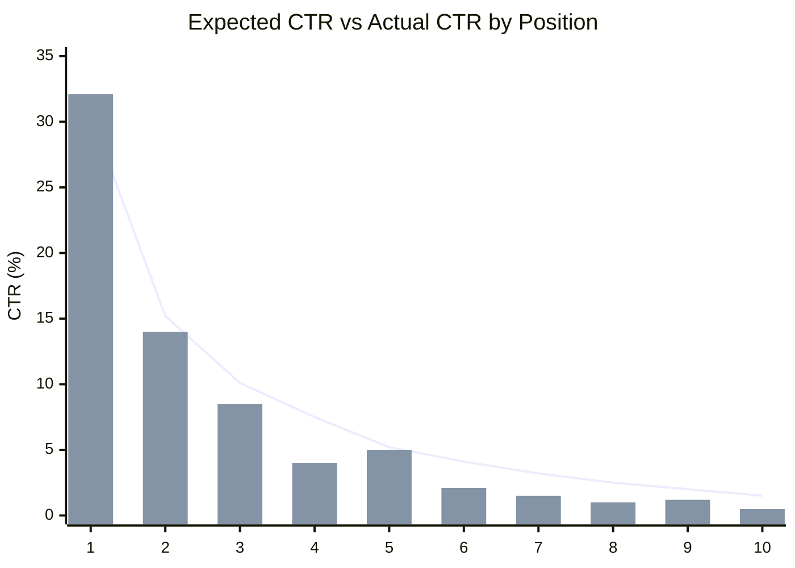
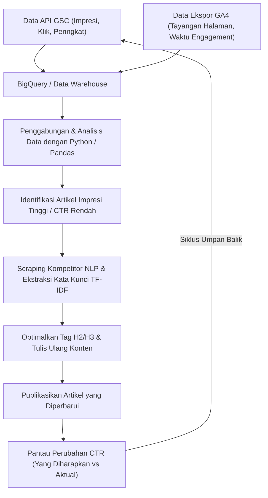

## 1. Pendahuluan: Pentingnya Menulis Ulang di Blog Teknis dan Pendekatan Berbasis Data

Dalam mengelola blog teknis atau media milik (owned media) yang ditujukan untuk developer, "menulis ulang artikel lama" sama pentingnya, atau bahkan lebih penting, daripada terus-menerus menulis artikel baru. Khususnya pada topik IT dan teknologi, informasi cepat menjadi usang. Bukan hal yang aneh jika snippet kode atau spesifikasi API yang ditulis beberapa tahun lalu kini telah usang (Deprecated). Namun, sekadar memperbarui artikel lama secara asal-asalan tidak akan memaksimalkan trafik (kunjungan) dari mesin pencari.

Oleh karena itu, artikel ini akan menjelaskan strategi tingkat lanjut untuk mengidentifikasi artikel teknis mana yang harus ditulis ulang dengan menggunakan data dari **Google Search Console (selanjutnya disebut GSC)** dan **Google Analytics 4 (GA4)**. Dengan menggunakan pendekatan berbasis data dan matematis, strategi ini bertujuan untuk meningkatkan peringkat pencarian dan rasio klik-tayang (CTR) secara drastis.

Secara khusus, artikel ini akan membahas secara komprehensif mulai dari cara menemukan "artikel yang kehilangan peluang" dengan CTR rendah dibandingkan jumlah impresi (tayangan) menggunakan Python dan BigQuery untuk mengintegrasikan data GSC dan GA4, hingga metode untuk mengidentifikasi kata kunci yang kurang pada heading H2 atau H3 menggunakan analisis TF-IDF dari NLP (Natural Language Processing) untuk mengisi celah konten secara efisien.

---

## 2. Analisis Kesenjangan antara CTR yang Diharapkan dan CTR Aktual (Pengenalan Model Matematis)

Salah satu metrik paling dasar dalam SEO adalah "Rasio Klik-Tayang (CTR) terhadap peringkat pencarian". Secara umum, jika peringkat pencarian ada di posisi 1, CTR-nya sekitar 25-30%, di posisi 2 sekitar 15%, dan menurun drastis setelah itu. Hubungan antara peringkat dan CTR ini dapat dimodelkan sebagai distribusi yang mengikuti Hukum Pangkat (Power Law).

CTR yang diharapkan $CTR(r)$ untuk peringkat $r$ diketahui dapat diperkirakan dengan rumus berikut:

$$
CTR(r) = a \cdot r^{-b}
$$

Di sini, $a$ adalah CTR yang diharapkan saat berada di posisi 1 (misal: $0.30$ untuk 30%), dan $b$ adalah parameter peluruhan (umumnya antara $1.0$ hingga $1.5$).

Pendekatan paling efektif saat memilih artikel yang akan ditulis ulang adalah **menemukan artikel (kata kunci) yang "CTR aktual"-nya jauh di bawah "CTR yang diharapkan" ini**. Misalnya, meskipun peringkat pencarian berada di posisi 3 (CTR yang diharapkan sekitar 10%), tetapi CTR aktual hanya 2%. Dalam kasus ini, sangat mungkin ada ketidaksesuaian antara niat pencarian (search intent) dengan judul/deskripsi, atau klik direbut oleh faktor kompetitor seperti rich snippet.

Grafik berikut adalah ilustrasi yang menunjukkan kesenjangan antara CTR yang diharapkan dan CTR aktual pada sebuah blog teknis.



(* Garis menunjukkan CTR yang diharapkan, sedangkan diagram batang menunjukkan CTR aktual. Terlihat jelas bahwa pada posisi ke-4 dan ke-8 nilainya jauh di bawah ekspektasi.)

---

## 3. Ekstraksi Data Performa Pencarian Secara Otomatis Menggunakan API GSC (Python)

Walaupun memungkinkan untuk mengunduh CSV dari UI web GSC untuk dianalisis, cara terbaik untuk melakukan analisis berkelanjutan atau pada blog berskala besar adalah membangun sistem ekstraksi data otomatis dengan Python menggunakan API GSC.

Berikut adalah snippet Python yang menggunakan `google-api-python-client` untuk mengambil data performa (jumlah klik, jumlah impresi, CTR, peringkat rata-rata) berdasarkan halaman dan kueri pada periode tertentu.

```python
import pandas as pd
from google.oauth2 import service_account
from googleapiclient.discovery import build

def get_gsc_data(key_path, site_url, start_date, end_date):
    # Memuat kredensial dan membangun klien API
    credentials = service_account.Credentials.from_service_account_file(
        key_path, scopes=['https://www.googleapis.com/auth/webmasters.readonly']
    )
    service = build('searchconsole', 'v1', credentials=credentials)

    # Mengatur payload permintaan API (menentukan halaman dan kueri sebagai dimensi)
    request = {
        'startDate': start_date,
        'endDate': end_date,
        'dimensions': ['page', 'query'],
        'rowLimit': 25000
    }

    # Menjalankan API
    response = service.searchanalytics().query(
        siteUrl=site_url, body=request
    ).execute()

    # Mengekstrak data dari respons dan mengubahnya menjadi Pandas DataFrame
    rows = response.get('rows', [])
    data = []
    for row in rows:
        keys = row['keys']
        data.append({
            'page': keys[0],
            'query': keys[1],
            'clicks': row['clicks'],
            'impressions': row['impressions'],
            'ctr': row['ctr'],
            'position': row['position']
        })
    
    return pd.DataFrame(data)

# Contoh eksekusi
# df_gsc = get_gsc_data('credentials.json', 'https://kenji.blog/', '2026-08-01', '2026-08-31')
# print(df_gsc.head())
```

Melalui skrip ini, Anda dapat memperoleh data terperinci yang menghubungkan URL halaman dan kueri pencarian sebagai DataFrame. Hal ini memungkinkan Anda untuk memahami secara komprehensif kata kunci apa yang memunculkan artikel tertentu.

---

## 4. Pemfilteran Kata Kunci Teknis Menggunakan Regular Expression (Regex)

Fitur yang sangat kuat dalam menganalisis blog teknis adalah **filter regular expression (Regex)** di GSC.
Misalnya, jika Anda menulis artikel yang mencakup berbagai topik mulai dari frontend, backend, hingga infrastruktur, Anda mungkin hanya ingin mengekstrak "artikel tutorial dan error seputar Python dan Pandas" untuk menentukan prioritas penulisan ulang.

Menggunakan filter regex kustom GSC memungkinkan Anda untuk menyaring kueri dengan kondisi yang kompleks.

**Contoh Praktis Pemfilteran Kata Kunci Teknis:**
- Penyelidikan error terkait Python: `^(python|pandas|numpy|matplotlib).* (error|exception|bug|エラー|動かない)`
- Pembangunan infrastruktur terkait AWS: `(aws|amazon web services|ec2|s3|lambda).* (構築|設定|チュートリアル|tutorial|how to)`
- Pembaruan versi library tertentu: `(react|vue|angular) (v17|v18|v3) (migration|マイグレーション|移行)`

Ketika mengintegrasikan ini ke dalam permintaan API GSC, Anda dapat menerapkan kondisi regex dengan memanfaatkan `dimensionFilterGroups`. Dengan menggunakan pemfilteran ini, Anda dapat menargetkan kata kunci penyelesaian masalah bernilai tinggi yang diketik oleh para developer yang "benar-benar sedang mengalami kendala".

---

## 5. Mengintegrasikan Data GA4 dan GSC dengan BigQuery/Pandas

Data GSC saja hanya memberi tahu "peringkat pencarian dan CTR". Untuk mengetahui "berapa lama pengguna yang sampai ke artikel tersebut benar-benar tinggal, dan apakah mereka mencapai konversi (misal: navigasi ke repositori GitHub, atau pendaftaran newsletter)", kita perlu mengintegrasikannya (JOIN) dengan data dari **Google Analytics 4 (GA4)**.

Jika Anda menyimpan data ekspor GA4 dan data ekspor massal GSC di BigQuery, Anda dapat menggabungkan keduanya menggunakan query SQL seperti di bawah ini untuk mengekstrak "artikel dengan jumlah impresi tinggi dan peringkat pencarian yang lumayan, namun memiliki bounce rate (rasio pantulan) tinggi atau waktu engagement singkat".

```sql
WITH gsc_data AS (
  SELECT
    url AS page_path,
    SUM(impressions) AS total_impressions,
    SUM(clicks) AS total_clicks,
    AVG(sum_top_position) AS avg_position
  FROM
    `project.searchconsole.searchdata_url_impression`
  WHERE
    data_date BETWEEN '2026-08-01' AND '2026-08-31'
  GROUP BY
    url
),
ga4_data AS (
  SELECT
    REGEXP_REPLACE(
      (SELECT value.string_value FROM UNNEST(event_params) WHERE key = 'page_location'),
      r'^https?://[^/]+', ''
    ) AS page_path,
    COUNT(DISTINCT user_pseudo_id) AS users,
    AVG((SELECT value.int_value FROM UNNEST(event_params) WHERE key = 'engagement_time_msec')) / 1000 AS avg_engagement_sec
  FROM
    `project.analytics_123456789.events_*`
  WHERE
    event_name = 'page_view'
  GROUP BY
    page_path
)

SELECT
  g.page_path,
  g.total_impressions,
  g.total_clicks,
  SAFE_DIVIDE(g.total_clicks, g.total_impressions) AS ctr,
  g.avg_position,
  a.users,
  a.avg_engagement_sec
FROM
  gsc_data g
JOIN
  ga4_data a ON g.page_path = a.page_path
WHERE
  g.total_impressions > 1000
  AND g.avg_position BETWEEN 3 AND 15
ORDER BY
  g.total_impressions DESC
```

Dengan menggunakan hasil ini, klasifikasikan target penulisan ulang dalam matriks seperti berikut:

1. **High Impression, Low CTR, High Engagement (Impresi Tinggi, CTR Rendah, Engagement Tinggi)**:
   Artikel yang membuat pembaca puas asalkan mereka mengekliknya di hasil pencarian. Prioritas utamanya hanya **merevisi judul dan deskripsi meta (meta description)**.
2. **High CTR, Low Engagement (CTR Tinggi, Engagement Rendah)**:
   Artikel yang diklik, tetapi pengguna pergi karena kontennya mengecewakan. Perlu ditulis ulang secara besar-besaran pada bagian isi, seperti **memperbaiki paragraf pengantar, memperbarui kode ke versi terbaru, dan meningkatkan kelengkapan informasi (menambahkan H2/H3)**.

---

## 6. Analisis Kesenjangan Konten Menggunakan NLP dan TF-IDF

Setelah berhasil mengidentifikasi artikel mana yang harus ditulis ulang, langkah selanjutnya adalah menganalisis "secara spesifik heading (H2/H3) atau kata kunci apa yang perlu ditambahkan". Daripada hanya menebak-nebak, kita akan menggunakan **TF-IDF (Term Frequency-Inverse Document Frequency) dalam pemrosesan bahasa alami (NLP)**.

TF-IDF adalah metrik statistik untuk mengevaluasi seberapa penting sebuah kata dalam suatu dokumen.

$$
TF\text{-}IDF(t, d) = tf(t, d) \times \log\left(\frac{N}{df(t)}\right)
$$

Di mana:
- $tf(t, d)$ adalah frekuensi kemunculan kata $t$ pada dokumen $d$
- $N$ adalah jumlah total dokumen
- $df(t)$ adalah jumlah dokumen yang mengandung kata $t$

**Pendekatan:**
1. Mengambil data teks dari 10 artikel teratas (situs kompetitor) untuk kata kunci target dengan cara web scraping atau metode lainnya.
2. Menyiapkan data teks artikel dari situs kita sendiri.
3. Menggunakan `TfidfVectorizer` dari `scikit-learn` pada Python untuk mengekstrak kata kunci (kata fitur) yang muncul dengan skor tinggi secara umum di artikel kompetitor, tetapi tidak ada, atau skornya jauh lebih rendah, pada artikel di situs kita.

```python
from sklearn.feature_extraction.text import TfidfVectorizer
import pandas as pd
import numpy as np

# documents = [teks situs sendiri, teks kompetitor 1, teks kompetitor 2, ...]
# Di sini kita asumsikan menggunakan daftar teks bahasa Jepang yang sudah dipisah per kata menggunakan morphological analysis (seperti MeCab)

def extract_missing_keywords(documents):
    vectorizer = TfidfVectorizer(max_df=0.9, min_df=2)
    tfidf_matrix = vectorizer.fit_transform(documents)
    
    feature_names = vectorizer.get_feature_names_out()
    
    # Menghitung skor TF-IDF rata-rata untuk artikel kompetitor (indeks 1 dan seterusnya)
    competitor_mean_tfidf = np.mean(tfidf_matrix[1:].toarray(), axis=0)
    
    # Mengambil skor TF-IDF artikel dari situs kita (indeks 0)
    my_article_tfidf = tfidf_matrix[0].toarray()[0]
    
    # Menghitung kesenjangan kata yang penting bagi kompetitor, tetapi tidak ada (atau sedikit) di situs kita
    gap_scores = competitor_mean_tfidf - my_article_tfidf
    
    # Mengekstrak kata-kata teratas dengan kesenjangan yang besar
    df_gap = pd.DataFrame({'keyword': feature_names, 'gap_score': gap_scores})
    df_gap = df_gap.sort_values(by='gap_score', ascending=False)
    
    return df_gap.head(20)

# Contoh: missing_keywords = extract_missing_keywords(processed_docs)
# print(missing_keywords)
```

Melalui analisis ini, Anda bisa secara kuantitatif menemukan **topik yang hilang (kesenjangan konten)**. Misalnya, "Ternyata artikel peringkat atas membahas tentang 'Cara deploy ke container Docker' dan 'Membangun pipeline CI/CD', padahal artikel saya tidak menyinggung hal itu sama sekali".

Kata-kata kunci penting yang ditemukan sebaiknya tidak sekadar disisipkan sembarangan di dalam teks. Anda harus menambahkannya sebagai bagian bermakna melalui **heading (tag Heading H2 atau H3)**, lalu menulis penjelasan teknis yang mendetail dan menyertakan snippet kode pada heading tersebut. Hal ini dapat secara drastis meningkatkan penilaian dari Google.

---

## 7. Pipeline Data dan Siklus Peningkatan Berkelanjutan

Proses yang dijelaskan di atas bukan sekadar untuk dilakukan sekali lalu selesai; mengubahnya menjadi pipeline yang berjalan secara berkelanjutan adalah kunci keberhasilan SEO. Di bawah ini adalah arsitektur keseluruhan dan alur operasional yang direpresentasikan menggunakan diagram alur (flowchart) Mermaid.



Dengan mensistemasikan serangkaian langkah ini—mulai dari pengumpulan data dari GSC dan GA4, pemilihan target melalui analisis, optimalisasi konten dengan NLP, hingga pemantauan hasilnya—blog atau media Anda akan menjadi aset yang terus berkembang secara otomatis.

---

## 8. Kesimpulan dan Prospek di Masa Mendatang

Menulis ulang artikel teknis dengan memanfaatkan Google Search Console bukanlah sekadar memperbaiki kalimat. Itu adalah sebuah proses rekayasa tingkat lanjut, di mana kita memanfaatkan data dan model matematis untuk menghadirkan solusi optimal dalam menghadapi "kotak hitam" bernama algoritma mesin pencari.

Berikut ringkasan metode yang dibahas dalam artikel ini:
1. Menghitung **kesenjangan antara CTR yang diharapkan dan CTR aktual** untuk mengidentifikasi artikel dengan dampak perbaikan yang besar.
2. Menggunakan **API GSC dan Python** untuk mengekstrak data performa secara otomatis.
3. Menggabungkan data engagement GA4 pada **BigQuery** dan memperbaiki isi artikel yang memiliki bounce rate tinggi.
4. Menemukan kesenjangan konten dengan kompetitor melalui **analisis NLP menggunakan TF-IDF** dan mengoptimalkan heading (H2/H3).

Tren teknologi terus berubah. Untuk secara akurat merespons error dan masalah yang sedang dihadapi pembaca, pertimbangkanlah untuk menjadikan strategi penulisan ulang berbasis data ini sebagai bagian dari operasional harian Anda.
