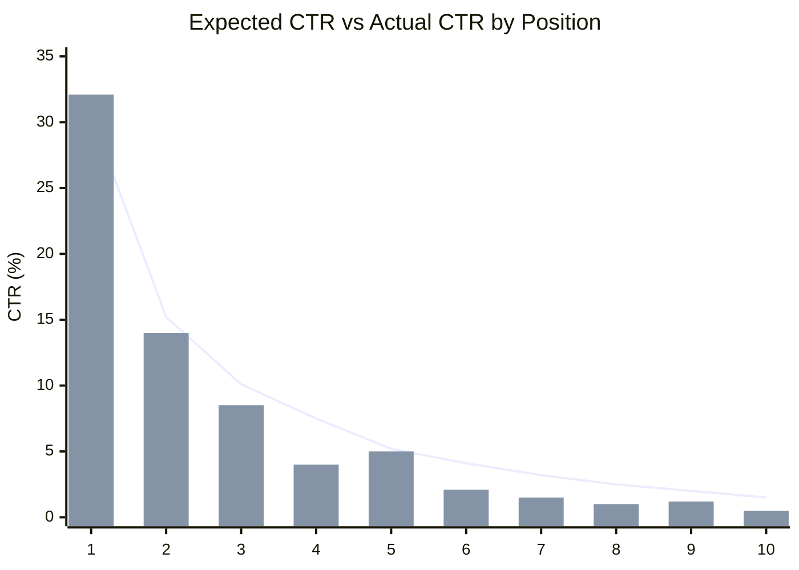
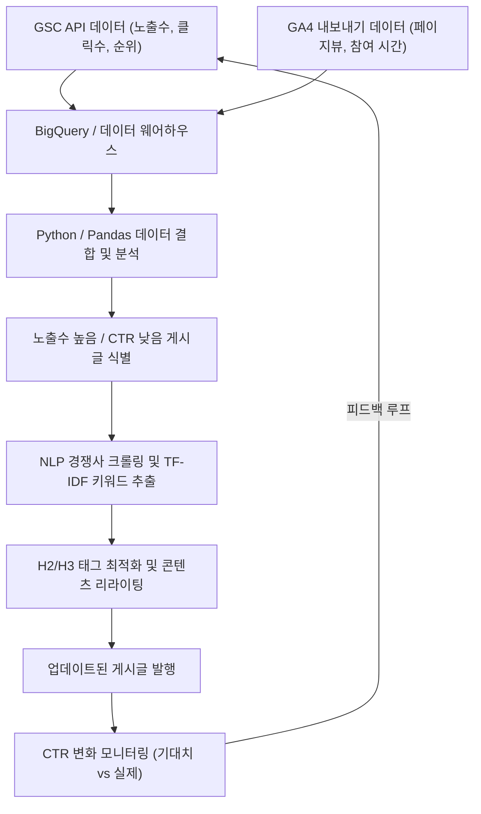

## 1. 시작하며: 기술 블로그에서 리라이팅의 중요성과 데이터 기반 접근법

기술 블로그나 개발자를 위한 온드 미디어(Owned Media)를 운영함에 있어, 신규 게시글을 지속적으로 작성하는 것만큼, 혹은 그 이상으로 중요한 것이 '과거 게시글의 리라이팅'입니다. 특히 IT·기술 관련 주제는 정보의 진부화가 빨라, 몇 년 전에 작성한 코드 스니펫이나 API 사양이 현재는 더 이상 사용되지 않는(Deprecated) 경우도 드물지 않습니다. 하지만 무턱대고 과거 게시글을 업데이트하는 것만으로는 검색 엔진으로부터의 트래픽(유입)을 극대화할 수 없습니다.

따라서 본 게시글에서는 **Google Search Console(이하 GSC)**과 **Google Analytics 4(GA4)**의 데이터를 활용하여, 데이터 기반 및 수리적 접근 방식을 통해 리라이팅해야 할 기술 게시글을 식별하고, 검색 순위와 클릭률(CTR)을 극적으로 향상시키는 고도화된 전략을 설명합니다.

구체적으로는 Python이나 BigQuery를 사용하여 GSC와 GA4 데이터를 통합하고, 노출수(인프레션) 대비 CTR이 낮은 '기회 손실 게시글'을 발견하는 방법부터, NLP(자연어 처리)의 TF-IDF 분석을 사용하여 H2나 H3 제목에 부족한 키워드를 파악하고, 효율적으로 콘텐츠의 공백(Gap)을 메우는 방법까지 종합적으로 해설합니다.

---

## 2. 기대 CTR과 실제 CTR의 격차 분석 (수리 모델의 도입)

SEO에서 가장 기본적인 지표 중 하나가 '검색 순위 대비 클릭률(CTR)'입니다. 일반적으로 검색 순위가 1위일 경우의 CTR은 약 25~30% 정도, 2위는 약 15%이며, 그 이후로는 급격히 감소하는 성질을 가지고 있습니다. 이 순위와 CTR의 관계는 멱법칙(Power Law)을 따르는 분포로 모델링할 수 있습니다.

순위 $r$ 에 대한 기대 클릭률 $CTR(r)$ 은 다음 수식으로 근사할 수 있는 것으로 알려져 있습니다.

$$
CTR(r) = a \cdot r^{-b}
$$

여기서 $a$ 는 1위일 때의 기대 CTR(예: 30%인 경우 $0.30$), $b$ 는 감쇠 파라미터(일반적으로 $1.0$ 에서 $1.5$ 사이)를 나타냅니다.

리라이팅 대상이 될 게시글을 선정할 때 가장 효과적인 접근법은 **'실제 CTR'이 이 '기대 CTR'을 크게 밑도는 게시글(키워드)을 찾는 것**입니다. 예를 들어, 검색 순위가 3위(기대 CTR 약 10%)임에도 불구하고 실제 CTR이 2%밖에 되지 않는다면, 검색 의도와 제목·설명이 어긋나 있거나, 혹은 리치 스니펫 등 경쟁 요인으로 인해 클릭을 빼앗기고 있을 가능성이 높다고 판단할 수 있습니다.

다음 그래프는 어느 기술 블로그에서 기대 CTR과 실제 CTR의 괴리를 보여주는 이미지입니다.



(※ 꺾은선이 기대 CTR, 막대그래프가 실제 CTR을 나타냅니다. 4위나 8위에서 크게 밑돌고 있는 것을 확인할 수 있습니다.)

---

## 3. GSC API를 활용한 검색 실적 데이터 자동 추출 (Python)

GSC의 웹 UI에서 CSV를 다운로드하여 분석하는 것도 가능하지만, 대규모 블로그나 지속적인 분석을 위해서는 GSC API를 활용하여 Python으로 데이터를 자동 추출하는 시스템을 구축하는 것이 가장 좋습니다.

아래에 `google-api-python-client` 를 사용하여 특정 기간 동안의 페이지별·쿼리별 실적 데이터(클릭수, 노출수, CTR, 평균 순위)를 가져오는 Python 스니펫을 나타냅니다.

```python
import pandas as pd
from google.oauth2 import service_account
from googleapiclient.discovery import build

def get_gsc_data(key_path, site_url, start_date, end_date):
    # 인증 정보 로드 및 API 클라이언트 빌드
    credentials = service_account.Credentials.from_service_account_file(
        key_path, scopes=['https://www.googleapis.com/auth/webmasters.readonly']
    )
    service = build('searchconsole', 'v1', credentials=credentials)

    # API 요청 페이로드 설정 (측정기준으로 페이지와 쿼리 지정)
    request = {
        'startDate': start_date,
        'endDate': end_date,
        'dimensions': ['page', 'query'],
        'rowLimit': 25000
    }

    # API 실행
    response = service.searchanalytics().query(
        siteUrl=site_url, body=request
    ).execute()

    # 응답에서 데이터를 추출하고 Pandas DataFrame으로 변환
    rows = response.get('rows', [])
    data = []
    for row in rows:
        keys = row['keys']
        data.append({
            'page': keys[0],
            'query': keys[1],
            'clicks': row['clicks'],
            'impressions': row['impressions'],
            'ctr': row['ctr'],
            'position': row['position']
        })
    
    return pd.DataFrame(data)

# 실행 예
# df_gsc = get_gsc_data('credentials.json', 'https://kenji.blog/', '2026-08-01', '2026-08-31')
# print(df_gsc.head())
```

이 스크립트를 통해 페이지 URL과 검색 쿼리가 연결된 상세 데이터를 DataFrame으로 가져올 수 있습니다. 이를 통해 특정 게시글이 어떤 키워드로 노출되고 있는지 종합적으로 파악할 수 있게 됩니다.

---

## 4. 정규 표현식(Regex)을 사용한 기술 키워드 필터링

기술 블로그 분석에서 매우 강력한 기능이 GSC의 **정규 표현식(Regex) 필터**입니다.
예를 들어, 프론트엔드부터 백엔드, 인프라까지 다양한 게시글을 작성하고 있는 경우, 'Python이나 Pandas에 관한 오류나 튜토리얼 게시글'만을 추출하여 리라이팅의 우선순위를 정하고 싶을 수 있습니다.

GSC의 맞춤 정규 표현식 필터를 사용하면 복잡한 조건으로 쿼리를 좁힐 수 있습니다.

**기술 키워드 필터링의 실제 예:**
- Python 관련 오류 조사: `^(python|pandas|numpy|matplotlib).* (error|exception|bug|오류|작동하지 않음)`
- AWS 관련 인프라 구축: `(aws|amazon web services|ec2|s3|lambda).* (구축|설정|튜토리얼|tutorial|how to)`
- 특정 라이브러리의 버전 업그레이드: `(react|vue|angular) (v17|v18|v3) (migration|마이그레이션|이전)`

이를 GSC API 요청에 포함할 경우, `dimensionFilterGroups` 를 활용하여 정규 표현식 조건을 부여합니다. 이 필터링을 잘 활용하면 개발자가 '지금 당장 곤란해서 검색하고 있는' 가치 높은 문제 해결형 키워드를 정확하게 추출할 수 있습니다.

---

## 5. BigQuery/Pandas를 통한 GA4와 GSC 데이터 통합

GSC 데이터만으로는 '검색 순위와 클릭률'만 알 수 있습니다. '해당 게시글에 도달한 사용자가 실제로 얼마나 머물렀고, 전환(예: GitHub 저장소로의 이동이나 이메일 매거진 등록 등)에 이르렀는지'를 알기 위해서는 **Google Analytics 4(GA4)**의 데이터와 통합(JOIN)해야 합니다.

BigQuery에 GA4의 내보내기 데이터와 GSC의 일괄 내보내기 데이터를 저장하고 있는 경우, 다음과 같은 SQL 쿼리로 양쪽을 결합하여, '노출수가 많고 검색 순위도 어느 정도 높지만, 이탈률이 높거나 참여 시간이 짧은 게시글'을 추출할 수 있습니다.

```sql
WITH gsc_data AS (
  SELECT
    url AS page_path,
    SUM(impressions) AS total_impressions,
    SUM(clicks) AS total_clicks,
    AVG(sum_top_position) AS avg_position
  FROM
    `project.searchconsole.searchdata_url_impression`
  WHERE
    data_date BETWEEN '2026-08-01' AND '2026-08-31'
  GROUP BY
    url
),
ga4_data AS (
  SELECT
    REGEXP_REPLACE(
      (SELECT value.string_value FROM UNNEST(event_params) WHERE key = 'page_location'),
      r'^https?://[^/]+', ''
    ) AS page_path,
    COUNT(DISTINCT user_pseudo_id) AS users,
    AVG((SELECT value.int_value FROM UNNEST(event_params) WHERE key = 'engagement_time_msec')) / 1000 AS avg_engagement_sec
  FROM
    `project.analytics_123456789.events_*`
  WHERE
    event_name = 'page_view'
  GROUP BY
    page_path
)

SELECT
  g.page_path,
  g.total_impressions,
  g.total_clicks,
  SAFE_DIVIDE(g.total_clicks, g.total_impressions) AS ctr,
  g.avg_position,
  a.users,
  a.avg_engagement_sec
FROM
  gsc_data g
JOIN
  ga4_data a ON g.page_path = a.page_path
WHERE
  g.total_impressions > 1000
  AND g.avg_position BETWEEN 3 AND 15
ORDER BY
  g.total_impressions DESC
```

이 결과를 사용하여 다음과 같은 매트릭스로 리라이팅 대상을 분류합니다.

1. **High Impression, Low CTR, High Engagement**:
   검색 결과에서 클릭만 되면 독자가 만족하는 게시글입니다. **제목과 메타 설명의 수정**만을 최우선으로 진행해야 합니다.
2. **High CTR, Low Engagement**:
   클릭은 되지만 내용이 기대에 미치지 못해 이탈하는 게시글입니다. **도입부 개선이나 최신 코드로의 업데이트, 정보의 포괄성 향상(H2/H3 추가)** 등 대규모의 본문 리라이팅이 필요합니다.

---

## 6. NLP와 TF-IDF를 이용한 콘텐츠 격차 분석

리라이팅해야 할 게시글이 특정되었다면, 다음으로 할 일은 '구체적으로 어떤 제목(H2/H3)이나 키워드를 추가할 것인지'를 분석하는 것입니다. 여기서도 감에 의존하는 것이 아니라, **자연어 처리(NLP)에서의 TF-IDF(Term Frequency-Inverse Document Frequency)**를 활용합니다.

TF-IDF는 어떤 단어가 그 문서 내에서 얼마나 중요한지를 평가하기 위한 통계량입니다.

$$
TF\text{-}IDF(t, d) = tf(t, d) \times \log\left(\frac{N}{df(t)}\right)
$$

여기서,
- $tf(t, d)$ 는 문서 $d$ 에서 단어 $t$ 의 출현 빈도
- $N$ 은 전체 문서의 총 수
- $df(t)$ 는 단어 $t$ 가 출현하는 문서의 수

**접근법:**
1. 타겟 키워드의 상위 10개 게시글(경쟁 사이트)의 텍스트 데이터를 웹 크롤링 등으로 수집합니다.
2. 내 사이트의 대상 게시글 텍스트 데이터를 준비합니다.
3. Python의 `scikit-learn` 의 `TfidfVectorizer` 를 사용하여, 경쟁 상위 게시글 그룹에 공통적으로 높은 점수로 출현하지만 내 사이트의 게시글에는 존재하지 않거나 점수가 현저히 낮은 키워드(특징어)를 추출합니다.

```python
from sklearn.feature_extraction.text import TfidfVectorizer
import pandas as pd
import numpy as np

# documents = [내 사이트의 텍스트, 경쟁 게시글1의 텍스트, 경쟁 게시글2의 텍스트, ...]
# 여기서는 한국어 형태소 분석(MeCab 등)으로 형태소 분석이 완료된 텍스트 리스트를 가정

def extract_missing_keywords(documents):
    vectorizer = TfidfVectorizer(max_df=0.9, min_df=2)
    tfidf_matrix = vectorizer.fit_transform(documents)
    
    feature_names = vectorizer.get_feature_names_out()
    
    # 경쟁 게시글(인덱스 1 이후)의 평균 TF-IDF 점수 계산
    competitor_mean_tfidf = np.mean(tfidf_matrix[1:].toarray(), axis=0)
    
    # 내 사이트 게시글(인덱스 0)의 TF-IDF 점수 가져오기
    my_article_tfidf = tfidf_matrix[0].toarray()[0]
    
    # 경쟁사에서는 중요하지만, 내 사이트에는 없는(또는 적은) 단어의 격차 계산
    gap_scores = competitor_mean_tfidf - my_article_tfidf
    
    # 격차가 큰 상위 단어를 추출
    df_gap = pd.DataFrame({'keyword': feature_names, 'gap_score': gap_scores})
    df_gap = df_gap.sort_values(by='gap_score', ascending=False)
    
    return df_gap.head(20)

# 예: missing_keywords = extract_missing_keywords(processed_docs)
# print(missing_keywords)
```

이 분석을 통해, '사실 상위 게시글은 "Docker 컨테이너로의 배포 방법"이나 "CI/CD 파이프라인 구축"에 대해서도 언급하고 있지만, 내 게시글에서는 다루지 않고 있다'와 같은 **주제의 누락(콘텐츠 격차)**을 정량적으로 발견할 수 있습니다.

발견한 중요 키워드 그룹은 단순히 본문에 흩뿌리는 것이 아니라, **H2나 H3 제목(Heading 태그)**으로서 의미 있는 섹션으로 추가하고, 제목에 대한 상세한 기술 설명과 코드 스니펫을 작성함으로써 Google의 평가를 극적으로 높일 수 있습니다.

---

## 7. 데이터 파이프라인과 지속적인 개선 사이클

지금까지 설명한 프로세스는 한 번 실행하고 끝나는 것이 아니라, 파이프라인화하여 지속적으로 실행하는 것이 SEO 성공의 열쇠가 됩니다. 아래에 전체 아키텍처와 운영 흐름을 Mermaid 플로우차트로 나타냅니다.



이와 같이 GSC와 GA4로부터의 데이터 수집, 분석을 통한 타겟 선정, NLP를 활용한 콘텐츠 최적화, 그리고 결과 모니터링까지의 일련의 흐름을 시스템화함으로써, 블로그 미디어는 자동으로 계속 성장하는 자산이 됩니다.

---

## 8. 요약 및 향후 전망

Google Search Console을 활용한 기술 게시글의 리라이팅은 단순한 문장 수정이 아닙니다. 이는 검색 엔진의 알고리즘이라는 블랙박스에 대해, 데이터와 수리 모델을 구사하여 최적해를 제시해 나가는 고도의 엔지니어링입니다.

본 게시글에서 설명한 기법을 요약합니다.
1. **기대 CTR과 실제 CTR의 괴리**를 계산하여, 수정 영향력이 큰 게시글을 파악합니다.
2. **GSC API와 Python**을 사용하여 실적 데이터를 자동으로 추출합니다.
3. **BigQuery** 상에서 GA4의 참여 데이터와 결합하여, 이탈률이 높은 게시글의 본문을 수정합니다.
4. **TF-IDF를 이용한 NLP 분석**을 통해, 경쟁사와의 콘텐츠 격차를 발견하고 제목(H2/H3)을 최적화합니다.

기술의 트렌드는 끊임없이 변화합니다. 독자가 지금 겪고 있는 오류나 문제에 정확하게 대응하기 위해서라도, 데이터를 아군으로 삼은 전략적인 리라이팅을 꼭 일상적인 운영에 도입해 보시기 바랍니다.
