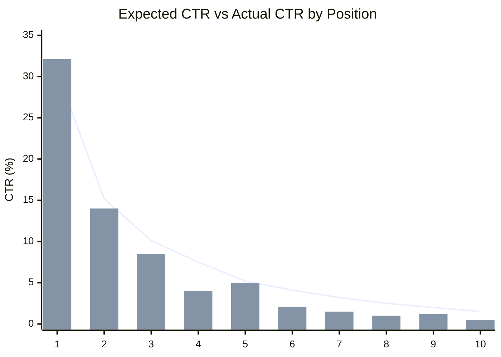
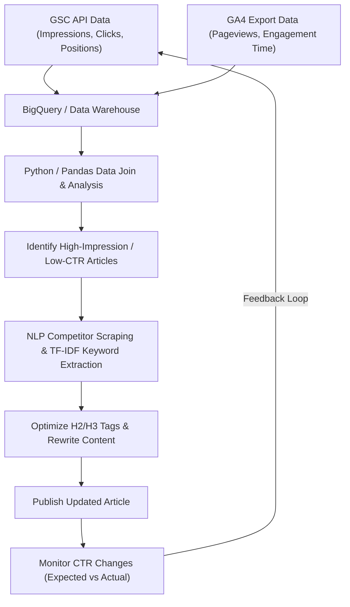

## 1. はじめに：技術ブログにおけるリライトの重要性とデータドリブンアプローチ

技術ブログや開発者向けのオウンドメディアを運営していく上で、新規記事の継続的な執筆と同じくらい、あるいはそれ以上に重要なのが「過去記事のリライト」です。特にIT・技術系のトピックは情報の陳腐化が早く、数年前に書いたコードスニペットやAPIの仕様が現在では非推奨（Deprecated）になっているケースも珍しくありません。しかし、ただ闇雲に過去の記事を更新するだけでは、検索エンジンからのトラフィック（流入）を最大化することはできません。

そこで本記事では、**Google Search Console（以下、GSC）**と**Google Analytics 4（GA4）**のデータを活用し、データドリブンかつ数理的なアプローチを用いて、リライトすべき技術記事を特定し、検索順位とクリック率（CTR）を劇的に向上させる高度な戦略を解説します。

具体的には、PythonやBigQueryを用いてGSCとGA4のデータを統合し、インプレッション数（表示回数）に対してCTRが低い「機会損失記事」を発見する方法から、NLP（自然言語処理）のTF-IDF分析を用いてH2やH3見出しに不足しているキーワードを特定し、効率的にコンテンツのギャップを埋める手法までを網羅的に解説します。

---

## 2. 期待CTRと実際のCTRのギャップ分析（数理モデルの導入）

SEOにおける最も基本的な指標の一つが「検索順位に対するクリック率（CTR）」です。一般的に、検索順位が1位の場合のCTRは約25〜30%程度、2位で約15%、それ以降は急激に低下していくという性質があります。この順位とCTRの関係は、べき乗則（Power Law）に従う分布としてモデル化することができます。

順位 $r$ に対する期待クリック率 $CTR(r)$ は、以下の数式で近似されることが知られています。

$$
CTR(r) = a \cdot r^{-b}
$$

ここで、$a$ は1位の時の期待CTR（例：30%の場合は $0.30$）、$b$ は減衰パラメータ（一般的には $1.0$ から $1.5$ の間）を表します。

リライト対象となる記事を選定する際の最も有効なアプローチは、**「実際のCTR」がこの「期待CTR」を大きく下回っている記事（キーワード）を見つけること**です。例えば、検索順位が3位（期待CTRが約10%）であるにもかかわらず、実際のCTRが2%しかない場合、検索意図とタイトル・ディスクリプションがズレているか、あるいはリッチスニペット等の競合要因によってクリックを奪われている可能性が高いと判断できます。

以下のグラフは、ある技術ブログにおける期待CTRと実際のCTRの乖離を示したイメージです。



（※ 折れ線が期待CTR、棒グラフが実際のCTRを示します。4位や8位で大きく下回っていることが確認できます。）

---

## 3. GSC APIを用いた検索パフォーマンスデータの自動抽出 (Python)

GSCのウェブUIからCSVをダウンロードして分析することも可能ですが、大規模なブログや継続的な分析を行うためには、GSC APIを用いてPythonでデータを自動抽出する仕組みを構築するのがベストです。

以下に、`google-api-python-client` を用いて、特定の期間におけるページ別・クエリ別のパフォーマンスデータ（クリック数、インプレッション数、CTR、平均順位）を取得するPythonスニペットを示します。

```python
import pandas as pd
from google.oauth2 import service_account
from googleapiclient.discovery import build

def get_gsc_data(key_path, site_url, start_date, end_date):
    # 認証情報の読み込みとAPIクライアントの構築
    credentials = service_account.Credentials.from_service_account_file(
        key_path, scopes=['https://www.googleapis.com/auth/webmasters.readonly']
    )
    service = build('searchconsole', 'v1', credentials=credentials)

    # APIリクエストのペイロード設定（ディメンションとしてページとクエリを指定）
    request = {
        'startDate': start_date,
        'endDate': end_date,
        'dimensions': ['page', 'query'],
        'rowLimit': 25000
    }

    # API実行
    response = service.searchanalytics().query(
        siteUrl=site_url, body=request
    ).execute()

    # 応答からデータを抽出し、Pandas DataFrameに変換
    rows = response.get('rows', [])
    data = []
    for row in rows:
        keys = row['keys']
        data.append({
            'page': keys[0],
            'query': keys[1],
            'clicks': row['clicks'],
            'impressions': row['impressions'],
            'ctr': row['ctr'],
            'position': row['position']
        })
    
    return pd.DataFrame(data)

# 実行例
# df_gsc = get_gsc_data('credentials.json', 'https://kenji.blog/', '2026-08-01', '2026-08-31')
# print(df_gsc.head())
```

このスクリプトにより、ページURLと検索クエリが紐づいた詳細なデータをDataFrameとして取得できます。これにより、特定の記事がどのようなキーワードで表示されているかを網羅的に把握することが可能になります。

---

## 4. 正規表現（Regex）を用いた技術キーワードのフィルタリング

技術ブログの分析において非常に強力な機能が、GSCの**正規表現（Regex）フィルタ**です。
例えば、フロントエンドからバックエンド、インフラまで多岐にわたる記事を書いている場合、「PythonやPandasに関するエラーやチュートリアルの記事」だけを抽出してリライトの優先度を決めたい場合があります。

GSCのカスタム正規表現フィルタを使用すると、複雑な条件でクエリを絞り込むことができます。

**技術キーワードフィルタリングの実例:**
- Python関連のエラー調査: `^(python|pandas|numpy|matplotlib).* (error|exception|bug|エラー|動かない)`
- AWS関連のインフラ構築: `(aws|amazon web services|ec2|s3|lambda).* (構築|設定|チュートリアル|tutorial|how to)`
- 特定のライブラリのバージョンアップ: `(react|vue|angular) (v17|v18|v3) (migration|マイグレーション|移行)`

これをGSC APIのリクエストに組み込む場合は、`dimensionFilterGroups` を活用して正規表現の条件を付与します。このフィルタリングを駆使することで、開発者が「今まさに困って検索している」価値の高い課題解決型キーワードをピンポイントで抽出できます。

---

## 5. BigQuery/PandasによるGA4とGSCデータの統合

GSCのデータだけでは「検索順位とクリック率」しか分かりません。「その記事にたどり着いたユーザーが、実際にどれくらい滞在し、コンバージョン（例：GitHubリポジトリへの遷移や、メルマガ登録など）に至ったか」を知るには、**Google Analytics 4（GA4）**のデータと統合（JOIN）する必要があります。

BigQueryにGA4のエクスポートデータとGSCの一括エクスポートデータを格納している場合、以下のようなSQLクエリで両者を結合し、「インプレッションが多く、検索順位もそこそこ高いが、直帰率が高い・エンゲージメント時間が短い記事」を抽出できます。

```sql
WITH gsc_data AS (
  SELECT
    url AS page_path,
    SUM(impressions) AS total_impressions,
    SUM(clicks) AS total_clicks,
    AVG(sum_top_position) AS avg_position
  FROM
    `project.searchconsole.searchdata_url_impression`
  WHERE
    data_date BETWEEN '2026-08-01' AND '2026-08-31'
  GROUP BY
    url
),
ga4_data AS (
  SELECT
    REGEXP_REPLACE(
      (SELECT value.string_value FROM UNNEST(event_params) WHERE key = 'page_location'),
      r'^https?://[^/]+', ''
    ) AS page_path,
    COUNT(DISTINCT user_pseudo_id) AS users,
    AVG((SELECT value.int_value FROM UNNEST(event_params) WHERE key = 'engagement_time_msec')) / 1000 AS avg_engagement_sec
  FROM
    `project.analytics_123456789.events_*`
  WHERE
    event_name = 'page_view'
  GROUP BY
    page_path
)

SELECT
  g.page_path,
  g.total_impressions,
  g.total_clicks,
  SAFE_DIVIDE(g.total_clicks, g.total_impressions) AS ctr,
  g.avg_position,
  a.users,
  a.avg_engagement_sec
FROM
  gsc_data g
JOIN
  ga4_data a ON g.page_path = a.page_path
WHERE
  g.total_impressions > 1000
  AND g.avg_position BETWEEN 3 AND 15
ORDER BY
  g.total_impressions DESC
```

この結果を用いて、以下のようなマトリクスでリライト対象を分類します。

1. **High Impression, Low CTR, High Engagement**:
   検索結果でクリックさえされれば、読者は満足している記事。**タイトルとメタディスクリプションの修正**のみを最優先で行うべき。
2. **High CTR, Low Engagement**:
   クリックはされるが、内容が期待外れで離脱されている記事。**リード文の改善や、最新のコードへのアップデート、情報の網羅性向上（H2/H3追加）**など、大規模な本文リライトが必要。

---

## 6. NLPとTF-IDFを用いたコンテンツギャップ分析

リライトすべき記事が特定できたら、次に行うのが「具体的にどのような見出し（H2/H3）やキーワードを追加すべきか」の分析です。ここでもカンに頼るのではなく、**自然言語処理（NLP）におけるTF-IDF（Term Frequency-Inverse Document Frequency）**を活用します。

TF-IDFは、ある単語がその文書内でどれだけ重要かを評価するための統計量です。

$$
TF\text{-}IDF(t, d) = tf(t, d) \times \log\left(\frac{N}{df(t)}\right)
$$

ここで、
- $tf(t, d)$ は文書 $d$ における単語 $t$ の出現頻度
- $N$ は全文書の総数
- $df(t)$ は単語 $t$ が出現する文書の数

**アプローチ:**
1. ターゲットキーワードの上位10記事（競合サイト）のテキストデータをスクレイピング等で取得する。
2. 自サイトの対象記事のテキストデータを用意する。
3. Pythonの `scikit-learn` の `TfidfVectorizer` を用いて、競合上位記事群に共通して高いスコアで出現しているが、自サイトの記事には存在しない、あるいはスコアが著しく低いキーワード（特徴語）を抽出する。

```python
from sklearn.feature_extraction.text import TfidfVectorizer
import pandas as pd
import numpy as np

# documents = [自サイトのテキスト, 競合記事1のテキスト, 競合記事2のテキスト, ...]
# ここでは日本語の形態素解析（MeCab等）で分かち書き済みのテキストリストを想定

def extract_missing_keywords(documents):
    vectorizer = TfidfVectorizer(max_df=0.9, min_df=2)
    tfidf_matrix = vectorizer.fit_transform(documents)
    
    feature_names = vectorizer.get_feature_names_out()
    
    # 競合記事（インデックス1以降）の平均TF-IDFスコアを計算
    competitor_mean_tfidf = np.mean(tfidf_matrix[1:].toarray(), axis=0)
    
    # 自サイトの記事（インデックス0）のTF-IDFスコアを取得
    my_article_tfidf = tfidf_matrix[0].toarray()[0]
    
    # 競合で重要だが、自サイトに無い（または少ない）単語のギャップを計算
    gap_scores = competitor_mean_tfidf - my_article_tfidf
    
    # ギャップが大きい上位の単語を抽出
    df_gap = pd.DataFrame({'keyword': feature_names, 'gap_score': gap_scores})
    df_gap = df_gap.sort_values(by='gap_score', ascending=False)
    
    return df_gap.head(20)

# 例: missing_keywords = extract_missing_keywords(processed_docs)
# print(missing_keywords)
```

この分析により、「実は上位記事は『Dockerコンテナへのデプロイ方法』や『CI/CDパイプラインの構築』についても言及しているが、自分の記事では触れていない」といった**トピックの抜け漏れ（コンテンツギャップ）**を定量的に発見できます。

発見した重要キーワード群は、ただ本文に散りばめるのではなく、**H2やH3の見出し（Headingタグ）**として意味のあるセクションとして追加し、見出しに対する詳細な技術解説とコードスニペットを書き下ろすことで、Googleの評価を劇的に高めることができます。

---

## 7. データパイプラインと継続的改善サイクル

これまで解説したプロセスは、一度実施して終わりではなく、パイプライン化して継続的に実行することがSEO成功の鍵となります。以下に全体のアーキテクチャと運用フローをMermaidのフローチャートで示します。



このように、GSCとGA4からのデータ収集、分析によるターゲット選定、NLPによるコンテンツ最適化、そして結果のモニタリングまでの一連の流れをシステム化することで、ブログメディアは自動的に成長し続ける資産となります。

---

## 8. まとめと今後の展望

Google Search Consoleを活用した技術記事のリライトは、単なる文章の修正ではありません。それは、検索エンジンのアルゴリズムというブラックボックスに対して、データと数理モデルを駆使して最適解を提示していく高度なエンジニアリングです。

本記事で解説した手法をまとめます。
1. **期待CTRと実際のCTRの乖離**を計算し、修正インパクトの大きい記事を特定する。
2. **GSC APIとPython**を用いてパフォーマンスデータを自動抽出する。
3. **BigQuery**上でGA4のエンゲージメントデータと結合し、直帰率の高い記事の本文を修正する。
4. **TF-IDFを用いたNLP分析**によって、競合とのコンテンツギャップを発見し、見出し（H2/H3）を最適化する。

技術のトレンドは絶えず変化します。読者が今抱えているエラーや課題に正確に応えるためにも、データを味方につけた戦略的なリライトをぜひ日々の運用に取り入れてみてください。
