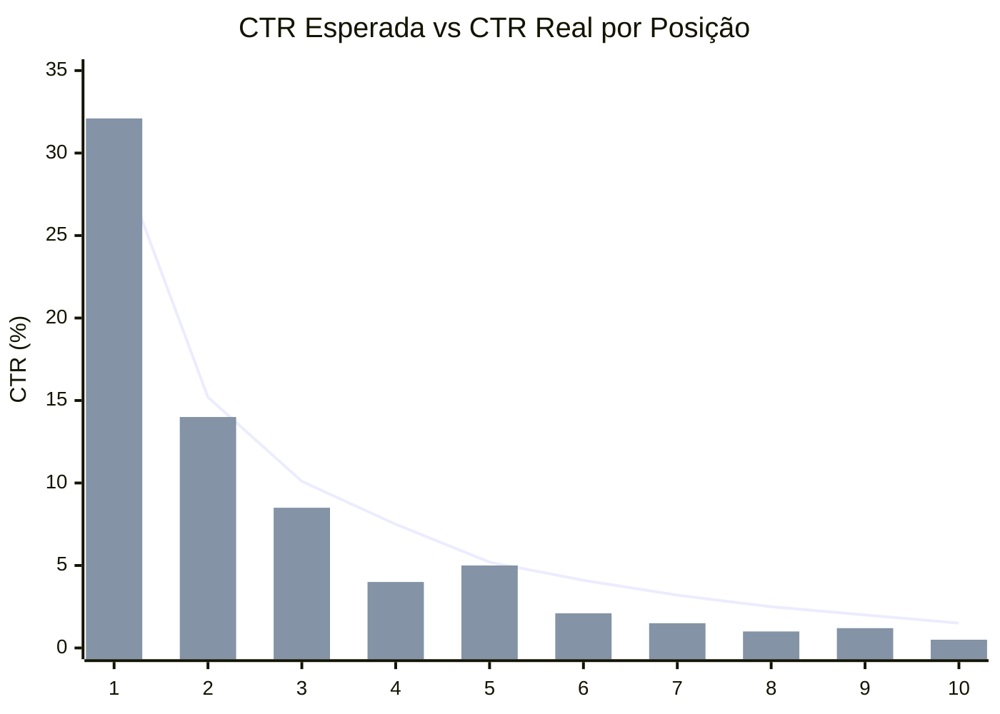
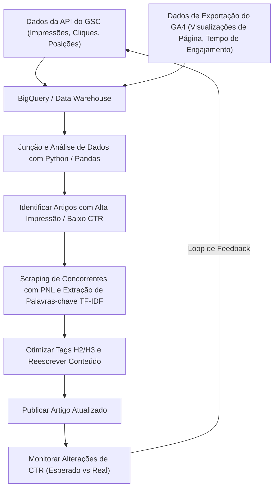

## 1. Introdução: A importância da reescrita e uma abordagem baseada em dados em blogs técnicos

Ao gerenciar um blog técnico ou mídia própria voltada para desenvolvedores, a "reescrita de artigos antigos" é tão ou mais importante do que a escrita contínua de novos artigos. Especialmente em tópicos técnicos e de TI, as informações se tornam obsoletas rapidamente, e não é incomum que trechos de código ou especificações de API escritos há alguns anos sejam agora descontinuados (Deprecated). No entanto, atualizar cegamente artigos antigos não maximizará o tráfego (visitas) dos motores de busca.

Neste artigo, explicarei uma estratégia avançada para identificar quais artigos técnicos devem ser reescritos e melhorar drasticamente as classificações de pesquisa e taxas de cliques (CTR). Para isso, usaremos dados do **Google Search Console (doravante GSC)** e do **Google Analytics 4 (GA4)**, adotando uma abordagem matemática e baseada em dados.

Especificamente, explicarei de forma abrangente desde como usar Python e BigQuery para integrar os dados do GSC e GA4 e encontrar "artigos de perda de oportunidade" com uma CTR baixa em relação ao número de impressões, até como identificar palavras-chave ausentes nos cabeçalhos H2 e H3 usando a análise TF-IDF de Processamento de Linguagem Natural (PNL) para preencher eficientemente as lacunas de conteúdo.

---

## 2. Análise da lacuna entre CTR esperada e CTR real (Introdução ao modelo matemático)

Um dos indicadores mais básicos em SEO é a "taxa de cliques (CTR) em relação à classificação de pesquisa". Geralmente, a CTR para a primeira posição é de cerca de 25-30%, a segunda posição é de cerca de 15%, e diminui acentuadamente a partir daí. Essa relação entre classificação e CTR pode ser modelada como uma distribuição seguindo a Lei de Potência (Power Law).

Sabe-se que a taxa de cliques esperada $CTR(r)$ para a classificação $r$ pode ser aproximada pela seguinte fórmula:

$$
CTR(r) = a \cdot r^{-b}
$$

Aqui, $a$ representa a CTR esperada para a primeira posição (por exemplo, $0.30$ para 30%) e $b$ é o parâmetro de decaimento (geralmente entre $1.0$ e $1.5$).

A abordagem mais eficaz para selecionar artigos para reescrever é **encontrar artigos (palavras-chave) onde a "CTR real" está significativamente abaixo dessa "CTR esperada"**. Por exemplo, se a classificação da pesquisa for a 3ª posição (CTR esperada de cerca de 10%), mas a CTR real for de apenas 2%, é muito provável que haja uma incompatibilidade entre a intenção de pesquisa e o título ou descrição, ou que os cliques estejam sendo perdidos por fatores da concorrência, como rich snippets.

O gráfico a seguir ilustra a divergência entre a CTR esperada e a CTR real em um blog técnico.



(※ A linha representa a CTR esperada e o gráfico de barras mostra a CTR real. Pode-se observar que os valores estão notavelmente abaixo nas posições 4 e 8.)

---

## 3. Extração automática de dados de desempenho de pesquisa usando a API do GSC (Python)

Embora seja possível baixar CSVs da interface web do GSC para análise, a melhor abordagem para grandes blogs ou para realizar análises contínuas é construir um sistema que extraia automaticamente os dados usando Python e a API do GSC.

Abaixo está um snippet de código em Python usando `google-api-python-client` para obter dados de desempenho por página e por consulta (cliques, impressões, CTR, posição média) num período específico.

```python
import pandas as pd
from google.oauth2 import service_account
from googleapiclient.discovery import build

def get_gsc_data(key_path, site_url, start_date, end_date):
    # Carregamento de credenciais e construção do cliente de API
    credentials = service_account.Credentials.from_service_account_file(
        key_path, scopes=['https://www.googleapis.com/auth/webmasters.readonly']
    )
    service = build('searchconsole', 'v1', credentials=credentials)

    # Configuração do payload da requisição de API (especificando página e consulta como dimensões)
    request = {
        'startDate': start_date,
        'endDate': end_date,
        'dimensions': ['page', 'query'],
        'rowLimit': 25000
    }

    # Execução da API
    response = service.searchanalytics().query(
        siteUrl=site_url, body=request
    ).execute()

    # Extração de dados da resposta e conversão para Pandas DataFrame
    rows = response.get('rows', [])
    data = []
    for row in rows:
        keys = row['keys']
        data.append({
            'page': keys[0],
            'query': keys[1],
            'clicks': row['clicks'],
            'impressions': row['impressions'],
            'ctr': row['ctr'],
            'position': row['position']
        })
    
    return pd.DataFrame(data)

# Exemplo de execução
# df_gsc = get_gsc_data('credentials.json', 'https://kenji.blog/', '2026-08-01', '2026-08-31')
# print(df_gsc.head())
```

Com este script, os dados detalhados vinculando URLs de páginas e consultas de pesquisa podem ser obtidos como um DataFrame. Isso torna possível entender de forma abrangente para quais palavras-chave artigos específicos estão aparecendo.

---

## 4. Filtrando palavras-chave técnicas com Expressões Regulares (Regex)

Uma funcionalidade muito poderosa na análise de blogs técnicos é o **filtro de expressões regulares (Regex)** do GSC.
Por exemplo, se você escreve artigos variando de frontend a backend e infraestrutura, pode querer extrair apenas "artigos de tutoriais ou de erros relacionados a Python e Pandas" para priorizar a reescrita.

Usando filtros de expressões regulares personalizadas no GSC, você pode restringir consultas sob condições complexas.

**Exemplos de filtragem de palavras-chave técnicas:**
- Investigação de erros relacionados ao Python: `^(python|pandas|numpy|matplotlib).* (error|exception|bug|erro|não funciona)`
- Construção de infraestrutura AWS: `(aws|amazon web services|ec2|s3|lambda).* (construção|configuração|tutorial|tutorial|how to)`
- Atualização de versão de biblioteca específica: `(react|vue|angular) (v17|v18|v3) (migration|migração|transição)`

Para incorporar isso numa requisição da API do GSC, você utiliza o `dimensionFilterGroups` para adicionar a condição da expressão regular. Fazendo uso intensivo dessa filtragem, você consegue extrair com precisão palavras-chave altamente valiosas orientadas para a solução de problemas, que os desenvolvedores estão "buscando justamente agora por estarem com dificuldades".

---

## 5. Integração de dados GA4 e GSC via BigQuery/Pandas

Os dados do GSC informam apenas a "classificação de pesquisa e taxa de cliques". Para descobrir "quanto tempo os usuários que chegaram àquele artigo realmente permaneceram e se chegaram à conversão (ex: navegação para um repositório GitHub ou assinatura de newsletter)", é necessário integrar (JOIN) com os dados do **Google Analytics 4 (GA4)**.

Se você está armazenando dados de exportação do GA4 e dados de exportação em massa do GSC no BigQuery, pode combiná-los usando uma consulta SQL como a seguinte. Isso permite extrair "artigos com muitas impressões e uma classificação razoável, mas que têm alta taxa de rejeição e curto tempo de engajamento".

```sql
WITH gsc_data AS (
  SELECT
    url AS page_path,
    SUM(impressions) AS total_impressions,
    SUM(clicks) AS total_clicks,
    AVG(sum_top_position) AS avg_position
  FROM
    `project.searchconsole.searchdata_url_impression`
  WHERE
    data_date BETWEEN '2026-08-01' AND '2026-08-31'
  GROUP BY
    url
),
ga4_data AS (
  SELECT
    REGEXP_REPLACE(
      (SELECT value.string_value FROM UNNEST(event_params) WHERE key = 'page_location'),
      r'^https?://[^/]+', ''
    ) AS page_path,
    COUNT(DISTINCT user_pseudo_id) AS users,
    AVG((SELECT value.int_value FROM UNNEST(event_params) WHERE key = 'engagement_time_msec')) / 1000 AS avg_engagement_sec
  FROM
    `project.analytics_123456789.events_*`
  WHERE
    event_name = 'page_view'
  GROUP BY
    page_path
)

SELECT
  g.page_path,
  g.total_impressions,
  g.total_clicks,
  SAFE_DIVIDE(g.total_clicks, g.total_impressions) AS ctr,
  g.avg_position,
  a.users,
  a.avg_engagement_sec
FROM
  gsc_data g
JOIN
  ga4_data a ON g.page_path = a.page_path
WHERE
  g.total_impressions > 1000
  AND g.avg_position BETWEEN 3 AND 15
ORDER BY
  g.total_impressions DESC
```

Com base nestes resultados, os alvos de reescrita são classificados através da seguinte matriz:

1. **Alta Impressão, Baixo CTR, Alto Engajamento**:
   Artigos em que os leitores ficam satisfeitos desde que cliquem nos resultados de pesquisa. A **modificação do título e da meta descrição** deve ser feita com prioridade máxima.
2. **Alto CTR, Baixo Engajamento**:
   Artigos em que clicam, mas cujo conteúdo decepciona, levando à saída do usuário. É necessária uma reescrita significativa do texto, como **melhorar a introdução, atualizar para o código mais recente ou melhorar a abrangência das informações (adicionar H2/H3)**.

---

## 6. Análise de lacuna de conteúdo usando PNL e TF-IDF

Uma vez identificados os artigos a serem reescritos, o passo seguinte é analisar "quais subtítulos exatos (H2/H3) e palavras-chave devem ser adicionados". Em vez de confiar na intuição aqui também, fazemos uso do **TF-IDF (Frequência do Termo - Frequência Inversa do Documento) em Processamento de Linguagem Natural (PNL)**.

O TF-IDF é uma estatística para avaliar a importância de uma certa palavra dentro desse documento.

$$
TF\text{-}IDF(t, d) = tf(t, d) \times \log\left(\frac{N}{df(t)}\right)
$$

Onde,
- $tf(t, d)$ é a frequência de ocorrência da palavra $t$ no documento $d$
- $N$ é o número total de documentos
- $df(t)$ é o número de documentos em que a palavra $t$ aparece

**Abordagem:**
1. Obtenha os dados de texto dos top 10 artigos (sites concorrentes) para a palavra-chave alvo através de raspagem (scraping), etc.
2. Prepare os dados de texto para o artigo alvo em seu próprio site.
3. Usando o `TfidfVectorizer` da biblioteca `scikit-learn` em Python, extraia palavras-chave (palavras-recurso) que aparecem de forma consistente com altas pontuações no grupo de artigos dos principais concorrentes, mas que não existem (ou têm pontuação notavelmente baixa) no artigo de seu próprio site.

```python
from sklearn.feature_extraction.text import TfidfVectorizer
import pandas as pd
import numpy as np

# documents = [Texto do próprio site, Texto do concorrente 1, Texto do concorrente 2, ...]
# Aqui assume-se uma lista de textos já separados por análise morfológica (MeCab, etc.) em japonês

def extract_missing_keywords(documents):
    vectorizer = TfidfVectorizer(max_df=0.9, min_df=2)
    tfidf_matrix = vectorizer.fit_transform(documents)
    
    feature_names = vectorizer.get_feature_names_out()
    
    # Calcula a pontuação média TF-IDF dos artigos concorrentes (índice 1 em diante)
    competitor_mean_tfidf = np.mean(tfidf_matrix[1:].toarray(), axis=0)
    
    # Obtém a pontuação TF-IDF do artigo do próprio site (índice 0)
    my_article_tfidf = tfidf_matrix[0].toarray()[0]
    
    # Calcula a lacuna de palavras que são importantes nos concorrentes, mas ausentes (ou poucas) no próprio site
    gap_scores = competitor_mean_tfidf - my_article_tfidf
    
    # Extrai as principais palavras onde a lacuna é grande
    df_gap = pd.DataFrame({'keyword': feature_names, 'gap_score': gap_scores})
    df_gap = df_gap.sort_values(by='gap_score', ascending=False)
    
    return df_gap.head(20)

# Exemplo: missing_keywords = extract_missing_keywords(processed_docs)
# print(missing_keywords)
```

Através dessa análise, você pode descobrir quantitativamente **lacunas de tópicos (lacunas de conteúdo)**, tais como "na verdade, os principais artigos mencionam sobre 'como implantar em contêineres Docker' e 'construir um pipeline CI/CD', mas não toco nisso no meu artigo".

O conjunto de palavras-chave importantes descobertas não deve ser simplesmente espalhado no texto, mas sim adicionado como seções significativas como **cabeçalhos H2 e H3 (tags de Heading)**. Escrever explicações técnicas detalhadas e trechos de código para esses cabeçalhos pode melhorar drasticamente a avaliação do Google.

---

## 7. Pipeline de dados e ciclo de melhoria contínua

O processo explicado até agora não acaba após uma única execução; transformá-lo num pipeline e executá-lo de forma contínua é a chave do sucesso em SEO. A arquitetura geral e o fluxo operacional são exibidos num fluxograma Mermaid abaixo.



Ao sistematizar essa série de passos — desde a coleta de dados do GSC e GA4, passando pela seleção de alvos baseada em análise e otimização de conteúdo via PNL, até ao monitoramento dos resultados — o blog torna-se um ativo que continua crescendo de forma automática.

---

## 8. Conclusão e perspectivas futuras

Reescrever artigos técnicos utilizando o Google Search Console não é meramente corrigir texto. Trata-se de uma engenharia avançada que faz pleno uso de dados e modelos matemáticos para apresentar uma solução otimizada para a caixa-preta que é o algoritmo do motor de busca.

Resumindo os métodos explicados neste artigo:
1. Calcular a disparidade entre a **CTR esperada e a CTR real** para identificar artigos com um grande impacto para correção.
2. Extrair automaticamente dados de desempenho utilizando a **API do GSC e Python**.
3. Integrar com os dados de engajamento do GA4 no **BigQuery** e corrigir o corpo dos artigos com altas taxas de rejeição.
4. Usar a **análise PNL com TF-IDF** para descobrir lacunas de conteúdo face aos concorrentes e otimizar os cabeçalhos (H2/H3).

As tendências tecnológicas estão em constante evolução. Para responder de forma precisa aos erros e desafios que os leitores enfrentam atualmente, certifique-se de incorporar uma estratégia de reescrita baseada em dados nas suas operações diárias.
