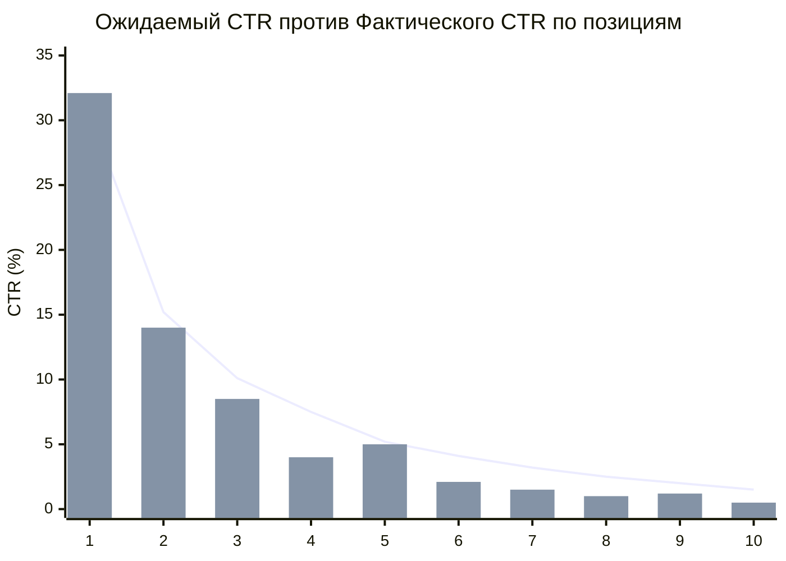
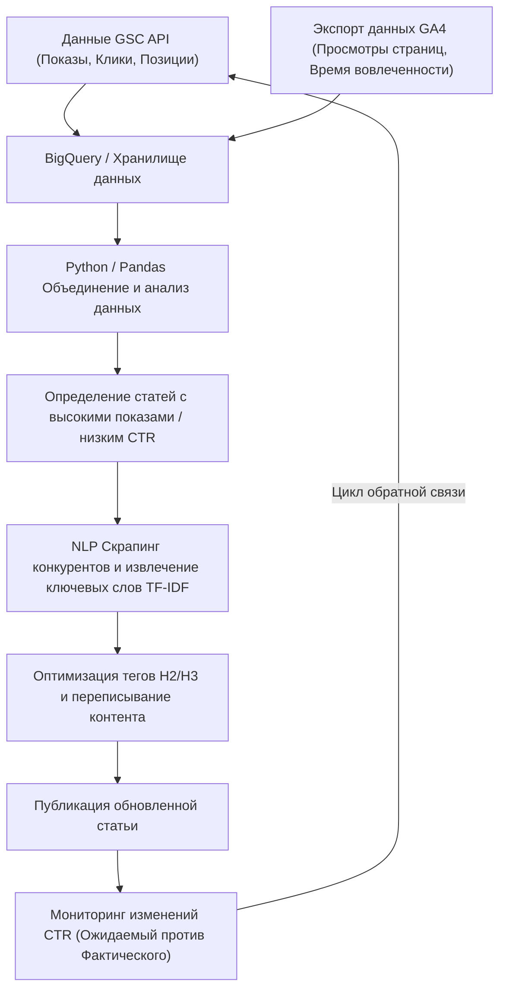

## 1. Введение: Важность переписывания и подход на основе данных в технических блогах

При ведении технического блога или корпоративного медиа для разработчиков "переписывание прошлых статей" так же важно, а возможно, и более важно, чем постоянное написание новых. Особенно в сфере IT и технологий информация быстро устаревает, и нередко фрагменты кода или спецификации API, написанные несколько лет назад, теперь устарели (Deprecated). Однако, просто слепо обновляя старые статьи, невозможно максимизировать трафик (приток посетителей) из поисковых систем.

Поэтому в этой статье будет рассказано о продвинутой стратегии, которая использует данные **Google Search Console (далее GSC)** и **Google Analytics 4 (GA4)**, а также подходы на основе данных и математических моделей для выявления технических статей, нуждающихся в переписывании, с целью значительного повышения позиций в поиске и показателя кликабельности (CTR).

В частности, мы подробно рассмотрим методы, начиная от интеграции данных GSC и GA4 с помощью Python и BigQuery для выявления "статей упущенной выгоды" с низким CTR по отношению к количеству показов (impressions), до выявления недостающих ключевых слов в заголовках H2 и H3 с использованием анализа TF-IDF из области обработки естественного языка (NLP) для эффективного заполнения пробелов в контенте.

---

## 2. Анализ разрыва между ожидаемым CTR и фактическим CTR (Введение математической модели)

Одним из самых базовых показателей в SEO является "показатель кликабельности (CTR) относительно позиции в поиске". Как правило, если позиция в поиске равна 1, CTR составляет около 25-30%, на 2-м месте — около 15%, после чего он резко падает. Эту зависимость между позицией и CTR можно смоделировать как распределение, подчиняющееся степенному закону (Power Law).

Известно, что ожидаемый показатель кликабельности $CTR(r)$ для позиции $r$ аппроксимируется следующей формулой:

$$
CTR(r) = a \cdot r^{-b}
$$

Здесь $a$ — это ожидаемый CTR на 1-м месте (например, $0.30$ для 30%), а $b$ — параметр затухания (обычно от $1.0$ до $1.5$).

Наиболее эффективный подход при выборе статей для переписывания — **найти статьи (ключевые слова), где "фактический CTR" значительно ниже "ожидаемого CTR"**. Например, если позиция в поиске — 3-я (ожидаемый CTR около 10%), но фактический CTR составляет всего 2%, высока вероятность того, что поисковое намерение не совпадает с заголовком и описанием (description) или клики забирают факторы конкурентов, такие как расширенные сниппеты.

Следующий график иллюстрирует разрыв между ожидаемым CTR и фактическим CTR в техническом блоге.



(* Линия графика показывает ожидаемый CTR, а гистограмма — фактический CTR. Можно заметить значительное отставание на 4-й и 8-й позициях.)

---

## 3. Автоматическое извлечение данных о поисковой эффективности с помощью GSC API (Python)

Хотя данные можно скачивать в формате CSV из веб-интерфейса GSC для анализа, для больших блогов или постоянного анализа лучше всего создать систему для автоматического извлечения данных на Python с помощью GSC API.

Ниже приведен фрагмент кода на Python, использующий `google-api-python-client` для получения данных о производительности по страницам и запросам (количество кликов, количество показов, CTR, средняя позиция) за определенный период.

```python
import pandas as pd
from google.oauth2 import service_account
from googleapiclient.discovery import build

def get_gsc_data(key_path, site_url, start_date, end_date):
    # Загрузка учетных данных и создание клиента API
    credentials = service_account.Credentials.from_service_account_file(
        key_path, scopes=['https://www.googleapis.com/auth/webmasters.readonly']
    )
    service = build('searchconsole', 'v1', credentials=credentials)

    # Настройка полезной нагрузки запроса к API (указание страниц и запросов в качестве параметров)
    request = {
        'startDate': start_date,
        'endDate': end_date,
        'dimensions': ['page', 'query'],
        'rowLimit': 25000
    }

    # Выполнение API-запроса
    response = service.searchanalytics().query(
        siteUrl=site_url, body=request
    ).execute()

    # Извлечение данных из ответа и преобразование в Pandas DataFrame
    rows = response.get('rows', [])
    data = []
    for row in rows:
        keys = row['keys']
        data.append({
            'page': keys[0],
            'query': keys[1],
            'clicks': row['clicks'],
            'impressions': row['impressions'],
            'ctr': row['ctr'],
            'position': row['position']
        })
    
    return pd.DataFrame(data)

# Пример выполнения
# df_gsc = get_gsc_data('credentials.json', 'https://kenji.blog/', '2026-08-01', '2026-08-31')
# print(df_gsc.head())
```

С помощью этого скрипта вы можете получить подробные данные, связывающие URL страниц и поисковые запросы, в виде DataFrame. Это позволяет получить полное представление о том, по каким ключевым словам показывается конкретная статья.

---

## 4. Фильтрация технических ключевых слов с помощью регулярных выражений (Regex)

Одной из очень мощных функций при анализе технического блога является **фильтр по регулярным выражениям (Regex)** в GSC.
Например, если вы пишете множество статей по темам от фронтенда до бэкенда и инфраструктуры, вы можете захотеть выделить только "статьи об ошибках и туториалы по Python и Pandas", чтобы определить приоритеты для переписывания.

Используя пользовательские фильтры по регулярным выражениям в GSC, вы можете сузить запросы по сложным условиям.

**Примеры фильтрации технических ключевых слов:**
- Исследование ошибок, связанных с Python: `^(python|pandas|numpy|matplotlib).* (error|exception|bug|ошибка|не работает)`
- Построение инфраструктуры, связанной с AWS: `(aws|amazon web services|ec2|s3|lambda).* (создание|настройка|туториал|tutorial|how to)`
- Обновление версий конкретных библиотек: `(react|vue|angular) (v17|v18|v3) (migration|миграция|переход)`

Если вы встраиваете это в запрос к GSC API, используйте `dimensionFilterGroups` для применения условий регулярного выражения. Искусно используя эту фильтрацию, вы сможете точечно выделять высокоценные ключевые слова, направленные на решение проблем, которые разработчики "активно гуглят прямо сейчас".

---

## 5. Интеграция данных GA4 и GSC с помощью BigQuery/Pandas

Одни только данные GSC показывают лишь "позицию в поиске и CTR". Чтобы узнать, "насколько долго пользователи, попавшие на статью, фактически оставались на ней и достигли ли они конверсии (например, переход в репозиторий GitHub или подписка на рассылку)", необходимо объединить (JOIN) их с данными **Google Analytics 4 (GA4)**.

Если вы храните экспортированные данные GA4 и данные массового экспорта GSC в BigQuery, вы можете использовать следующий SQL-запрос для их объединения и извлечения "статей с большим количеством показов и приемлемой позицией в поиске, но с высоким показателем отказов (bounce rate) или коротким временем вовлеченности".

```sql
WITH gsc_data AS (
  SELECT
    url AS page_path,
    SUM(impressions) AS total_impressions,
    SUM(clicks) AS total_clicks,
    AVG(sum_top_position) AS avg_position
  FROM
    `project.searchconsole.searchdata_url_impression`
  WHERE
    data_date BETWEEN '2026-08-01' AND '2026-08-31'
  GROUP BY
    url
),
ga4_data AS (
  SELECT
    REGEXP_REPLACE(
      (SELECT value.string_value FROM UNNEST(event_params) WHERE key = 'page_location'),
      r'^https?://[^/]+', ''
    ) AS page_path,
    COUNT(DISTINCT user_pseudo_id) AS users,
    AVG((SELECT value.int_value FROM UNNEST(event_params) WHERE key = 'engagement_time_msec')) / 1000 AS avg_engagement_sec
  FROM
    `project.analytics_123456789.events_*`
  WHERE
    event_name = 'page_view'
  GROUP BY
    page_path
)

SELECT
  g.page_path,
  g.total_impressions,
  g.total_clicks,
  SAFE_DIVIDE(g.total_clicks, g.total_impressions) AS ctr,
  g.avg_position,
  a.users,
  a.avg_engagement_sec
FROM
  gsc_data g
JOIN
  ga4_data a ON g.page_path = a.page_path
WHERE
  g.total_impressions > 1000
  AND g.avg_position BETWEEN 3 AND 15
ORDER BY
  g.total_impressions DESC
```

Используя эти результаты, можно классифицировать статьи для переписывания с помощью следующей матрицы:

1. **High Impression, Low CTR, High Engagement (Высокие показы, Низкий CTR, Высокая вовлеченность)**:
   Статьи, которыми читатели остаются довольны, если кликают на них в результатах поиска. **Исправление заголовков и мета-описаний** должно быть главным приоритетом.
2. **High CTR, Low Engagement (Высокий CTR, Низкая вовлеченность)**:
   Статьи, на которые кликают, но содержимое разочаровывает, и пользователи уходят. Требуется масштабное переписывание основного текста, например, **улучшение вступления, обновление кода до последних версий и повышение полноты информации (добавление H2/H3)**.

---

## 6. Анализ пробелов в контенте с использованием NLP и TF-IDF

Как только статьи для переписывания определены, следующим шагом является анализ того, "какие конкретно заголовки (H2/H3) или ключевые слова следует добавить". Вместо того чтобы полагаться на интуицию, мы будем использовать **TF-IDF (Term Frequency-Inverse Document Frequency) из области обработки естественного языка (NLP)**.

TF-IDF — это статистический показатель, используемый для оценки того, насколько важно слово в данном документе.

$$
TF\text{-}IDF(t, d) = tf(t, d) \times \log\left(\frac{N}{df(t)}\right)
$$

Где:
- $tf(t, d)$ — частота появления слова $t$ в документе $d$
- $N$ — общее количество документов
- $df(t)$ — количество документов, в которых встречается слово $t$

**Подход:**
1. Получите текстовые данные 10 лучших статей (с сайтов конкурентов) по целевому ключевому слову с помощью веб-скрапинга и т. д.
2. Подготовьте текстовые данные целевой статьи с вашего собственного сайта.
3. Используя `TfidfVectorizer` из библиотеки `scikit-learn` на Python, извлеките ключевые слова (характерные слова), которые часто встречаются с высоким показателем в статьях конкурентов, но отсутствуют или имеют значительно более низкий показатель в статье на вашем собственном сайте.

```python
from sklearn.feature_extraction.text import TfidfVectorizer
import pandas as pd
import numpy as np

# documents = [Текст вашего сайта, Текст статьи конкурента 1, Текст статьи конкурента 2, ...]
# Предполагается список текстов, уже разделенных на слова с помощью морфологического анализатора (например, MeCab для японского языка)

def extract_missing_keywords(documents):
    vectorizer = TfidfVectorizer(max_df=0.9, min_df=2)
    tfidf_matrix = vectorizer.fit_transform(documents)
    
    feature_names = vectorizer.get_feature_names_out()
    
    # Расчет среднего показателя TF-IDF для статей конкурентов (начиная с индекса 1)
    competitor_mean_tfidf = np.mean(tfidf_matrix[1:].toarray(), axis=0)
    
    # Получение показателей TF-IDF для статьи на вашем сайте (индекс 0)
    my_article_tfidf = tfidf_matrix[0].toarray()[0]
    
    # Расчет разрыва для слов, важных у конкурентов, но отсутствующих (или редких) на вашем сайте
    gap_scores = competitor_mean_tfidf - my_article_tfidf
    
    # Извлечение верхних слов с наибольшим разрывом
    df_gap = pd.DataFrame({'keyword': feature_names, 'gap_score': gap_scores})
    df_gap = df_gap.sort_values(by='gap_score', ascending=False)
    
    return df_gap.head(20)

# Пример: missing_keywords = extract_missing_keywords(processed_docs)
# print(missing_keywords)
```

С помощью этого анализа вы сможете количественно обнаружить **пробелы в темах (контентные пробелы)**, такие как "на самом деле, топовые статьи упоминают «как развернуть в Docker-контейнере» и «построение CI/CD пайплайна», а в моей статье об этом ни слова".

Обнаруженные группы важных ключевых слов не следует просто разбрасывать по тексту; добавив их в виде осмысленных разделов с **заголовками H2 или H3 (теги Heading)**, и написав подробные технические объяснения и фрагменты кода под этими заголовками, вы сможете значительно повысить оценку от Google.

---

## 7. Конвейер данных и цикл непрерывного улучшения

Ключ к успеху в SEO — это не просто однократное выполнение процессов, описанных до сих пор, а их превращение в конвейер и постоянное выполнение. Ниже приведена общая архитектура и рабочий процесс (workflow) в виде блок-схемы Mermaid.



Таким образом, систематизируя весь поток — от сбора данных из GSC и GA4 до выбора целей с помощью анализа, оптимизации контента с помощью NLP и мониторинга результатов — медиа-блог становится активом, который продолжает расти автоматически.

---

## 8. Заключение и перспективы

Переписывание технических статей с использованием Google Search Console — это не просто исправление текста. Это продвинутая инженерия, которая использует данные и математические модели для предложения оптимальных решений "черному ящику" алгоритмов поисковых систем.

Подведем итоги методов, описанных в этой статье:
1. Вычислите разрыв между **ожидаемым CTR и фактическим CTR** для выявления статей, на которые исправления окажут наибольшее влияние.
2. Используйте **GSC API и Python** для автоматического извлечения данных о производительности.
3. Объедините эти данные с данными о вовлеченности из GA4 в **BigQuery** и перепишите текст статей с высоким показателем отказов.
4. Выявите пробелы в контенте с конкурентами посредством **анализа NLP с использованием TF-IDF** и оптимизируйте заголовки (H2/H3).

Технологические тренды постоянно меняются. Чтобы точно отвечать на ошибки и проблемы, с которыми сейчас сталкиваются читатели, обязательно внедрите в свои повседневные операции стратегическое переписывание, опирающееся на данные.
