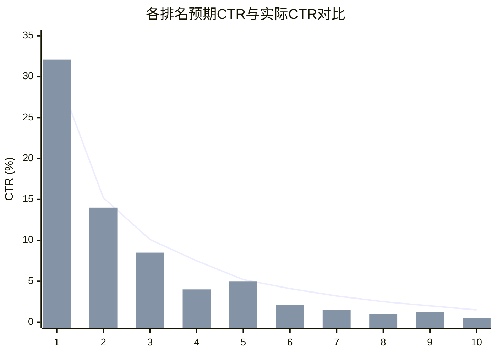
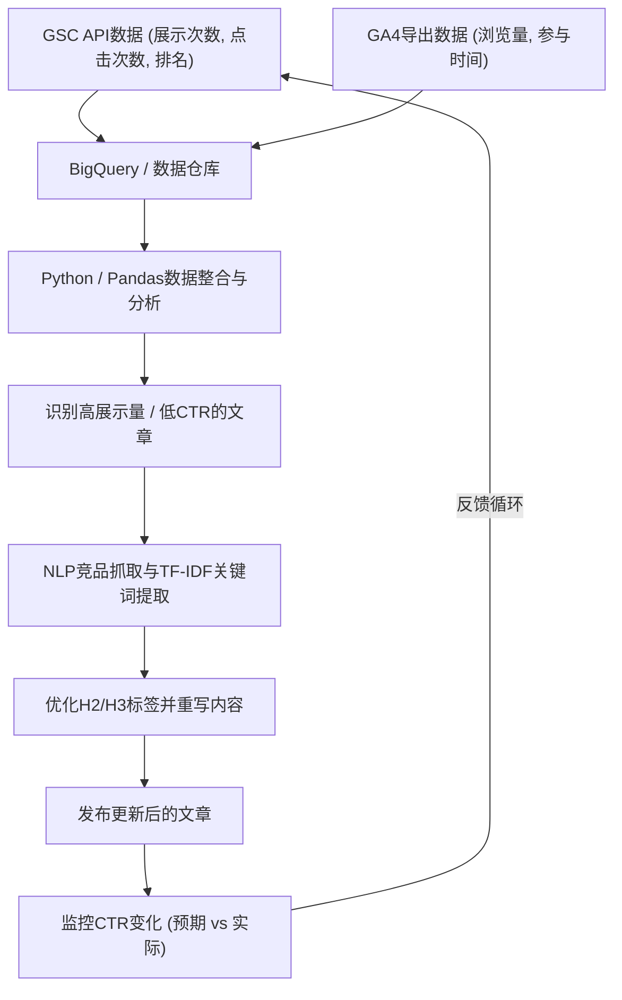

## 1. 引言：技术博客中重写的重要性与数据驱动方法

在运营技术博客或面向开发者的自有媒体时，持续撰写新文章固然重要，但“重写过去的文章”同样重要，甚至可能更为关键。尤其是IT和技术类话题，信息过时非常快，几年前编写的代码片段或API规范如今已被弃用（Deprecated）的情况屡见不鲜。然而，如果只是盲目地更新过去的文章，并不能最大化来自搜索引擎的流量（访问量）。

因此，本文将讲解如何利用**Google Search Console（以下简称GSC）**和**Google Analytics 4（GA4）**的数据，采用数据驱动及数学方法，识别出需要重写的技术文章，从而大幅提升搜索排名和点击率（CTR）的高级策略。

具体而言，本文将全面解析如何使用Python和BigQuery整合GSC和GA4数据，找出展示次数（Impressions）高但CTR低的“错失机会文章”的方法，以及如何运用NLP（自然语言处理）的TF-IDF分析来定位H2或H3标题中缺失的关键词，从而高效填补内容空白。

---

## 2. 预期CTR与实际CTR的差距分析（引入数学模型）

SEO中最基本的指标之一就是“搜索排名对应的点击率（CTR）”。一般而言，当搜索排名为第1位时，CTR约为25〜30%，第2位约为15%，此后会急剧下降。这种排名与CTR之间的关系，可以将其建模为服从幂律（Power Law）的分布。

已知对于排名 $r$ 的预期点击率 $CTR(r)$，可以通过以下公式进行近似：

$$
CTR(r) = a \cdot r^{-b}
$$

这里，$a$ 表示排名为第1位时的预期CTR（例如：30%的情况下为 $0.30$），$b$ 表示衰减参数（通常在 $1.0$ 到 $1.5$ 之间）。

在筛选重写目标文章时，最有效的方法是**寻找“实际CTR”远低于此“预期CTR”的文章（关键词）**。例如，如果某篇文章的搜索排名为第3位（预期CTR约10%），但实际CTR却只有2%，则很有可能是搜索意图与标题、描述存在偏差，或者点击被丰富网页摘要（Rich Snippets）等竞争因素夺走。

下图展示了某技术博客中预期CTR与实际CTR之间差距的示意图。



（※ 折线代表预期CTR，柱状图代表实际CTR。可以看出在第4位和第8位时，实际CTR远低于预期CTR。）

---

## 3. 使用GSC API自动提取搜索表现数据 (Python)

虽然可以从GSC的Web界面下载CSV进行分析，但为了应对大规模博客或进行持续性分析，最好的做法是构建一套使用GSC API和Python自动提取数据的机制。

以下展示了使用 `google-api-python-client` 获取特定时间段内按页面、按查询（Query）划分的表现数据（点击数、展示数、CTR、平均排名）的Python代码片段。

```python
import pandas as pd
from google.oauth2 import service_account
from googleapiclient.discovery import build

def get_gsc_data(key_path, site_url, start_date, end_date):
    # 加载凭据并构建API客户端
    credentials = service_account.Credentials.from_service_account_file(
        key_path, scopes=['https://www.googleapis.com/auth/webmasters.readonly']
    )
    service = build('searchconsole', 'v1', credentials=credentials)

    # 设置API请求的有效负载（指定页面和查询作为维度）
    request = {
        'startDate': start_date,
        'endDate': end_date,
        'dimensions': ['page', 'query'],
        'rowLimit': 25000
    }

    # 执行API
    response = service.searchanalytics().query(
        siteUrl=site_url, body=request
    ).execute()

    # 从响应中提取数据并转换为Pandas DataFrame
    rows = response.get('rows', [])
    data = []
    for row in rows:
        keys = row['keys']
        data.append({
            'page': keys[0],
            'query': keys[1],
            'clicks': row['clicks'],
            'impressions': row['impressions'],
            'ctr': row['ctr'],
            'position': row['position']
        })
    
    return pd.DataFrame(data)

# 执行示例
# df_gsc = get_gsc_data('credentials.json', 'https://kenji.blog/', '2026-08-01', '2026-08-31')
# print(df_gsc.head())
```

通过这段脚本，可以获取页面URL与搜索查询相关联的详细数据并作为DataFrame返回。这使得我们能够全面掌握特定文章是因哪些关键词而展示的。

---

## 4. 使用正则表达式（Regex）过滤技术关键词

在技术博客的分析中，GSC的一个非常强大的功能是**正则表达式（Regex）过滤器**。
例如，当你编写了从前端到后端再到基础设施等广泛领域的文章时，有时可能希望只提取“关于Python和Pandas错误及教程的文章”来决定重写的优先级。

通过使用GSC的自定义正则表达式过滤器，你可以利用复杂的条件来筛选查询。

**技术关键词过滤示例:**
- Python相关的错误排查: `^(python|pandas|numpy|matplotlib).* (error|exception|bug|错误|不运行)`
- AWS相关的基础设施搭建: `(aws|amazon web services|ec2|s3|lambda).* (搭建|配置|教程|tutorial|how to)`
- 特定库的版本升级: `(react|vue|angular) (v17|v18|v3) (migration|迁移|升级)`

当将其整合到GSC API请求中时，可以利用 `dimensionFilterGroups` 添加正则表达式的条件。通过充分利用这种过滤功能，开发者可以精准提取用户“此时此刻正遇到困难并进行搜索”的高价值、解决问题型关键词。

---

## 5. 使用BigQuery/Pandas整合GA4与GSC数据

仅靠GSC的数据只能知道“搜索排名和点击率”。要了解“访问该文章的用户，实际停留了多长时间，是否达到了转化（例如：跳转到GitHub仓库，或订阅邮件列表等）”，就需要将其与**Google Analytics 4（GA4）**的数据进行整合（JOIN）。

如果你已将GA4的导出数据和GSC的批量导出数据存储在BigQuery中，则可以使用以下类似的SQL查询将两者结合，从而提取出“展示次数多且搜索排名尚可，但跳出率高、参与度（Engagement）时间短的文章”。

```sql
WITH gsc_data AS (
  SELECT
    url AS page_path,
    SUM(impressions) AS total_impressions,
    SUM(clicks) AS total_clicks,
    AVG(sum_top_position) AS avg_position
  FROM
    `project.searchconsole.searchdata_url_impression`
  WHERE
    data_date BETWEEN '2026-08-01' AND '2026-08-31'
  GROUP BY
    url
),
ga4_data AS (
  SELECT
    REGEXP_REPLACE(
      (SELECT value.string_value FROM UNNEST(event_params) WHERE key = 'page_location'),
      r'^https?://[^/]+', ''
    ) AS page_path,
    COUNT(DISTINCT user_pseudo_id) AS users,
    AVG((SELECT value.int_value FROM UNNEST(event_params) WHERE key = 'engagement_time_msec')) / 1000 AS avg_engagement_sec
  FROM
    `project.analytics_123456789.events_*`
  WHERE
    event_name = 'page_view'
  GROUP BY
    page_path
)

SELECT
  g.page_path,
  g.total_impressions,
  g.total_clicks,
  SAFE_DIVIDE(g.total_clicks, g.total_impressions) AS ctr,
  g.avg_position,
  a.users,
  a.avg_engagement_sec
FROM
  gsc_data g
JOIN
  ga4_data a ON g.page_path = a.page_path
WHERE
  g.total_impressions > 1000
  AND g.avg_position BETWEEN 3 AND 15
ORDER BY
  g.total_impressions DESC
```

使用此结果，可通过以下矩阵对重写目标进行分类：

1. **High Impression, Low CTR, High Engagement**:
   只要在搜索结果中被点击，读者就会感到满意的文章。应将**修改标题和元描述（Meta Description）**作为最高优先级。
2. **High CTR, Low Engagement**:
   虽然有点击，但内容未达到期望导致用户离开的文章。需要进行大规模的正文重写，如**改善引言、更新到最新代码、提高信息的全面性（添加H2/H3）**等。

---

## 6. 使用NLP和TF-IDF进行内容差距分析

确定了需要重写的文章后，接下来要做的就是分析“具体应该添加什么样的标题（H2/H3）或关键词”。在这一步中也不能凭直觉，而是要运用**自然语言处理（NLP）中的TF-IDF（词频-逆文档频率）**。

TF-IDF 是一种用于评估某个词语在该文档中重要程度的统计指标。

$$
TF\text{-}IDF(t, d) = tf(t, d) \times \log\left(\frac{N}{df(t)}\right)
$$

这里，
- $tf(t, d)$ 是词语 $t$ 在文档 $d$ 中的出现频率
- $N$ 是所有文档的总数
- $df(t)$ 是包含词语 $t$ 的文档数量

**方法:**
1. 通过爬虫等方式获取目标关键词排名前10的文章（竞争对手网站）的文本数据。
2. 准备自己网站中目标文章的文本数据。
3. 使用Python `scikit-learn` 中的 `TfidfVectorizer`，提取在竞品排名靠前文章中普遍存在且得分较高，但在自己网站文章中不存在或得分极低的关键词（特征词）。

```python
from sklearn.feature_extraction.text import TfidfVectorizer
import pandas as pd
import numpy as np

# documents = [自己网站的文本, 竞品文章1的文本, 竞品文章2的文本, ...]
# 这里假设使用了中文分词工具（如Jieba等）进行分词后的文本列表

def extract_missing_keywords(documents):
    vectorizer = TfidfVectorizer(max_df=0.9, min_df=2)
    tfidf_matrix = vectorizer.fit_transform(documents)
    
    feature_names = vectorizer.get_feature_names_out()
    
    # 计算竞品文章（索引1及之后）的平均TF-IDF得分
    competitor_mean_tfidf = np.mean(tfidf_matrix[1:].toarray(), axis=0)
    
    # 获取自己网站文章（索引0）的TF-IDF得分
    my_article_tfidf = tfidf_matrix[0].toarray()[0]
    
    # 计算在竞品中重要但在自己网站中没有（或很少）的词语差距
    gap_scores = competitor_mean_tfidf - my_article_tfidf
    
    # 提取差距较大的前几名词语
    df_gap = pd.DataFrame({'keyword': feature_names, 'gap_score': gap_scores})
    df_gap = df_gap.sort_values(by='gap_score', ascending=False)
    
    return df_gap.head(20)

# 示例: missing_keywords = extract_missing_keywords(processed_docs)
# print(missing_keywords)
```

通过这一分析，我们可以定量地发现**话题遗漏（内容差距）**，例如：“实际上排名靠前的文章都提到了‘如何部署到Docker容器’或‘构建CI/CD流水线’，但我的文章却没有涉及”。

发现的这些重要关键词组，不应仅仅是随意散布在正文中，而是应该作为**H2或H3标题（Heading标签）**添加为有意义的独立部分，并针对标题编写详细的技术解说和代码片段，这样可以显著提高Google的评价。

---

## 7. 数据流水线与持续改善循环

到目前为止讲解的流程，并不是执行一次就结束了，将其流水线化并持续执行才是SEO成功的关键。以下使用Mermaid流程图展示了整体的架构和运维流程。



通过将“从GSC和GA4收集数据 -> 通过分析选定目标 -> 通过NLP优化内容 -> 监控结果”这一系列流程进行系统化，博客媒体将成为一项能够持续自动增长的资产。

---

## 8. 总结与未来展望

利用Google Search Console重写技术文章绝不仅仅是修改一下文字。这是一项面对搜索引擎算法这个“黑盒”，充分利用数据和数学模型提出最优解的高级工程操作。

本文讲解的方法总结如下：
1. 计算**预期CTR与实际CTR的差距**，找出修改后影响较大的文章。
2. 使用**GSC API和Python**自动提取表现数据。
3. 在**BigQuery**上结合GA4的参与度数据，修改跳出率高的文章正文。
4. 通过**使用TF-IDF的NLP分析**，发现与竞品的内容差距，并优化标题（H2/H3）。

技术趋势总是在不断变化。为了能够准确解答读者当下遇到的错误和难题，请务必尝试将借助数据的战略性重写纳入到日常的运营中。
