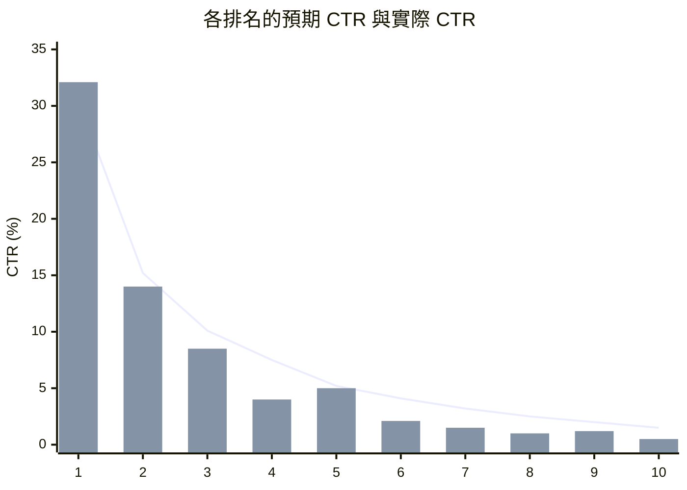
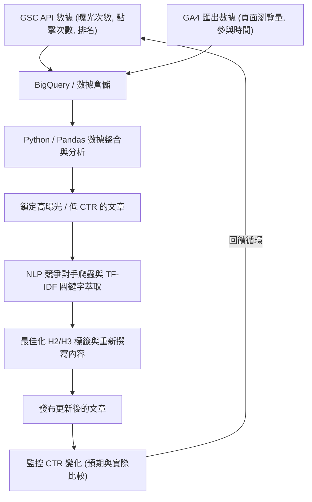

## 1. 前言：技術部落格中重新撰寫的重要性與數據驅動方法

在經營技術部落格或針對開發者的自有媒體時，與持續撰寫新文章同等重要、甚至更重要的，就是「重新撰寫過往文章」。特別是 IT 與技術相關的主題，資訊過時得很快，幾年前寫的程式碼片段或 API 規格在現在已不建議使用 (Deprecated) 的情況也屢見不鮮。然而，如果只是盲目地更新舊文章，是無法將來自搜尋引擎的流量 (流入) 最大化的。

因此，本文將解說如何活用 **Google Search Console (以下簡稱 GSC)** 與 **Google Analytics 4 (GA4)** 的數據，採用數據驅動且數學化的方法，來鎖定應該重新撰寫的技術文章，並大幅提升搜尋排名與點擊率 (CTR) 的進階策略。

具體而言，我們將網羅各種方法，從運用 Python 和 BigQuery 整合 GSC 與 GA4 數據，找出相對於曝光次數但 CTR 卻很低的「錯失機會文章」，到使用 NLP (自然語言處理) 的 TF-IDF 分析，來找出 H2 或 H3 標題中缺乏的關鍵字，有效率地填補內容差距的手法。

---

## 2. 預期 CTR 與實際 CTR 的差距分析 (導入數學模型)

SEO 中最基本的指標之一就是「相對於搜尋排名的點擊率 (CTR)」。一般來說，當搜尋排名第 1 時的 CTR 大約是 25〜30%，第 2 名約 15%，之後便會呈現急遽下降的特性。這個排名與 CTR 的關係，可以被模型化為服從冪法則 (Power Law) 的分佈。

已知相對於排名 $r$ 的預期點擊率 $CTR(r)$ 可以用以下數學公式來近似：

$$
CTR(r) = a \cdot r^{-b}
$$

在此，$a$ 代表第 1 名時的預期 CTR (例如：30% 的情況為 $0.30$)，$b$ 代表衰減參數 (通常介於 $1.0$ 到 $1.5$ 之間)。

在選定要重新撰寫的文章時，最有效的方法是**找出「實際 CTR」遠低於「預期 CTR」的文章 (關鍵字)**。舉例來說，儘管搜尋排名第 3 名 (預期 CTR 約為 10%)，但實際 CTR 卻只有 2% 的話，就可以判斷很有可能是搜尋意圖與標題、描述 (Description) 產生了落差，又或者是受到複合式摘要 (Rich Snippets) 等競爭因素的影響而被搶走了點擊。

下方的圖表展示了某技術部落格中預期 CTR 與實際 CTR 之間落差的示意圖。



(※ 折線代表預期 CTR，長條圖代表實際 CTR。可以確認在第 4 名與第 8 名時出現了大幅低於預期的情況。)

---

## 3. 使用 GSC API 自動擷取搜尋成效數據 (Python)

雖然從 GSC 的網頁介面下載 CSV 進行分析也是可行的，但為了應付大規模的部落格或進行持續性的分析，最好的方式還是建構一套使用 GSC API 搭配 Python 來自動擷取數據的機制。

以下展示了一個 Python 程式碼片段，使用 `google-api-python-client` 來取得特定期間內依頁面、依查詢 (Query) 的成效數據 (點擊次數、曝光次數、CTR、平均排名)。

```python
import pandas as pd
from google.oauth2 import service_account
from googleapiclient.discovery import build

def get_gsc_data(key_path, site_url, start_date, end_date):
    # 讀取認證資訊並建構 API 客戶端
    credentials = service_account.Credentials.from_service_account_file(
        key_path, scopes=['https://www.googleapis.com/auth/webmasters.readonly']
    )
    service = build('searchconsole', 'v1', credentials=credentials)

    # API 請求的 Payload 設定 (指定頁面與查詢為維度)
    request = {
        'startDate': start_date,
        'endDate': end_date,
        'dimensions': ['page', 'query'],
        'rowLimit': 25000
    }

    # 執行 API
    response = service.searchanalytics().query(
        siteUrl=site_url, body=request
    ).execute()

    # 從回應中擷取數據並轉換為 Pandas DataFrame
    rows = response.get('rows', [])
    data = []
    for row in rows:
        keys = row['keys']
        data.append({
            'page': keys[0],
            'query': keys[1],
            'clicks': row['clicks'],
            'impressions': row['impressions'],
            'ctr': row['ctr'],
            'position': row['position']
        })
    
    return pd.DataFrame(data)

# 執行範例
# df_gsc = get_gsc_data('credentials.json', 'https://kenji.blog/', '2026-08-01', '2026-08-31')
# print(df_gsc.head())
```

透過這支腳本，可以將頁面 URL 與搜尋查詢關聯起來，以 DataFrame 的形式取得詳細數據。這使得我們能夠全面掌握特定文章是透過哪些關鍵字顯示出來的。

---

## 4. 使用正規表示式 (Regex) 過濾技術關鍵字

在技術部落格的分析中，GSC 的**正規表示式 (Regex) 過濾器**是一項非常強大的功能。
舉例來說，當撰寫的文章橫跨前端、後端到基礎設施等多種領域時，我們有時會希望只萃取出「與 Python 或 Pandas 相關的錯誤或教學文章」，藉此決定重新撰寫的優先順序。

使用 GSC 的自訂正規表示式過濾器，就可以透過複雜的條件來篩選查詢。

**技術關鍵字過濾的實際範例:**
- Python 相關的錯誤調查: `^(python|pandas|numpy|matplotlib).* (error|exception|bug|錯誤|無法執行)`
- AWS 相關的基礎設施建置: `(aws|amazon web services|ec2|s3|lambda).* (建置|設定|教學|tutorial|how to)`
- 特定函式庫的版本升級: `(react|vue|angular) (v17|v18|v3) (migration|遷移|轉移)`

若要將此整合到 GSC API 的請求中，可以活用 `dimensionFilterGroups` 來加上正規表示式的條件。充分利用這種過濾方式，就能精準地萃取出開發者「正因為遇到困難而進行搜尋」的高價值、解決問題型關鍵字。

---

## 5. 透過 BigQuery/Pandas 整合 GA4 與 GSC 數據

只靠 GSC 的數據，我們只能知道「搜尋排名與點擊率」。若要了解「來到該文章的使用者，實際停留了多久，以及是否達成轉換 (例如：前往 GitHub 儲存庫或訂閱電子報等)」，就必須整合 (JOIN) **Google Analytics 4 (GA4)** 的數據。

如果已將 GA4 的匯出數據與 GSC 的批次匯出數據儲存在 BigQuery 中，可以透過以下 SQL 查詢將兩者結合，進而萃取出「曝光次數多、搜尋排名也還不錯，但跳出率高或參與時間短的文章」。

```sql
WITH gsc_data AS (
  SELECT
    url AS page_path,
    SUM(impressions) AS total_impressions,
    SUM(clicks) AS total_clicks,
    AVG(sum_top_position) AS avg_position
  FROM
    `project.searchconsole.searchdata_url_impression`
  WHERE
    data_date BETWEEN '2026-08-01' AND '2026-08-31'
  GROUP BY
    url
),
ga4_data AS (
  SELECT
    REGEXP_REPLACE(
      (SELECT value.string_value FROM UNNEST(event_params) WHERE key = 'page_location'),
      r'^https?://[^/]+', ''
    ) AS page_path,
    COUNT(DISTINCT user_pseudo_id) AS users,
    AVG((SELECT value.int_value FROM UNNEST(event_params) WHERE key = 'engagement_time_msec')) / 1000 AS avg_engagement_sec
  FROM
    `project.analytics_123456789.events_*`
  WHERE
    event_name = 'page_view'
  GROUP BY
    page_path
)

SELECT
  g.page_path,
  g.total_impressions,
  g.total_clicks,
  SAFE_DIVIDE(g.total_clicks, g.total_impressions) AS ctr,
  g.avg_position,
  a.users,
  a.avg_engagement_sec
FROM
  gsc_data g
JOIN
  ga4_data a ON g.page_path = a.page_path
WHERE
  g.total_impressions > 1000
  AND g.avg_position BETWEEN 3 AND 15
ORDER BY
  g.total_impressions DESC
```

利用這個結果，我們可以依照以下矩陣將要重新撰寫的對象進行分類：

1. **High Impression, Low CTR, High Engagement**:
   只要在搜尋結果中被點擊，讀者就會感到滿意的文章。應將**修改標題與 Meta Description** 列為最優先事項。
2. **High CTR, Low Engagement**:
   雖然會被點擊，但內容不如預期而導致讀者離開的文章。需要進行大規模的內文重新撰寫，例如**改善前言、更新至最新的程式碼，以及提升資訊的完整度 (新增 H2/H3)**。

---

## 6. 使用 NLP 與 TF-IDF 進行內容差距分析

鎖定應該重新撰寫的文章後，接下來要做的就是分析「具體來說應該新增什麼樣的標題 (H2/H3) 或關鍵字」。在這裡我們同樣不依靠直覺，而是活用**自然語言處理 (NLP) 中的 TF-IDF (Term Frequency-Inverse Document Frequency)**。

TF-IDF 是一種用來評估某個單字在該文件中重要程度的統計量。

$$
TF\text{-}IDF(t, d) = tf(t, d) \times \log\left(\frac{N}{df(t)}\right)
$$

在此，
- $tf(t, d)$ 為單字 $t$ 在文件 $d$ 中的出現頻率
- $N$ 為所有文件的總數
- $df(t)$ 為出現單字 $t$ 的文件數量

**方法:**
1. 透過網路爬蟲等方式，取得目標關鍵字排名前 10 名的文章 (競爭對手網站) 的文字數據。
2. 準備好自己網站中目標文章的文字數據。
3. 使用 Python `scikit-learn` 的 `TfidfVectorizer`，萃取出在競爭對手前幾名文章中普遍獲得高分，但在自己網站的文章中卻不存在，或是分數明顯偏低的關鍵字 (特徵詞)。

```python
from sklearn.feature_extraction.text import TfidfVectorizer
import pandas as pd
import numpy as np

# documents = [自己網站的文字, 競爭對手文章1的文字, 競爭對手文章2的文字, ...]
# 這裡假設已經備妥使用中文斷詞系統 (如 Jieba 等) 切分好的文字列表

def extract_missing_keywords(documents):
    vectorizer = TfidfVectorizer(max_df=0.9, min_df=2)
    tfidf_matrix = vectorizer.fit_transform(documents)
    
    feature_names = vectorizer.get_feature_names_out()
    
    # 計算競爭對手文章 (索引 1 之後) 的平均 TF-IDF 分數
    competitor_mean_tfidf = np.mean(tfidf_matrix[1:].toarray(), axis=0)
    
    # 取得自己網站文章 (索引 0) 的 TF-IDF 分數
    my_article_tfidf = tfidf_matrix[0].toarray()[0]
    
    # 計算競爭對手覺得重要，但自己網站中缺乏 (或較少) 的單字差距
    gap_scores = competitor_mean_tfidf - my_article_tfidf
    
    # 萃取出差距最大的前幾名單字
    df_gap = pd.DataFrame({'keyword': feature_names, 'gap_score': gap_scores})
    df_gap = df_gap.sort_values(by='gap_score', ascending=False)
    
    return df_gap.head(20)

# 範例: missing_keywords = extract_missing_keywords(processed_docs)
# print(missing_keywords)
```

透過這項分析，可以量化地發現**主題的遺漏 (內容差距)**，例如：「原來排名前面的文章也提到了『部署至 Docker 容器的方法』與『建置 CI/CD 流程』，但我的文章卻沒有觸及」。

發現的重要關鍵字群不能只是隨便散佈在內文中，而是必須將它們作為有意義的段落，以 **H2 或 H3 標題 (Heading 標籤)** 的形式加入，並針對標題撰寫詳細的技術解說與程式碼片段，如此一來便能大幅提升 Google 的評價。

---

## 7. 數據管道與持續改善循環

上述解說的流程並不是做一次就結束了，將其管道化 (Pipeline) 並持續執行，才是 SEO 成功的關鍵。以下使用 Mermaid 的流程圖來展示整體的架構與營運流程。



像這樣，將從 GSC 與 GA4 收集數據、透過分析選定目標、利用 NLP 最佳化內容，一直到監控結果的一連串流程系統化，就能讓部落格媒體成為持續自動成長的資產。

---

## 8. 總結與未來展望

活用 Google Search Console 來重新撰寫技術文章，並不僅僅是修改文字而已。這是一項針對搜尋引擎演算法這個黑盒子，透過運用數據與數學模型來提出最佳解答的高階工程。

總結本文解說的手法：
1. 計算**預期 CTR 與實際 CTR 的落差**，鎖定修改後成效最顯著的文章。
2. 使用 **GSC API 與 Python** 自動擷取成效數據。
3. 在 **BigQuery** 上結合 GA4 的參與度數據，修改跳出率較高文章的內文。
4. 透過**使用 TF-IDF 的 NLP 分析**，發現與競爭對手之間的內容差距，並最佳化標題 (H2/H3)。

技術趨勢會不斷改變。為了能精準回應讀者目前面臨的錯誤或課題，請務必將這種數據為輔的戰略性重新撰寫，融入到日常的營運當中。
