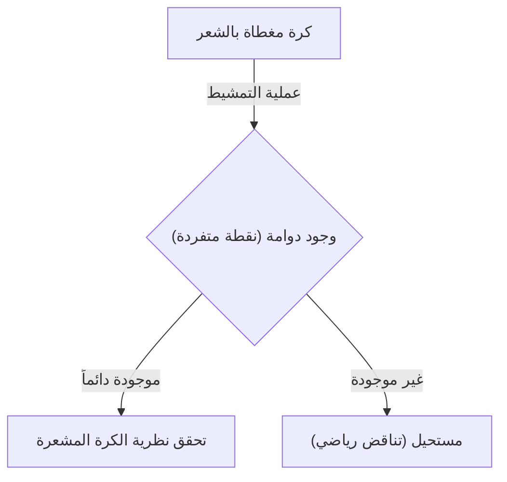
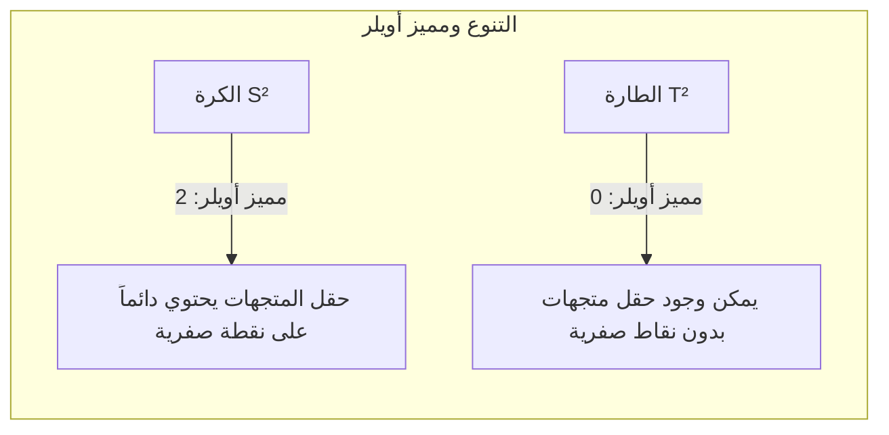

## مقدمة

في فرع الرياضيات المعروف بالطوبولوجيا (التبولوجيا)، توجد العديد من النظريات التي تتميز بأنها مثيرة للاهتمام بديهياً وقوية في نفس الوقت. من أشهر هذه النظريات **نظرية الكرة المشعرة** (Hairy Ball Theorem). يُعبَّر عن هذه النظرية بعبارة بصرية واضحة جداً: "لا يمكن تمشيط كرة مغطاة بالشعر بشكل مسطح بالكامل دون إحداث دوامة واحدة على الأقل".

ولكن، تخفي هذه النظرية وراءها معاني رياضية عميقة تؤثر على الطقس في كوكبنا، ورسومات الكمبيوتر، وحتى القوانين الأساسية للفيزياء. في هذا المقال، سنشرح بالتفصيل المعنى البديهي لهذه النظرية، وصياغتها الرياضية، وتطبيقاتها المذهلة.

## ما هي نظرية الكرة المشعرة؟

ذُكرت نظرية الكرة المشعرة لأول مرة بواسطة هنري بوانكاريه (Henri Poincaré) في عام 1885، وتم إثباتها بدقة بواسطة لويتزن إغبرتوس جان براور (Luitzen Egbertus Jan Brouwer) في عام 1912.

### الفهم البديهي

تخيل كرة مغطاة بالكامل بشعر دقيق كثيف، مثل كرة التنس أو حبة جوز الهند. أنت تحاول استخدام مشط لتمليس شعر هذه الكرة بشكل مسطح. هل يمكنك تمشيط كل الشعر بسلاسة على طول سطح الكرة دون إحداث أي "دوامة" (منطقة يبرز فيها الشعر) أو "فرق" في أي مكان؟

تجزم نظرية الكرة المشعرة بأنه **"من المستحيل فعل ذلك تماماً"**.

بغض النظر عن مدى براعتك في تمشيط الشعر، يجب أن يكون هناك مكان واحد على الأقل يقف فيه الشعر بشكل مستقيم (دوامة) أو نقطة لا يوجد فيها شعر على الإطلاق (نقطة متفردة).

### الصياغة الرياضية

دعونا نعبر عن هذه الحقيقة البديهية بدقة باستخدام لغة الرياضيات (خاصة الهندسة التفاضلية والطوبولوجيا).

رياضياً، يُمثَّل "الشعر" كـ "متجه مماس" عند كل نقطة على سطح الكرة. و"تمشيط كل الشعر بسلاسة" يعادل تعريف "حقل متجهات مماسية متصلة غير صفرية" عبر السطح الكامل للكرة.

النص الدقيق للنظرية هو كالتالي:

> لا يوجد حقل متجهات مماسية متصلة غير صفرية في كل مكان على كرة ذات أبعاد زوجية $S^{2n}$.

يُشار إلى الكرة العادية في مساحتنا ثلاثية الأبعاد بـ $S^2$ لأن سطحها ثنائي الأبعاد. نظراً لأن 2 عدد زوجي، تنطبق هذه النظرية.

وبالتعبير الرياضي، لأي حقل متجهات مماسية متصلة $V(p)$ على الكرة $S^2$ (حيث $p \in S^2$)، توجد دائماً نقطة $p_0 \in S^2$ بحيث:
$$
V(p_0) = 0
$$
هذه النقطة $p_0$ التي يكون فيها $V(p_0) = 0$ تقابل "الدوامة" أو "المكان الذي يقف فيه الشعر".

## لماذا يحدث هذا؟

الأساس الكامن وراء هذه النظرية هو ثابت طوبولوجي يُعرف باسم **مميز أويلر** (Euler characteristic).

يتم حساب مميز أويلر $\chi$ لمجسم متعدد الوجوه باستخدام الصيغة الشهيرة التالية (معادلة أويلر للمجسمات المتعددة الوجوه)، باستخدام عدد الرؤوس ($V$)، وعدد الحواف ($E$)، وعدد الوجوه ($F$):

$$
\chi = V - E + F
$$

بالنسبة لمجسم متكافئ طوبولوجياً مع الكرة، يكون مميز أويلر دائماً $\chi = 2$.

وفقاً لنظرية بوانكاريه-هوبف (Poincaré-Hopf Theorem)، فإن مجموع مؤشرات النقاط المتفردة (النقاط التي يكون فيها المتجه صفراً) لحقل متجهات على تنوع (manifold) يساوي مميز أويلر لهذا التنوع.

بصيغة رياضية:
$$
\sum_{i} \text{المؤشر}_{x_i}(V) = \chi(M)
$$
حيث $M$ هو التنوع (في هذه الحالة الكرة $S^2$).

في حالة الكرة، $\chi(S^2) = 2$. لكي يكون مجموع المؤشرات 2، يجب أن توجد على الأقل نقطة متفردة واحدة (نقطة مؤشرها ليس صفراً). نظراً لأن المجموع لا يمكن أن يكون 0 أبداً، فإن "حالة عدم وجود نقاط متفردة (حقل متجهات غير صفري في كل مكان)" مستحيلة.

## ماذا لو كان الشكل طارة (على شكل كعكة الدونات)؟

هنا يطرح سؤال مثير للاهتمام. ماذا لو كان الشكل يشبه الدونات (طارة $T^2$) بدلاً من كرة؟

في الواقع، مميز أويلر للطارة هو $\chi(T^2) = 0$.

لذلك، يصبح الجانب الأيمن في نظرية بوانكاريه-هوبف صفراً. وهذا يعني أنه من **الممكن** إنشاء حقل متجهات متصلة بدون أي نقاط متفردة.

بشكل بديهي، إذا كان لدينا شكل دونات مغطى بالشعر، فيمكننا تمشيط الشعر بسلاسة في اتجاه واحد حول ثقب الدونات دون إحداث أي دوامة.

## تطبيقات مذهلة في العالم الحقيقي

نظرية الكرة المشعرة ليست مجرد لغز رياضي. بل تساعد في تفسير ظواهر مختلفة في العالم الحقيقي، مثل الفيزياء، والأرصاد الجوية، والهندسة.

### 1. الأرصاد الجوية: الرياح على الأرض

لنتخيل أن الأرض عبارة عن كرة كبيرة $S^2$. الرياح هي حركة الهواء على طول سطح الأرض، وهي تمثل بالضبط "حقل متجهات مماسية" على سطح الكرة.

على افتراض أن سرعة الرياح واتجاهها يتغيران بشكل مستمر على الأرض، تنطبق نظرية الكرة المشعرة مباشرة. أي أنه **"يجب أن يكون هناك مكان ما على الأرض تكون فيه سرعة الرياح صفراً تماماً"**.

وهذا يثبت رياضياً أنه "يوجد دائماً مكان على الأرض في حالة هدوء للرياح (نقطة متفردة مثل عين الإعصار)". هبوب الرياح في كل مكان على الأرض في نفس الوقت هو أمر مستحيل طوبولوجياً.

### 2. رسومات الكمبيوتر (CG)

تحمل هذه النظرية أهمية كبيرة في عالم رسومات الكمبيوتر ثلاثية الأبعاد أيضاً.

تخيل محاولة توليد فراء أو شعر على رأس شخصية أو جسم حيوان (كائنات متكافئة للكرة). حتى لو حاول المبرمج أو الفنان تسوية كل الشعر بسلاسة في اتجاه معين، فستظهر دائماً دوامات أو تجمعات شعر غير طبيعية.

لتجنب ذلك، تستخدم برامج الرسوميات تقنيات مثل تعديل طوبولوجيا النموذج (إخفاء النقاط المتفردة في مناطق غير مرئية) أو تقسيمه إلى أجزاء متعددة لحساب حقول المتجهات.

### 3. فيزياء البلازما ومفاعلات الاندماج النووي

في الأجهزة التي يتم البحث فيها لتحقيق توليد طاقة الاندماج النووي، هناك طريقة حصر مغناطيسي تُعرف باسم "توكاماك" (Tokamak).

لحصر البلازما بشكل مستقر، يجب ترتيب خطوط المجال المغناطيسي بسلاسة على طول سطح الوعاء. إذا كان الوعاء كروياً ($S^2$)، فبموجب نظرية الكرة المشعرة، ستكون هناك دائماً نقطة يكون فيها المجال المغناطيسي صفراً (نقطة متفردة)، مما سيؤدي إلى مشكلة قاتلة حيث تتسرب البلازما من تلك النقطة.

لهذا السبب، فإن وعاء حصر البلازما في مفاعلات التوكاماك ليس كروياً، بل يتخذ شكل **طارة (على شكل دونات)**. باستخدام شكل الطارة ($\chi = 0$)، من الممكن ترتيب خطوط المجال المغناطيسي بسلاسة دون إنشاء نقاط متفردة.

## الخلاصة

"نظرية الكرة المشعرة" هي نظرية ذات اسم فكاهي بعض الشيء وصورة بديهية، ولكن تكمن في جوهرها فكرة رياضية قوية وهي الطوبولوجيا.

*   **الاستنتاج البديهي:** لا يمكن تمشيط كرة مغطاة بالشعر دون إحداث دوامة.
*   **الحقيقة الرياضية:** أي حقل متجهات مماسية متصلة على كرة بمميز أويلر يساوي 2، سيحتوي دائماً على نقطة صفرية.
*   **التطبيقات العملية:** ترتبط بالرياح على الأرض، وحتى بتصميم شكل مفاعلات الاندماج النووي.

يمكن القول إنها نظرية رائعة تُظهر كيف تصف الرياضيات العالم الحقيقي بجمال ودقة. بعد معرفتك بهذه النظرية، قد تنظر إلى العالم من منظور مختلف قليلاً عندما تنظر إلى خريطة الطقس في يوم عاصف أو عندما تمسح على فراء كلب.
