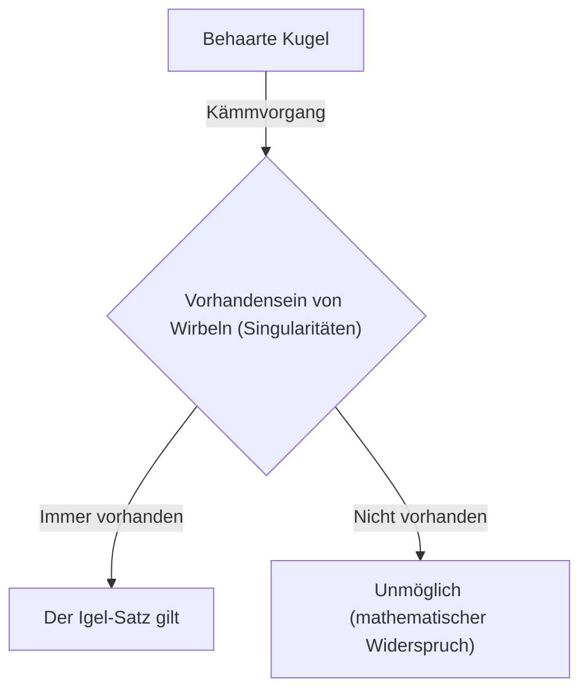
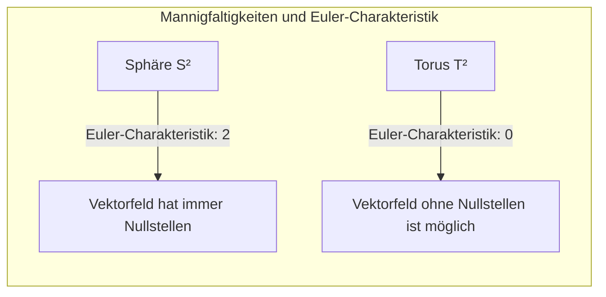

## Einleitung

In dem mathematischen Bereich der Topologie (Topologie) gibt es viele intuitiv interessante und mächtige Sätze. Einer der berühmtesten unter ihnen ist der **Igel-Satz** ([Hairy Ball Theorem](https://kenji.blog/de/p/hairy-ball-theorem/)). Dieser Satz wird in einer sehr visuellen und leicht verständlichen Formulierung ausgedrückt: "Man kann einen behaarten Ball nicht glatt kämmen, ohne dass mindestens ein Wirbel entsteht."

Doch dahinter verbirgt sich eine tiefgehende mathematische Bedeutung, die das Wetter auf unserer Erde, Computergrafiken und sogar die grundlegenden physikalischen Gesetze beeinflusst. In diesem Artikel werden wir die intuitive Bedeutung dieses Satzes, seine mathematische Formulierung und überraschende Anwendungsbeispiele im Detail erklären.

## Was ist der Igel-Satz?

Der Igel-Satz wurde 1885 erstmals von [Henri Poincaré](https://kenji.blog/de/p/poincare/) erwähnt und 1912 von Luitzen Egbertus Jan Brouwer streng bewiesen.

### Intuitives Verständnis

Stellen Sie sich vor: Eine Kugel, wie ein Tennisball oder eine Kokosnuss, deren gesamte Oberfläche dicht mit feinen Haaren bedeckt ist. Sie versuchen, die Haare auf diesem Ball mit einem Kamm flachzustreichen. Ist es möglich, alle Haare reibungslos entlang der Oberfläche des Balls flachzukämmen, ohne irgendwo einen "Wirbel" oder "Scheitel" zu erzeugen?

Der Igel-Satz behauptet: **"Das ist absolut unmöglich."**

Egal wie geschickt Sie die Haare kämmen, es wird immer mindestens einen Punkt geben, an dem die Haare gerade abstehen (ein Wirbel), oder einen Punkt ganz ohne Haare (eine Singularität).

### Mathematische Formulierung

Lassen Sie uns diese intuitive Tatsache mithilfe der Sprache der Mathematik (insbesondere der Differentialgeometrie und Topologie) genau ausdrücken.

Mathematisch werden "Haare" als "Tangentialvektoren" an jedem Punkt auf der Oberfläche der Kugel dargestellt. Und "alle Haare glatt kämmen" entspricht der Definition eines "kontinuierlichen, nirgends verschwindenden Tangentialvektorfeldes" über die gesamte Oberfläche der Kugel.

Die genaue Aussage des Satzes lautet wie folgt:

> Auf einer n-dimensionalen Sphäre $S^{2n}$ von gerader Dimension gibt es kein stetiges Tangentialvektorfeld, das überall ungleich Null ist.

Die normale Sphäre in unserem dreidimensionalen Raum wird als $S^2$ bezeichnet, da ihre Oberfläche zweidimensional ist. Da 2 eine gerade Zahl ist, findet dieser Satz Anwendung.

Mathematisch ausgedrückt bedeutet dies, dass für jedes stetige Tangentialvektorfeld $V(p)$ (wobei $p \in S^2$) auf der Sphäre $S^2$ immer ein Punkt $p_0 \in S^2$ existiert, so dass:
$$
V(p_0) = 0
$$
Dieser Punkt $p_0$, an dem $V(p) = 0$ ist, entspricht dem "Wirbel" oder dem "Ort, an dem die Haare abstehen".

## Warum passiert das?

Hinter diesem Satz steht eine topologische Invariante: die **Euler-Charakteristik** (Euler characteristic).

Die Euler-Charakteristik $\chi$ eines Polyeders wird mithilfe der Anzahl der Ecken ($V$), Kanten ($E$) und Flächen ($F$) durch die folgende berühmte Formel (den Eulerschen Polyedersatz) berechnet:

$$
\chi = V - E + F
$$

Für Körper, die homöomorph zur Sphäre sind (topologisch gleich), ist die Euler-Charakteristik immer $\chi = 2$.

Nach dem Satz von [Poincaré](https://kenji.blog/de/p/poincare/)-Hopf ([Poincaré](https://kenji.blog/de/p/poincare/)-Hopf Theorem) ist die Summe der Indizes der Singularitäten (Punkte, an denen der Vektor null wird) eines Vektorfeldes auf einer Mannigfaltigkeit gleich der Euler-Charakteristik dieser Mannigfaltigkeit.

In mathematischer Notation ausgedrückt:
$$
\sum_{i} \text{index}_{x_i}(V) = \chi(M)
$$
Hierbei ist $M$ die Mannigfaltigkeit (in diesem Fall die Sphäre $S^2$).

Im Fall der Sphäre gilt $\chi(S^2) = 2$. Damit die Summe der Indizes 2 ergibt, muss mindestens eine Singularität (ein Punkt, an dem der Index ungleich null ist) existieren. Da die Summe niemals 0 sein kann, ist ein [Zustand](https://kenji.blog/de/p/state-management-history-redux-context-recoil-zustand/) ohne jegliche Singularität (ein überall nicht verschwindendes Vektorfeld) unmöglich.

## Wie verhält es sich bei einem Torus (Donut-Form)?

Hier stellt sich eine interessante Frage. Was passiert, wenn es kein Ball, sondern eine donutförmige Figur (Torus $T^2$) ist?

Tatsächlich beträgt die Euler-Charakteristik eines Torus $\chi(T^2) = 0$.

Folglich wird die rechte Seite des Satzes von [Poincaré](https://kenji.blog/de/p/poincare/)-Hopf zu 0. Dies bedeutet, dass es **möglich** ist, ein stetiges Vektorfeld zu erzeugen, in dem es keine einzige Singularität gibt.

Intuitiv gesprochen: Wenn Sie einen donutartigen behaarten Ball hätten, könnten Sie die Haare glatt und ohne einen einzigen Wirbel kämmen, indem Sie sie kontinuierlich in einer Richtung entlang des Lochs des Donuts bürsten.

## Überraschende Anwendungen in der realen Welt

Der Igel-Satz ist nicht nur ein mathematisches Puzzle. Er hilft dabei, verschiedene Phänomene der realen Welt in Physik, Meteorologie, Technik und mehr zu erklären.

### 1. Meteorologie: Winde auf der Erde

Betrachten wir die Erde als eine große Sphäre $S^2$. Der Wind ist die Bewegung von Luft entlang der Erdoberfläche und stellt somit ein "Tangentialvektorfeld" auf einer Sphäre dar.

Wenn wir annehmen, dass sich Windgeschwindigkeit und Windrichtung auf der Erde kontinuierlich ändern, findet der Igel-Satz direkte Anwendung. Das bedeutet, dass es **irgendwo auf der Erde immer einen Ort geben muss, an dem die Windgeschwindigkeit vollständig null ist**.

Dies beweist mathematisch, dass es immer irgendwo auf der Erde einen windstillen Ort gibt (eine Singularität, ähnlich dem Auge eines Taifuns). Ein gleichzeitiger Sturm auf der gesamten Erde ist topologisch unmöglich.

### 2. Computergrafik (CG)

Auch in der Welt der 3D-Computergrafik hat dieser Satz eine wichtige Bedeutung.

Stellen wir uns den Fall vor, in dem Fell (Fur) oder Haare auf dem Kopf eines Charakters oder dem Körper eines Tieres (Objekte homöomorph zu einer Sphäre) erzeugt werden. Selbst wenn Programmierer oder Künstler versuchen, alle Haare glatt in eine Richtung flachzulegen, entstehen unweigerlich Wirbel oder unnatürliche Haaransammlungen.

Um dies zu vermeiden, nutzen CG-Softwares Techniken wie das Anpassen der Topologie des Modells (um Singularitäten in unsichtbaren Bereichen zu verbergen) oder das Unterteilen in mehrere Stücke zur Berechnung des Vektorfelds.

### 3. Plasmaphysik und Fusionsreaktoren

Unter den Geräten, die für die Realisierung der Kernfusionsenergie erforscht werden, gibt es eine magnetische Einschlussmethode namens "Tokamak".

Um das Plasma stabil einzuschließen, müssen die magnetischen Feldlinien glatt entlang der Oberfläche des Behälters angeordnet sein. Wenn der Behälter kugelförmig ($S^2$) wäre, würde der Igel-Satz unweigerlich einen Punkt (eine Singularität) vorschreiben, an dem das Magnetfeld null wird, wodurch das fatale Problem entstünde, dass dort Plasma austritt.

Genau aus diesem Grund ist das Plasma-Einschlussgefäß eines Tokamak-Reaktors nicht kugelförmig, sondern hat die Form eines **Torus (Donut-Form)**. Da es sich um eine Torusform ($\chi = 0$) handelt, ist es möglich, die magnetischen Feldlinien glatt ohne die Entstehung von Singularitäten anzuordnen.

## Zusammenfassung

Der "Igel-Satz" ist ein Satz, der auf den ersten Blick einen etwas humorvollen Namen und ein intuitives Bild hat, an dessen Basis jedoch das starke mathematische Konzept der Topologie liegt.

*   **Intuitive Schlussfolgerung:** Man kann einen behaarten Ball nicht kämmen, ohne einen Wirbel zu erzeugen.
*   **Mathematische Wahrheit:** Ein kontinuierliches Tangentialvektorfeld auf einer Sphäre mit einer Euler-Charakteristik von 2 wird unweigerlich Punkte haben, an denen es null wird.
*   **Anwendung in der Realität:** Er ist mit den Winden auf der Erde und sogar mit der Formgestaltung von Kernfusionsreaktoren verbunden.

Man kann sagen, dass dies ein sehr faszinierender Satz ist, der uns lehrt, wie schön und präzise die Mathematik die reale Welt beschreibt. Wenn Sie diesen Satz einmal kennen, sehen Sie die Welt vielleicht aus einem etwas anderen Blickwinkel, wenn Sie an einem windigen Tag auf eine Wetterkarte schauen oder das Fell eines Hundes streicheln.
