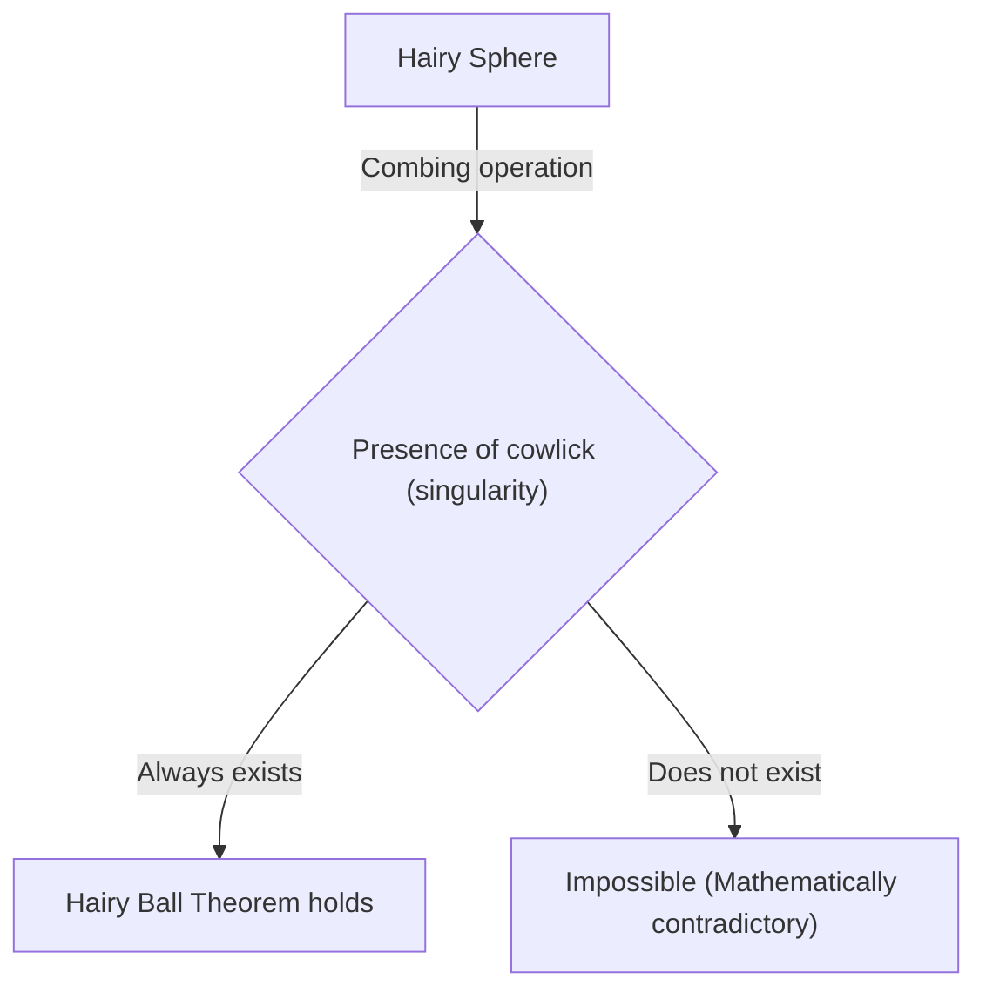
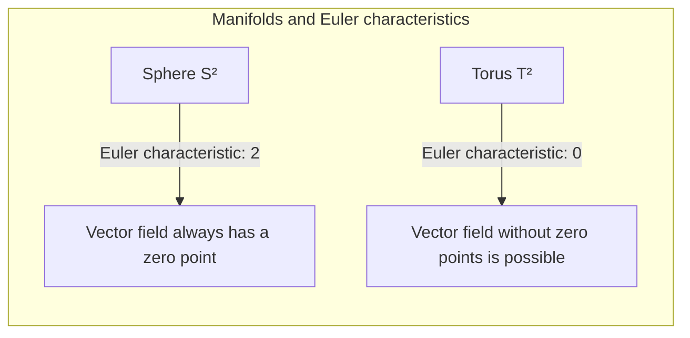

## Introduction

In the field of mathematics known as topology, there are many theorems that are intuitively interesting and powerful. One of the most famous among them is the **Hairy Ball Theorem**. This theorem is often expressed in very visual and easy-to-understand terms: "You can't comb a hairy ball flat without creating a cowlick."

However, deep mathematical meaning is hidden behind it, influencing the weather of our Earth, computer graphics, and even the fundamental laws of physics. In this article, we will explain this theorem in detail, from its intuitive meaning to its mathematical formulation, and its surprising applications.

## What is the Hairy Ball Theorem?

The Hairy Ball Theorem was first stated by Henri Poincaré in 1885 and rigorously proved by Luitzen Egbertus Jan Brouwer in 1912.

### Intuitive Understanding

Imagine a sphere completely covered in fine hair, like a tennis ball or a coconut. You are trying to comb the hair on this ball flat using a comb. Can you comb all the hair smoothly along the surface of the ball without creating any "cowlicks" or "parts" anywhere?

The Hairy Ball Theorem asserts that **"it is absolutely impossible."**

No matter how cleverly you comb the hair, there will always be at least one place where the hair stands straight up (a cowlick) or a point with no hair at all (a singularity).

### Mathematical Formulation

Let's express this intuitive fact precisely using the language of mathematics (specifically differential geometry and topology).

Mathematically, "hair" is represented as a "tangent vector" at each point on the surface of the sphere. And "combing all the hair smoothly" corresponds to defining a "continuous non-zero tangent vector field" over the entire surface of the sphere.

The exact statement of the theorem is as follows:

> On an even-dimensional sphere $S^{2n}$, there is no continuous tangent vector field that is non-zero everywhere.

A normal sphere in the 3-dimensional space we live in is denoted as $S^2$ because its surface is 2-dimensional. Since 2 is an even number, this theorem applies.

Expressed in a formula, for any continuous tangent vector field $V(p)$ on the sphere $S^2$ (where $p \in S^2$), there is always a point $p_0 \in S^2$ such that
$$
V(p_0) = 0
$$
This point $p_0$ where $V(p_0) = 0$ corresponds to the "cowlick" or the "place where the hair stands up".

## Why Does This Happen?

Behind this theorem lies a topological invariant known as the **Euler characteristic**.

The Euler characteristic $\chi$ of a polyhedron is calculated using the number of vertices ($V$), edges ($E$), and faces ($F$) with the following famous formula (Euler's polyhedron formula):

$$
\chi = V - E + F
$$

For a solid that is homeomorphic (topologically identical) to a sphere, the Euler characteristic is always $\chi = 2$.

According to the Poincaré-Hopf Theorem, the sum of the indices of the singularities (points where the vector becomes zero) of a vector field on a manifold is equal to the Euler characteristic of that manifold.

Expressed in a formula,
$$
\sum_{i} \text{index}_{x_i}(V) = \chi(M)
$$
Here, $M$ is the manifold (in this case, the sphere $S^2$).

For a sphere, $\chi(S^2) = 2$. For the sum of the indices to be 2, there must be at least one or more singularities (points with a non-zero index). Since the sum can never be 0, a "state without any singularities (a vector field that is non-zero everywhere)" is impossible.

## What About a Torus (Donut Shape)?

An interesting question arises here. What if the shape was not a ball, but a donut (torus $T^2$)?

Actually, the Euler characteristic of a torus is $\chi(T^2) = 0$.

Therefore, the right side of the Poincaré-Hopf Theorem becomes 0. This means that it is **possible** to create a continuous vector field without a single singularity.

Intuitively speaking, if it were a donut-shaped hairy ball, you could comb the hair perfectly without creating a single cowlick by combing it in a constant direction around the hole of the donut.

## Surprising Real-World Applications

The Hairy Ball Theorem is not just a mathematical puzzle. It helps explain various phenomena in the real world, such as in physics, meteorology, and engineering.

### 1. Meteorology: Winds on Earth

Let's consider the Earth as a large sphere $S^2$. Wind is the movement of air blowing along the Earth's surface, which is exactly a "tangent vector field" on a sphere.

Assuming wind speed and direction change continuously on the Earth, the Hairy Ball Theorem applies directly. In other words, **there is always a place somewhere on Earth where the wind speed is completely zero**.

This mathematically proves that "there is always a place with no wind (a singularity like the eye of a typhoon) somewhere on Earth." It is topologically impossible for the wind to blow simultaneously across the entire Earth.

### 2. Computer Graphics (CG)

In the world of 3D computer graphics, this theorem also has significant implications.

Consider the case of generating fur or hair on a character's head or an animal's body (objects homeomorphic to a sphere). Even if a programmer or artist tries to lay all the hair smoothly in a constant direction, cowlicks or unnatural clusters of hair will inevitably form.

To avoid this, CG software uses techniques such as modifying the topology of the model (hiding singularities in invisible parts) or splitting it into multiple pieces to calculate the vector field.

### 3. Plasma Physics and Fusion Reactors

There is a magnetic confinement method called the "Tokamak" type among devices being researched for the realization of fusion power generation.

To stably confine the plasma, the magnetic field lines must be arranged smoothly along the surface of the container. If the shape of the container were a sphere ($S^2$), the Hairy Ball Theorem states that a point where the magnetic field becomes zero (a singularity) would inevitably occur, leading to a fatal problem of plasma leaking from there.

That is precisely why the plasma confinement container of a Tokamak nuclear reactor is not a sphere, but a **torus (donut shape)**. With a torus shape ($\chi = 0$), it is possible to arrange the magnetic field lines smoothly without creating a singularity.

## Conclusion

The "Hairy Ball Theorem" is a theorem that has a seemingly humorous name and an intuitive image, but at its core lies the powerful mathematical concept of topology.

*   **Intuitive conclusion:** A hairy ball cannot be combed without creating a cowlick.
*   **Mathematical truth:** A continuous tangent vector field on a sphere with an Euler characteristic of 2 always has a point where it becomes zero.
*   **Real-world application:** It is involved in winds on Earth and even the shape design of fusion reactors.

It can be said to be a fascinating theorem that teaches us how beautifully and strictly mathematics describes the real world. After knowing this theorem, you might look at the world from a slightly different perspective when looking at a weather map on a windy day or stroking your dog's fur.
