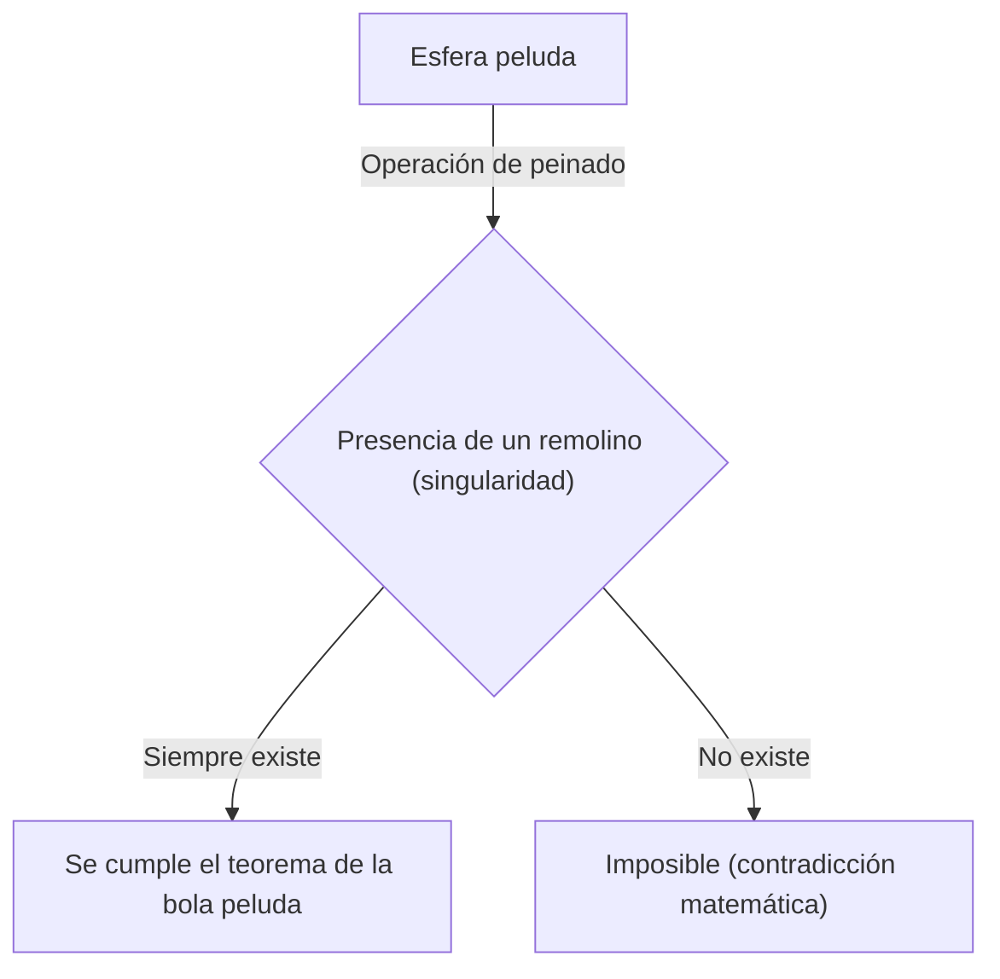
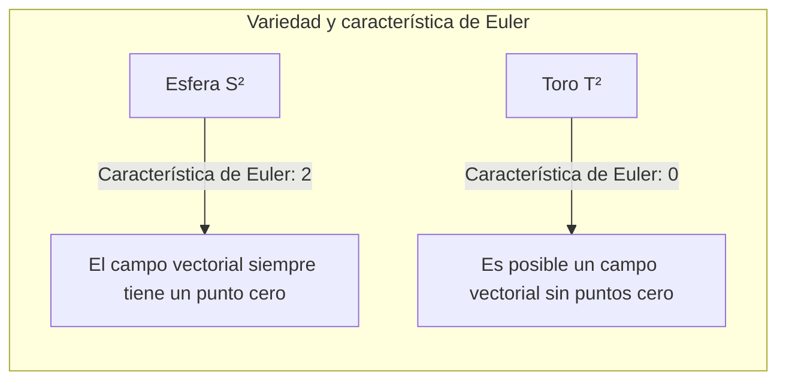

## Introducción

En la rama de las matemáticas llamada topología, existen numerosos teoremas que son tanto intuitivamente fascinantes como poderosos. Entre ellos, destaca especialmente el **Teorema de la bola peluda** (Hairy Ball Theorem). Este teorema se expresa de manera muy visual y comprensible: "no puedes peinar una bola peluda de forma que el pelo quede plano sin crear al menos un remolino".

Sin embargo, detrás de esto se esconde un profundo significado matemático que afecta desde el clima de la Tierra hasta los gráficos por computadora e incluso las leyes fundamentales de la física. En este artículo, explicaremos detalladamente desde el significado intuitivo de este teorema hasta su formulación matemática y sorprendentes ejemplos de aplicación.

## ¿Qué es el Teorema de la bola peluda?

El teorema de la bola peluda fue mencionado por primera vez por Henri Poincaré en 1885 y probado rigurosamente en 1912 por Luitzen Egbertus Jan Brouwer.

### Comprensión intuitiva

Imagina una esfera cubierta completamente de pelos finos, como una pelota de tenis o un coco. Intentas peinar todo el pelo de esta bola usando un peine para que quede plano. ¿Serías capaz de peinar todos los pelos suavemente a lo largo de la superficie de la bola sin dejar ninguna "raya" o "remolino" en ninguna parte?

El teorema de la bola peluda afirma categóricamente que **"eso es absolutamente imposible"**.

Por muy ingeniosamente que intentes peinar el pelo, siempre habrá al menos un lugar donde el pelo quede levantado (un remolino) o un punto donde no haya ningún pelo (una singularidad).

### Formulación matemática

Intentemos expresar este hecho intuitivo con precisión utilizando el lenguaje matemático (especialmente la geometría diferencial y la topología).

Matemáticamente, un "pelo" se representa como un "vector tangente" en cada punto de la superficie de la esfera. Y "peinar todo el pelo sin dejar remolinos" equivale a definir un "campo vectorial tangente continuo y no nulo" en toda la superficie de la esfera.

La afirmación exacta del teorema es la siguiente:

> No existe un campo vectorial tangente continuo y no nulo en todas partes sobre una esfera de dimensión par $S^{2n}$.

Una esfera ordinaria en el espacio tridimensional en el que vivimos se denota como $S^2$ porque su superficie es bidimensional. Como 2 es un número par, este teorema se aplica.

Expresado matemáticamente, para cualquier campo vectorial tangente continuo $V(p)$ sobre la esfera $S^2$ (donde $p \in S^2$), siempre existe algún punto $p_0 \in S^2$ tal que:
$$
V(p_0) = 0
$$
Este punto $p_0$ donde $V(p_0) = 0$ corresponde al "remolino" o al "lugar donde el pelo está levantado".

## ¿Por qué ocurre esto?

Detrás de este teorema se encuentra un invariante topológico: la **característica de Euler** (Euler characteristic).

La característica de Euler $\chi$ de un poliedro se calcula usando la famosa fórmula (Teorema de los poliedros de Euler) con el número de vértices ($V$), el número de aristas ($E$) y el número de caras ($F$).

$$
\chi = V - E + F
$$

Para un sólido homeomorfo a una esfera (topológicamente equivalente), la característica de Euler es siempre $\chi = 2$.

Según el teorema de Poincaré-Hopf (Poincaré-Hopf Theorem), la suma de los índices de las singularidades de un campo vectorial (los puntos donde el vector se anula) en una variedad es igual a la característica de Euler de esa variedad.

Matemáticamente, esto se expresa como:
$$
\sum_{i} \text{índice}_{x_i}(V) = \chi(M)
$$
Donde $M$ es la variedad (en este caso, la esfera $S^2$).

Para una esfera, $\chi(S^2) = 2$. Para que la suma de los índices sea 2, debe existir al menos una singularidad (un punto donde el índice no sea cero). Puesto que la suma nunca puede ser 0, el "estado sin ninguna singularidad (un campo vectorial no nulo en todas partes)" es imposible.

## ¿Qué sucede en el caso de un toro (forma de rosquilla)?

Aquí surge una pregunta interesante. ¿Qué pasaría si no fuera una bola, sino una forma de rosquilla (un toro $T^2$)?

En realidad, la característica de Euler de un toro es $\chi(T^2) = 0$.

Por lo tanto, el lado derecho del teorema de Poincaré-Hopf se vuelve 0. Esto significa que es **posible** crear un campo vectorial continuo sin ninguna singularidad.

Intuitivamente, si tuviéramos una bola peluda en forma de rosquilla, podríamos peinar el pelo suavemente y de manera constante alrededor del agujero de la rosquilla, sin crear ni un solo remolino.

## Sorprendentes aplicaciones en el mundo real

El teorema de la bola peluda no es simplemente un acertijo matemático. Sirve para explicar diversos fenómenos del mundo real en campos como la física, la meteorología y la ingeniería.

### 1. Meteorología: El viento en la Tierra

Imaginemos que la Tierra es una gran esfera $S^2$. El viento es el movimiento del aire que sopla a lo largo de la superficie de la Tierra, lo cual es exactamente un "campo vectorial tangente" sobre una esfera.

Si asumimos que la velocidad y la dirección del viento cambian continuamente sobre la Tierra, el teorema de la bola peluda se aplica directamente. Esto significa que **siempre debe haber un lugar en algún punto de la Tierra donde la velocidad del viento sea absolutamente cero**.

Esto demuestra matemáticamente que "siempre hay un lugar en la Tierra sin viento (una singularidad como el ojo de un huracán)". Topológicamente, es imposible que sople el viento de manera constante en todo el planeta al mismo tiempo.

### 2. Gráficos por computadora (CG)

Este teorema también tiene implicaciones importantes en el mundo de los gráficos por computadora en 3D.

Consideremos el caso de generar pelaje (fur) o cabello en la cabeza de un personaje o el cuerpo de un animal (objetos homeomorfos a una esfera). Incluso si un programador o artista intenta peinar suavemente todo el cabello en una dirección constante, inevitablemente se formará un remolino o una agrupación de cabello antinatural.

Para evitar esto, en el software de CG, se emplean técnicas como ajustar la topología del modelo (ocultando singularidades en partes no visibles) o dividirlo en múltiples partes y calcular campos vectoriales por separado.

### 3. Física de plasmas y reactores de fusión nuclear

Existen dispositivos en investigación para lograr la generación de energía por fusión nuclear, y uno de ellos utiliza un método de confinamiento magnético llamado tipo "Tokamak".

Para confinar el plasma de manera estable, las líneas de campo magnético deben disponerse suavemente a lo largo de la superficie del contenedor. Si la forma del contenedor fuera una esfera ($S^2$), debido al teorema de la bola peluda, inevitablemente habría un punto (singularidad) donde el campo magnético sería cero, provocando un problema fatal: el plasma se escaparía por ahí.

Es por esta razón que el contenedor de confinamiento de plasma de los reactores nucleares de tipo Tokamak no es esférico, sino que tiene **forma de toro (rosquilla)**. Al ser de forma toroidal ($\chi = 0$), es posible organizar suavemente las líneas de campo magnético sin crear ninguna singularidad.

## Resumen

El "Teorema de la bola peluda" es un teorema que, a primera vista, tiene un nombre humorístico y una imagen intuitiva, pero en el fondo subyace el poderoso concepto matemático de la topología.

*   **Conclusión intuitiva:** No se puede peinar una bola peluda sin crear un remolino.
*   **Verdad matemática:** Cualquier campo vectorial tangente continuo sobre una esfera con característica de Euler igual a 2 siempre tiene un punto donde es cero.
*   **Aplicaciones en la realidad:** Está relacionado con los vientos en la Tierra y hasta con el diseño de formas de los reactores de fusión nuclear.

Se podría decir que es un teorema extremadamente fascinante que nos enseña lo hermosa y rigurosamente que las matemáticas describen el mundo real. Después de conocer este teorema, tal vez veas el mundo desde una perspectiva ligeramente diferente cuando mires el mapa del tiempo en un día ventoso o acaricies el pelaje de tu perro.
