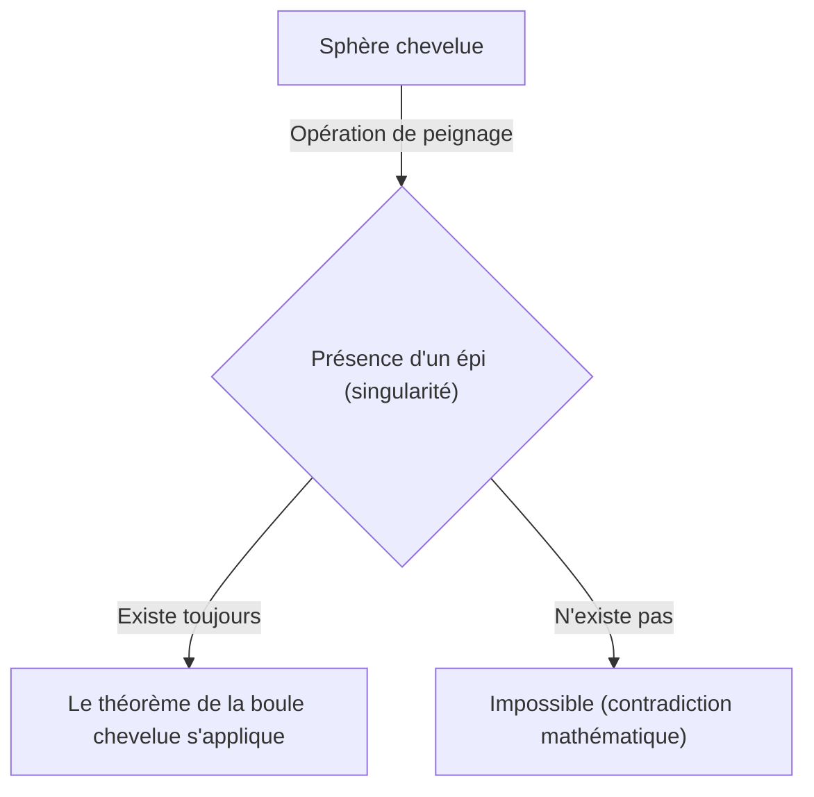
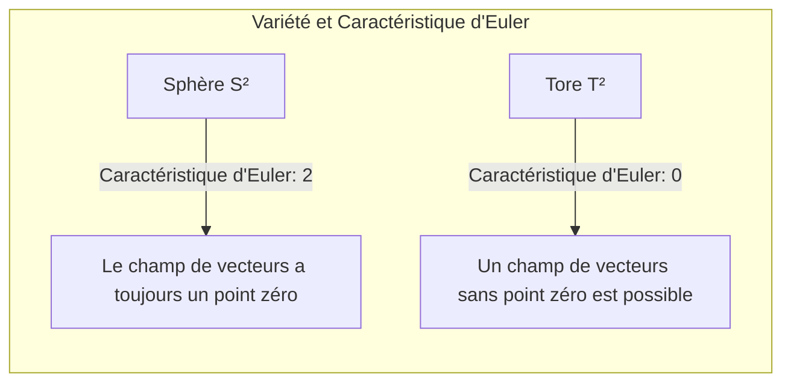

## Introduction

Dans le domaine des mathématiques appelé topologie, il existe de nombreux théorèmes à la fois intuitivement intéressants et puissants. Parmi eux, le **théorème de la boule chevelue** ([Hairy Ball Theorem](https://kenji.blog/fr/p/hairy-ball-theorem/)) est particulièrement célèbre. Ce théorème s'exprime dans des termes très visuels et faciles à comprendre : « on ne peut pas peigner une boule chevelue sans faire au moins un épi ».

Cependant, un sens mathématique profond se cache derrière ce théorème, influençant la météorologie de notre Terre, l'infographie (CG), et même les lois fondamentales de la physique. Dans cet article, nous expliquerons en détail ce théorème, de sa signification intuitive à sa formulation mathématique, jusqu'à ses applications étonnantes.

## Qu'est-ce que le théorème de la boule chevelue ?

Le théorème de la boule chevelue a été énoncé pour la première fois en 1885 par [Henri Poincaré](https://kenji.blog/fr/p/poincare/), et a été rigoureusement prouvé en 1912 par Luitzen Egbertus Jan Brouwer.

### Compréhension intuitive

Imaginez une sphère recouverte entièrement de poils fins, comme une balle de tennis ou une noix de coco. Vous essayez de plaquer ces poils à plat à l'aide d'un peigne. Est-il possible de lisser doucement tous les poils le long de la surface de la balle sans créer le moindre « épi » ou la moindre « raie » nulle part ?

Le théorème de la boule chevelue affirme catégoriquement : **« C'est absolument impossible »**.

Peu importe l'ingéniosité avec laquelle vous peignez les poils, il y aura toujours au moins un endroit où un poil se dresse tout droit (un épi) ou un point où il n'y a pas de poil du tout (une singularité).

### Formulation mathématique

Exprimons ce fait intuitif avec précision en utilisant le langage des mathématiques (en particulier la géométrie différentielle et la topologie).

Mathématiquement, les « poils » sont représentés comme des « vecteurs tangents » en chaque point de la surface de la sphère. Et « peigner parfaitement tous les poils » équivaut à définir un « champ de vecteurs tangents continu et non nul » sur toute la surface de la sphère.

L'énoncé exact du théorème est le suivant :

> Sur une sphère de dimension paire $S^{2n}$, il n'existe pas de champ de vecteurs tangents continu qui ne s'annule nulle part.

Une sphère ordinaire dans l'espace tridimensionnel dans lequel nous vivons est notée $S^2$ car sa surface est en deux dimensions. 2 étant un nombre pair, ce théorème s'applique.

Exprimé sous forme de formule mathématique, pour tout champ de vecteurs tangents continu $V(p)$ (où $p \in S^2$) sur la sphère $S^2$, il existe toujours un point $p_0 \in S^2$ tel que :
$$
V(p_0) = 0
$$
Ce point $p_0$ où $V(p_0) = 0$ correspond à l'« épi » ou à l'« endroit où les poils se dressent ».

## Pourquoi cela se produit-il ?

Derrière ce théorème se cache la **caractéristique d'Euler**, un invariant topologique.

La caractéristique d'Euler $\chi$ d'un polyèdre est calculée à l'aide de la célèbre formule suivante (théorème de [Descartes](https://kenji.blog/fr/p/descartes/)-Euler), utilisant le nombre de sommets ($V$), d'arêtes ($E$) et de faces ($F$) :

$$
\chi = V - E + F
$$

Pour un solide homéomorphe (topologiquement équivalent) à une sphère, la caractéristique d'Euler est toujours $\chi = 2$.

Selon le théorème de [Poincaré](https://kenji.blog/fr/p/poincare/)-Hopf, la somme des indices des singularités (points où le vecteur s'annule) d'un champ de vecteurs sur une variété est égale à la caractéristique d'Euler de cette variété.

Exprimé sous forme de formule :
$$
\sum_{i} \text{indice}_{x_i}(V) = \chi(M)
$$
où $M$ est la variété (dans ce cas, la sphère $S^2$).

Dans le cas d'une sphère, $\chi(S^2) = 2$. Pour que la somme des indices soit égale à 2, il doit y avoir au moins une singularité (un point où l'indice n'est pas zéro). Puisque la somme ne peut jamais être 0, un « état sans aucune singularité (un champ de vecteurs non nul partout) » est impossible.

## Qu'en est-il du tore (forme de beignet) ?

Ici se pose une question intéressante. Que se passerait-il si la forme n'était pas une balle, mais plutôt un beignet (un tore $T^2$) ?

En fait, la caractéristique d'Euler d'un tore est $\chi(T^2) = 0$.

Par conséquent, le côté droit du théorème de [Poincaré](https://kenji.blog/fr/p/poincare/)-Hopf devient 0. Cela signifie qu'il est **possible** de créer un champ de vecteurs continu sans aucune singularité.

Intuitivement, s'il s'agissait d'une boule chevelue en forme de beignet, en peignant les poils dans une direction constante autour du trou du beignet, on pourrait les peigner parfaitement sans créer le moindre épi.

## Des applications étonnantes dans le monde réel

Le théorème de la boule chevelue n'est pas qu'un simple casse-tête mathématique. Il aide à expliquer divers phénomènes du monde réel dans des domaines tels que la physique, la météorologie et l'ingénierie.

### 1. Météorologie : Le vent sur Terre

Considérons la Terre comme une grande sphère $S^2$. Le vent est le mouvement de l'air soufflant le long de la surface de la Terre, et c'est exactement un « champ de vecteurs tangents » sur une sphère.

En supposant que la vitesse et la direction du vent changent continuellement sur la Terre, le théorème de la boule chevelue s'applique directement. Cela signifie qu'**il y a toujours un endroit sur Terre où la vitesse du vent est complètement nulle**.

Cela prouve mathématiquement qu'« il y a toujours un endroit sur Terre sans vent (une singularité comme l'œil d'un cyclone) ». Il est topologiquement impossible que le vent souffle partout sur Terre en même temps.

### 2. Infographie (CG)

Ce théorème a également une signification importante dans le monde de l'infographie 3D.

Considérons le cas de la génération de fourrure ou de cheveux sur la tête d'un personnage ou le corps d'un animal (objets homéomorphes à une sphère). Même si les programmeurs ou les artistes essaient de lisser tous les poils dans une direction constante, un épi ou un amas de poils non naturel se formera inévitablement.

Pour éviter cela, les logiciels d'infographie utilisent des techniques telles que l'ajustement de la topologie du modèle (cacher les singularités dans des parties invisibles) ou le calcul des champs de vecteurs en divisant le modèle en plusieurs morceaux.

### 3. Physique des plasmas et réacteurs à fusion

Parmi les dispositifs étudiés pour la réalisation de la production d'énergie par fusion nucléaire, il existe une méthode de confinement magnétique appelée « type tokamak ».

Pour confiner le plasma de manière stable, les lignes de champ magnétique doivent être disposées en douceur le long de la surface du récipient. Si le récipient était une sphère ($S^2$), le théorème de la boule chevelue créerait inévitablement des points (singularités) où le champ magnétique est nul, provoquant un problème fatal où le plasma s'échapperait par ces points.

C'est pourquoi le récipient de confinement du plasma d'un réacteur tokamak n'est pas une sphère, mais un **tore (en forme de beignet)**. Avec une forme torique ($\chi = 0$), il est possible de disposer les lignes de champ magnétique en douceur sans créer de singularités.

## Résumé

Le « théorème de la boule chevelue » est un théorème qui a, à première vue, un nom plutôt humoristique et une image intuitive, mais à sa base se trouve le puissant concept mathématique de la topologie.

*   **Conclusion intuitive :** On ne peut pas peigner une boule chevelue sans faire un épi.
*   **Vérité mathématique :** Un champ de vecteurs tangents continu sur une sphère de caractéristique d'Euler égale à 2 a toujours un point où il s'annule.
*   **Applications dans la réalité :** Il est impliqué dans les vents terrestres et même dans la conception de la forme des réacteurs à fusion.

On peut dire que c'est un théorème fascinant qui nous montre à quel point les mathématiques décrivent le monde réel de manière magnifique et rigoureuse. Après avoir pris connaissance de ce théorème, vous regarderez peut-être le monde sous un angle légèrement différent lorsque vous consulterez une carte météorologique un jour de grand vent, ou lorsque vous caresserez le pelage de votre chien.
