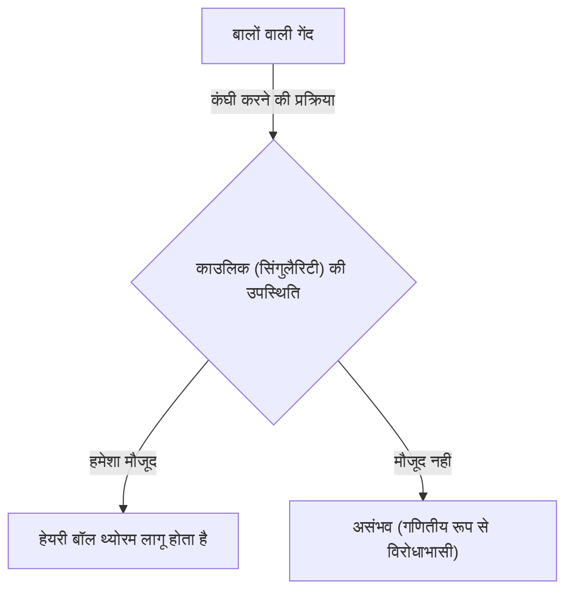
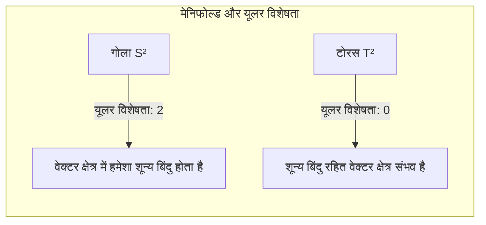

## प्रस्तावना

टोपोलॉजी (Topology) नामक गणित की शाखा में कई ऐसे प्रमेय हैं जो सहज रूप से दिलचस्प और शक्तिशाली हैं। इनमें सबसे प्रसिद्ध **हेयरी बॉल थ्योरम** ([Hairy Ball Theorem](https://kenji.blog/p/hairy-ball-theorem/)) है। इस प्रमेय को बहुत ही दृश्य और आसानी से समझ में आने वाले शब्दों में व्यक्त किया गया है: "बालों वाली गेंद को बिना काउलिक (भंवर) बनाए पूरी तरह से कंघी करना असंभव है।"

हालांकि, इसके पीछे एक गहरा गणितीय अर्थ छिपा है, जो हमारे ग्रह पृथ्वी के मौसम, कंप्यूटर ग्राफिक्स, और यहां तक कि भौतिकी के बुनियादी नियमों को भी प्रभावित करता है। इस लेख में, हम इस प्रमेय के सहज अर्थ से लेकर इसके गणितीय सूत्रीकरण, और आश्चर्यजनक अनुप्रयोगों तक सब कुछ विस्तार से समझाएंगे।

## हेयरी बॉल थ्योरम क्या है?

हेयरी बॉल थ्योरम का पहली बार उल्लेख 1885 में हेनरी पोंकारे ([Henri Poincaré](https://kenji.blog/p/poincare/)) ने किया था, और 1912 में लुइटज़ेन एगबर्टस जन ब्राउन (Luitzen Egbertus Jan Brouwer) ने इसे कठोरता से सिद्ध किया था।

### सहज बोध

कल्पना करें। एक ऐसी गेंद जिसके चारों ओर सतह पर घने बाल हैं, जैसे टेनिस बॉल या नारियल। आप कंघी का उपयोग करके इस गेंद के बालों को सपाट बिठाने की कोशिश कर रहे हैं। क्या आप बिना कोई "काउलिक (भंवर)" या "मांग" बनाए, सभी बालों को गेंद की सतह के साथ सुचारू रूप से बिठा सकते हैं?

हेयरी बॉल थ्योरम दृढ़ता से कहता है: **"यह बिल्कुल असंभव है।"**

आप कितनी भी कुशलता से कंघी कर लें, कम से कम एक जगह ऐसी होगी जहाँ बाल सीधे खड़े होंगे (भंवर) या जहाँ बाल बिल्कुल नहीं होंगे (सिंगुलैरिटी)।

### गणितीय सूत्रीकरण

आइए इस सहज तथ्य को गणितीय भाषा (विशेषकर अवकल ज्यामिति और टोपोलॉजी) का उपयोग करके सटीक रूप से व्यक्त करें।

गणितीय दृष्टि से, "बालों" को गोले की सतह पर प्रत्येक बिंदु पर "स्पर्शरेखा वेक्टर (Tangent vector)" के रूप में दर्शाया जाता है। और "सभी बालों को अच्छी तरह से कंघी करना" का अर्थ है पूरे गोले की सतह पर "सतत गैर-शून्य स्पर्शरेखा वेक्टर क्षेत्र (Continuous non-zero tangent vector field)" को परिभाषित करना।

प्रमेय का सटीक दावा इस प्रकार है:

> सम-आयामी गोले (Even-dimensional sphere) $S^{2n}$ पर, हर जगह गैर-शून्य होने वाला कोई भी सतत स्पर्शरेखा वेक्टर क्षेत्र मौजूद नहीं है।

हमारे 3-आयामी स्थान में सामान्य गोले को $S^2$ के रूप में दर्शाया जाता है क्योंकि इसकी सतह 2-आयामी है। चूंकि 2 एक सम संख्या है, यह प्रमेय लागू होता है।

गणितीय रूप से, गोले $S^2$ पर किसी भी सतत स्पर्शरेखा वेक्टर क्षेत्र $V(p)$ के लिए (जहां $p \in S^2$), हमेशा एक बिंदु $p_0 \in S^2$ मौजूद होता है, जिससे:
$$
V(p_0) = 0
$$
होता है। यह बिंदु $p_0$ जहां $V(p) = 0$ है, "काउलिक (भंवर)" या "वह स्थान जहाँ बाल खड़े हैं" के अनुरूप है।

## ऐसा क्यों होता है?

इस प्रमेय के पीछे टोपोलॉजिकल अपरिवर्तनीय **यूलर विशेषता** (Euler characteristic) है।

बहुफलक (Polyhedron) की यूलर विशेषता $\chi$ की गणना शिखरों (Vertices) की संख्या ($V$), किनारों (Edges) की संख्या ($E$), और चेहरों (Faces) की संख्या ($F$) का उपयोग करके निम्नलिखित प्रसिद्ध सूत्र (यूलर का बहुफलक प्रमेय) द्वारा की जाती है:

$$
\chi = V - E + F
$$

गोले के समरूपी (टोपोलॉजिकल रूप से समान) ठोस वस्तु के मामले में, यूलर विशेषता हमेशा $\chi = 2$ होती है।

पोंकारे-हॉप प्रमेय (Poincaré-Hopf Theorem) के अनुसार, मेनिफोल्ड (Manifold) पर वेक्टर क्षेत्र की सिंगुलैरिटी (वह बिंदु जहां वेक्टर शून्य हो जाता है) के सूचकांकों का योग उस मेनिफोल्ड की यूलर विशेषता के बराबर होता है।

सूत्र रूप में:
$$
\sum_{i} \text{index}_{x_i}(V) = \chi(M)
$$
यहां, $M$ मेनिफोल्ड (इस मामले में गोला $S^2$) है।

गोले के मामले में, $\chi(S^2) = 2$ है। सूचकांकों का योग 2 होने के लिए, कम से कम एक सिंगुलैरिटी (वह बिंदु जहां सूचकांक शून्य नहीं है) का मौजूद होना आवश्यक है। चूंकि योग कभी शून्य नहीं हो सकता, "बिना किसी सिंगुलैरिटी की स्थिति (हर जगह गैर-शून्य वेक्टर क्षेत्र)" संभव नहीं है।

## टोरस (डोनट आकार) के मामले में क्या होता है?

यहां एक दिलचस्प सवाल उठता है। अगर आकार गेंद का न होकर डोनट जैसा (टोरस $T^2$) हो, तो क्या होगा?

वास्तव में, टोरस की यूलर विशेषता $\chi(T^2) = 0$ है।

इसलिए, पोंकारे-हॉप प्रमेय में दाईं ओर का मान 0 हो जाता है। इसका अर्थ है कि एक सतत वेक्टर क्षेत्र बनाना **संभव** है जिसमें एक भी सिंगुलैरिटी न हो।

सरल शब्दों में, अगर यह डोनट के आकार की बालों वाली गेंद है, तो डोनट के छेद के साथ एक निश्चित दिशा में बालों को कंघी करने से, बिना कोई काउलिक बनाए उसे पूरी तरह से कंघी किया जा सकता है।

## वास्तविक दुनिया में आश्चर्यजनक अनुप्रयोग

हेयरी बॉल थ्योरम केवल एक गणितीय पहेली नहीं है। यह भौतिकी, मौसम विज्ञान, और इंजीनियरिंग जैसे क्षेत्रों में वास्तविक दुनिया की विभिन्न घटनाओं को समझाने में मदद करता है।

### 1. मौसम विज्ञान: पृथ्वी पर हवा

आइए पृथ्वी को एक विशाल गोला $S^2$ मान लें। हवा, पृथ्वी की सतह पर चलने वाली हवा की गति है, जो वास्तव में गोले पर见 (टोपोलॉजिकल रूप से) एक "स्पर्शरेखा वेक्टर क्षेत्र" है।

यह मानते हुए कि पृथ्वी पर हवा की गति और दिशा लगातार बदल रही है, हेयरी बॉल थ्योरम सीधे लागू होता है। इसका मतलब है, **पृथ्वी पर कहीं न कहीं, एक ऐसी जगह जरूर होगी जहां हवा की गति पूरी तरह से शून्य हो**।

यह गणितीय रूप से साबित करता है कि "पृथ्वी पर हमेशा कम से कम एक जगह ऐसी होती है जहां हवा बिल्कुल नहीं होती (जैसे तूफान की आंख जैसी सिंगुलैरिटी)।" टोपोलॉजी के नजरिए से पूरी पृथ्वी पर एक साथ हवा का चलना असंभव है।

### 2. कंप्यूटर ग्राफिक्स (CG)

3D कंप्यूटर ग्राफिक्स की दुनिया में भी इस प्रमेय का महत्वपूर्ण अर्थ है।

कल्पना करें कि आप किसी चरित्र के सिर या किसी जानवर के शरीर (गोले के समरूपी वस्तु) पर फर या बाल उत्पन्न कर रहे हैं। भले ही प्रोग्रामर या कलाकार सभी बालों को एक दिशा में सुचारू रूप से बिठाने की कोशिश करें, हमेशा एक काउलिक या बालों का अप्राकृतिक गुच्छा बन जाएगा।

इससे बचने के लिए, CG सॉफ्टवेयर में तकनीकों का उपयोग किया जाता है जैसे मॉडल की टोपोलॉजी में बदलाव करना (सिंगुलैरिटी को अदृश्य भागों में छिपाना) या वेक्टर क्षेत्र की गणना करने के लिए मॉडल को कई टुकड़ों में विभाजित करना।

### 3. प्लाज्मा भौतिकी और परमाणु संलयन रिएक्टर

परमाणु संलयन (Nuclear fusion) शक्ति को प्राप्त करने के लिए शोध किए जा रहे उपकरणों में, "टोकामक (Tokamak)" नामक एक चुंबकीय परिसीमन (Magnetic confinement) प्रणाली है।

प्लाज्मा को स्थिर रूप से सीमित करने के लिए, चुंबकीय क्षेत्र रेखाओं को कंटेनर की सतह के साथ सुचारू रूप से व्यवस्थित किया जाना चाहिए। यदि कंटेनर का आकार गोलाकार ($S^2$) है, तो हेयरी बॉल थ्योरम के कारण, एक ऐसा बिंदु (सिंगुलैरिटी) अवश्य उत्पन्न होगा जहां चुंबकीय क्षेत्र शून्य हो जाता है, जिससे एक गंभीर समस्या पैदा होगी जहां से प्लाज्मा लीक हो जाएगा।

यही कारण है कि टोकामक परमाणु रिएक्टरों का प्लाज्मा परिसीमन कंटेनर गोलाकार नहीं बल्कि **टोरस (डोनट आकार)** का होता है। टोरस आकार ($\chi = 0$) होने से, बिना किसी सिंगुलैरिटी के चुंबकीय क्षेत्र रेखाओं को सुचारू रूप से व्यवस्थित करना संभव हो जाता है।

## निष्कर्ष

"हेयरी बॉल थ्योरम" एक ऐसा प्रमेय है जो पहली नज़र में थोड़ा हास्यपूर्ण नाम और सहज चित्र पेश करता है, लेकिन इसके मूल में टोपोलॉजी की शक्तिशाली गणितीय अवधारणा निहित है।

*   **सहज निष्कर्ष:** बालों वाली गेंद को काउलिक बनाए बिना कंघी नहीं किया जा सकता।
*   **गणितीय सत्य:** 2 की यूलर विशेषता वाले गोले पर सतत स्पर्शरेखा वेक्टर क्षेत्र में हमेशा एक बिंदु होगा जो शून्य हो जाता है।
*   **वास्तविक दुनिया में अनुप्रयोग:** यह पृथ्वी की हवाओं और यहां तक कि परमाणु संलयन रिएक्टरों के आकार के डिजाइन से भी जुड़ा हुआ है।

यह कहा जा सकता है कि यह एक बहुत ही आकर्षक प्रमेय है जो हमें सिखाता है कि गणित वास्तविक दुनिया का कितनी खूबसूरती से और कठोरता से वर्णन करता है। इस प्रमेय को जानने के बाद, जब आप हवा वाले दिन मौसम का नक्शा देखते हैं, या किसी कुत्ते के बालों को सहलाते हैं, तो आप दुनिया को थोड़े अलग नजरिए से देख सकते हैं।
