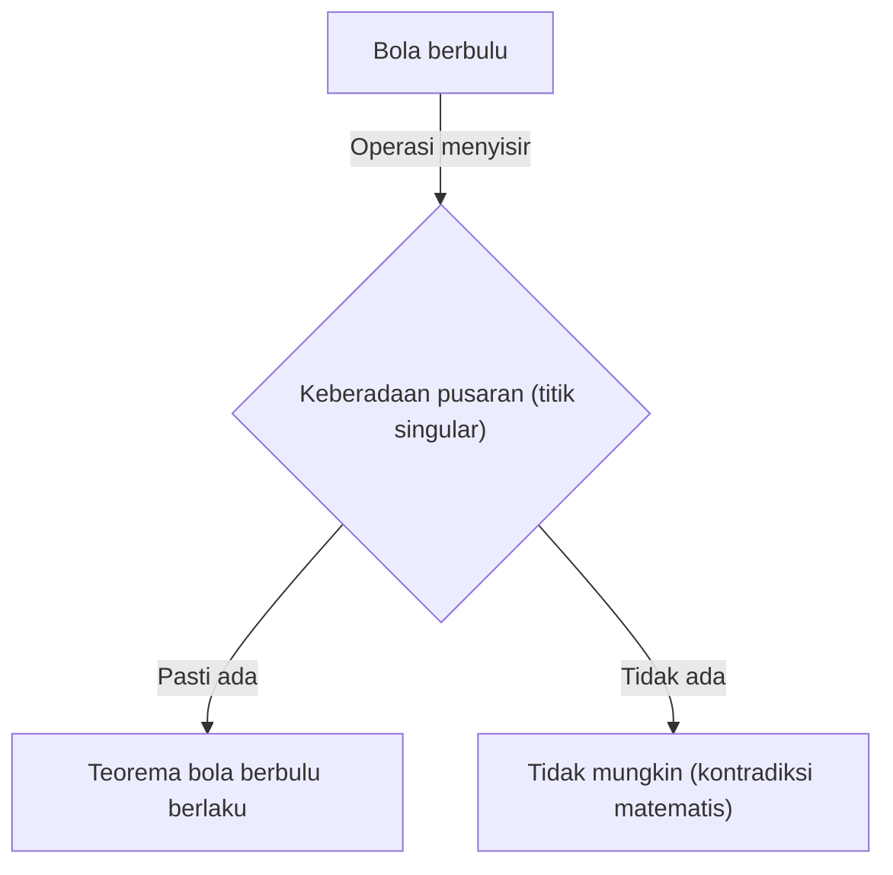
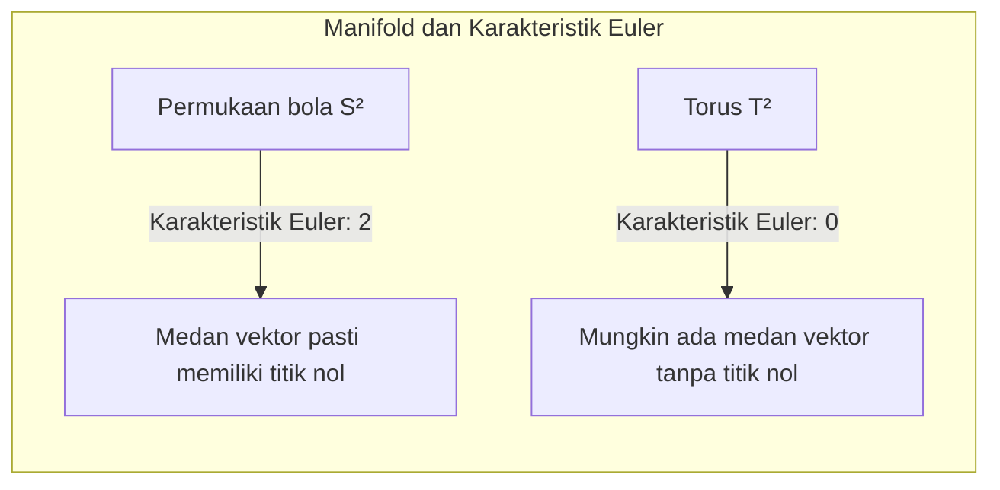

## Pendahuluan

Di bidang matematika yang disebut topologi, terdapat banyak teorema yang secara intuitif menarik dan sangat kuat. Salah satu yang paling terkenal di antaranya adalah **Teorema Bola Berbulu** ([Hairy Ball Theorem](https://kenji.blog/id/p/hairy-ball-theorem/)). Teorema ini diungkapkan dengan kata-kata yang sangat visual dan mudah dipahami: "Anda tidak bisa menyisir rapi bola yang berbulu tanpa membuat setidaknya satu pusaran".

Namun, di baliknya tersembunyi makna matematis yang mendalam, yang memengaruhi cuaca di planet Bumi tempat kita tinggal, grafik komputer, dan bahkan hukum dasar fisika. Artikel ini akan menjelaskan secara rinci makna intuitif dari teorema ini, rumusan matematisnya, serta contoh aplikasinya yang menakjubkan.

## Apa itu Teorema Bola Berbulu?

Teorema Bola Berbulu pertama kali disebutkan oleh [Henri Poincaré](https://kenji.blog/id/p/poincare/) pada tahun 1885 dan dibuktikan secara ketat oleh Luitzen Egbertus Jan Brouwer pada tahun 1912.

### Pemahaman Intuitif

Bayangkan sebuah bola yang seluruh permukaannya ditutupi bulu-bulu halus yang lebat, seperti bola tenis atau kelapa. Anda mencoba meratakan bulu-bulu bola ini menggunakan sisir. Bisakah Anda menyisir semua bulu dengan mulus di sepanjang permukaan bola tanpa membuat "pusaran" atau "belahan" di mana pun?

Teorema Bola Berbulu menegaskan, **"Itu sama sekali tidak mungkin"**.

Tidak peduli seberapa pintar Anda menyisir bulunya, pasti akan ada setidaknya satu tempat di mana bulu tersebut berdiri tegak (pusaran) atau titik di mana tidak ada bulu sama sekali (titik singular).

### Rumusan Matematis

Mari kita nyatakan fakta intuitif ini secara tepat menggunakan bahasa matematika (terutama geometri diferensial dan topologi).

Secara matematis, "bulu" direpresentasikan sebagai "vektor singgung" pada setiap titik di permukaan bola. Dan "menyisir semua bulu dengan rapi" setara dengan mendefinisikan "medan vektor singgung kontinu yang tidak nol" di seluruh permukaan bola.

Pernyataan pasti dari teorema ini adalah sebagai berikut:

> Pada bola berdimensi genap $S^{2n}$, tidak ada medan vektor singgung kontinu yang tidak pernah bernilai nol di mana pun.

Permukaan bola biasa di ruang 3 dimensi tempat kita tinggal dilambangkan dengan $S^2$ karena permukaannya 2 dimensi. Karena 2 adalah angka genap, teorema ini berlaku.

Dinyatakan dalam rumus, untuk setiap medan vektor singgung kontinu $V(p)$ di permukaan bola $S^2$ (di mana $p \in S^2$), pasti ada titik $p_0 \in S^2$ sehingga:
$$
V(p_0) = 0
$$
Titik $p_0$ di mana $V(p) = 0$ ini sesuai dengan "pusaran" atau "tempat bulu berdiri tegak".

## Mengapa Hal Ini Terjadi?

Di balik teorema ini terdapat invarian topologi yang disebut **Karakteristik Euler** (Euler characteristic).

Karakteristik Euler $\chi$ dari sebuah polihedron dihitung dengan menggunakan rumus terkenal berikut (Teorema Polihedron Euler), menggunakan jumlah titik sudut ($V$), jumlah rusuk ($E$), dan jumlah sisi ($F$).

$$
\chi = V - E + F
$$

Dalam kasus bangun ruang yang homeomorfik (secara topologi sama) dengan permukaan bola, karakteristik Eulernya selalu $\chi = 2$.

Menurut Teorema [Poincaré](https://kenji.blog/id/p/poincare/)-Hopf, jumlah dari indeks titik singular (titik di mana vektor menjadi nol) dari suatu medan vektor pada manifold sama dengan karakteristik Euler dari manifold tersebut.

Dalam rumus matematis:
$$
\sum_{i} \text{index}_{x_i}(V) = \chi(M)
$$
Di mana, $M$ adalah manifold (dalam hal ini, permukaan bola $S^2$).

Untuk permukaan bola, $\chi(S^2) = 2$. Agar jumlah indeksnya menjadi 2, harus ada setidaknya satu atau lebih titik singular (titik dengan indeks tidak nol). Karena jumlahnya tidak akan pernah 0, keadaan "tanpa titik singular sama sekali (medan vektor yang tidak nol di mana-mana)" tidak mungkin terjadi.

## Bagaimana dengan Torus (Bentuk Donat)?

Sebuah pertanyaan menarik muncul di sini. Bagaimana jika bentuknya bukan bola, melainkan donat (torus $T^2$)?

Faktanya, karakteristik Euler dari torus adalah $\chi(T^2) = 0$.

Oleh karena itu, sisi kanan pada Teorema [Poincaré](https://kenji.blog/id/p/poincare/)-Hopf menjadi 0. Ini berarti **mungkin** untuk membuat medan vektor kontinu tanpa satu pun titik singular.

Secara intuitif, jika itu adalah bola berbulu berbentuk donat, Anda dapat menyisir bulunya dengan rapi tanpa membuat pusaran satu pun dengan menyisirnya terus-menerus ke arah yang sama di sepanjang lubang donat.

## Aplikasi Menakjubkan di Dunia Nyata

Teorema Bola Berbulu bukan sekadar teka-teki matematika. Teorema ini membantu menjelaskan berbagai fenomena dunia nyata dalam fisika, meteorologi, teknik, dan lain-lain.

### 1. Meteorologi: Angin di Bumi

Mari kita anggap Bumi sebagai permukaan bola besar $S^2$. Angin adalah pergerakan udara yang bertiup di sepanjang permukaan Bumi, dan ini persis seperti "medan vektor singgung" pada permukaan bola.

Dengan asumsi bahwa kecepatan dan arah angin berubah secara kontinu di Bumi, Teorema Bola Berbulu berlaku secara langsung. Dengan kata lain, **pasti ada tempat di Bumi di mana kecepatan angin benar-benar nol**.

Ini membuktikan secara matematis bahwa "selalu ada titik tanpa angin di suatu tempat di Bumi (titik singular seperti mata angin topan)". Tidak mungkin secara topologi angin bertiup kencang di seluruh bumi pada saat yang bersamaan.

### 2. Grafik Komputer (CG)

Dalam dunia grafik komputer 3D, teorema ini juga memiliki makna yang penting.

Mari pertimbangkan kasus membuat bulu (fur) atau rambut pada kepala karakter atau tubuh hewan (objek yang homeomorfik dengan permukaan bola). Bahkan jika pemrogram atau seniman mencoba meratakan semua bulu secara mulus ke satu arah, pusaran atau kumpulan rambut yang tidak wajar pasti akan terbentuk.

Untuk menghindari hal ini, perangkat lunak CG menggunakan teknik seperti menyesuaikan topologi model (menyembunyikan titik singular di bagian yang tidak terlihat) atau membaginya menjadi beberapa bagian untuk menghitung medan vektor.

### 3. Fisika Plasma dan Reaktor Fusi Nuklir

Di antara perangkat yang dipelajari untuk mewujudkan pembangkit listrik tenaga fusi nuklir, terdapat metode pengurungan magnetik yang disebut tipe "Tokamak".

Untuk mengurung plasma secara stabil, garis medan magnet harus diatur secara mulus di sepanjang permukaan wadah. Jika wadah berbentuk bola ($S^2$), Teorema Bola Berbulu menentukan bahwa pasti akan ada titik (titik singular) di mana medan magnet menjadi nol, dan masalah fatal akan terjadi di mana plasma bocor dari sana.

Itulah sebabnya wadah pengurungan plasma dari reaktor fusi tipe Tokamak bukan berbentuk bola, melainkan **torus (berbentuk donat)**. Hal ini karena bentuk torus ($\chi = 0$) memungkinkan untuk mengatur garis medan magnet dengan mulus tanpa membuat titik singular.

## Kesimpulan

"Teorema Bola Berbulu" adalah teorema dengan nama yang sedikit lucu dan gambaran intuitif, namun di dasarnya terbentang konsep matematika kuat yang disebut topologi.

*   **Kesimpulan Intuitif:** Bola berbulu tidak bisa disisir tanpa membuat pusaran.
*   **Kebenaran Matematis:** Medan vektor singgung kontinu pada permukaan bola dengan karakteristik Euler 2 pasti memiliki titik di mana ia bernilai nol.
*   **Aplikasi di Dunia Nyata:** Berkaitan dengan angin di Bumi dan bahkan desain bentuk reaktor fusi nuklir.

Dapat dikatakan bahwa ini adalah teorema yang sangat menarik yang mengajarkan kita betapa indahnya dan ketatnya matematika mendeskripsikan dunia nyata. Setelah mengetahui teorema ini, Anda mungkin dapat melihat dunia dari sudut pandang yang sedikit berbeda ketika melihat peta cuaca di hari yang berangin atau mengelus bulu anjing.
