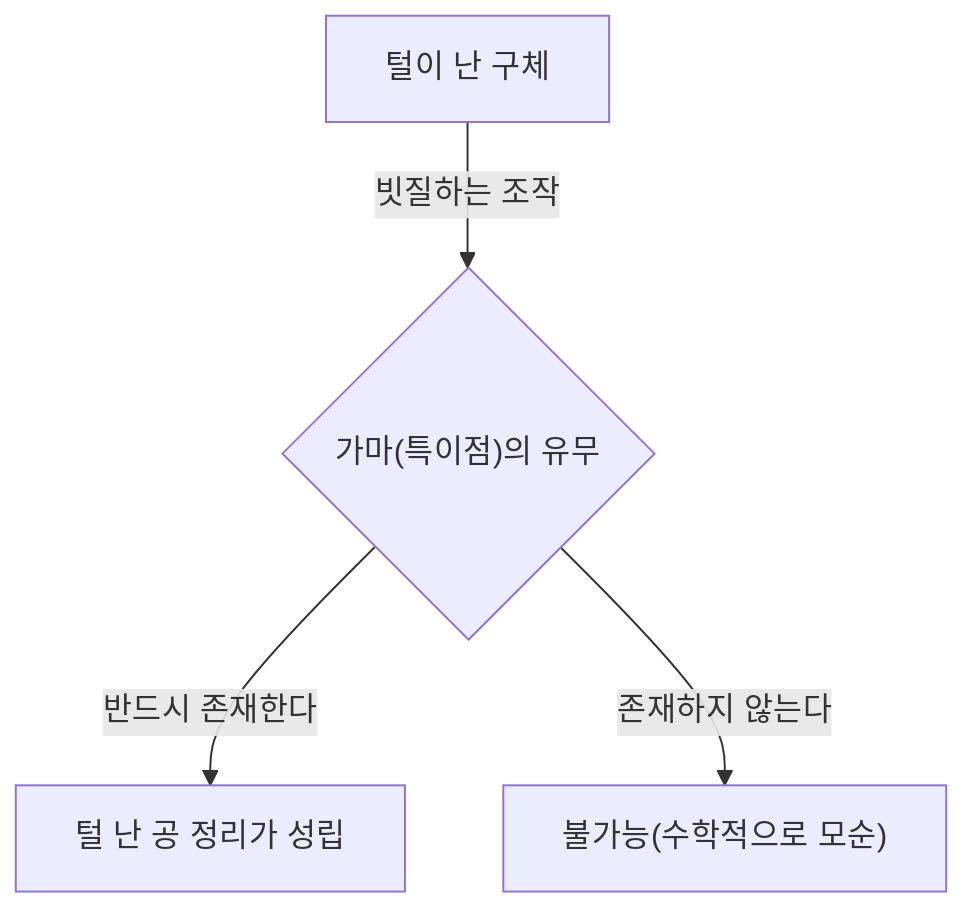
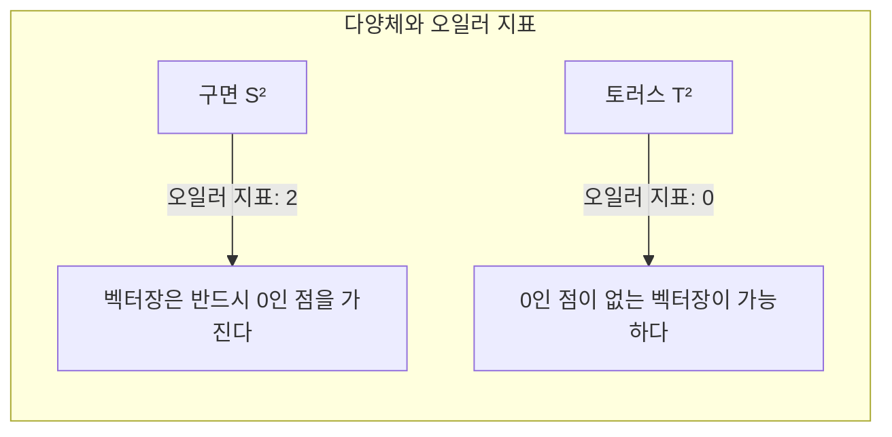

## 머리말

위상수학(토폴로지)이라는 수학 분야에는 직관적으로 재미있고 강력한 정리가 많이 존재합니다. 그중에서도 특히 유명한 것이 **털 난 공 정리** ([Hairy Ball Theorem](https://kenji.blog/p/hairy-ball-theorem/))입니다. 이 정리는 "털이 난 공을, 가마를 하나도 만들지 않고 예쁘게 빗질할 수는 없다"라는, 매우 시각적이고 알기 쉬운 말로 표현됩니다.

하지만 그 이면에는 깊은 수학적 의미가 숨겨져 있으며, 우리가 사는 이 지구의 기상이나 컴퓨터 그래픽스, 나아가 물리학의 기본 법칙에까지 영향을 미치고 있습니다. 본 기사에서는 이 정리의 직관적인 의미부터 수학적 정식화, 그리고 놀라운 응용 사례까지 자세히 해설해 나갑니다.

## 털 난 공 정리란 무엇인가?

털 난 공 정리는 1885년에 [앙리 푸앵카레](https://kenji.blog/p/poincare/)([Henri Poincaré](https://kenji.blog/p/poincare/))에 의해 처음 언급되었고, 1912년에 라위천 에흐베르튀스 얀 브라우어르(Luitzen Egbertus Jan Brouwer)에 의해 엄밀하게 증명되었습니다.

### 직관적인 이해

상상해 보세요. 테니스공이나 코코넛처럼 표면 전체에 빽빽하게 잔털이 나 있는 구체를. 당신은 이 공의 털을 빗을 사용하여 평평하게 눕히려고 하고 있습니다. 어디에도 "가마"나 "가르마"를 만들지 않고 모든 털을 공의 표면을 따라 매끄럽게 눕힐 수 있을까요?

털 난 공 정리는 **"그것은 절대 불가능하다"** 라고 단언하고 있습니다.

아무리 교묘하게 털을 빗질한다 해도, 반드시 적어도 한 곳은 털이 곧게 서 버리는 곳(가마)이나 털이 전혀 없는 점(특이점)이 생기고 마는 것입니다.

### 수학적 정식화

이 직관적인 사실을 수학의 언어(특히 미분기하학과 위상수학)를 사용하여 정확하게 표현해 봅시다.

수학적으로 "털"은 구의 표면상 각 점에서의 "접벡터"로 표현됩니다. 그리고 "모든 털을 예쁘게 빗질한다"는 것은 구의 표면 전체에 걸쳐 "연속적인 0이 아닌 접벡터장"을 정의하는 것에 해당합니다.

정리의 정확한 주장은 다음과 같습니다.

> 짝수 차원의 구면 $S^{2n}$ 위에는, 어느 곳에서도 0이 되지 않는 연속적인 접벡터장은 존재하지 않는다.

우리가 살고 있는 3차원 공간 내의 일반적인 구면은 표면이 2차원이므로 $S^2$ 로 표기됩니다. 2는 짝수이므로 이 정리가 적용됩니다.

수식으로 나타내면, 구면 $S^2$ 위의 임의의 연속적인 접벡터장 $V(p)$ (단, $p \in S^2$)에 대해 반드시 어떤 점 $p_0 \in S^2$ 가 존재하여,
$$
V(p_0) = 0
$$
이 된다는 것입니다. 이 $V(p) = 0$ 이 되는 점 $p_0$ 가 "가마"나 "털이 서 있는 장소"에 해당합니다.

## 왜 이런 일이 일어나는 것일까?

이 정리의 이면에 있는 것은 위상수학의 불변량인 **오일러 지표** (Euler characteristic)입니다.

다면체의 오일러 지표 $\chi$ 는 꼭짓점의 수($V$), 모서리의 수($E$), 면의 수($F$)를 사용하여 다음과 같은 유명한 공식([오일러의 다면체 정리](https://kenji.blog/p/eulers-polyhedron-formula/))으로 계산됩니다.

$$
\chi = V - E + F
$$

구면과 위상 동형(위상수학적으로 같음)인 입체의 경우, 오일러 지표는 항상 $\chi = 2$ 가 됩니다.

푸앵카레-호프 정리(Poincaré-Hopf Theorem)에 따르면, 다양체 위의 벡터장의 특이점(벡터가 0이 되는 점)들의 지수 총합은 그 다양체의 오일러 지표와 같아집니다.

수식으로 나타내면,
$$
\sum_{i} \text{지수}_{x_i}(V) = \chi(M)
$$
가 됩니다. 여기서 $M$ 은 다양체(이 경우 구면 $S^2$)입니다.

구면의 경우 $\chi(S^2) = 2$ 입니다. 지수의 총합이 2가 되기 위해서는 적어도 1개 이상의 특이점(지수가 0이 아닌 점)이 존재해야만 합니다. 총합이 0이 되는 일은 절대 없기 때문에 "특이점이 하나도 없는 상태(어느 곳에서도 0이 아닌 벡터장)"는 있을 수 없는 것입니다.

## 토러스(도넛 모양)의 경우는 어떻게 될까?

여기서 흥미로운 의문이 생깁니다. 공이 아니라 도넛 같은 모양(토러스 $T^2$)이라면 어떻게 될까요?

사실 토러스의 오일러 지표는 $\chi(T^2) = 0$ 입니다.

따라서 푸앵카레-호프 정리에서 우변이 0이 됩니다. 이는 특이점이 하나도 존재하지 않는 연속적인 벡터장을 만드는 것이 **가능** 하다는 것을 의미합니다.

직관적으로 말하자면, 도넛 모양의 털 뭉치라면 도넛의 구멍을 따라 빙글빙글 일정한 방향으로 털을 빗어 가면, 가마를 하나도 만들지 않고 예쁘게 빗질할 수 있는 것입니다.

## 현실 세계에서의 놀라운 응용

털 난 공 정리는 단순한 수학 퍼즐이 아닙니다. 물리학이나 기상학, 공학 등 현실 세계의 다양한 현상을 설명하는 데 도움이 됩니다.

### 1. 기상학: 지구상의 바람

지구를 커다란 구면 $S^2$ 라고 간주해 봅시다. 바람은 지구 표면을 따라 부는 공기의 이동이며, 이는 바로 구면상의 "접벡터장"입니다.

풍속과 풍향이 지구상에서 연속적으로 변화하고 있다고 가정하면, 털 난 공 정리가 직접 적용됩니다. 즉, **지구상의 어딘가에 반드시 풍속이 완전히 0이 되는 장소가 존재한다** 는 것입니다.

이는 "항상 지구상 어딘가에 무풍 상태인 장소(태풍의 눈 같은 특이점)가 있다"는 것을 수학적으로 증명하고 있습니다. 지구 전체에서 동시에 바람이 휘몰아치는 것은 위상수학적으로 불가능합니다.

### 2. 컴퓨터 그래픽스(CG)

3D 컴퓨터 그래픽스 세계에서도 이 정리는 중요한 의미를 가집니다.

캐릭터의 머리나 동물의 몸(구면에 위상 동형인 오브젝트)에 모피(퍼)나 머리카락을 생성하는 경우를 생각해 봅시다. 프로그래머나 아티스트가 모든 털을 일정한 방향으로 매끄럽게 눕히려고 해도, 반드시 가마나 부자연스러운 털의 뭉침이 생기고 맙니다.

이를 피하기 위해 CG 소프트웨어에서는 모델의 토폴로지를 고안하거나(보이지 않는 부분에 특이점을 숨김), 여러 조각으로 분할하여 벡터장을 계산하는 기술이 사용되고 있습니다.

### 3. 플라즈마 물리학과 핵융합로

핵융합 발전의 실현을 향해 연구되고 있는 장치 중에 "토카막형"이라고 불리는 자기 가둠 방식이 있습니다.

플라즈마를 안정적으로 가두기 위해서는 자기력선이 용기 표면을 따라 매끄럽게 배치되어야 합니다. 만약 용기의 모양이 구체($S^2$)라면 털 난 공 정리에 의해 자기장이 0이 되는 점(특이점)이 반드시 생기게 되고, 그곳으로 플라즈마가 새어 나가 버리는 치명적인 문제가 일어납니다.

그렇기 때문에 토카막형 원자로의 플라즈마 가둠 용기는 구체가 아니라 **토러스(도넛 모양)** 를 하고 있는 것입니다. 토러스형($\chi = 0$)이라면 특이점을 만들지 않고 자기력선을 매끄럽게 배치하는 것이 가능해지기 때문입니다.

## 맺음말

"털 난 공 정리"는 언뜻 보면 조금 유머러스한 이름과 직관적인 이미지를 가진 정리이지만, 그 근본에는 토폴로지라는 강력한 수학 개념이 자리 잡고 있습니다.

*   **직관적인 결론:** 털이 난 공은 가마를 만들지 않고서는 빗질할 수 없다.
*   **수학적인 진리:** 오일러 지표가 2인 구면상의 연속적인 접벡터장은 반드시 0이 되는 점을 가진다.
*   **현실에의 적용:** 지구상의 바람이나 핵융합로의 형상 설계에까지 관여하고 있다.

수학이 현실 세계를 얼마나 아름답고 엄밀하게 기술하고 있는지를 알려주는 매우 매력적인 정리라고 할 수 있을 것입니다. 이 정리를 알고 난 후에는 바람이 강한 날에 일기도를 보거나 개 털을 쓰다듬을 때 조금 다른 시각으로 세상을 볼 수 있을지도 모릅니다.
