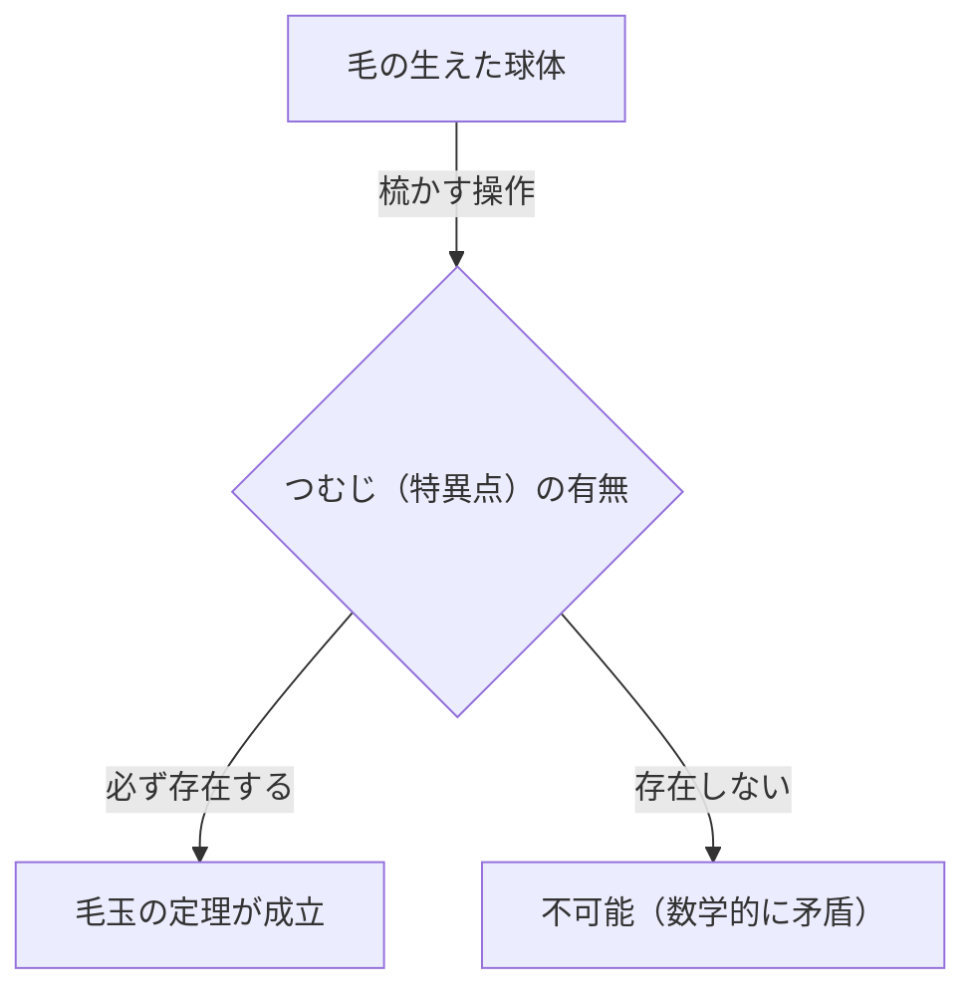
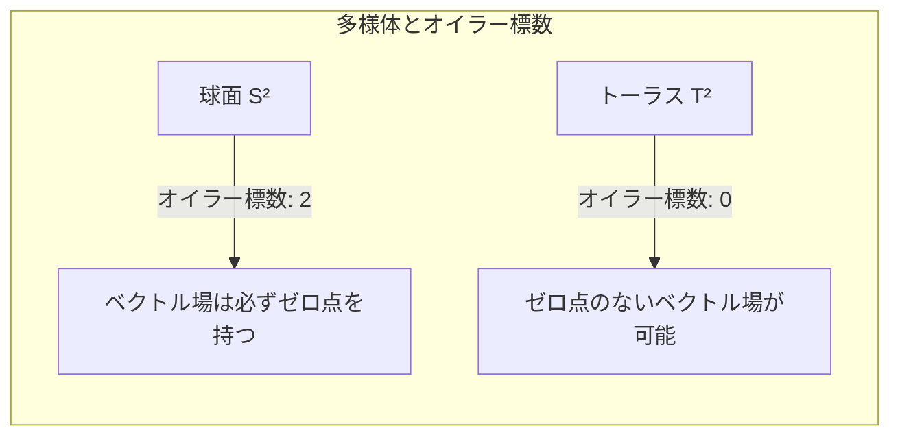

## はじめに

位相幾何学（トポロジー）という数学の分野には、直感的に面白く、かつ強力な定理が数多く存在します。その中でも特に有名なのが、 **毛玉の定理** （[Hairy Ball Theorem](https://kenji.blog/p/hairy-ball-theorem/)）です。この定理は、「毛の生えたボールを、つむじを一つも作らずに綺麗に梳かすことはできない」という、非常に視覚的で分かりやすい言葉で表現されます。

しかし、その背後には深い数学的な意味が隠されており、私たちの住むこの地球の気象や、コンピュータグラフィックス、さらには物理学の基本法則にまで影響を与えています。本記事では、この定理の直感的な意味から、数学的な定式化、そして驚くべき応用例までを詳細に解説していきます。

## 毛玉の定理とは何か？

毛玉の定理は、1885年に[アンリ・ポアンカレ](https://kenji.blog/p/poincare/)（[Henri Poincaré](https://kenji.blog/p/poincare/)）によって最初に言及され、1912年にライツェン・エヒベルトゥス・ヤン・ブラウワー（Luitzen Egbertus Jan Brouwer）によって厳密に証明されました。

### 直感的な理解

想像してみてください。テニスボールやココナッツのように、表面全体に細かい毛がびっしりと生えている球体を。あなたはこのボールの毛を、櫛を使って平らに寝かしつけようとしています。どこにも「つむじ」や「分け目」を作らずに、すべての毛をボールの表面に沿って滑らかに寝かしつけることができるでしょうか？

毛玉の定理は、 **「それは絶対に不可能である」** と断言しています。

どれほど巧妙に毛を梳かしたとしても、必ず少なくとも1箇所は、毛がまっすぐ立ってしまう場所（つむじ）や、毛が全く無い点（特異点）ができてしまうのです。

### 数学的な定式化

この直感的な事実を、数学の言葉（特に微分幾何学とトポロジー）を使って正確に表現してみましょう。

数学的には、「毛」は球の表面上の各点における「接ベクトル」として表現されます。そして、「すべての毛を綺麗に梳かす」ということは、球の表面全体にわたって「連続な非ゼロの接ベクトル場」を定義することに相当します。

定理の正確な主張は以下のようになります。

> 偶数次元の球面 $S^{2n}$ 上には、至る所ゼロにならない連続な接ベクトル場は存在しない。

私たちが住んでいる3次元空間内の通常の球面は、表面が2次元であるため $S^2$ と表記されます。2は偶数なので、この定理が適用されます。

数式で表すと、球面 $S^2$ 上の任意の連続な接ベクトル場 $V(p)$ （ただし $p \in S^2$）に対して、必ずある点 $p_0 \in S^2$ が存在して、
$$
V(p_0) = 0
$$
となる、ということです。この $V(p) = 0$ となる点 $p_0$ が、「つむじ」や「毛が立っている場所」に相当します。

## なぜこのようなことが起きるのか？

この定理の背後にあるのは、位相幾何学の不変量である **[オイラー](https://kenji.blog/p/euler/)標数** （Euler characteristic）です。

多面体の[オイラー](https://kenji.blog/p/euler/)標数 $\chi$ は、頂点の数（$V$）、辺の数（$E$）、面の数（$F$）を用いて、以下の有名な公式（[オイラー](https://kenji.blog/p/euler/)の多面体定理）で計算されます。

$$
\chi = V - E + F
$$

球面と同相（トポロジー的に同じ）な立体の場合、[オイラー](https://kenji.blog/p/euler/)標数は常に $\chi = 2$ となります。

[ポアンカレ](https://kenji.blog/p/poincare/)・ホップの定理（[Poincaré](https://kenji.blog/p/poincare/)-Hopf Theorem）によれば、多様体上のベクトル場の特異点（ベクトルがゼロになる点）の指数の総和は、その多様体の[オイラー](https://kenji.blog/p/euler/)標数に等しくなります。

数式で表すと、
$$
\sum_{i} \text{index}_{x_i}(V) = \chi(M)
$$
となります。ここで、$M$ は多様体（この場合は球面 $S^2$）です。

球面の場合、$\chi(S^2) = 2$ です。指数の総和が2になるためには、少なくとも1つ以上の特異点（指数がゼロでない点）が存在しなければなりません。総和が0になることは絶対にないため、「特異点が一つもない状態（至る所非ゼロのベクトル場）」はあり得ないのです。

## トーラス（ドーナツ型）の場合はどうなる？

ここで興味深い疑問が湧きます。ボールではなく、ドーナツのような形（トーラス $T^2$）だったらどうなるでしょうか？

実は、トーラスの[オイラー](https://kenji.blog/p/euler/)標数は $\chi(T^2) = 0$ です。

したがって、[ポアンカレ](https://kenji.blog/p/poincare/)・ホップの定理において右辺が0になります。これは、特異点が一つも存在しない連続なベクトル場を作ることが **可能** であることを意味します。

直感的に言えば、ドーナツ型の毛玉であれば、ドーナツの穴に沿ってぐるぐると一定方向に毛を梳かしていけば、つむじを一つも作らずに綺麗に梳かすことができるのです。

## 現実世界での驚くべき応用

毛玉の定理は、単なる数学のパズルではありません。物理学や気象学、工学など、現実世界の様々な現象を説明するのに役立ちます。

### 1. 気象学：地球上の風

地球を大きな球面 $S^2$ と見立ててみましょう。風は、地球の表面に沿って吹く空気の移動であり、これはまさに球面上の「接ベクトル場」です。

風速と風向が地球上で連続的に変化していると仮定すると、毛玉の定理が直接適用されます。つまり、 **地球上のどこかに、必ず風速が完全にゼロになる場所が存在する** ということです。

これは、「常に地球上のどこかで無風状態の場所（台風の目のような特異点）がある」ということを数学的に証明しています。地球全体で同時に風が吹き荒れることは、位相幾何学的に不可能なのです。

### 2. コンピュータグラフィックス（CG）

3Dコンピュータグラフィックスの世界でも、この定理は重要な意味を持ちます。

キャラクターの頭部や動物の体（球面に同相なオブジェクト）に、毛皮（ファー）や髪の毛を生成する場合を考えてみましょう。プログラマーやアーティストが、すべての毛を一定方向に滑らかに寝かせようとしても、必ずつむじや不自然な毛の集まりができてしまいます。

これを回避するために、CGソフトウェアでは、モデルのトポロジーを工夫したり（見えない部分に特異点を隠す）、複数のピースに分割してベクトル場を計算したりする技術が用いられています。

### 3. プラズマ物理学と核融合炉

核融合発電の実現に向けて研究されている装置に、「トカマク型」と呼ばれる磁気閉じ込め方式があります。

プラズマを安定して閉じ込めるためには、磁力線が容器の表面に沿って滑らかに配置されなければなりません。もし容器の形が球体（$S^2$）であれば、毛玉の定理により、磁場がゼロになる点（特異点）が必ず生じてしまい、そこからプラズマが漏れ出してしまうという致命的な問題が起こります。

だからこそ、トカマク型原子炉のプラズマ閉じ込め容器は、球体ではなく **トーラス（ドーナツ型）** をしているのです。トーラス型（$\chi = 0$）であれば、特異点を作らずに磁力線を滑らかに配置することが可能になるからです。

## まとめ

「毛玉の定理」は、一見すると少しユーモラスな名前と直感的なイメージを持つ定理ですが、その根本にはトポロジーという強力な数学の概念が横たわっています。

*   **直感的な結論:** 毛の生えたボールは、つむじを作らずには梳かせない。
*   **数学的な真理:** [オイラー](https://kenji.blog/p/euler/)標数が2である球面上の連続な接ベクトル場は、必ずゼロになる点を持つ。
*   **現実への適用:** 地球上の風や、核融合炉の形状設計にまで関わっている。

数学が現実世界をいかに美しく、そして厳密に記述しているかを教えてくれる、非常に魅力的な定理であると言えるでしょう。この定理を知った後では、風の強い日に天気図を見たり、犬の毛並みを撫でたりする際に、少し違った視点で世界を見ることができるかもしれません。
