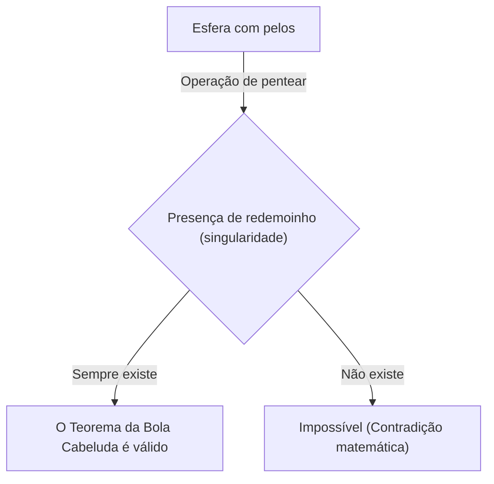
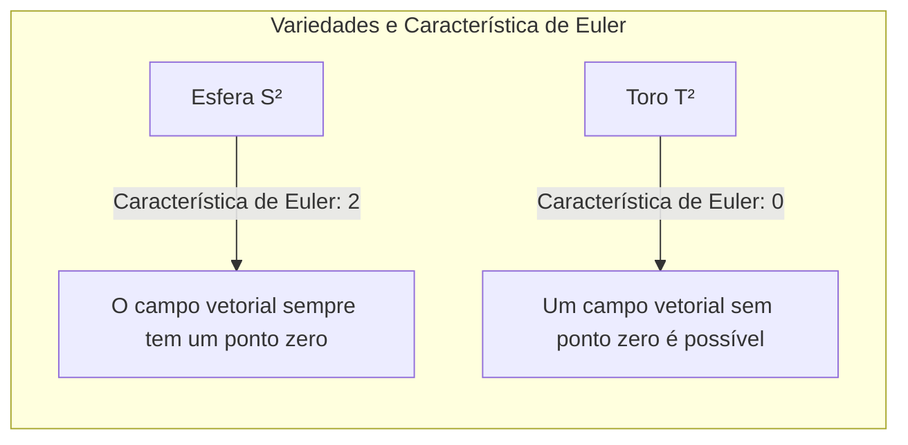

## Introdução

Na área da matemática chamada topologia (geometria topológica), existem muitos teoremas que são intuitivamente interessantes e poderosos. Um dos mais famosos entre eles é o **Teorema da Bola Cabeluda** ([Hairy Ball Theorem](https://kenji.blog/pt/p/hairy-ball-theorem/)). Esse teorema é frequentemente expresso em palavras muito visuais e fáceis de entender: "você não pode pentear perfeitamente uma bola com pelos sem criar pelo menos um redemoinho".

No entanto, por trás disso, há um profundo significado matemático oculto, que influencia desde a meteorologia da nossa Terra e computação gráfica até as leis fundamentais da física. Neste artigo, explicaremos detalhadamente desde o significado intuitivo deste teorema até a sua formulação matemática e exemplos surpreendentes de aplicações.

## O que é o Teorema da Bola Cabeluda?

O Teorema da Bola Cabeluda foi mencionado pela primeira vez em 1885 por [Henri Poincaré](https://kenji.blog/pt/p/poincare/) e foi rigorosamente provado em 1912 por Luitzen Egbertus Jan Brouwer.

### Compreensão Intuitiva

Imagine uma esfera completamente coberta por pelos finos, como uma bola de tênis ou um coco. Você está tentando alisar os pelos desta bola usando um pente. Seria possível deitar todos os pelos suavemente ao longo da superfície da bola, sem criar nenhum "redemoinho" ou "repartição" em nenhum lugar?

O Teorema da Bola Cabeluda afirma categoricamente que **"isso é absolutamente impossível"**.

Não importa o quão habilmente você penteie os pelos, inevitavelmente haverá pelo menos um local onde os pelos ficarão em pé (um redemoinho) ou um ponto sem pelos (uma singularidade).

### Formulação Matemática

Vamos expressar esse fato intuitivo de forma precisa usando a linguagem matemática (especialmente a geometria diferencial e a topologia).

Matematicamente, o "pelo" é representado como um "vetor tangente" em cada ponto da superfície da esfera. E "pentear todos os pelos perfeitamente" equivale a definir um "campo de vetores tangentes contínuo e não-nulo" sobre toda a superfície da esfera.

A afirmação exata do teorema é a seguinte:

> Não existe um campo de vetores tangentes contínuo e em nenhum lugar nulo sobre uma esfera de dimensão par $S^{2n}$.

A esfera comum dentro do espaço tridimensional em que vivemos tem uma superfície bidimensional, portanto, é denotada como $S^2$. Como 2 é um número par, este teorema se aplica.

Expressando matematicamente, para qualquer campo de vetores tangentes contínuo $V(p)$ (onde $p \in S^2$) sobre a esfera $S^2$, sempre existirá um ponto $p_0 \in S^2$ tal que
$$
V(p_0) = 0
$$
Este ponto $p_0$ onde $V(p) = 0$ corresponde ao "redemoinho" ou "lugar onde os pelos estão de pé".

## Por que isso acontece?

Por trás deste teorema está um invariante topológico chamado **Característica de Euler** (Euler characteristic).

A característica de Euler $\chi$ de um poliedro é calculada usando o número de vértices ($V$), número de arestas ($E$) e número de faces ($F$), com a seguinte fórmula famosa (Fórmula de Euler para poliedros):

$$
\chi = V - E + F
$$

Para um sólido que é homeomorfo (topologicamente o mesmo) a uma esfera, a característica de Euler é sempre $\chi = 2$.

De acordo com o Teorema de Poincaré-Hopf (Poincaré-Hopf Theorem), a soma dos índices das singularidades (pontos onde o vetor se torna zero) de um campo vetorial em uma variedade é igual à característica de Euler dessa variedade.

Expressando em fórmula matemática,
$$
\sum_{i} \text{index}_{x_i}(V) = \chi(M)
$$
Aqui, $M$ é a variedade (neste caso, a esfera $S^2$).

Para uma esfera, $\chi(S^2) = 2$. Para que a soma dos índices seja 2, deve haver pelo menos uma singularidade (um ponto com índice diferente de zero). Como a soma nunca pode ser 0, um "estado sem singularidades (um campo vetorial não-nulo em toda parte)" é impossível.

## E no caso de um toro (formato de rosquinha)?

Aqui surge uma questão interessante. E se não fosse uma bola, mas sim uma forma como uma rosquinha (toro $T^2$)?

Na verdade, a característica de Euler de um toro é $\chi(T^2) = 0$.

Portanto, no Teorema de Poincaré-Hopf, o lado direito torna-se 0. Isso significa que é **possível** criar um campo vetorial contínuo que não possui nenhuma singularidade.

De modo intuitivo, se fosse uma bola de pelos com formato de rosquinha, poderíamos pentear os pelos suavemente na mesma direção ao redor do buraco da rosquinha, sem criar nenhum redemoinho.

## Aplicações surpreendentes no mundo real

O Teorema da Bola Cabeluda não é apenas um quebra-cabeça matemático. Ele é útil para explicar vários fenômenos no mundo real em áreas como a física, meteorologia e engenharia.

### 1. Meteorologia: Os ventos da Terra

Vamos considerar a Terra como uma grande esfera $S^2$. O vento é o movimento do ar que sopra ao longo da superfície da Terra, o que é exatamente um "campo de vetores tangentes" em uma esfera.

Se assumirmos que a velocidade e a direção do vento mudam continuamente na Terra, o Teorema da Bola Cabeluda é aplicado diretamente. Ou seja, **sempre haverá algum lugar na Terra onde a velocidade do vento será completamente zero**.

Isso prova matematicamente que "sempre há um lugar na Terra em condição de calmaria (uma singularidade como o olho de um furacão)". É topologicamente impossível que o vento sopre simultaneamente em toda a Terra.

### 2. Computação Gráfica (CG)

No mundo da computação gráfica 3D, este teorema também tem grande importância.

Considere o caso de gerar pelagem (fur) ou cabelo na cabeça de um personagem ou no corpo de um animal (objetos que são homeomorfos a uma esfera). Mesmo se os programadores e artistas tentarem deitar todos os pelos suavemente em uma certa direção, ineviramente surgirão redemoinhos ou aglomerados não naturais de pelos.

Para evitar isso, em softwares de CG, técnicas são utilizadas, como ajustar a topologia do modelo (ocultando a singularidade em partes invisíveis) ou dividi-lo em várias peças para calcular o campo vetorial.

### 3. Física de Plasmas e Reatores de Fusão Nuclear

Em dispositivos pesquisados para a realização de usinas de fusão nuclear, existe um método de confinamento magnético chamado "Tokamak".

Para confinar o plasma de forma estável, as linhas do campo magnético devem ser organizadas de maneira suave ao longo da superfície do recipiente. Se a forma do recipiente fosse uma esfera ($S^2$), devido ao Teorema da Bola Cabeluda, necessariamente existiria um ponto onde o campo magnético se tornaria zero (singularidade), resultando no problema fatal do vazamento do plasma por ali.

É por isso que o recipiente de confinamento de plasma de um reator nuclear do tipo Tokamak não é uma esfera, mas sim um **toro (formato de rosquinha)**. Por ser do tipo toro ($\chi = 0$), é possível organizar suavemente as linhas do campo magnético sem criar singularidades.

## Conclusão

O "Teorema da Bola Cabeluda" é um teorema que à primeira vista tem um nome um pouco humorístico e uma imagem intuitiva, mas em sua essência encontra-se o poderoso conceito matemático da topologia.

*   **Conclusão intuitiva:** Uma bola com pelos não pode ser penteada sem criar um redemoinho.
*   **Verdade matemática:** Um campo de vetores tangentes contínuo sobre uma esfera, cuja característica de Euler é 2, sempre terá um ponto que se torna zero.
*   **Aplicação na realidade:** Está envolvido nos ventos da Terra e até no projeto da forma dos reatores de fusão nuclear.

Pode-se dizer que é um teorema fascinante que nos ensina como a matemática descreve o mundo real de maneira bela e rigorosa. Depois de conhecer este teorema, você talvez possa ver o mundo de uma perspectiva um pouco diferente ao olhar um mapa meteorológico em um dia ventoso ou acariciar o pelo de um cachorro.
