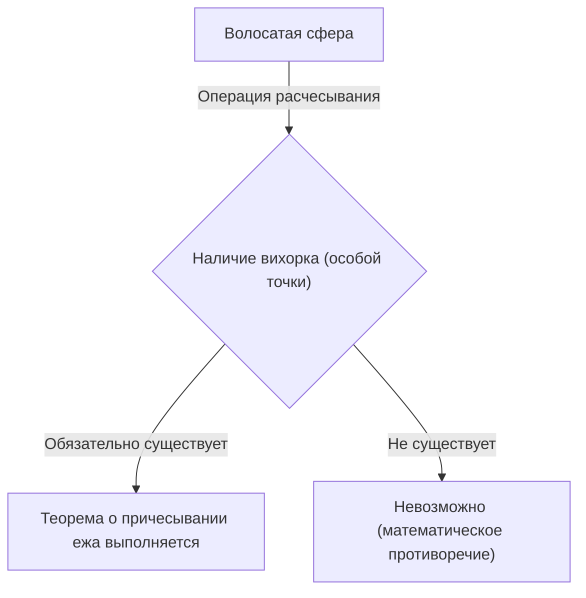
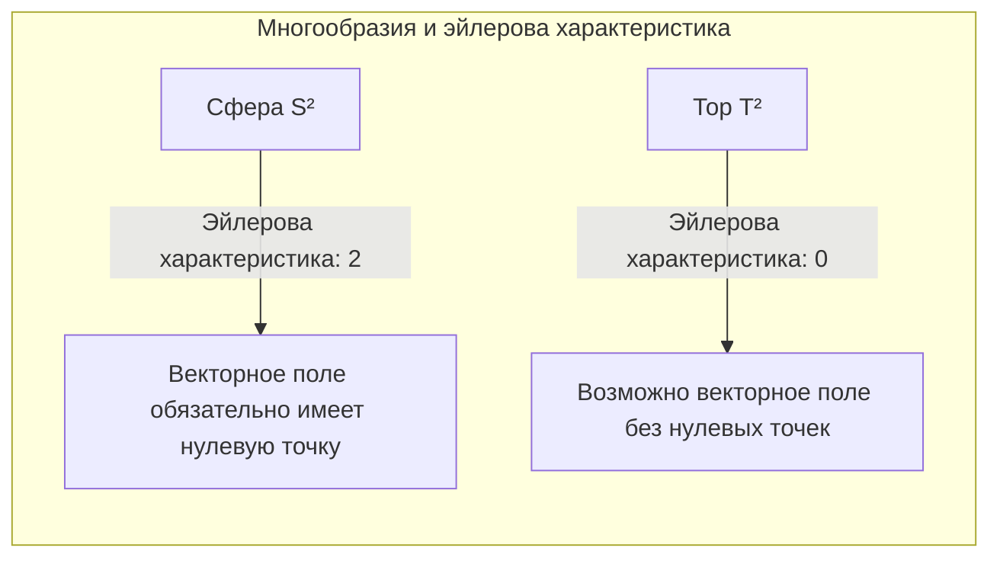

## Введение

В такой области математики, как топология, существует множество интуитивно интересных и мощных теорем. Одной из самых известных среди них является **теорема о причесывании ежа** ([Hairy Ball Theorem](https://kenji.blog/ru/p/hairy-ball-theorem/)). Эта теорема выражается очень наглядно и понятно: «Волосатый шар нельзя причесать гладко, не создав ни одного вихорка».

Однако за этим скрывается глубокий математический смысл, влияющий на погоду нашей Земли, компьютерную графику и даже на фундаментальные законы физики. В этой статье мы подробно рассмотрим эту теорему, начиная с ее интуитивного смысла, математической формулировки и заканчивая удивительными примерами применения.

## Что такое теорема о причесывании ежа?

Теорема о причесывании ежа была впервые упомянута [Анри Пуанкаре](https://kenji.blog/ru/p/poincare/) ([Henri Poincaré](https://kenji.blog/ru/p/poincare/)) в 1885 году и строго доказана Лейтзеном Эгбертом Яном Брауэром (Luitzen Egbertus Jan Brouwer) в 1912 году.

### Интуитивное понимание

Представьте себе сферу, сплошь покрытую мелкими волосками, как теннисный мяч или кокос. Вы пытаетесь причесать волосы на этом шаре расческой, чтобы они лежали ровно. Сможете ли вы гладко уложить все волосы вдоль поверхности шара, нигде не создав «вихорка» или «пробора»?

Теорема о причесывании ежа утверждает: **«Это абсолютно невозможно»**.

Как бы искусно вы ни причесывали волосы, обязательно появится хотя бы одно место, где волосы будут торчать прямо (вихорок), или точка, где волос вообще нет (сингулярная точка).

### Математическая формулировка

Давайте точно выразим этот интуитивный факт с помощью языка математики (в частности, дифференциальной геометрии и топологии).

Математически «волос» представляется как «касательный вектор» в каждой точке на поверхности сферы. А «гладко причесать все волосы» эквивалентно определению «непрерывного нигде не обращающегося в нуль касательного векторного поля» по всей поверхности сферы.

Точная формулировка теоремы звучит так:

> На сфере четной размерности $S^{2n}$ не существует нигде не обращающегося в нуль непрерывного касательного векторного поля.

Обычная сфера в нашем трехмерном пространстве имеет двумерную поверхность, поэтому она обозначается как $S^2$. Поскольку 2 — четное число, эта теорема к ней применима.

В виде формулы это означает, что для любого непрерывного касательного векторного поля $V(p)$ на сфере $S^2$ (где $p \in S^2$) обязательно найдется такая точка $p_0 \in S^2$, что
$$
V(p_0) = 0
$$
Эта точка $p_0$, где $V(p) = 0$, и соответствует «вихорку» или «месту, где волосы стоят торчком».

## Почему это происходит?

В основе этой теоремы лежит топологический инвариант — **эйлерова характеристика** (Euler characteristic).

Эйлерова характеристика $\chi$ многогранника вычисляется по следующей известной формуле (теорема Эйлера для многогранников) с использованием количества вершин ($V$), ребер ($E$) и граней ($F$).

$$
\chi = V - E + F
$$

Для трехмерного тела, гомеоморфного (топологически эквивалентного) сфере, эйлерова характеристика всегда равна $\chi = 2$.

Согласно теореме Пуанкаре — Хопфа ([Poincaré](https://kenji.blog/ru/p/poincare/)-Hopf Theorem), сумма индексов особых точек (точек, где вектор равен нулю) векторного поля на многообразии равна эйлеровой характеристике этого многообразия.

В виде формулы это выражается так:
$$
\sum_{i} \text{индекс}_{x_i}(V) = \chi(M)
$$
где $M$ — многообразие (в данном случае сфера $S^2$).

Для сферы $\chi(S^2) = 2$. Чтобы сумма индексов была равна 2, должна существовать хотя бы одна особая точка (точка с ненулевым индексом). Поскольку сумма никогда не может быть равна 0, ситуация «ни одной особой точки (нигде не обращающееся в нуль векторное поле)» невозможна.

## Что происходит в случае тора (формы пончика)?

Здесь возникает интересный вопрос. А что, если форма будет не шарообразной, а в виде пончика (тор $T^2$)?

На самом деле, эйлерова характеристика тора равна $\chi(T^2) = 0$.

Следовательно, в теореме Пуанкаре — Хопфа правая часть равна 0. Это означает, что **возможно** создать непрерывное векторное поле без единой особой точки.

Говоря интуитивно, если бы у нас был волосатый пончик, мы могли бы гладко причесать его, не создавая вихорков, если бы причесывали волосы в одном направлении по кругу вдоль отверстия пончика.

## Удивительные применения в реальном мире

Теорема о причесывании ежа — это не просто математическая головоломка. Она помогает объяснить различные явления в реальном мире, в физике, метеорологии, инженерии и других областях.

### 1. Метеорология: Ветры на Земле

Представим Землю как большую сферу $S^2$. Ветер — это движение воздуха вдоль поверхности Земли, и это в точности «касательное векторное поле» на сфере.

Если предположить, что скорость и направление ветра изменяются на Земле непрерывно, то напрямую применяется теорема о причесывании ежа. Это означает, что **где-то на Земле обязательно существует место, где скорость ветра полностью равна нулю**.

Это математически доказывает, что «на Земле всегда есть место с безветренной погодой (особая точка, подобная глазу бури)». Топологически невозможно, чтобы ветер дул одновременно на всей поверхности Земли.

### 2. Компьютерная графика (CG)

В мире 3D компьютерной графики эта теорема также имеет важное значение.

Рассмотрим случай создания меха или волос на голове персонажа или теле животного (объекты, гомеоморфные сфере). Даже если программист или художник попытается гладко уложить все волосы в одном направлении, обязательно возникнет вихорок или неестественное скопление волос.

Чтобы избежать этого, в программном обеспечении для CG используются технологии адаптации топологии модели (скрытие особых точек в невидимых местах) или расчет векторного поля путем разбиения на несколько частей.

### 3. Физика плазмы и термоядерные реакторы

Среди устройств, разрабатываемых для реализации термоядерной энергетики, есть метод магнитного удержания, называемый «токамак».

Для стабильного удержания плазмы магнитные силовые линии должны быть гладко распределены вдоль поверхности камеры. Если бы камера имела форму сферы ($S^2$), то по теореме о причесывании ежа обязательно появилась бы точка (особая точка), где магнитное поле равно нулю, что привело бы к фатальной проблеме утечки плазмы из этой точки.

Именно поэтому камера для удержания плазмы в термоядерном реакторе типа токамак имеет не сферическую форму, а форму **тора (пончика)**. Потому что в тороидальной форме ($\chi = 0$) возможно гладко распределить магнитные силовые линии, не создавая особых точек.

## Заключение

«Теорема о причесывании ежа» — это теорема, которая на первый взгляд имеет несколько забавное название и интуитивно понятный образ, но в ее основе лежит мощная математическая концепция топологии.

*   **Интуитивный вывод:** Волосатый шар нельзя причесать, не создав вихорка.
*   **Математическая истина:** Непрерывное касательное векторное поле на сфере, эйлерова характеристика которой равна 2, обязательно имеет точку, где оно равно нулю.
*   **Применение в реальности:** Связано с ветрами на Земле и даже проектированием формы термоядерных реакторов.

Можно сказать, что это очень увлекательная теорема, которая показывает нам, как красиво и строго математика описывает реальный мир. Узнав об этой теореме, возможно, вы станете смотреть на мир под немного другим углом, когда будете рассматривать карту погоды в ветреный день или гладить собаку.
