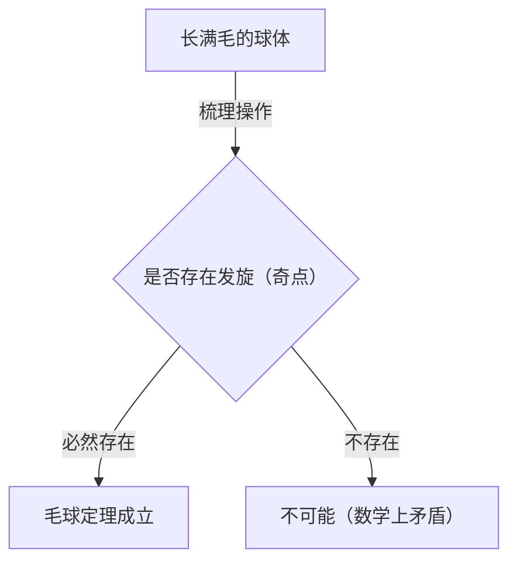
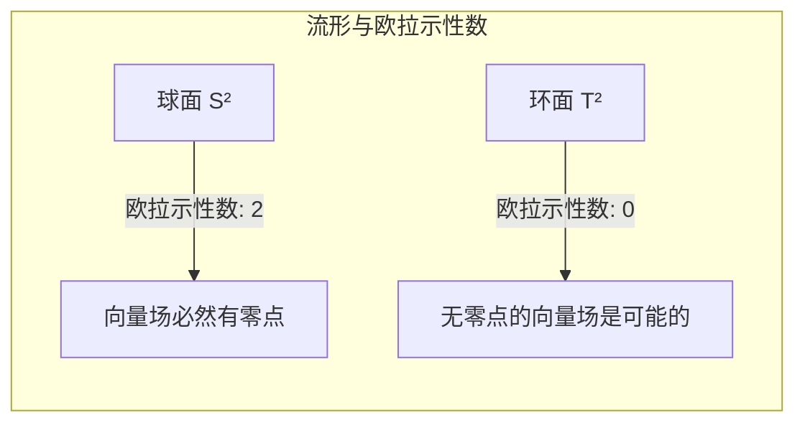

## 引言

在拓扑学（Topology）这个数学分支中，存在许多直观上有趣且强大的定理。其中特别著名的就是 **毛球定理** （[Hairy Ball Theorem](https://kenji.blog/p/hairy-ball-theorem/)）。这个定理可以用非常直观易懂的话来表述：“你无法将一个长满毛的球梳理平整，而不留下任何发旋（毛发漩涡）”。

然而，在其背后隐藏着深刻的数学意义，它影响着我们居住的地球的气象、计算机图形学，甚至物理学的基本定律。本文将从该定理的直观意义出发，详细讲解其数学上的表述形式，以及令人惊讶的应用实例。

## 什么是毛球定理？

毛球定理最早由[亨利·庞加莱](https://kenji.blog/p/poincare/)（[Henri Poincaré](https://kenji.blog/p/poincare/)）于1885年提出，并在1912年由鲁伊兹·埃格伯特斯·扬·布劳威尔（Luitzen Egbertus Jan Brouwer）给出了严格的证明。

### 直观理解

请想象一下，有一个像网球或椰子一样的球体，表面密密麻麻地长满了细毛。你正试图用梳子将这个球上的毛平整地梳贴。你能在不产生任何“发旋”或“分界线”的情况下，将所有的毛顺着球体表面平滑地梳贴吗？

毛球定理断言， **“那绝对是不可能的”** 。

无论你梳理得多么巧妙，必然至少会有一个地方，毛会直立起来（发旋），或者是一个完全没有毛的点（奇点）。

### 数学上的表述

让我们用数学的语言（特别是微分几何和拓扑学）来准确地表达这个直观的事实。

在数学上，“毛”被表示为球面表面上各点处的“切向量”。而“将所有的毛梳理平整”则相当于在整个球面表面上定义一个“连续的非零切向量场”。

定理的准确表述如下：

> 在偶数维球面 $S^{2n}$ 上，不存在处处非零的连续切向量场。

我们居住的三维空间中的普通球面，因为其表面是二维的，所以记为 $S^2$ 。由于2是偶数，因此适用该定理。

用数学公式表示，对于球面 $S^2$ 上的任意连续切向量场 $V(p)$ （其中 $p \in S^2$ ），必然存在某一点 $p_0 \in S^2$ ，使得：
$$
V(p_0) = 0
$$
这个满足 $V(p) = 0$ 的点 $p_0$ ，就相当于“发旋”或“毛发直立的地方”。

## 为什么会发生这种情况？

这个定理背后隐藏的是拓扑学的一个不变量—— **欧拉示性数** （Euler characteristic）。

多面体的欧拉示性数 $\chi$ ，使用顶点数（$V$）、边数（$E$）和面数（$F$），通过以下著名的公式（欧拉多面体公式）来计算：

$$
\chi = V - E + F
$$

对于与球面同胚（拓扑上相同）的立体，欧拉示性数始终为 $\chi = 2$ 。

根据庞加莱-霍普夫定理（Poincaré-Hopf Theorem），流形上向量场的奇点（向量为零的点）的指数总和，等于该流形的欧拉示性数。

用数学公式表示为：
$$
\sum_{i} \text{指数}_{x_i}(V) = \chi(M)
$$
在这里，$M$ 是流形（在这种情况下是球面 $S^2$ ）。

对于球面而言， $\chi(S^2) = 2$ 。为了使指数总和为2，必然至少存在一个以上的奇点（指数不为零的点）。由于总和绝不可能为0，因此“完全没有奇点的状态（处处非零的向量场）”是不可能存在的。

## 如果是环面（甜甜圈形状）会怎样？

这里产生了一个有趣的问题。如果不是球，而是像甜甜圈一样的形状（环面 $T^2$ ）会怎样呢？

实际上，环面的欧拉示性数为 $\chi(T^2) = 0$ 。

因此，在庞加莱-霍普夫定理中右边变为0。这意味着，构建一个没有任何奇点的连续向量场是 **可能** 的。

直观地说，如果是一个甜甜圈形状的毛球，只要沿着甜甜圈的孔洞一圈一圈地沿同一方向梳理，就可以不产生任何发旋地将其平整地梳理好。

## 现实世界中令人惊讶的应用

毛球定理不仅是一个简单的数学难题。它有助于解释物理学、气象学、工程学等现实世界中的各种现象。

### 1. 气象学：地球上的风

让我们把地球看作一个巨大的球面 $S^2$ 。风是沿着地球表面吹动的空气运动，这恰好是球面上的“切向量场”。

假设风速和风向在地球上是连续变化的，那么毛球定理就可以直接适用。也就是说， **地球上的某个地方，必然存在风速完全为零的地点** 。

这在数学上证明了，“地球上的某个地方总是存在无风状态的地点（像台风眼一样的奇点）”。从拓扑学上讲，地球上所有地方同时狂风大作是不可能的。

### 2. 计算机图形学（CG）

在3D计算机图形学的世界中，这个定理也具有重要的意义。

假设要在角色头部或动物身体（与球面同胚的物体）上生成毛皮或头发。即使程序员或美术师试图将所有的毛平滑地向一个方向梳贴，也必然会产生发旋或不自然的毛发聚集。

为了避免这种情况，在CG软件中，会使用各种技术，比如巧妙处理模型的拓扑结构（将奇点隐藏在看不见的部分），或者将其分成多个部分来计算向量场。

### 3. 等离子体物理学与核聚变反应堆

在为了实现核聚变发电而研究的装置中，有一种被称为“托卡马克型”的磁约束方式。

为了稳定地约束等离子体，磁感线必须沿着容器表面平滑地分布。如果容器的形状是球体（ $S^2$ ），根据毛球定理，必然会产生磁场为零的点（奇点），从而导致等离子体从那里泄漏出来的致命问题。

正因为如此，托卡马克型核反应堆的等离子体约束容器并不是球体，而是 **环面（甜甜圈形状）** 。因为如果是环面（ $\chi = 0$ ），就可以在不产生奇点的情况下平滑地分布磁感线。

## 总结

“毛球定理”虽然有着看似有些幽默的名字和直观的意象，但其根本却横亘着拓扑学这一强大的数学概念。

*   **直观结论:** 长满毛的球，如果不产生发旋就无法梳理平整。
*   **数学真理:** 欧拉示性数为2的球面上的连续切向量场，必然存在为零的点。
*   **对现实的应用:** 甚至涉及到地球上的风以及核聚变反应堆的形状设计。

可以说，这是一个非常具有魅力的定理，它告诉我们数学是如何美丽且严谨地描述现实世界的。在了解这个定理之后，也许在风大之日看天气图，或是抚摸小狗的毛发时，你能够以稍微不同的视角来看待这个世界。
