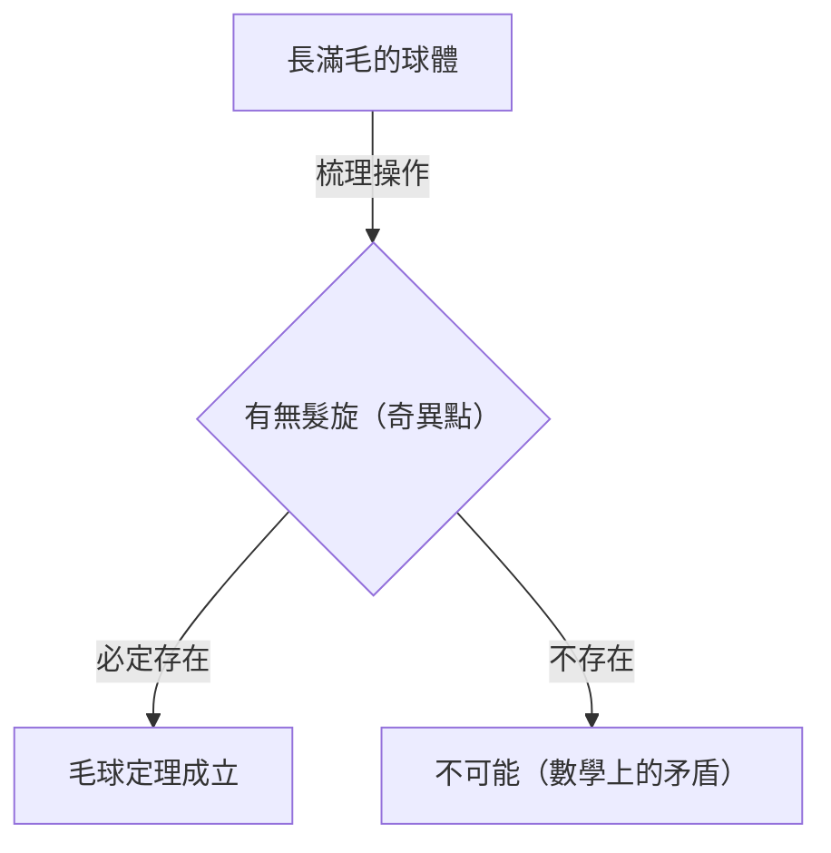
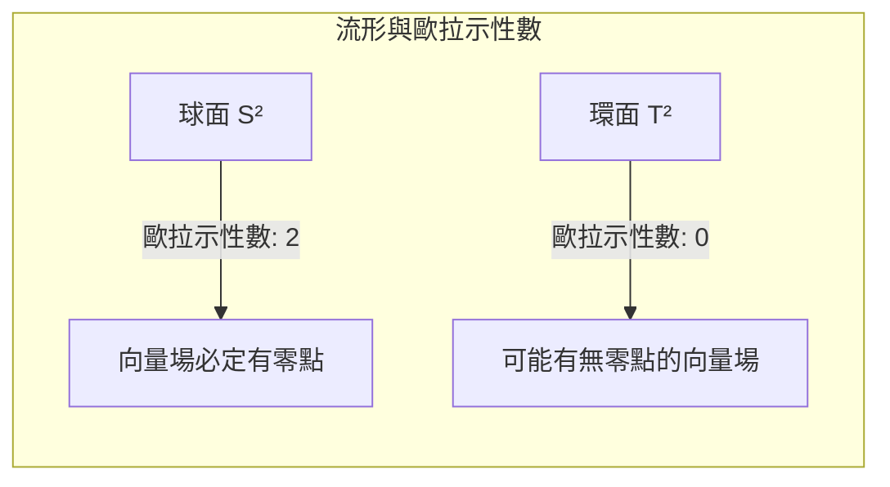

## 前言

在拓撲學（Topology）這個數學領域中，存在許多直觀上有趣且強大的定理。其中特別有名的就是 **毛球定理** （[Hairy Ball Theorem](https://kenji.blog/p/hairy-ball-theorem/)）。這個定理可以用非常視覺化且易懂的話來表達：「你無法將一個長滿毛的球梳理平整，而不留下任何髮旋」。

然而，在其背後隱藏著深刻的數學意義，甚至影響著我們居住的地球氣象、電腦圖學，甚至是物理學的基本定律。本文將詳細解說這個定理的直觀意義、數學公式化，以及令人驚嘆的應用實例。

## 什麼是毛球定理？

毛球定理最早由[亨利·龐加萊](https://kenji.blog/p/poincare/)（[Henri Poincaré](https://kenji.blog/p/poincare/)）在1885年提及，並在1912年由魯伊茲·布勞威爾（Luitzen Egbertus Jan Brouwer）嚴謹證明。

### 直觀的理解

請想像一下，有一個像網球或椰子一樣，整個表面密密麻麻長滿細毛的球體。你正試圖用梳子將這個球上的毛梳平。你能夠不留下任何「髮旋」或「分線」，將所有的毛沿著球體表面平滑地梳理平整嗎？

毛球定理斷言， **「那絕對是不可能的」** 。

無論你多麼巧妙地梳理那些毛，必定至少會有一個地方，毛會直立起來（髮旋），或是完全沒有毛的點（奇異點）。

### 數學公式化

讓我們用數學語言（特別是微分幾何和拓撲學）來準確地表達這個直觀的事實。

在數學上，「毛」被表示為球面上各點的「切向量」。而「將所有的毛梳理平整」，就相當於在整個球面上定義一個「連續的非零切向量場」。

定理的準確主張如下：

> 在偶數維度的球面 $S^{2n}$ 上，不存在處處非零的連續切向量場。

我們居住的三維空間中普通的球面，因為表面是二維的，所以記為 $S^2$。因為2是偶數，所以這個定理適用。

用數學公式表示，對於球面 $S^2$ 上任意的連續切向量場 $V(p)$ （其中 $p \in S^2$），必定存在某一點 $p_0 \in S^2$，使得
$$
V(p_0) = 0
$$
也就是說，這個 $V(p) = 0$ 的點 $p_0$，就相當於「髮旋」或「毛直立的地方」。

## 為什麼會發生這種事？

這個定理背後的原因是拓撲學的非變量 **歐拉示性數** （Euler characteristic）。

多面體的歐拉示性數 $\chi$ 可以使用頂點數（$V$）、邊數（$E$）、面數（$F$），透過以下著名的公式（歐拉多面體定理）來計算。

$$
\chi = V - E + F
$$

對於與球面同胚（拓撲上相同）的立體，其歐拉示性數恆為 $\chi = 2$。

根據龐加萊-霍普夫定理（Poincaré-Hopf Theorem），流形上向量場的奇異點（向量為零的點）的指數總和，等於該流形的歐拉示性數。

用數學公式表示為：
$$
\sum_{i} \text{index}_{x_i}(V) = \chi(M)
$$
這裡的 $M$ 是流形（在此為球面 $S^2$）。

對於球面，$\chi(S^2) = 2$。為了使指數的總和為2，至少必須存在一個以上的奇異點（指數不為零的點）。由於總和絕對不可能為0，因此「完全沒有奇異點的狀態（處處非零的向量場）」是不可能的。

## 如果是環面（甜甜圈形狀）會怎麼樣？

這裡產生了一個有趣的問題。如果不是球體，而是像甜甜圈一樣的形狀（環面 $T^2$）會怎麼樣呢？

實際上，環面的歐拉示性數為 $\chi(T^2) = 0$。

因此，在龐加萊-霍普夫定理中，右邊會變成0。這意味著，建立一個完全沒有奇異點的連續向量場是 **可能的** 。

直觀地說，如果是甜甜圈形狀的毛球，只要沿著甜甜圈的洞一直朝同一個方向梳理毛髮，就能夠不產生任何髮旋地梳理平整。

## 現實世界中令人驚嘆的應用

毛球定理不僅僅是數學謎題。它有助於解釋物理學、氣象學和工程學等現實世界中的各種現象。

### 1. 氣象學：地球上的風

讓我們將地球視為一個巨大的球面 $S^2$。風是空氣沿著地球表面的移動，這正是一個球面上的「切向量場」。

假設風速和風向在地球上是連續變化的，那麼毛球定理就可以直接適用。也就是說， **地球上必定有某個地方的風速完全為零** 。

這在數學上證明了「地球上總是存在無風的地方（像颱風眼一樣的奇異點）」。就拓撲學而言，全球同時颳風是不可能的。

### 2. 電腦圖學（CG）

在3D電腦圖學的世界裡，這個定理也具有重要的意義。

考慮在角色頭部或動物身體（與球面同胚的物件）上生成毛皮（fur）或頭髮的情況。程式設計師或藝術家即使試圖將所有的毛平滑地朝同一個方向梳理，也必定會產生髮旋或不自然的毛髮聚集。

為了避免這種情況，在CG軟體中，會使用調整模型的拓撲結構（將奇異點隱藏在看不見的地方），或者將其分割成多個部分來計算向量場等技術。

### 3. 電漿物理學與核融合爐

在致力於實現核融合發電的研究裝置中，有一種被稱為「托卡馬克型（Tokamak）」的磁束縛方式。

為了穩定地束縛電漿，磁力線必須沿著容器表面平滑地配置。如果容器的形狀是球體（$S^2$），根據毛球定理，必定會產生磁場為零的點（奇異點），從而導致電漿從那裡洩漏出來的致命問題。

正因為如此，托卡馬克型核融合爐的電漿束縛容器不是球體，而是 **環面（甜甜圈形狀）** 。因為如果是環面形狀（$\chi = 0$），就有可能在不產生奇異點的情況下平滑地配置磁力線。

## 總結

「毛球定理」乍看之下是一個名字有些幽默且具有直觀意象的定理，但其根本在於拓撲學這個強大的數學概念。

*   **直觀的結論：** 長滿毛的球體無法不留髮旋地梳理平整。
*   **數學的真理：** 在歐拉示性數為2的球面上，連續切向量場必定有為零的點。
*   **對現實的應用：** 甚至與地球上的風或核融合爐的形狀設計有關。

可以說這是一個非常迷人的定理，它告訴我們數學是如何美麗而嚴謹地描述現實世界的。在了解了這個定理之後，當你在風大的日子看天氣圖，或是撫摸狗的毛髮時，或許可以用稍微不同的視角來看待這個世界。
