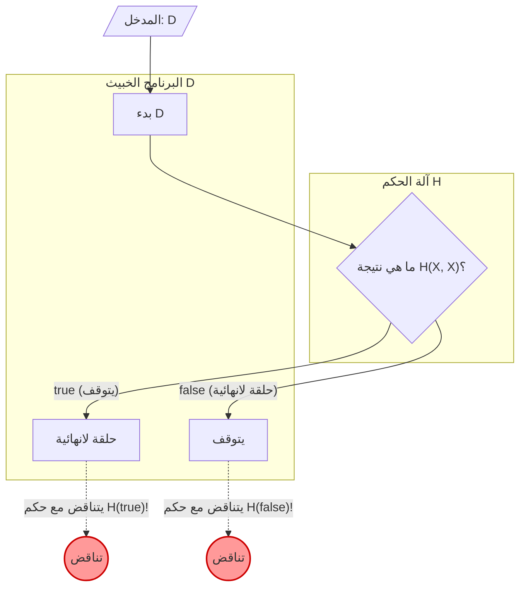

أثناء البرمجة، قد ينتابك القلق أحيانًا: "هل وقع هذا البرنامج في حلقة لانهائية (Infinite Loop) في مكان ما؟" لو كان لدينا **أداة قادرة على تحديد ما إذا كان أي برنامج سيقع في حلقة لانهائية أم لا بشكل مؤكد**، لأصبحت عملية التطوير وتصحيح الأخطاء (Debugging) أسهل بكثير.

ومع ذلك، في مجال علوم الكمبيوتر، تم إثبات رياضيًا أن مثل هذه الأداة الحلم **"لا يمكن صنعها أبدًا"**. هذا ما يُعرف باسم **"مشكلة التوقف" (Halting Problem)** الشهيرة.

في هذه المقالة، سنشرح هذه المشكلة التي أثبتها [آلان تورينج](https://kenji.blog/ar/p/turing/) ([Alan Turing](https://kenji.blog/ar/p/turing/)) في عام 1936، بطريقة سهلة الفهم باستخدام أمثلة بديهية، وصيغ رياضية (KaTeX)، ورسوم توضيحية (Mermaid).

## ما هي مشكلة التوقف؟

تشير مشكلة التوقف إلى المشكلة التالية:

> بالنظر إلى أي برنامج كمبيوتر ومدخلاته، هل توجد خوارزمية عامة لتحديد ما إذا كان البرنامج سينتهي (يتوقف) في وقت محدود، أم أنه سيستمر في العمل إلى الأبد (يقع في حلقة لانهائية)؟

لو كان هذا ممكنًا، لكان من المفترض أن نتمكن من تنفيذ دالة `Halt(P, I)` على النحو التالي:

```python
def Halt(P, I):
    """
    عند إعطاء البرنامج P المدخل I،
    ترجع true إذا كان سيتوقف،
    وترجع false إذا كان سيقع في حلقة لانهائية.
    """
    # الخوارزمية الشاملة الحلم...
```

للوهلة الأولى، يبدو أنه يمكننا صنعها عن طريق التحليل الثابت (Static Analysis) للكود المصدري أو محاكاة التنفيذ. دعونا نلقي نظرة على أمثلة بسيطة.

### أمثلة بديهية

**مثال 1: برنامج يتوقف بوضوح**

```python
def example1(x):
    return x * 2
```
هذا البرنامج `example1` يرجع قيمة رقمية ويتوقف فورًا بغض النظر عن المدخلات. لذلك يجب أن تكون `Halt(example1, input)` هي `true`.

**مثال 2: برنامج يقع في حلقة لانهائية بوضوح**

```python
def example2(x):
    while True:
        pass
```
هذا البرنامج `example2` لن يخرج من حلقة التكرار أبدًا. لذلك يجب أن تكون `Halt(example2, input)` هي `false`.

**مثال 3: برنامج يصعب الحكم عليه (حدسية كولاتز)**

```python
def collatz(n):
    while n > 1:
        if n % 2 == 0:
            n = n // 2
        else:
            n = 3 * n + 1
```
هذه الدالة تكرر العملية التالية حتى يصبح الرقم 1: إذا كان الرقم الممنوح زوجيًا تقسمه على النصف، وإذا كان فرديًا تضربه في 3 وتضيف 1. ما إذا كان هذا البرنامج يتوقف لجميع الأعداد الصحيحة الموجبة هو مسألة رياضية غير محلولة تُعرف باسم "حدسية كولاتز" (Collatz conjecture). لو كانت الدالة `Halt` الشاملة موجودة، لكان بإمكاننا حل حتى المسائل الرياضية غير المحلولة بمجرد تمرير البرنامج إليها.

## الإثبات الرياضي والإثبات بالخُلف

استخدم تورينج **"الإثبات بالخُلف" (Proof by Contradiction)** لإثبات عدم وجود الدالة `Halt` الشاملة. الإثبات بالخُلف هو طريقة إثبات تُظهر أنه إذا افترضنا صحة افتراض معين، فإنه يؤدي إلى تناقض، وبالتالي يُستنتج أن الافتراض الأصلي كان خاطئًا.

لبدء الإثبات، نفترض أولاً وجود خوارزمية حكم شاملة $H$. تُعرَّف الدالة $H(P, I)$ التي تستقبل البرنامج $P$ ومدخله $I$ على النحو التالي:

$$
H(P, I) =
\begin{cases}
\text{true} & (\text{إذا كان البرنامج } P \text{ يتوقف عند الإدخال } I) \\
\text{false} & (\text{إذا كان البرنامج } P \text{ يقع في حلقة لانهائية عند الإدخال } I)
\end{cases}
$$

ونفترض أن $H$ تُرجع دائمًا إما `true` أو `false` في وقت محدود لأي برنامج ومدخل.

بعد ذلك، نستخدم نتيجة $H$ هذه لإنشاء برنامج خبيث $D$ (Deceiver، المخادع). يستقبل البرنامج $D$ برنامجًا آخر $X$ كمدخل، ويتصرف على النحو التالي:

```python
def D(X):
    if H(X, X) == True:
        while True:
            pass  # يقع في حلقة لانهائية
    else:
        return  # يتوقف
```

سلوك البرنامج $D(X)$ هو كما يلي:
1. يحكم على التوقف $H(X, X)$ عندما يتم إعطاء البرنامج $X$ كمدخل لنفسه $X$.
2. إذا كان $H(X, X)$ هو `true` (أي أن $X(X)$ يتوقف)، فإنه يقع عمدًا في **حلقة لانهائية**.
3. إذا كان $H(X, X)$ هو `false` (أي أن $X(X)$ يقع في حلقة لانهائية)، فإنه **يتوقف** عمدًا.

وهنا يكمن جوهر الإثبات. **ماذا سيحدث لو أعطينا هذا البرنامج الخبيث $D$ لنفسه $D$ كمدخل؟** أي أننا نفكر في سلوك $D(D)$ عند تنفيذه.

دعونا نفكر في الحالات المختلفة.

### الحالة 1: افتراض أن $D(D)$ يتوقف

إذا افترضنا أن $D(D)$ يتوقف، فيجب أن تُرجع خوارزمية الحكم $H(D, D)$ القيمة `true`.
ومع ذلك، بالنظر إلى تعريف $D$، عندما يكون $H(D, D)$ هو `true`، يدخل $D$ في `while True`، ويقع في **حلقة لانهائية**.
وهذا يتناقض مع افتراض أن "$D(D)$ يتوقف".

### الحالة 2: افتراض أن $D(D)$ يقع في حلقة لانهائية

إذا افترضنا أن $D(D)$ يقع في حلقة لانهائية، فيجب أن تُرجع خوارزمية الحكم $H(D, D)$ القيمة `false`.
ومع ذلك، بالنظر إلى تعريف $D$، عندما يكون $H(D, D)$ هو `false`، فإن $D$ يقوم فورًا بـ `return` و **يتوقف**.
وهذا يتناقض مع افتراض أن "$D(D)$ يقع في حلقة لانهائية".

### الخلاصة

في كلتا الحالتين، ظهر تناقض. نتج هذا التناقض لأن الافتراض الأولي "توجد خوارزمية حكم شاملة $H$" كان خاطئًا.

لذلك، تم إثبات أنه **لا توجد خوارزمية شاملة لتحديد توقف أي برنامج**.

## رسم توضيحي: آلية التناقض

دعونا نوضح منطق الإثبات بالخُلف هذا بيانيًا باستخدام Mermaid.



كما نرى في الشكل، في اللحظة التي يتم فيها إعطاء $D$ نفسه كمدخل، تحدث حلقة معكوسة (مفارقة) تنقلب فيها النتيجة المتوقعة والإجراء الفعلي، وينهار المنطق. هذا يشبه إلى حد كبير هيكل مفارقة الكذاب "هذه الجملة كاذبة".

## تاريخ الكمبيوتر وآلة تورينج

طرح [آلان تورينج](https://kenji.blog/ar/p/turing/) هذه المشكلة وأثبتها في عام 1936، في عصر لم تكن فيه الحواسيب الإلكترونية (الكمبيوتر) موجودة كما هي اليوم. لتعريف "ما هو الحساب؟" بدقة رياضية، ابتكر آلة افتراضية تسمى **"آلة تورينج" (Turing Machine)**.

تتكون آلة تورينج من شريط يمتد إلى ما لا نهاية، ورأس يقرأ ويكتب المعلومات على الشريط، وجدول انتقال الحالات الذي يدير حالة الآلة. يُعرف أنه مهما كان البرنامج الحديث معقدًا، يمكن نظريًا اختزاله إلى آلة تورينج هذه. وهذا ما يسمى **"أطروحة تشيرش-تورينج" (Church-Turing Thesis)**.

حاول تورينج رسم خط فاصل بين "المسائل القابلة للحساب" و"المسائل غير القابلة للحساب" باستخدام هذا النموذج البسيط. ونتيجة لذلك، تم اكتشاف مشكلة التوقف كأبرز مثال على المشاكل غير القابلة للتقرير (Undecidable).

## العلاقة العميقة مع [مبرهنات عدم الاكتمال لغودل](https://kenji.blog/ar/p/godels-incompleteness-theorems/)

"مفارقة المرجعية الذاتية" (Self-reference) الكامنة وراء إثبات مشكلة التوقف ترتبط ارتباطًا وثيقًا بـ **"مبرهنات عدم الاكتمال" (Incompleteness Theorems)** التي نشرها [كورت غودل](https://kenji.blog/ar/p/godel/) ([Kurt Gödel](https://kenji.blog/ar/p/godel/)) في عام 1931، قبل تورينج بوقت قصير.

تنص مبرهنة عدم الاكتمال الأولى لغودل على أنه "في أي نظام بديهي قوي بما فيه الكفاية يتضمن نظرية الأعداد الطبيعية، توجد دائمًا قضايا صحيحة لا يمكن إثباتها أو دحضها". لإثبات هذه المبرهنة، بنى غودل رياضيًا قضية مرجعية ذاتية تقول "هذه القضية لا يمكن إثباتها".

يقوم البرنامج الخبيث $D$ في مشكلة التوقف لتورينج بالمرجعية الذاتية في شكل "إذا حكمت آلة الحكم $H$ بأنه سيتوقف فإنه يقع في حلقة لانهائية، وإذا حكمت بأنه سيقع في حلقة لانهائية فإنه يتوقف". أي أنه يمكن تفسير مشكلة التوقف على أنها **النسخة البرمجية من مبرهنة عدم الاكتمال** على مسرح علوم الكمبيوتر. هذان الإثباتان العظيمان اللذان يوضحان حدود المنطق يشتركان في نفس البنية للمفارقة.

## ماذا تعني هذه المبرهنة في العصر الحديث

حقيقة أن مشكلة التوقف "غير قابلة للتقرير" (Undecidable) لها أهمية كبيرة في هندسة البرمجيات الحديثة.

### الامتداد إلى مبرهنة رايس

تطورت مشكلة التوقف إلى نظرية أكثر عمومية تُعرف باسم **"مبرهنة رايس" (Rice's Theorem)**. تنص مبرهنة رايس على أنه "لا توجد خوارزمية عامة لتحديد ما إذا كان لبرنامج ما أي خصائص دلالية غير بديهية".

أي أنه من المعروف أن ليس فقط ما إذا كان البرنامج سيقع في حلقة لانهائية، ولكن الأسئلة التالية غالبًا ما تكون غير قابلة للتقرير:
- "هل تُرجع هذه الدالة دائمًا 0؟"
- "هل يوجد خطأ معين في هذا البرنامج؟"
- "هل يتسبب هذا النظام في وصول غير صالح للذاكرة؟"

### التنازلات في العالم العملي

لمجرد أنه "لا يمكن حله بشكل عام"، لا يعني أن مهندسي البرمجيات قد استسلموا.
توفر المترجمات (Compilers) الحديثة، وأدوات تحليل الكود الثابت، وبرامج مكافحة الفيروسات التي تكتشف البرامج الضارة، فوائد عملية من خلال تقديم تنازلات كما يلي:

- **الاستدلال (Heuristics)**: يتخلون عن اليقين بنسبة 100%، ويستنتجون من الأنماط الشائعة أنه "ربما يكون خطأ" أو "ربما يكون سلوكًا ضارًا".
- **لغات مقيدة**: من خلال استخدام لغات أو أنظمة أنواع ليست مكتملة تورينج (Turing complete) (حيث لا يمكن كتابة حلقة لانهائية في المقام الأول)، يضمنون أمانًا معينًا.
- **المهلة (Timeout)**: إذا تم حسابه لفترة معينة ولم ينته، يتم إنهاؤه قسريًا على أنه "تجاوز الوقت".

## الخلاصة

في هذه المقالة، شرحنا **مشكلة التوقف** التي أثبتها تورينج.

- لا توجد خوارزمية لتحديد بشكل مؤكد ما إذا كان أي برنامج سيتوقف في وقت محدود.
- بافتراض وجود آلة الحكم $H$، ينشأ تناقض بواسطة البرنامج الخبيث $D$ الذي يخون نتيجة الحكم (الإثبات بالخُلف).
- تُظهر هذه المبرهنة "الحدود المنطقية" لأجهزة الكمبيوتر، وهي السبب الأساسي في أن أدوات تطوير البرمجيات الحديثة تتطلب "التخمين" و"التنازل".

نظرًا لأنه لا يمكن رياضيًا إنشاء أداة تحليل برامج مثالية، لا تزال الاختبارات والتصميم من قبل المبرمجين أنفسهم مهمة اليوم. عند كتابة الكود، لا تنس استخدام عقلك للتفكير في إمكانية حدوث حلقات لانهائية.
