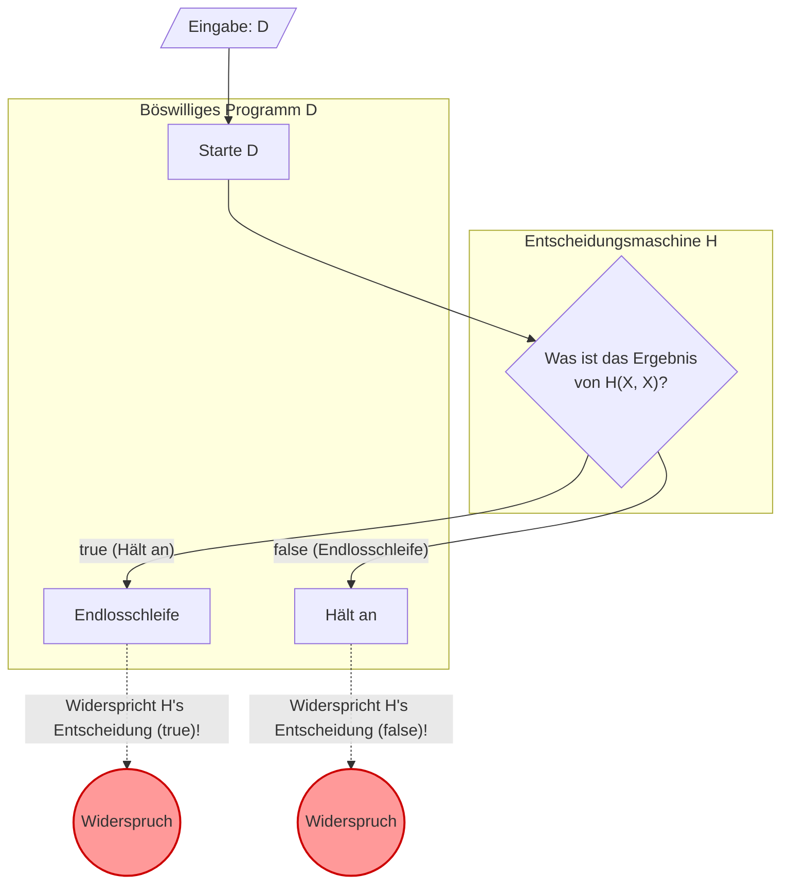

Beim Programmieren macht man sich oft Sorgen: „Könnte dieses Programm irgendwo in eine Endlosschleife geraten?“ Wenn es ein **Tool gäbe, das zuverlässig bestimmen könnte, ob ein beliebiges Programm in eine Endlosschleife gerät**, würde das die Entwicklung und das Debugging drastisch vereinfachen.

In der Informatik ist jedoch mathematisch bewiesen, dass ein solches Traum-Tool **„absolut unmöglich zu erschaffen“** ist. Dies ist das berühmte **„Halteproblem“** (Halting Problem).

In diesem Artikel erklären wir dieses Problem, das 1936 von [Alan Turing](https://kenji.blog/de/p/turing/) bewiesen wurde, verständlich anhand von intuitiven Beispielen, mathematischen Formeln (KaTeX) und Diagrammen (Mermaid).

## Was ist das Halteproblem?

Das Halteproblem bezieht sich auf folgende Frage:

> Gibt es einen allgemeinen Algorithmus, der für ein beliebiges Computerprogramm und dessen Eingabe bestimmt, ob das Programm nach einer endlichen Zeit beendet wird (hält) oder ob es ewig weiterläuft (in einer Endlosschleife feststeckt)?

Wäre dies möglich, so müsste sich eine Funktion `Halt(P, I)` wie folgt implementieren lassen:

```python
def Halt(P, I):
    """
    Gibt true zurück, wenn das Programm P mit der Eingabe I anhält.
    Gibt false zurück, wenn es in eine Endlosschleife gerät.
    """
    # Der Traum eines universellen Algorithmus...
```

Auf den ersten Blick könnte man meinen, dies ließe sich durch statische Code-Analyse oder durch Simulieren der Ausführung erreichen. Schauen wir uns einfache Beispiele an.

### Intuitive Beispiele

**Beispiel 1: Ein Programm, das offensichtlich anhält**

```python
def example1(x):
    return x * 2
```
Dieses Programm `example1` gibt unabhängig von der Eingabe sofort eine Zahl zurück und hält an. Daher sollte `Halt(example1, input)` den Wert `true` zurückgeben.

**Beispiel 2: Ein Programm, das offensichtlich in eine Endlosschleife gerät**

```python
def example2(x):
    while True:
        pass
```
Dieses Programm `example2` wird die Schleife niemals verlassen. Daher sollte `Halt(example2, input)` den Wert `false` zurückgeben.

**Beispiel 3: Ein Programm, das schwer zu beurteilen ist (Collatz-Problem)**

```python
def collatz(n):
    while n > 1:
        if n % 2 == 0:
            n = n // 2
        else:
            n = 3 * n + 1
```
Diese Funktion wiederholt den Vorgang, eine gerade Zahl zu halbieren oder eine ungerade Zahl zu verdreifachen und eins zu addieren, bis das Ergebnis 1 ist. Ob dieses Programm für jede positive ganze Zahl anhält, ist ein ungelöstes mathematisches Problem, das als "Collatz-Problem" oder "Collatz-Vermutung" bekannt ist. Gäbe es eine universelle `Halt`-Funktion, ließe sich selbst solch ein ungelöstes mathematisches Problem einfach dadurch lösen, dass man das Programm an die Funktion übergibt.

## Beweis durch Widerspruch mit mathematischen Formeln

Turing bewies die Nichtexistenz einer universellen `Halt`-Funktion mithilfe eines **Beweises durch Widerspruch** (Proof by Contradiction). Bei dieser Beweismethode nimmt man an, dass eine bestimmte Aussage wahr ist, und zeigt, dass diese Annahme zu einem logischen Widerspruch führt. Daraus folgert man, dass die ursprüngliche Annahme falsch gewesen sein muss.

Um den Beweis zu beginnen, nehmen wir zunächst an, dass es einen universellen Entscheidungsalgorithmus $H$ gibt. Die Funktion $H(P, I)$, die das Programm $P$ und dessen Eingabe $I$ empfängt, ist wie folgt definiert:

$$
H(P, I) =
\begin{cases}
\text{true} & (\text{wenn Programm } P \text{ mit Eingabe } I \text{ anhält}) \\
\text{false} & (\text{wenn Programm } P \text{ mit Eingabe } I \text{ in einer Endlosschleife läuft})
\end{cases}
$$

Wir nehmen an, dass dieses $H$ für jedes beliebige Programm und jede Eingabe nach einer endlichen Zeit garantiert `true` oder `false` zurückgibt.

Als Nächstes nutzen wir das Ergebnis dieses $H$, um ein böswilliges Programm $D$ (Deceiver, der Täuscher) zu erstellen. Das Programm $D$ nimmt ein anderes Programm $X$ als Eingabe und verhält sich wie folgt:

```python
def D(X):
    if H(X, X) == True:
        while True:
            pass  # Endlosschleife
    else:
        return  # Anhalten
```

Das Verhalten des Programms $D(X)$ ist wie folgt:
1. Es verwendet $H(X, X)$, um zu überprüfen, ob das Programm $X$ anhält, wenn man ihm sich selbst ($X$) als Eingabe übergibt.
2. Wenn $H(X, X)$ den Wert `true` zurückgibt (d. h. $X(X)$ hält an), geht $D$ absichtlich in eine **Endlosschleife**.
3. Wenn $H(X, X)$ den Wert `false` zurückgibt (d. h. $X(X)$ läuft in einer Endlosschleife), **hält** $D$ absichtlich an.

Jetzt kommt der Kern des Beweises. **Was passiert, wenn wir diesem böswilligen Programm $D$ als Eingabe sich selbst, also $D$, übergeben?** Wir betrachten das Verhalten, wenn $D(D)$ ausgeführt wird.

Lassen Sie uns die Fälle durchgehen.

### Fall 1: Annahme, dass $D(D)$ anhält

Wenn wir annehmen, dass $D(D)$ anhält, sollte der Entscheidungsalgorithmus $H(D, D)$ den Wert `true` zurückgeben.
Betrachtet man jedoch die Definition von $D$, so gerät $D$ in eine `while True`-**Endlosschleife**, wenn $H(D, D)$ `true` ist.
Dies widerspricht der Annahme, dass „$D(D)$ anhält“.

### Fall 2: Annahme, dass $D(D)$ in einer Endlosschleife läuft

Wenn wir annehmen, dass $D(D)$ in einer Endlosschleife läuft, sollte der Entscheidungsalgorithmus $H(D, D)$ den Wert `false` zurückgeben.
Betrachtet man jedoch die Definition von $D$, so führt $D$ sofort ein `return` aus und **hält an**, wenn $H(D, D)$ `false` ist.
Dies widerspricht der Annahme, dass „$D(D)$ in einer Endlosschleife läuft“.

### Schlussfolgerung

In beiden Fällen entsteht ein Widerspruch. Dieser Widerspruch ist entstanden, weil unsere anfängliche Annahme, dass „ein universeller Entscheidungsalgorithmus $H$ existiert“, falsch war.

Daher ist bewiesen, dass **es keinen universellen Algorithmus gibt, der für ein beliebiges Programm bestimmt, ob es anhält**.

## Diagramm: Die Mechanik des Widerspruchs

Lassen Sie uns die Logik dieses Beweises durch Widerspruch mithilfe von Mermaid visualisieren.



Wie das Diagramm zeigt, entsteht in dem Moment, in dem $D$ sich selbst als Eingabe erhält, eine Schleife der Inversion zwischen Entscheidung und tatsächlicher Handlung (ein Paradoxon), woran die Logik zerbricht. Es hat eine Struktur, die dem Lügner-Paradoxon („Dieser Satz ist eine Lüge“) sehr ähnlich ist.

## Die Geschichte des Computers und die Turingmaschine

Als [Alan Turing](https://kenji.blog/de/p/turing/) dieses Problem 1936 aufwarf und bewies, gab es noch keine elektronischen Rechenmaschinen (Computer) wie heute. Um die Frage „Was ist Berechnung?“ mathematisch exakt zu definieren, erfand er eine fiktive Maschine, die **„Turingmaschine“** (Turing Machine).

Eine Turingmaschine besteht aus einem unendlich langen Band, einem Schreib-Lese-Kopf, der Informationen auf dem Band liest und schreibt, und einer Zustandsübergangstabelle, die den Zustand der Maschine verwaltet. Es ist bekannt, dass selbst die komplexesten modernen Programme theoretisch auf diese Turingmaschine reduziert werden können. Dies wird als **„Church-Turing-These“** (Church-Turing Thesis) bezeichnet.

Turing nutzte dieses einfache Modell, um zu versuchen, eine Grenze zwischen „berechenbaren Problemen“ und „unberechenbaren Problemen“ zu ziehen. Das Halteproblem, als Paradebeispiel für ein unentscheidbares Problem, war das Resultat dieser Entdeckung.

## Tiefe Verbindung zu [Gödels Unvollständigkeitssätze](https://kenji.blog/de/p/godels-incompleteness-theorems/)n

Das „Paradoxon der Selbstreferenz“, das dem Beweis des Halteproblems zugrunde liegt, hat eine tiefe Verbindung zu den **„Unvollständigkeitssätzen“** (Incompleteness Theorems), die [Kurt Gödel](https://kenji.blog/de/p/godel/) kurz vor Turing im Jahr 1931 veröffentlichte.

Gödels Erster Unvollständigkeitssatz besagt: „In jedem hinreichend starken Axiomensystem, das die Zahlentheorie umfasst, gibt es immer wahre Aussagen, die weder bewiesen noch widerlegt werden können.“ Um dieses Theorem zu beweisen, konstruierte Gödel mathematisch eine selbstreferenzielle Aussage der Form „Diese Aussage ist nicht beweisbar“.

Das böswillige Programm $D$ in Turings Halteproblem nutzt Selbstreferenz in der Form: „Wenn die Entscheidungsmaschine $H$ feststellt, dass es anhält, geht es in eine Endlosschleife; wenn sie feststellt, dass es in eine Endlosschleife geht, hält es an.“ Das Halteproblem kann somit als die **Programmier-Version des Unvollständigkeitssatzes** auf der Bühne der Informatik interpretiert werden. Diese beiden großen Beweise, die die Grenzen der Logik aufzeigen, teilen dieselbe paradoxe Struktur.

## Welche Bedeutung dieses Theorem heute hat

Die Tatsache, dass das Halteproblem „unentscheidbar“ (Undecidable) ist, hat auch in der modernen Softwaretechnik eine enorme Bedeutung.

### Erweiterung zum Satz von Rice

Das Halteproblem wurde zu dem noch allgemeineren **„Satz von Rice“** (Rice's Theorem) erweitert. Der Satz von Rice besagt, dass „es keinen allgemeinen Algorithmus gibt, der entscheidet, ob ein Programm eine nicht-triviale semantische Eigenschaft besitzt“.

Das bedeutet, dass nicht nur die Frage, ob ein Programm in eine Endlosschleife gerät, unentscheidbar ist, sondern im Allgemeinen auch Fragen wie die folgenden:
- „Gibt diese Funktion immer 0 zurück?“
- „Gibt es in diesem Programm einen bestimmten Bug?“
- „Verursacht dieses System einen ungültigen Speicherzugriff?“

### Kompromisse in der Praxis

Nur weil es „im Allgemeinen nicht lösbar“ ist, bedeutet das nicht, dass Softwareentwickler aufgegeben haben.
Moderne Compiler, statische Code-Analyse-Tools, Antivirensoftware, die Malware erkennt usw., bieten durch die folgenden Kompromisse praktische Vorteile:

- **Heuristiken**: Man gibt die 100%ige Sicherheit auf und schließt aus häufigen Mustern auf „wahrscheinlich ein Bug“ oder „wahrscheinlich ein böswilliges Verhalten“.
- **Eingeschränkte Sprachen**: Durch die Verwendung nicht-Turing-vollständiger, eingeschränkter Sprachen oder Typsysteme (in denen Endlosschleifen gar nicht geschrieben werden können) wird eine bestimmte Sicherheit garantiert.
- **Timeouts**: Wenn die Berechnung nach einer bestimmten Zeit nicht abgeschlossen ist, wird der Prozess als „Timeout“ erzwungenermaßen beendet.

## Fazit

In diesem Artikel haben wir das von Turing bewiesene **Halteproblem** erklärt.

- Es gibt keinen Algorithmus, der zuverlässig bestimmt, ob ein beliebiges Programm in einer endlichen Zeit anhält.
- Wenn man annimmt, dass eine Entscheidungsmaschine $H$ existiert, wird durch das böswillige Programm $D$, das die Entscheidung hintergeht, ein Widerspruch erzeugt (Beweis durch Widerspruch).
- Dieses Theorem zeigt die „logischen Grenzen“ von Computern auf und ist der fundamentale Grund, warum moderne Softwareentwicklungstools „Vermutungen“ und „Kompromisse“ benötigen.

Gerade weil es mathematisch unmöglich ist, ein perfektes Programm-Analyse-Tool zu erstellen, bleiben Tests und Architekturentwürfe durch Programmierer bis heute so wichtig. Wenn Sie programmieren, sollten Sie nie vergessen, selbst über die Möglichkeit von Endlosschleifen nachzudenken.
